# AlexZoid · Formal Verification Track Record

DM [x.com/alexzoid](https://x.com/alexzoid) for engagements

## Engagements

25 formal verification engagements since 2023 · EVM, Stellar, Solana · 🏆 #1 on the Certora Community Contest [leaderboard](https://certora.com/leaderboard)

| Date | Specification | Chain | Engagement | Report |
|------|---------|----------|----------|-----|
| 2026 Jun | [Tenor](https://github.com/tenor-labs/tenor-contracts/tree/main/certora) | EVM | [Tenor](https://x.com/TenorFinance) [💬](#hl-2026-07-tenor) | [PDF](https://github.com/alexzoid-eth/fv-track-record/blob/main/pdf/2026_06_tenor_fv_report_alexzoid.pdf) |
| 2026 May | [Morpho Midnight](https://github.com/alexzoid-eth/morpho-midnight-fv/tree/main/certora) | EVM | [Tenor](https://x.com/TenorFinance) | [PDF](https://github.com/alexzoid-eth/fv-track-record/blob/main/pdf/2026_05_morpho_midnight_fv_report_alexzoid.pdf) |
| 2026 Apr | Vault aggregator | EVM | [Cyfrin](https://x.com/Cyfrin) [💬](#hl-2026-07-cyfrin-vault-aggregator) | - |
| 2026 Mar | [Morpho Blue](https://github.com/alexzoid-eth/morpho-blue-fv/tree/main/certora) | EVM | [Tenor](https://x.com/TenorFinance) | [PDF](https://github.com/alexzoid-eth/fv-track-record/blob/main/pdf/2026_03_morpho_blue_fv_report_alexzoid.pdf) |
| 2026 Feb | Parallel | EVM | [Cyfrin](https://x.com/Cyfrin) | [PDF](https://github.com/alexzoid-eth/fv-track-record/blob/main/pdf/2026_02_parallel_fv_report_cyfrin_alexzoid.pdf) |
| 2026 Jan | predict.fun | EVM | [Cyfrin](https://x.com/Cyfrin) [💬](#hl-2026-02-predictdotfun) | [PDF](https://github.com/alexzoid-eth/fv-track-record/blob/main/pdf/2026_01_predict_dot_fun_fv_report_cyfrin_alexzoid.pdf) |
| 2025 Nov | Deriverse | Solana | [Cyfrin](https://x.com/Cyfrin) [💬](#hl-2025-12-cyfrin-solana-dex) | [PDF](https://github.com/alexzoid-eth/fv-track-record/blob/main/pdf/2025_11_deriverse_fv_report_cyfrin_alexzoid.pdf) |
| 2025 Oct | Accountable | EVM | [Cyfrin](https://x.com/Cyfrin) [💬](#hl-2025-10-accountable) | [PDF](https://github.com/alexzoid-eth/fv-track-record/blob/main/pdf/2025_10_accountable_fv_report_cyfrin_alexzoid.pdf) |
| 2025 Sep | l2-angstrom | EVM | [Cyfrin](https://x.com/Cyfrin) [💬](#hl-2025-10-cyfrin-sorella-angstrom) | [PDF](https://github.com/alexzoid-eth/fv-track-record/blob/main/pdf/2025_09_sorella_l2_angstrom_fv_report_cyfrin_alexzoid.pdf) |
| 2025 Aug | [Licredity](https://github.com/alexzoid-eth/licredity-v1-core-fv/tree/cyfrin-formal-verification/certora) | EVM | [Cyfrin](https://x.com/Cyfrin) [💬](#hl-2025-09-licredity) | [PDF](https://github.com/alexzoid-eth/fv-track-record/blob/main/pdf/2025_08_licredity_fv_report_cyfrin_alexzoid.pdf) |
| 2025 Aug | Uniswap V4 Hooks Project | EVM | [Cyfrin](https://x.com/Cyfrin) [💬](#hl-2025-09-uniswap-v4-hooks) | - |
| 2025 Jun | [Aquarius](https://github.com/alexzoid-eth/aquarius-cantina-fv/tree/main/fees_collector/src/certora_specs) | Stellar | 🥈#2 [Cantina x Certora](https://cantina.xyz/competitions/990ce947-05da-443e-b397-be38a65f0bff) | [PDF](https://github.com/alexzoid-eth/fv-track-record/blob/main/pdf/2025_06_aquarius_stellar_fv_report_cantina_alexzoid.pdf) |
| 2025 Feb | [Blend v2](https://github.com/alexzoid-eth/2025-02-blend-fv/tree/main/blend-contracts-v2/backstop) | Stellar | 🏆#1 [Code4rena x Certora](https://code4rena.com/audits/2025-02-blend-v2-audit-certora-formal-verification) [💬](#hl-2025-07-blend-v2) | [PDF](https://github.com/alexzoid-eth/fv-track-record/blob/main/pdf/2025_02_blend_v2_backstop_fv_report_alexzoid.pdf) |
| 2025 Jan | [Silo v2](https://github.com/alexzoid-eth/silo-v2-cantina-fv/tree/main/certora) | EVM | 🏅#5 [Cantina x Certora](https://cantina.xyz/competitions/18f1e37b-9ac2-4ba9-b32e-50344500c1a7) [💬](#hl-2025-06-silo-v2) | [PDF](https://github.com/alexzoid-eth/fv-track-record/blob/main/pdf/2025_01_silo_v2_fv_report_alexzoid.pdf) |
| 2024 Dec | Perpetuals DEX | EVM | [Cyfrin](https://x.com/Cyfrin) | - |
| 2024 Sep | [Uniswap v4](https://github.com/alexzoid-eth/uniswap-v4-periphery-cantina-fv/tree/main/certora) | EVM | 🥈#2 [Cantina x Certora](https://cantina.xyz/competitions/e2cf6906-ec8b-4c78-a585-74ac90615659) [💬](#hl-2024-11-uniswap-v4) | [PDF](https://github.com/alexzoid-eth/fv-track-record/blob/main/pdf/2024_09_uniswap_v4_fv_report_cantina_alexzoid.pdf) |
| 2024 Jun | [Euler v2](https://github.com/alexzoid-eth/euler-vault-cantina-fv/tree/master/certora) | EVM | 🥉#3 [Cantina x Certora](https://cantina.xyz/competitions/41306bb9-2bb8-4da6-95c3-66b85e11639f) [💬](#hl-2024-08-euler-v2) | [PDF](https://github.com/alexzoid-eth/fv-track-record/blob/main/pdf/2024_06_euler_fv_report_cantina_alexzoid.pdf) |
| 2024 Mar | [Tokemak](https://github.com/alexzoid-eth/tokemak-v2-core-fv/tree/main/certora) | EVM | [Hats Finance x Certora](https://hatsfinance.medium.com/tokemak-audit-competition-rewards-up-to-18k-in-usdc-dcb565684b34) | [MD](https://github.com/Certora/tokemak-v2-core-fv/blob/main/Report.md#lastrebalancetimestamp-must-only-be-updated-to-blocktimestamp) |
| 2024 Feb | [Ion Protocol](https://github.com/alexzoid-eth/2024-01-ion-certora/tree/master/certora) | EVM | [Hats Finance x Certora](https://hatsfinance.medium.com/ion-audit-competition-rewards-up-to-40k-in-usdc-28fd49712b9b) | - |
| 2023 Nov | [Badger eBTC](https://github.com/alexzoid-eth/2023-10-badger-fv/tree/main/certora) | EVM | 🥈#2 [Code4rena x Certora](https://code4rena.com/audits/2023-10-badger-ebtc-audit-certora-formal-verification-competition) [💬](#hl-2024-01-badger-ebtc) | [PDF](https://github.com/alexzoid-eth/fv-track-record/blob/main/pdf/2023_11_badger_fv_report_code4rena_alexzoid.pdf) |
| 2023 Oct | [Aave GHO Token](https://github.com/alexzoid-eth/gho-competition/tree/certora/competition/certora) | EVM | 🏅[#7](https://docs.google.com/spreadsheets/d/1bOi5IYGPQTPQ9PzsqyJm81kaCkqFXC9qAcv1xtoB9_U/edit?gid=1970712821#gid=1970712821) [Certora](https://x.com/Certora/status/1704977200574054700) | [MD](https://github.com/Certora/gho-competition/blob/certora/competition/Report.md#ghoatokens-bucketlevel-must-be-change-when-calling-mint-and-burn) |
| 2023 Aug | [GMX](https://github.com/alexzoid-eth/2023-08-gmx-fv/tree/certora/certora) | EVM | 🥉#3 [Code4rena x Certora](https://code4rena.com/audits/2023-08-certora-gmx-formal-verification) [💬](#hl-2023-11-gmx) | - |
| 2023 Jul | [Aave Periphery](https://github.com/alexzoid-eth/aave-v3-periphery-contest/tree/certora/certora) | EVM | 🏆#1 [Certora](https://github.com/Certora/aave-v3-periphery_contest/tree/certora/certora) | - |
| 2023 Jun | [VMEX Finance](https://github.com/alexzoid-eth/VMEX-Finance-Certora-FV-Competition/tree/master/packages/contracts/certora) | EVM | [Hats Finance x Certora](https://hatsfinance.medium.com/a-new-audit-competition-begins-up-to-62-5k-in-prizes-and-certora-prover-collaboration-9ae41964b90a) | [Medium](https://hatsfinance.medium.com/vmex-audit-competition-final-note-dca82e36a33d) |
| 2023 May | [Aave StaticAToken](https://github.com/alexzoid-eth/static-a-token-v3/tree/certora-contest/certora) | EVM | [Certora](https://github.com/Certora/static-a-token-v3/tree/certora-contest) [💬](#hl-2023-07-aave-staticatoken) | - |

## Highlights

[2026 Jul](https://x.com/DevDacian/status/2079513565409800668) · Vault aggregator FV with Cyfrin

<a href="https://x.com/DevDacian/status/2079513565409800668">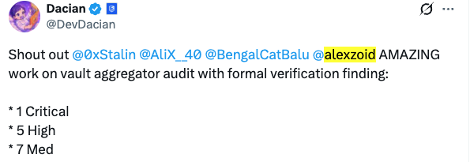</a>

---

[2026 Jul](https://x.com/TenorFinance/status/2077385238729121900) · Tenor credits my key FV contributions to security

<a href="https://x.com/TenorFinance/status/2077385238729121900">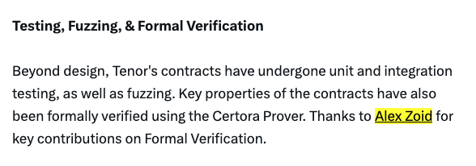</a>

<a href="https://x.com/TenorFinance/status/2077385238729121900">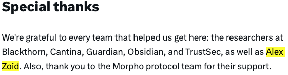</a>

---

[2026 Feb](https://x.com/predictdotfun/status/2023429535295995970) · predict.fun announces the Cyfrin audit with my FV

<a href="https://x.com/predictdotfun/status/2023429535295995970">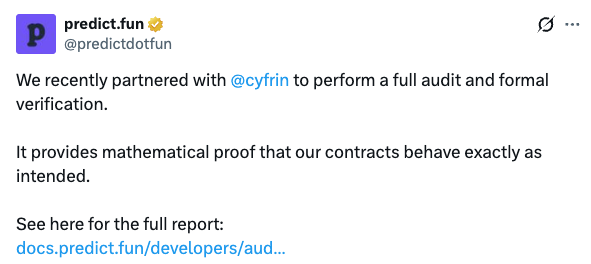</a>

---

[2025 Dec](https://x.com/DevDacian/status/2000880083431776346) · Solana DEX FV with Cyfrin

<a href="https://x.com/DevDacian/status/2000880083431776346">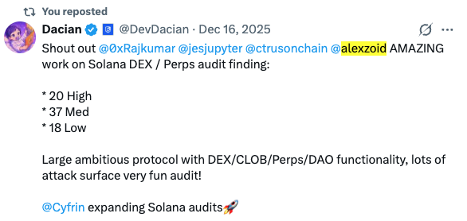</a>

---

[2025 Oct](https://x.com/alexzoid/status/1978808525842174124) · Accountable team praises my FV work

<a href="https://x.com/alexzoid/status/1978808525842174124">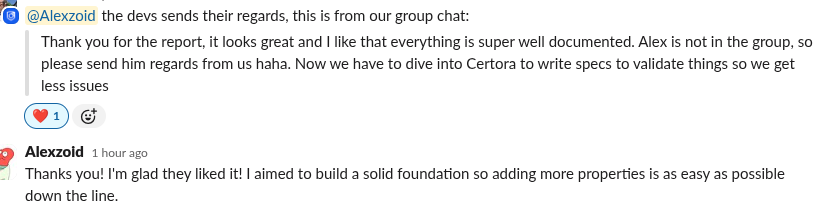</a>

---

[2025 Oct](https://x.com/DevDacian/status/1975501829225205966) · Sorella Angstrom FV with Cyfrin

<a href="https://x.com/DevDacian/status/1975501829225205966">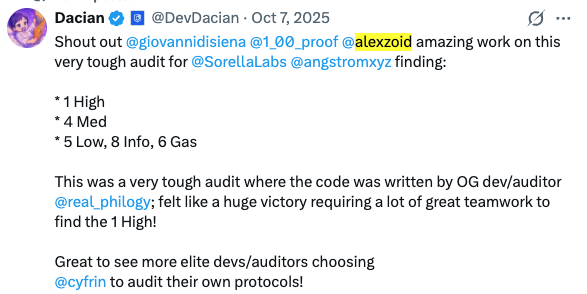</a> <a href="https://x.com/real_philogy/status/1971296804357734582">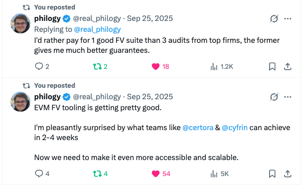</a>

---

[2025 Oct](https://x.com/DevDacian/status/1974381149968609688) · Cyfrin recommends me for FV jobs

---

[2025 Sep](https://x.com/alexzoid/status/1965455656686858388) · FV work for Uniswap V4 hooks project with Cyfrin

<a href="https://x.com/alexzoid/status/1965455656686858388">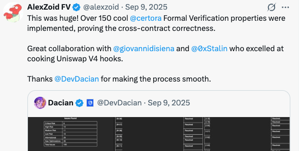</a>

---

[2025 Sep](https://x.com/licredity/status/1962834953236029498) · Licredity thanks me and the Cyfrin team for the audit and FV

<a href="https://x.com/licredity/status/1962834953236029498">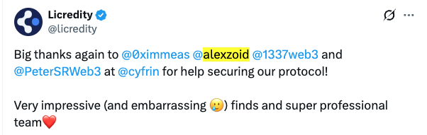</a>

---

[2025 Aug](https://x.com/alexzoid/status/1960987430426747273) · My FV property caught a Critical bug missed by manual review

---

[2025 Jul](https://x.com/code4rena/status/1942660010456256972) · 🏆 1st place in Blend V2, first Stellar FV contest

<a href="https://x.com/code4rena/status/1942660010456256972">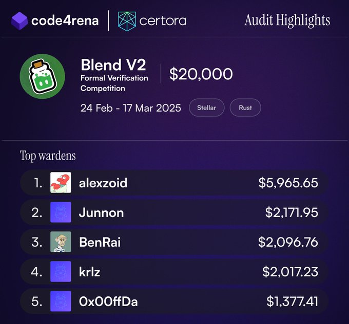</a>

---

[2025 Jun](https://x.com/Certora/status/1934978645342204403) · Top 5 in the Silo v2 FV contest

<a href="https://x.com/Certora/status/1934978645342204403">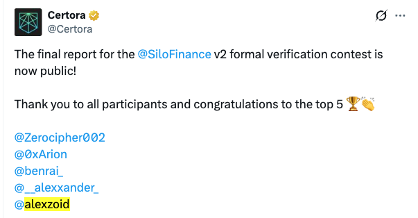</a>

---

[2025 May](https://x.com/alexzoid/status/1922710720015147309) · Moved up to 🏆 #1 on the Certora all-time [leaderboard](https://certora.com/leaderboard)

<a href="https://x.com/alexzoid/status/1922710720015147309">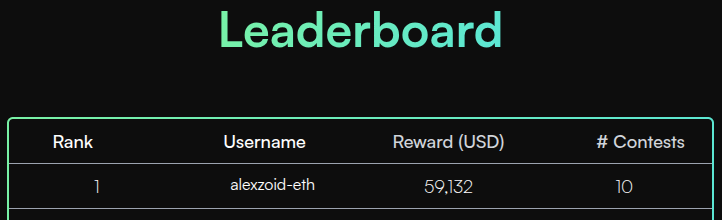</a>

---

[2023 Apr - 2025 May](https://audits.sherlock.xyz/watson/alexzoid) · Competed in many manual public audit contests

<a href="https://audits.sherlock.xyz/watson/alexzoid">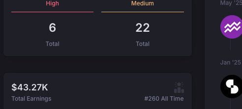</a> <a href="https://audits.sherlock.xyz/watson/alexzoid">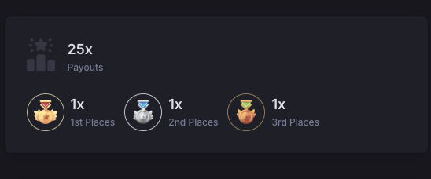</a>

<a href="https://x.com/sherlockdefi/status/1778408997340565785">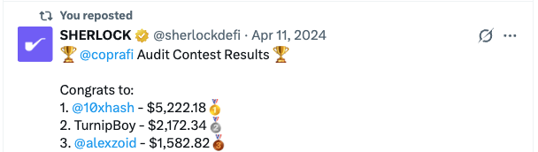</a>

<a href="https://x.com/sherlockdefi/status/1753046042579276278">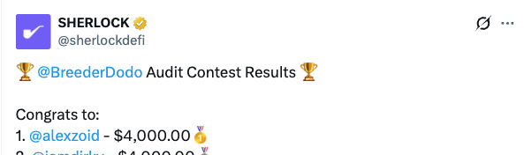</a>

---

[2024 Nov](https://x.com/alexzoid/status/1858412279806497256) · 🥈 2nd place in the Uniswap v4 FV contest

<a href="https://x.com/alexzoid/status/1858412279806497256">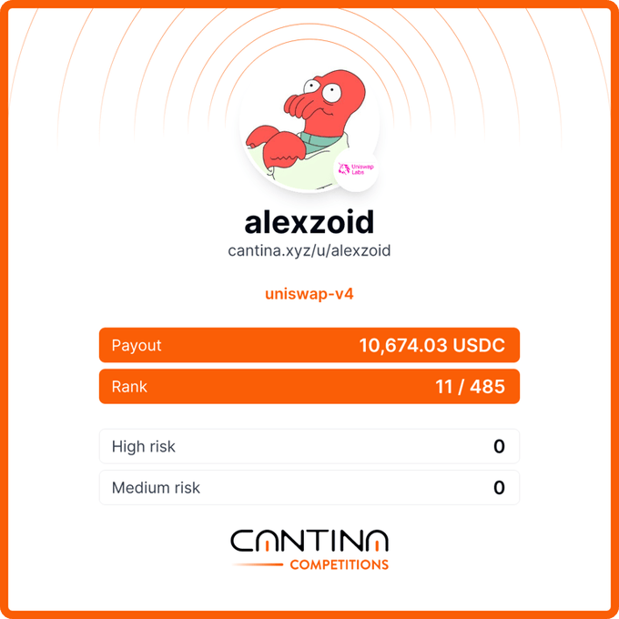</a>

---

[2024 Aug](https://x.com/alexzoid/status/1820297530577670307) · 🥉 3rd place in Euler v2 FV: my invariant caught all 3 public mutations

<a href="https://x.com/alexzoid/status/1820297530577670307">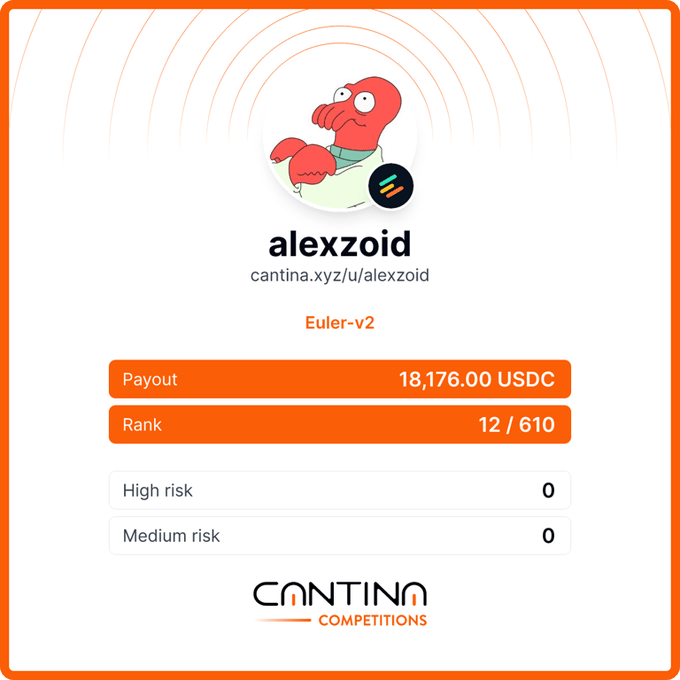</a> <a href="https://x.com/Certora/status/1817938993599873298">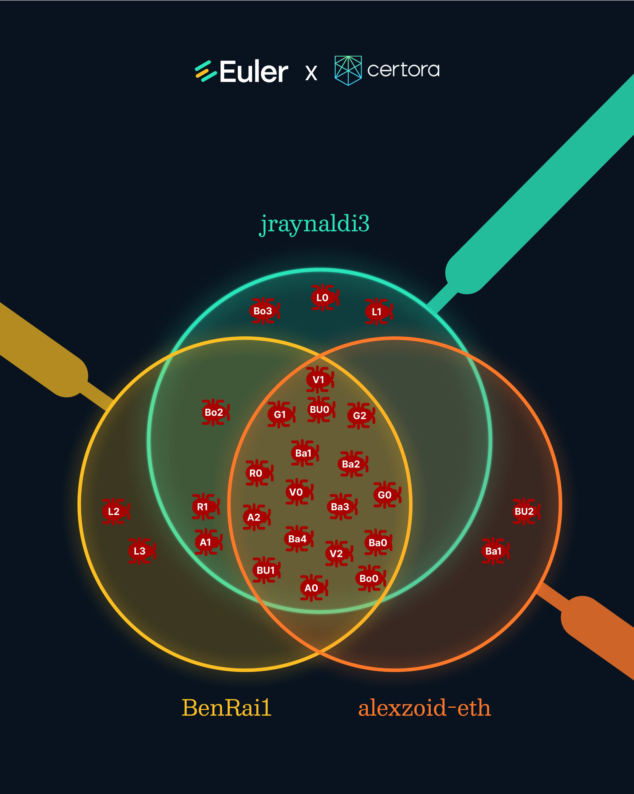</a>

<a href="https://x.com/alexzoid/status/1805857941947564215">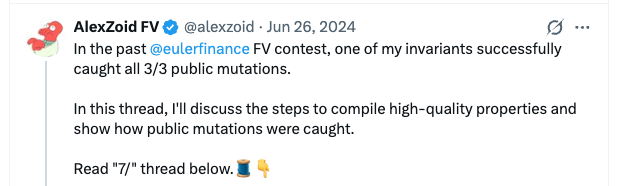</a>

---

[2024 Jan](https://x.com/Certora/status/1749369324026950029) · Certora recommends my FV guide

<a href="https://x.com/Certora/status/1749369324026950029">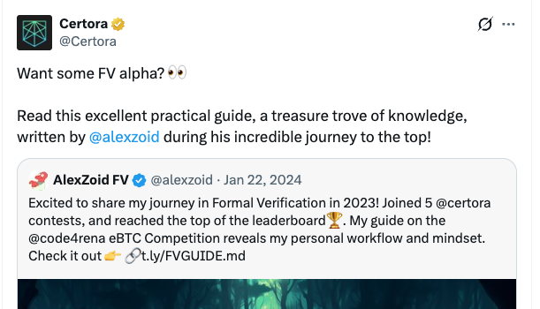</a>

---

[2024 Jan](https://x.com/alexzoid/status/1744586071449690561) · 🥈 2nd place in the Badger eBTC FV competition

<a href="https://x.com/alexzoid/status/1744586071449690561">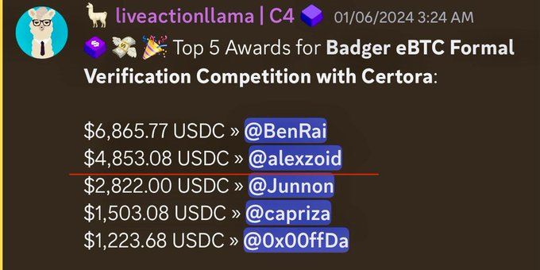</a>

---

[2023 Nov](https://x.com/Certora/status/1729526812710158696) · Moved up to 🥈 #2 on the Certora [leaderboard](https://certora.com/leaderboard)

<a href="https://x.com/Certora/status/1729526812710158696">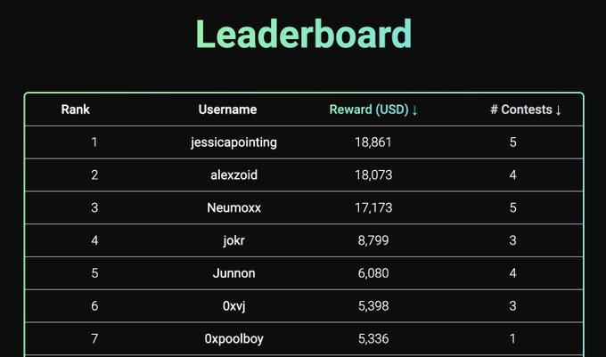</a>

---

[2023 Nov](https://x.com/code4rena/status/1724624278107353440) · 🥉 3rd place in the GMX FV competition

<a href="https://x.com/code4rena/status/1724624278107353440">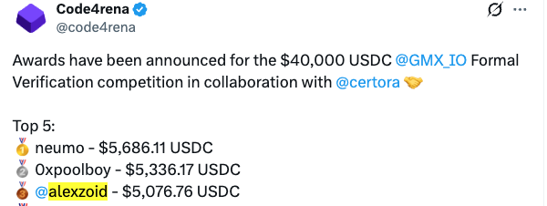</a>

---

[2023 Jul](https://x.com/alexzoid/status/1678702391967854592) · Aave StaticAToken, my first FV contest

<a href="https://x.com/alexzoid/status/1678702391967854592">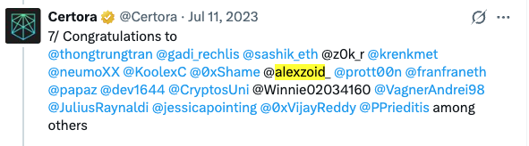</a>
