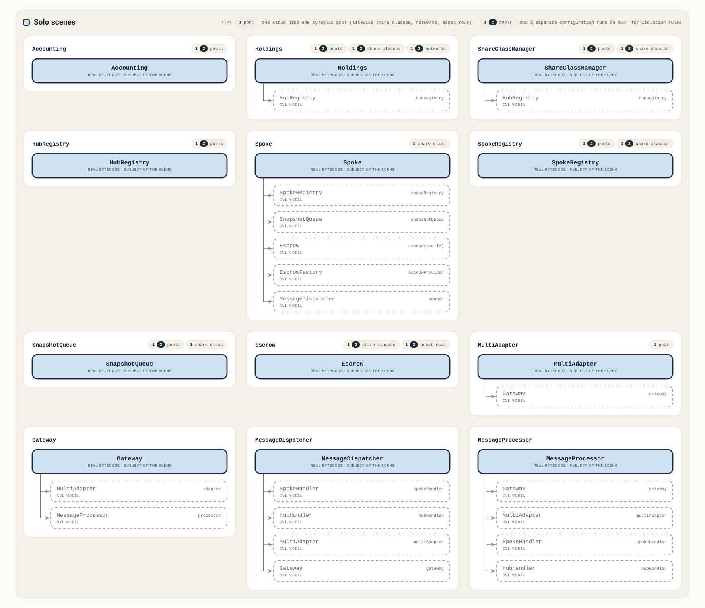
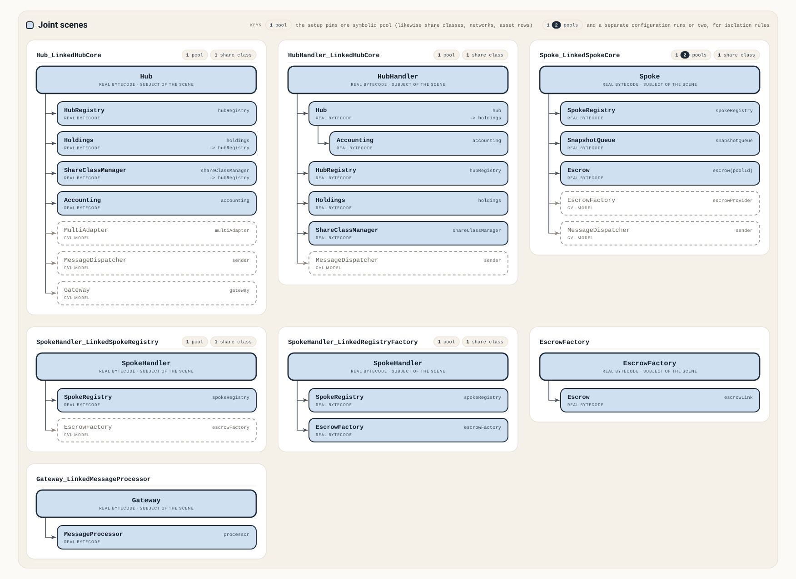

# Formal Verification Report: Centrifuge Core

- Date: September 11th, 2026
- Audit Repo: https://github.com/alexzoid-eth/2026-08-centrifuge-fv-ex
- Client Repo: https://github.com/centrifuge/protocol-internal ([3397d602](https://github.com/centrifuge/protocol-internal/tree/3397d6025cd7a300c860b29ab9beef5948113f34/src/core))
- Author: [AlexZoid](https://x.com/alexzoid)
- Certora Prover version: 8.16.2

<!-- Audit Commit: f85a3fedc -->

---

## Table of Contents

1. [Verification Scope](#verification-scope)
2. [Methodology](#methodology)
   - [Setup Scenes](#setup-scenes)
   - [Types of Properties](#types-of-properties)
   - [Types of Assumptions](#types-of-assumptions)
3. [Properties](#properties)
   - [Accounting](#accounting)
   - [Holdings](#holdings)
   - [ShareClassManager](#shareclassmanager)
   - [HubRegistry](#hubregistry)
   - [Spoke](#spoke)
   - [SpokeRegistry](#spokeregistry)
   - [SnapshotQueue](#snapshotqueue)
   - [PoolEscrow](#poolescrow)
   - [MultiAdapter](#multiadapter)
   - [Hub_LinkedHubCore](#hub_linkedhubcore)
   - [HubHandler_LinkedHubCore](#hubhandler_linkedhubcore)
   - [Spoke_LinkedSpokeCore](#spoke_linkedspokecore)
   - [SpokeHandler_LinkedSpokeRegistry](#spokehandler_linkedspokeregistry)
   - [SpokeHandler_LinkedRegistryFactory](#spokehandler_linkedregistryfactory)
   - [MessageDispatcher](#messagedispatcher)
   - [PoolEscrowFactory](#poolescrowfactory)
4. [Mutation Testing](#mutation-testing)
5. [Reproducing the Results](#reproducing-the-results)
   - [Prerequisites](#prerequisites)
   - [Remote Execution](#remote-execution)
   - [Local Execution](#local-execution)
   - [Running the Suites](#running-the-suites)
6. [Resources](#resources)

---

## Verification Scope

Centrifuge is a real-world-asset tokenization protocol built as a hub and spoke: one hub chain carries each pool's accounting and administration, spoke chains the custody and user-facing balance-sheet operations; a quorum-gated messaging layer keeps them convergent. The contracts verified, all in [`src/core/`](../src/core/), fall into three groups.

**Hub side**

1. **Accounting** ([`hub/Accounting.sol`](../src/core/hub/Accounting.sol)): the double-entry ledger of per-pool charts of accounts, mutable only inside a transient session that refuses to close unless debits equal credits.

2. **Holdings** ([`hub/Holdings.sol`](../src/core/hub/Holdings.sol)): the hub's mirror of spoke asset positions per pool, share class and asset, with carrying value in pool currency against cumulative increase and decrease counters.

3. **ShareClassManager** ([`hub/ShareClassManager.sol`](../src/core/hub/ShareClassManager.sol)): the share class registry and hub-side conservation ledger, where per-network issuance and revocation counters must sum to the global total issuance.

4. **HubRegistry** ([`hub/HubRegistry.sol`](../src/core/hub/HubRegistry.sol)): the registry of pools, assets, managers and policies, plus the timelocked authorization ledger the hub access-control model rests on.

5. **Hub** ([`hub/Hub.sol`](../src/core/hub/Hub.sol)): the pool-manager orchestrator over the four contracts above, which must post a paired debit and credit for every accounting mutation.

6. **HubHandler** ([`hub/HubHandler.sol`](../src/core/hub/HubHandler.sol)): the hub-side entry point for cross-chain messages, applying spoke deltas to Holdings and ShareClassManager, reconciling the burn-and-mint share bridge.

**Spoke side**

7. **Spoke** ([`spoke/Spoke.sol`](../src/core/spoke/Spoke.sol)): the balance-sheet orchestrator for users and managers, where every escrow operation must mirror into the snapshot queue.

8. **SpokeRegistry** ([`spoke/SpokeRegistry.sol`](../src/core/spoke/SpokeRegistry.sol)): the spoke's source of truth for pools, share classes, roles, policies, vaults and prices, over an asset-id bijection.

9. **SpokeHandler** ([`spoke/SpokeHandler.sol`](../src/core/spoke/SpokeHandler.sol)): the spoke-side message applier, deploying escrows, tokens and vaults and routing mutations into the registry.

10. **SnapshotQueue** ([`spoke/SnapshotQueue.sol`](../src/core/spoke/SnapshotQueue.sol)): the accumulator of share and asset deltas pending submission to the hub, carrying the consistency flag the hub trusts.

11. **PoolEscrow** ([`spoke/PoolEscrow.sol`](../src/core/spoke/PoolEscrow.sol)): the per-pool custody contract, with total and reserved bookkeeping where a withdrawal never pays the reserved part.

12. **PoolEscrowFactory** ([`spoke/factories/PoolEscrowFactory.sol`](../src/core/spoke/factories/PoolEscrowFactory.sol)): the CREATE2 deployer and address oracle for those escrows, where a pool's escrow address is the same for every caller and unchanged by any call the factory takes.

**Messaging**

13. **MultiAdapter** ([`messaging/MultiAdapter.sol`](../src/core/messaging/MultiAdapter.sol)): the quorum layer over bridge adapters, where an inbound payload becomes truth only at threshold votes per chain, pool and session.

14. **MessageDispatcher** ([`messaging/MessageDispatcher.sol`](../src/core/messaging/MessageDispatcher.sol)): the outbound end of the messaging layer, taking a local destination straight into its handler and a remote one into the gateway, where a caller without the ward bit moves no wiring and reaches no neighbour.

<div style="page-break-before: always;"></div>

---

## Methodology

Certora Formal Verification (FV) provides mathematical proofs of smart contract correctness by verifying code against a formal specification. Unlike testing and fuzzing which examine specific execution paths, Certora FV examines all possible states and execution paths.

The process involves crafting properties in CVL (Certora Verification Language) and submitting them alongside compiled Solidity smart contracts to the prover. The prover transforms the contract bytecode and rules into a mathematical model and determines the validity of rules.

### Setup Scenes

A scene is the set of contracts the prover compiles for one verification run. Each is present as **real** bytecode or as a **CVL model**, a stand-in written in the specification language, and every target is real in the scene that verifies it.

A scene splits into a setup and the rules that run over it. The setup ships two files per contract: the specification another scene imports to attach it, and the model that stands in for it. It links the compiled contracts, resolves every outgoing call to a model, a compiled neighbour or out of scope, and rewrites in CVL the internal functions the prover cannot analyse.



A **solo** scene compiles one target and models every neighbour in CVL; it carries whatever valid state that target's storage admits, and every property that needs no second contract.



A **joint** scene compiles several contracts and links them, is usually named `A_LinkedB`, and takes each participant's valid state, where a rule needs it, either as a fact already proven on that contract's own scene or by re-proving it inductively here.

The setup also narrows: one symbolic pool where the scene has that dimension, a multi-pool setup for isolation rules, bounded sets where a property sums (token holders, accounts), every loop unrolled to a fixed count. Each scene below lists its own bounds.

### Types of Properties

The official Certora [methodology](https://github.com/Certora/Tutorials/blob/master/06.Lesson_ThinkingProperties/Categorizing_Properties.pdf) defines several property categories. A **parametric** category is checked against every external function of the scene, including ones added after the specification.

- **Valid State** (parametric): system-wide invariants that hold in every reachable state; once proven, other properties reuse them as preconditions through `requireInvariant`.
- **State Transitions** (parametric): the moves between valid states, how a valid state may change and in what order.
- **Variable Transitions** (parametric): the permitted before/after relation on a single state variable across any call: monotonic counters, write-once fields, values that only move within a bound.
- **High Level**: properties of one or several specific function calls (share conservation, a deposit and redeem round trip).
- **Reverts**: an external call reverts exactly on its documented preconditions.
- **Reachability**: every rule's states are reachable, so none passes vacuously.
- **Access Control** (parametric): every privileged entry point enforces its ward or role gate.

### Types of Assumptions

Each `require` limits which states the prover checks, and its tag says why.

- **SAFE**: excludes no reachable state (`msg.sender != 0`).
- **SCOPE**: narrows a rule to the logic it checks (`receiver != escrowAddress`).
- **UNSAFE**: drops reachable states, for a prover limit or timeout (a loop unrolled to a fixed count).
- **TRUSTED**: guaranteed by a trusted party outside the scene (a valid setup left by the initializer logic).
- **PROVED**: not an assumption: a fact proven elsewhere, reused as a precondition (an invariant via `requireInvariant`).
- **ASSERT**: used in models: a `require` reproducing a revert of the real code, a path the prover drops by default anyway (`InsufficientBalance` in the token model).

<div style="page-break-before: always;"></div>

---

## Properties

Every verdict below comes from the prover version named in the header.

- **Properties**: every invariant and rule the suite states
- **Proved** ✅: verified by the prover
- **Timeout** ⏱️: the prover ran the rule and did not decide it within the solver budget the confs carry
- **Mutations** 🎯: rules with a mutant the prover killed, meaning the rule holds on the real code and breaks on a deliberately faulted one. An empty cell means no mutant is written for that rule, which is where an undecided rule stands: a kill is a change of verdict, and a rule the prover never decided has none to change
- **Violations** ❌: rules that fail

| Contract | Properties | Proved ✅ | Timeout ⏱️ | Mutations 🎯 | Violations ❌ |
|---|---|---|---|---|---|
| [Accounting](#accounting) | 72 | 72 | 0 | 72 | 0 |
| [Holdings](#holdings) | 87 | 87 | 0 | 87 | 0 |
| [ShareClassManager](#shareclassmanager) | 85 | 85 | 0 | 85 | 0 |
| [HubRegistry](#hubregistry) | 105 | 105 | 0 | 105 | 0 |
| [Spoke](#spoke) | 94 | 94 | 0 | 94 | 0 |
| [SpokeRegistry](#spokeregistry) | 141 | 141 | 0 | 141 | 0 |
| [SnapshotQueue](#snapshotqueue) | 75 | 75 | 0 | 75 | 0 |
| [PoolEscrow](#poolescrow) | 52 | 52 | 0 | 52 | 0 |
| [MultiAdapter](#multiadapter) | 97 | 96 | 1 | 96 | 0 |
| [Hub_LinkedHubCore](#hub_linkedhubcore) | 97 | 97 | 0 | 97 | 0 |
| [HubHandler_LinkedHubCore](#hubhandler_linkedhubcore) | 101 | 101 | 0 | 101 | 0 |
| [Spoke_LinkedSpokeCore](#spoke_linkedspokecore) | 39 | 39 | 0 | 39 | 0 |
| [SpokeHandler_LinkedSpokeRegistry](#spokehandler_linkedspokeregistry) | 91 | 91 | 0 | 91 | 0 |
| [SpokeHandler_LinkedRegistryFactory](#spokehandler_linkedregistryfactory) | 1 | 1 | 0 | 1 | 0 |
| [MessageDispatcher](#messagedispatcher) | 3 | 3 | 0 | 3 | 0 |
| [PoolEscrowFactory](#poolescrowfactory) | 4 | 4 | 0 | 4 | 0 |
| **Total** | **1144** | **1143** | **1** | **1143** | **0** |

### Accounting

- Every configuration
  - The chart of accounts bounded to 3 symbolic accounts
  - Loops running up to 3 iterations
- Single pool
  - One symbolic pool
- Multi pool
  - Two symbolic pools

#### Valid State

| Properties | Status | Mutations |
|---|---|---|
| [AC-VS-01](./specs/Accounting/Accounting_single_pool_valid_state.spec#L18-L22) `absentAccountIsEmpty`<br>An account that was never created is empty, so one opened later cannot carry a history. | ✅ | [🎯](./mutations/Accounting/README.md#accounting-602) [🎯](./mutations/Accounting/README.md#accounting-603) [🎯](./mutations/Accounting/README.md#accounting-604) |
| [AC-VS-02](./specs/Accounting/Accounting_single_pool_valid_state.spec#L24-L27) `nullAccountNeverCreated`<br>The null account id never exists, so it absorbs no entries and no holding wires to it. | ✅ | [🎯](./mutations/Accounting/README.md#accounting-605) |
| [AC-VS-03](./specs/Accounting/Accounting_single_pool_valid_state.spec#L29-L34) `lastUpdatedBetweenEnvFloorAndBlock`<br>An existing account's stamp sits above the scene's minimum block time and no later than the current block. | ✅ | [🎯](./mutations/Accounting/README.md#accounting-606) [🎯](./mutations/Accounting/README.md#accounting-607) |
| [AC-VS-04](./specs/Accounting/Accounting_single_pool_valid_state.spec#L36-L40) `postedHistoryImpliesAnIssuedJournalId`<br>An account carrying posting history proves a session was opened and took an id. | ✅ | [🎯](./mutations/Accounting/README.md#accounting-617) |

#### State Transitions

| Properties | Status | Mutations |
|---|---|---|
| [AC-ST-01](./specs/Accounting/Accounting_single_pool_state_transitions.spec#L5-L19) `stAcAccountOrientationIsPermanent`<br>An account keeps the orientation it was opened under. | ✅ | [🎯](./mutations/Accounting/README.md#accounting-629) |
| [AC-ST-02](./specs/Accounting/Accounting_multi_pool_state_transitions.spec#L9-L37) `stAcAccountRowsArePerPool`<br>A call moving one pool's account row leaves the other pool's rows untouched. | ✅ | [🎯](./mutations/Accounting/README.md#accounting-622) |
| [AC-ST-03](./specs/Accounting/Accounting_multi_pool_state_transitions.spec#L39-L58) `stAcJournalNumberingIsPerPool`<br>A call touching one pool's journal leaves the other pool's journal alone. | ✅ | [🎯](./mutations/Accounting/README.md#accounting-623) |

#### Variable Transitions

| Properties | Status | Mutations |
|---|---|---|
| [AC-VT-01](./specs/Accounting/Accounting_single_pool_variable_transitions.spec#L5-L20) `vtAcAccountDebitNeverDecreases`<br>Debit history is permanent: no call writes down what a pool has recorded. | ✅ | [🎯](./mutations/Accounting/README.md#accounting-608) [🎯](./mutations/Accounting/README.md#accounting-4000) [🎯](./mutations/Accounting/README.md#accounting-4014) |
| [AC-VT-02](./specs/Accounting/Accounting_single_pool_variable_transitions.spec#L22-L37) `vtAcAccountCreditNeverDecreases`<br>Credit history is permanent: no call writes down what a pool has recorded. | ✅ | [🎯](./mutations/Accounting/README.md#accounting-608) [🎯](./mutations/Accounting/README.md#accounting-4000) [🎯](./mutations/Accounting/README.md#accounting-4015) |
| [AC-VT-03](./specs/Accounting/Accounting_single_pool_variable_transitions.spec#L39-L54) `vtAcAccountStampNeverRegresses`<br>An account's stamp only moves forward, so a row can never be backdated. | ✅ | [🎯](./mutations/Accounting/README.md#accounting-4001) |
| [AC-VT-04](./specs/Accounting/Accounting_single_pool_variable_transitions.spec#L56-L70) `vtAcJournalCounterNeverRewinds`<br>A pool's journal numbering never rewinds, so a number once spent is never handed out again. | ✅ | [🎯](./mutations/Accounting/README.md#accounting-7107) |

#### High Level

| Properties | Status | Mutations |
|---|---|---|
| [AC-HL-01](./specs/Accounting/Accounting_single_pool_high_level.spec#L5-L21) `hlAcSessionClosesOnlyOnEqualPostedValues`<br>A session closes only when the values it posted balance on both sides. | ✅ | [🎯](./mutations/Accounting/README.md#accounting-4003) |
| [AC-HL-02](./specs/Accounting/Accounting_single_pool_high_level.spec#L23-L38) `hlAcJournalPairDebitsExactlyItsNamedRow`<br>A journal pair debits exactly the row and the value it names, and no other row. | ✅ | [🎯](./mutations/Accounting/README.md#accounting-4004) [🎯](./mutations/Accounting/README.md#accounting-4302) |
| [AC-HL-03](./specs/Accounting/Accounting_single_pool_high_level.spec#L40-L55) `hlAcJournalPairCreditsExactlyItsNamedRow`<br>A journal pair credits exactly the row and the value it names, and no other row. | ✅ | [🎯](./mutations/Accounting/README.md#accounting-619) [🎯](./mutations/Accounting/README.md#accounting-4005) |
| [AC-HL-04](./specs/Accounting/Accounting_single_pool_high_level.spec#L57-L74) `hlAcLedgerMovesOnlyThroughAJournal`<br>The recorded books move only through a journal; every other call leaves them standing. | ✅ | [🎯](./mutations/Accounting/README.md#accounting-4006) |
| [AC-HL-05](./specs/Accounting/Accounting_single_pool_high_level.spec#L76-L97) `hlAcSecondJournalOfAPoolReusesItsJournalId`<br>A second journal of the same pool in one transaction is filed under the first journal's id. | ✅ | [🎯](./mutations/Accounting/README.md#accounting-4007) |
| [AC-HL-06](./specs/Accounting/Accounting_single_pool_high_level.spec#L99-L114) `hlAcAccountValueReportsTheRowsNetMagnitude`<br>The balance reported for an account is its net position, never a gross total. | ✅ | [🎯](./mutations/Accounting/README.md#accounting-4008) |
| [AC-HL-07](./specs/Accounting/Accounting_single_pool_high_level.spec#L116-L132) `hlAcAccountValueSignsByTheRowsOrientation`<br>An account's reported sign follows the orientation it was opened under. | ✅ | [🎯](./mutations/Accounting/README.md#accounting-4009) |
| [AC-HL-08](./specs/Accounting/Accounting_single_pool_high_level.spec#L134-L151) `hlAcReopenedJournalStartsFromEmptyPostedSides`<br>A journal reopened after an earlier one starts from empty totals. | ✅ | [🎯](./mutations/Accounting/README.md#accounting-4010) |

#### Reverts

| Properties | Status | Mutations |
|---|---|---|
| [AC-RV-01](./specs/Accounting/Accounting_single_pool_reverts.spec#L5-L19) `rvAcUnlockRefusesANonWard`<br>A journal opens only for the pool's own ledger authority, and never on the null pool. | ✅ | [🎯](./mutations/Accounting/README.md#accounting-7106) |
| [AC-RV-02](./specs/Accounting/Accounting_single_pool_reverts.spec#L21-L34) `rvAcUnlockRefusesASecondOpenWhileAJournalStands`<br>A journal already open is never opened a second time. | ✅ | [🎯](./mutations/Accounting/README.md#accounting-4012) |
| [AC-RV-03](./specs/Accounting/Accounting_single_pool_reverts.spec#L36-L54) `rvAcCreateAccountRefusesAPaidCallANonWardTheNullIdOrARowThatStands`<br>A live account's history cannot be wiped by opening the same account again. | ✅ | [🎯](./mutations/Accounting/README.md#accounting-4013) |
| [AC-RV-04](./specs/Accounting/Accounting_single_pool_reverts.spec#L56-L72) `rvAcAddDebitRefusesARowTheLedgerNeverOpened`<br>A debit needs a row the ledger opened. | ✅ | [🎯](./mutations/Accounting/README.md#accounting-7103) |
| [AC-RV-05](./specs/Accounting/Accounting_single_pool_reverts.spec#L74-L90) `rvAcAddCreditRefusesARowTheLedgerNeverOpened`<br>A credit needs a row the ledger opened. | ✅ | [🎯](./mutations/Accounting/README.md#accounting-7104) |
| [AC-RV-06](./specs/Accounting/Accounting_single_pool_reverts.spec#L92-L112) `rvAcLockRevertsIffThePostedSidesDiffer`<br>A journal closes only when the two sides it posted match. | ✅ | [🎯](./mutations/Accounting/README.md#accounting-616) [🎯](./mutations/Accounting/README.md#accounting-4016) |
| [AC-RV-07](./specs/Accounting/Accounting_single_pool_reverts.spec#L114-L129) `rvAcAddJournalOffSessionRefusesANonWardOrAnyEntry`<br>Nothing can be posted to a pool's books outside an open journal. | ✅ | [🎯](./mutations/Accounting/README.md#accounting-4017) |
| [AC-RV-08](./specs/Accounting/Accounting_single_pool_reverts.spec#L131-L145) `rvAcAccountValueRefusesARowTheLedgerNeverOpened`<br>The value of an account the ledger never opened is refused, not reported as zero. | ✅ | [🎯](./mutations/Accounting/README.md#accounting-4018) |
| [AC-RV-09](./specs/Accounting/Accounting_single_pool_reverts.spec#L147-L162) `rvAcPassingExistsIsReachable`<br>Witnesses a read taken in the transaction that opened an account answering and reporting that account. | ✅ | [🎯](./mutations/Accounting/README.md#accounting-4019) |
| [AC-RV-10](./specs/Accounting/Accounting_single_pool_reverts.spec#L164-L178) `rvAcJournalPairRefusesUnbalancedLegs`<br>An unbalanced pair never reaches the books. | ✅ | [🎯](./mutations/Accounting/README.md#accounting-4016) |
| [AC-RV-11](./specs/Accounting/Accounting_single_pool_reverts.spec#L180-L216) `rvAcPassingJournalPairOnABalancedPairIsReachable`<br>Witnesses a nonzero balanced pair going through end to end on two rows the ledger already holds. | ✅ | [🎯](./mutations/Accounting/README.md#accounting-7102) |
| [AC-RV-12](./specs/Accounting/Accounting_single_pool_reverts.spec#L218-L237) `rvAcAddDebitRefusesAnOutsiderInsideAnOpenJournal`<br>An open journal is not an open door: an outsider still cannot charge the books. | ✅ | [🎯](./mutations/Accounting/README.md#accounting-4020) |
| [AC-RV-13](./specs/Accounting/Accounting_single_pool_reverts.spec#L239-L258) `rvAcAddCreditRefusesAnOutsiderInsideAnOpenJournal`<br>An open journal is not an open door: an outsider still cannot credit the books. | ✅ | [🎯](./mutations/Accounting/README.md#accounting-4021) |
| [AC-RV-14](./specs/Accounting/Accounting_single_pool_reverts.spec#L260-L278) `rvAcLockRefusesAnOutsiderOnAnOpenJournal`<br>Only the ledger's own authority may close a journal. | ✅ | [🎯](./mutations/Accounting/README.md#accounting-4022) |
| [AC-RV-15](./specs/Accounting/Accounting_single_pool_reverts.spec#L280-L295) `rvAcAccountValueAlwaysAnswersForARowThatStands`<br>The value of an account the ledger holds always reads back, on either side of its normal balance. | ✅ | [🎯](./mutations/Accounting/README.md#accounting-7105) |

#### Reachability

| Properties | Status | Mutations |
|---|---|---|
| [AC-RC-01](./specs/Accounting/Accounting_single_pool_reachability.spec#L5-L21) `rcAcUnlockOpensAJournalIsReachable`<br>Witnesses a ward opening a journal on a pool, minting it a fresh id. | ✅ | [🎯](./mutations/Accounting/README.md#accounting-4026) |
| [AC-RC-02](./specs/Accounting/Accounting_single_pool_reachability.spec#L23-L43) `rcAcSecondSessionOfAPoolIsReachable`<br>Witnesses a pool's journal closed and reopened inside one transaction. | ✅ | [🎯](./mutations/Accounting/README.md#accounting-4027) |
| [AC-RC-03](./specs/Accounting/Accounting_single_pool_reachability.spec#L45-L59) `rcAcLastJournalIdOfTheSequenceIsReachable`<br>Witnesses a pool one id short of exhaustion opening one more journal. | ✅ | [🎯](./mutations/Accounting/README.md#accounting-4026) |
| [AC-RC-04](./specs/Accounting/Accounting_single_pool_reachability.spec#L61-L80) `rcAcEmptyJournalOverAnUntouchedLedgerIsReachable`<br>Witnesses an empty journal opening and closing, and still spending one id. | ✅ | [🎯](./mutations/Accounting/README.md#accounting-4026) |
| [AC-RC-05](./specs/Accounting/Accounting_single_pool_reachability.spec#L82-L105) `rcAcBalancedPairPostsAndClosesIsReachable`<br>Witnesses the ordinary journal end to end: open, a matching debit and credit, close. | ✅ | [🎯](./mutations/Accounting/README.md#accounting-4029) |
| [AC-RC-06](./specs/Accounting/Accounting_single_pool_reachability.spec#L107-L126) `rcAcDebitHeavySessionRecoversIsReachable`<br>Witnesses that a debit-heavy session is not wedged: the compensating credit still closes it. | ✅ | [🎯](./mutations/Accounting/README.md#accounting-4029) |
| [AC-RC-07](./specs/Accounting/Accounting_single_pool_reachability.spec#L128-L146) `rcAcTwoDebitsCloseAgainstOneCreditIsReachable`<br>Witnesses a journal of several entries closing on the summed condition. | ✅ | [🎯](./mutations/Accounting/README.md#accounting-4031) |
| [AC-RC-08](./specs/Accounting/Accounting_single_pool_reachability.spec#L148-L166) `rcAcZeroValueDebitRestampsTheRowIsReachable`<br>Witnesses a zero-value debit restamping the row without moving a total. | ✅ | [🎯](./mutations/Accounting/README.md#accounting-4033) |
| [AC-RC-09](./specs/Accounting/Accounting_single_pool_reachability.spec#L168-L186) `rcAcZeroValueCreditRestampsTheRowIsReachable`<br>Witnesses a zero-value credit restamping the row without moving a total. | ✅ | [🎯](./mutations/Accounting/README.md#accounting-4032) |
| [AC-RC-10](./specs/Accounting/Accounting_single_pool_reachability.spec#L188-L205) `rcAcDebitFillsARowToTheCeilingIsReachable`<br>Witnesses one posting carrying a row's debit side from empty to the widest value it holds. | ✅ | [🎯](./mutations/Accounting/README.md#accounting-4029) |
| [AC-RC-11](./specs/Accounting/Accounting_single_pool_reachability.spec#L207-L224) `rcAcCreditFillsARowToTheCeilingIsReachable`<br>Witnesses one credit carrying a row's credit side from empty to the widest value it holds. | ✅ | [🎯](./mutations/Accounting/README.md#accounting-4030) |
| [AC-RC-12](./specs/Accounting/Accounting_single_pool_reachability.spec#L226-L249) `rcAcCeilingPairPostsAndClosesIsReachable`<br>Witnesses a journal whose two legs each carry the widest value being settled, not merely opened. | ✅ | [🎯](./mutations/Accounting/README.md#accounting-4029) |
| [AC-RC-13](./specs/Accounting/Accounting_single_pool_reachability.spec#L251-L268) `rcAcSaturatedDebitRowStillTakesACreditIsReachable`<br>Witnesses a row already at its debit ceiling still accepting a credit. | ✅ | [🎯](./mutations/Accounting/README.md#accounting-4030) |
| [AC-RC-14](./specs/Accounting/Accounting_single_pool_reachability.spec#L270-L286) `rcAcDebitOvertakesACreditHeavyRowIsReachable`<br>Witnesses a debit carrying a credit-heavy row back across its own sign. | ✅ | [🎯](./mutations/Accounting/README.md#accounting-4034) |
| [AC-RC-15](./specs/Accounting/Accounting_single_pool_reachability.spec#L288-L305) `rcAcCreateDebitNormalAccountIsReachable`<br>Witnesses a debit-normal row being opened, absent before the call and present after. | ✅ | [🎯](./mutations/Accounting/README.md#accounting-4028) |
| [AC-RC-16](./specs/Accounting/Accounting_single_pool_reachability.spec#L307-L324) `rcAcCreateCreditNormalAccountIsReachable`<br>Witnesses a credit-normal row being opened, stamped and empty on both sides. | ✅ | [🎯](./mutations/Accounting/README.md#accounting-4028) |
| [AC-RC-17](./specs/Accounting/Accounting_single_pool_reachability.spec#L326-L348) `rcAcSecondRowOpensBesideALiveOneIsReachable`<br>Witnesses a row being opened beside a live one without disturbing it. | ✅ | [🎯](./mutations/Accounting/README.md#accounting-4028) |
| [AC-RC-18](./specs/Accounting/Accounting_single_pool_reachability.spec#L350-L368) `rcAcFirstRowOfAnEmptyChartIsReachable`<br>Witnesses the pool's very first account row being opened on an empty chart. | ✅ | [🎯](./mutations/Accounting/README.md#accounting-4028) |
| [AC-RC-19](./specs/Accounting/Accounting_single_pool_reachability.spec#L370-L390) `rcAcJournalBatchOfOneEntryASideIsReachable`<br>Witnesses one entry a side moving both rows the entries name and closing the journal. | ✅ | [🎯](./mutations/Accounting/README.md#accounting-4029) |
| [AC-RC-20](./specs/Accounting/Accounting_single_pool_reachability.spec#L392-L419) `rcAcJournalBatchReachesTheWholeChartIsReachable`<br>Witnesses one batch reaching every row of the pool's chart and still closing. | ✅ | [🎯](./mutations/Accounting/README.md#accounting-4029) |
| [AC-RC-21](./specs/Accounting/Accounting_single_pool_reachability.spec#L421-L442) `rcAcEmptyJournalBatchIsReachable`<br>Witnesses a journal carrying no entry being admitted and still spending one id. | ✅ | [🎯](./mutations/Accounting/README.md#accounting-4026) |
| [AC-RC-22](./specs/Accounting/Accounting_single_pool_reachability.spec#L444-L468) `rcAcZeroValueJournalBatchIsReachable`<br>Witnesses a batch of zero-value entries closing, restamping without moving a total. | ✅ | [🎯](./mutations/Accounting/README.md#accounting-4033) |
| [AC-RC-23](./specs/Accounting/Accounting_single_pool_reachability.spec#L470-L490) `rcAcRowsCreatedAndJournalledInOneTransactionIsReachable`<br>Witnesses a pool going from no chart at all to a closed journal in one transaction. | ✅ | [🎯](./mutations/Accounting/README.md#accounting-4028) |
| [AC-RC-24](./specs/Accounting/Accounting_single_pool_reachability.spec#L492-L507) `rcAcFreshRowReadsBackThePostedValueIsReachable`<br>Witnesses a row opened, posted to and read back in one transaction reporting what was posted. | ✅ | [🎯](./mutations/Accounting/README.md#accounting-4028) |
| [AC-RC-25](./specs/Accounting/Accounting_single_pool_reachability.spec#L509-L524) `rcAcDebitNormalRowReportsANegativeValueIsReachable`<br>Witnesses a debit-normal row credited beyond its debits reporting that magnitude as negative. | ✅ | [🎯](./mutations/Accounting/README.md#accounting-4028) |
| [AC-RC-26](./specs/Accounting/Accounting_single_pool_reachability.spec#L526-L542) `rcAcRowDebitedAndCreditedAlikeReadsZeroIsReachable`<br>Witnesses a row debited and credited alike reading back at zero. | ✅ | [🎯](./mutations/Accounting/README.md#accounting-4028) |
| [AC-RC-27](./specs/Accounting/Accounting_single_pool_reachability.spec#L544-L558) `rcAcOpenSessionReportsItsRunningSidesIsReachable`<br>Witnesses an open session reporting exactly what has been posted to each side so far. | ✅ | [🎯](./mutations/Accounting/README.md#accounting-4029) |
| [AC-RC-28](./specs/Accounting/Accounting_single_pool_reachability.spec#L560-L577) `rcAcAuthorityGrantRoundTripIsReachable`<br>Witnesses an authority grant being real and reversible inside one transaction. | ✅ | [🎯](./mutations/Accounting/README.md#accounting-7100) |
| [AC-RC-29](./specs/Accounting/Accounting_single_pool_reachability.spec#L579-L592) `rcAcWardRevokesItselfIsReachable`<br>Witnesses a ward revoking its own authority. | ✅ | [🎯](./mutations/Accounting/README.md#accounting-7101) |
| [AC-RC-30](./specs/Accounting/Accounting_single_pool_reachability.spec#L594-L613) `rcAcFreshRowReadsBackZeroedAndStampedIsReachable`<br>Witnesses the account getter reporting a freshly opened row as zeroed, oriented and stamped. | ✅ | [🎯](./mutations/Accounting/README.md#accounting-4028) |

#### Access Control

| Properties | Status | Mutations |
|---|---|---|
| [AC-AC-01](./specs/Accounting/Accounting_single_pool_access_control.spec#L5-L21) `acAcDebitHistoryMovesOnlyForAWard`<br>No outsider can inflate or erase the charges a pool has booked, outside the direct debit call. | ✅ | [🎯](./mutations/Accounting/README.md#accounting-4023) |
| [AC-AC-02](./specs/Accounting/Accounting_single_pool_access_control.spec#L23-L39) `acAcCreditHistoryMovesOnlyForAWard`<br>No outsider can inflate or erase the receipts a pool has booked, outside the direct credit call. | ✅ | [🎯](./mutations/Accounting/README.md#accounting-4023) |
| [AC-AC-03](./specs/Accounting/Accounting_single_pool_access_control.spec#L41-L57) `acAcAccountStampMovesOnlyForAWard`<br>Only the ledger's own authority moves an account's audit stamp, outside the direct posting calls. | ✅ | [🎯](./mutations/Accounting/README.md#accounting-4023) |
| [AC-AC-04](./specs/Accounting/Accounting_single_pool_access_control.spec#L59-L74) `acAcAccountOpensOnlyForAWard`<br>Only the pool's own ledger authority can open an account, outside the direct ledger calls. | ✅ | [🎯](./mutations/Accounting/README.md#accounting-4023) |
| [AC-AC-05](./specs/Accounting/Accounting_single_pool_access_control.spec#L76-L91) `acAcAccountOrientationIsSetOnlyByAWard`<br>Only the ledger's own authority decides whether an account counts value up or down, outside the direct ledger calls. | ✅ | [🎯](./mutations/Accounting/README.md#accounting-4023) |
| [AC-AC-06](./specs/Accounting/Accounting_single_pool_access_control.spec#L93-L108) `acAcPermissionsMoveOnlyForAWard`<br>Only someone already holding the ledger's authority can grant or revoke it, outside the direct ledger calls. | ✅ | [🎯](./mutations/Accounting/README.md#accounting-4025) |
| [AC-AC-07](./specs/Accounting/Accounting_single_pool_access_control.spec#L110-L126) `acAcJournalNumberingAdvancesOnlyForAWard`<br>Only the ledger's own authority advances a pool's journal numbering, outside the direct ledger calls. | ✅ | [🎯](./mutations/Accounting/README.md#accounting-4024) |
| [AC-AC-08](./specs/Accounting/Accounting_single_pool_access_control.spec#L128-L142) `acAcSessionIsLeftOpenOnlyForAWard`<br>Only the ledger's own authority can leave the ledger open for posting, outside the direct ledger calls. | ✅ | [🎯](./mutations/Accounting/README.md#accounting-4024) |

### Holdings

- Every configuration
  - Holding rows bounded to 2 symbolic rows
  - The deficit counter pinned to one symbolic network
  - Loops running up to 4 iterations
- Single pool
  - One symbolic pool
  - One symbolic share class
- Multi pool
  - Two symbolic pools
  - One share class per pool
- Multi share class
  - Two share classes in the pinned pool

#### Valid State

| Properties | Status | Mutations |
|---|---|---|
| [HO-VS-01](./specs/Holdings/Holdings_single_pool_valid_state.spec#L21-L24) `snapshotHookImpliesPoolExists`<br>A snapshot hook is attached only to a pool the hub registry knows. | ✅ | [🎯](./mutations/Holdings/README.md#holdings-802) [🎯](./mutations/Holdings/README.md#holdings-803) |
| [HO-VS-02](./specs/Holdings/Holdings_single_pool_valid_state.spec#L26-L29) `deficitCountMatchesTheShortRows`<br>The pool's deficit counter equals the number of holding rows with more withdrawn than deposited. | ✅ | [🎯](./mutations/Holdings/README.md#holdings-804) [🎯](./mutations/Holdings/README.md#holdings-805) [🎯](./mutations/Holdings/README.md#holdings-806) [🎯](./mutations/Holdings/README.md#holdings-807) |
| [HO-VS-03](./specs/Holdings/Holdings_single_pool_valid_state.spec#L31-L34) `uninitializedHoldingHasNoValue`<br>A holding row that was never initialized has no carrying value. | ✅ | [🎯](./mutations/Holdings/README.md#holdings-808) [🎯](./mutations/Holdings/README.md#holdings-809) |
| [HO-VS-04](./specs/Holdings/Holdings_single_pool_valid_state.spec#L36-L41) `emptyHoldingCarriesNoValue`<br>A holding row with nothing left in it (at least as much taken out as put in) has no carrying value. | ✅ | [🎯](./mutations/Holdings/README.md#holdings-810) [🎯](./mutations/Holdings/README.md#holdings-811) |
| [HO-VS-05](./specs/Holdings/Holdings_single_pool_valid_state.spec#L43-L46) `snapshotFlagImpliesAStartedNonce`<br>A snapshot row marked in sync has recorded at least one update. | ✅ | [🎯](./mutations/Holdings/README.md#holdings-814) [🎯](./mutations/Holdings/README.md#holdings-815) |
| [HO-VS-06](./specs/Holdings/Holdings_single_pool_valid_state.spec#L48-L51) `accountIdImpliesInitialized`<br>Journal account wiring exists only for holding rows that have been initialized. | ✅ | [🎯](./mutations/Holdings/README.md#holdings-812) [🎯](./mutations/Holdings/README.md#holdings-813) |
| [HO-VS-07](./specs/Holdings/Holdings_multi_share_class_valid_state.spec#L11-L14) `deficitCountSpansEveryShareClass`<br>The pool's deficit counter counts every short row of the pool, whichever class it sits on. | ✅ | [🎯](./mutations/Holdings/README.md#holdings-825) |

#### State Transitions

| Properties | Status | Mutations |
|---|---|---|
| [HO-ST-01](./specs/Holdings/Holdings_single_pool_state_transitions.spec#L5-L19) `stHoInflowAndOutflowNeverMoveTogether`<br>A holding's deposit and withdrawal histories never move in the same call. | ✅ | [🎯](./mutations/Holdings/README.md#holdings-816) |
| [HO-ST-02](./specs/Holdings/Holdings_single_pool_state_transitions.spec#L21-L50) `stHoOneCallTouchesOneHolding`<br>A single call touches a single holding. | ✅ | [🎯](./mutations/Holdings/README.md#holdings-817) |
| [HO-ST-03](./specs/Holdings/Holdings_single_pool_state_transitions.spec#L52-L66) `stHoInflowNeverLowersValue`<br>Money coming into a holding never writes its carrying value down. | ✅ | [🎯](./mutations/Holdings/README.md#holdings-818) |
| [HO-ST-04](./specs/Holdings/Holdings_single_pool_state_transitions.spec#L68-L82) `stHoOutflowNeverRaisesValue`<br>Money leaving a holding never writes its carrying value up. | ✅ | [🎯](./mutations/Holdings/README.md#holdings-819) |
| [HO-ST-05](./specs/Holdings/Holdings_single_pool_state_transitions.spec#L84-L103) `stHoOpeningAHoldingFundsNothing`<br>Opening a holding only gives it a price source, never a position or a carrying value no deposit funded. | ✅ | [🎯](./mutations/Holdings/README.md#holdings-820) |
| [HO-ST-06](./specs/Holdings/Holdings_single_pool_state_transitions.spec#L105-L119) `stHoSnapshotFlagMovesWithItsNonce`<br>A network's snapshot flag flips only together with a one-step advance of its nonce. | ✅ | [🎯](./mutations/Holdings/README.md#holdings-821) |
| [HO-ST-07](./specs/Holdings/Holdings_multi_pool_state_transitions.spec#L6-L34) `stHoHoldingRowIsPerPool`<br>A call that moves one pool's holding row leaves every holding row of the other pool alone. | ✅ | [🎯](./mutations/Holdings/README.md#holdings-822) |
| [HO-ST-08](./specs/Holdings/Holdings_multi_pool_state_transitions.spec#L36-L52) `stHoAccountWiringIsPerPool`<br>A call that wires one pool's ledger accounts leaves the other pool's wiring alone. | ✅ | [🎯](./mutations/Holdings/README.md#holdings-822) |
| [HO-ST-09](./specs/Holdings/Holdings_multi_pool_state_transitions.spec#L54-L73) `stHoSnapshotRowIsPerPool`<br>A call moving one pool's snapshot row leaves the other pool's row for that network alone. | ✅ | [🎯](./mutations/Holdings/README.md#holdings-823) |
| [HO-ST-10](./specs/Holdings/Holdings_multi_pool_state_transitions.spec#L75-L95) `stHoDeficitCountAndHookIgnoreASiblingsFlow`<br>Flow booked on one pool's holding row moves neither the sibling pool's deficit counter nor its snapshot hook. | ✅ | [🎯](./mutations/Holdings/README.md#holdings-824) |

#### Variable Transitions

| Properties | Status | Mutations |
|---|---|---|
| [HO-VT-01](./specs/Holdings/Holdings_single_pool_variable_transitions.spec#L5-L19) `vtHoDepositHistoryNeverShrinks`<br>A position's deposit history only ever accumulates. | ✅ | [🎯](./mutations/Holdings/README.md#holdings-4117) |
| [HO-VT-02](./specs/Holdings/Holdings_single_pool_variable_transitions.spec#L21-L35) `vtHoWithdrawalHistoryNeverShrinks`<br>A position's withdrawal history only ever accumulates, an over withdrawal included. | ✅ | [🎯](./mutations/Holdings/README.md#holdings-4117) |
| [HO-VT-03](./specs/Holdings/Holdings_single_pool_variable_transitions.spec#L37-L51) `vtHoOpenedHoldingIsNeverClosed`<br>A holding the pool has opened can never be closed again. | ✅ | [🎯](./mutations/Holdings/README.md#holdings-4118) |
| [HO-VT-04](./specs/Holdings/Holdings_single_pool_variable_transitions.spec#L53-L69) `vtHoSnapshotNonceStepsByAtMostOne`<br>A network's snapshot sequence advances one step at a time, never skipped or rewound. | ✅ | [🎯](./mutations/Holdings/README.md#holdings-4119) |

#### High Level

| Properties | Status | Mutations |
|---|---|---|
| [HO-HL-01](./specs/Holdings/Holdings_single_pool_high_level.spec#L5-L20) `hlHoDepositHistoryRecordsTheInflowAndSurvivesTheOutflow`<br>An inflow is recorded at full size, and the outflow after it leaves that history readable. | ✅ | [🎯](./mutations/Holdings/README.md#holdings-4111) |
| [HO-HL-02](./specs/Holdings/Holdings_single_pool_high_level.spec#L22-L37) `hlHoWithdrawalHistoryRecordsTheWholeOutflow`<br>An outflow is recorded at full size even beyond what the position carries, the excess staying a claim. | ✅ | [🎯](./mutations/Holdings/README.md#holdings-4111) |
| [HO-HL-03](./specs/Holdings/Holdings_single_pool_high_level.spec#L39-L53) `hlHoIncreaseReturnsTheValueItBooked`<br>An increase journals exactly the value it adds to the position book. | ✅ | [🎯](./mutations/Holdings/README.md#holdings-4112) |
| [HO-HL-04](./specs/Holdings/Holdings_single_pool_high_level.spec#L55-L69) `hlHoDecreaseReturnsTheValueItRemoved`<br>A decrease journals exactly the value it takes off the position book. | ✅ | [🎯](./mutations/Holdings/README.md#holdings-4113) |
| [HO-HL-05](./specs/Holdings/Holdings_single_pool_high_level.spec#L71-L86) `hlHoUpdateReportsTheRevaluationItWrote`<br>A revaluation journals exactly the move it writes, sign included. | ✅ | [🎯](./mutations/Holdings/README.md#holdings-4114) |
| [HO-HL-06](./specs/Holdings/Holdings_single_pool_high_level.spec#L88-L105) `hlHoAccountWiringMovesOnlyThroughItsTwoWriters`<br>A position's journal wiring moves only through initialize and setAccountId. | ✅ | [🎯](./mutations/Holdings/README.md#holdings-4115) |
| [HO-HL-07](./specs/Holdings/Holdings_single_pool_high_level.spec#L107-L122) `hlHoSnapshotHookMovesOnlyThroughItsSetter`<br>A pool's NAV automation hook is rewired only by setSnapshotHook. | ✅ | [🎯](./mutations/Holdings/README.md#holdings-4116) |
| [HO-HL-08](./specs/Holdings/Holdings_single_pool_high_level.spec#L124-L138) `hlHoPublishingASyncMarkerAlwaysAdvancesTheSequence`<br>Every sync marker consumes the sequence number that network was waiting on. | ✅ | [🎯](./mutations/Holdings/README.md#holdings-4110) |
| [HO-HL-09](./specs/Holdings/Holdings_single_pool_high_level.spec#L140-L157) `hlHoSnapshotSequenceMovesOnlyThroughItsPublisher`<br>A network's snapshot sequence advances only where a marker is published. | ✅ | [🎯](./mutations/Holdings/README.md#holdings-4110) |

#### Reverts

| Properties | Status | Mutations |
|---|---|---|
| [HO-RV-01](./specs/Holdings/Holdings_single_pool_reverts.spec#L5-L20) `rvHoInitializeRefusesANonWardANullSourceOrAnOpenRow`<br>A holding does not open for a stranger, without a price source, or on a row already open. | ✅ | [🎯](./mutations/Holdings/README.md#holdings-4101) |
| [HO-RV-02](./specs/Holdings/Holdings_single_pool_reverts.spec#L22-L36) `rvHoSetAccountIdRefusesANonWardOrAnUnopenedHolding`<br>A journal account does not wire for a stranger, nor onto a holding never opened. | ✅ | [🎯](./mutations/Holdings/README.md#holdings-4102) |
| [HO-RV-03](./specs/Holdings/Holdings_single_pool_reverts.spec#L38-L53) `rvHoUpdateValuationRefusesANonWardANullSourceOrAnUnopenedHolding`<br>A holding is repointed only by the ledger's own authority, and only at a real price source. | ✅ | [🎯](./mutations/Holdings/README.md#holdings-4103) |
| [HO-RV-04](./specs/Holdings/Holdings_single_pool_reverts.spec#L55-L68) `rvHoSetSnapshotHookRefusesANonWardOrAnUnknownPool`<br>A pool's NAV hook is attached only by the ledger's own authority, on a pool the registry knows. | ✅ | [🎯](./mutations/Holdings/README.md#holdings-4104) |
| [HO-RV-05](./specs/Holdings/Holdings_single_pool_reverts.spec#L70-L85) `rvHoSetSnapshotRefusesANonWardOrAnOutOfOrderNonce`<br>A sync marker is published only under the sequence number the network waits for. | ✅ | [🎯](./mutations/Holdings/README.md#holdings-4105) |
| [HO-RV-06](./specs/Holdings/Holdings_single_pool_reverts.spec#L87-L101) `rvHoCallOnSyncSnapshotIsNeverRefusedToAWard`<br>Replaying the sync notification is never refused to a ward, on any network. | ✅ | [🎯](./mutations/Holdings/README.md#holdings-4106) |
| [HO-RV-07](./specs/Holdings/Holdings_single_pool_reverts.spec#L103-L120) `rvHoCallOnTransferSnapshotIsNeverRefusedToAWard`<br>With no automation hook installed, a ward notifying a cross network transfer is never refused, since the hook is called only where a pool has set one. | ✅ | [🎯](./mutations/Holdings/README.md#holdings-4107) |
| [HO-RV-08](./specs/Holdings/Holdings_single_pool_reverts.spec#L122-L136) `rvHoIncreaseRefusesANonWard`<br>Nobody outside the pool's ward set can book an inflow onto a holding. | ✅ | [🎯](./mutations/Holdings/README.md#holdings-7207) |
| [HO-RV-09](./specs/Holdings/Holdings_single_pool_reverts.spec#L138-L153) `rvHoIncreaseRefusesAnInflowPastTheDepositCounter`<br>An inflow past the width of the deposit counter is refused rather than wrapped. | ✅ | [🎯](./mutations/Holdings/README.md#holdings-4108) |
| [HO-RV-10](./specs/Holdings/Holdings_single_pool_reverts.spec#L155-L173) `rvHoIncreaseBeforeTheRowIsOpenedIsNeverRefusedToAWard`<br>Custody arriving before a row is opened is never turned away. | ✅ | [🎯](./mutations/Holdings/README.md#holdings-4100) |
| [HO-RV-11](./specs/Holdings/Holdings_single_pool_reverts.spec#L175-L195) `rvHoIncreaseOntoAnEmptyValueBookIsNeverRefusedToAWard`<br>Holdings itself turns away no first deposit onto a position a pool has just opened. | ✅ | [🎯](./mutations/Holdings/README.md#holdings-4100) |
| [HO-RV-12](./specs/Holdings/Holdings_single_pool_reverts.spec#L197-L214) `rvHoDecreaseNeverStallsOnAnOversizedOutflow`<br>An outflow larger than the position never stalls the message stream. | ✅ | [🎯](./mutations/Holdings/README.md#holdings-4100) |
| [HO-RV-13](./specs/Holdings/Holdings_single_pool_reverts.spec#L216-L232) `rvHoUpdateIsNeverRefusedToAWardOnAnOpenHolding`<br>Holdings itself turns away no ward revaluing an open holding. | ✅ | [🎯](./mutations/Holdings/README.md#holdings-4100) |
| [HO-RV-14](./specs/Holdings/Holdings_single_pool_reverts.spec#L234-L247) `rvHoValuationRefusesAnUnopenedHolding`<br>An absent holding refuses its price source read rather than answering the zero address. | ✅ | [🎯](./mutations/Holdings/README.md#holdings-4109) |
| [HO-RV-15](./specs/Holdings/Holdings_single_pool_reverts.spec#L249-L260) `rvHoAmountAlwaysAnswers`<br>A holding reports its amount in every state, a pool in deficit included. | ✅ | [🎯](./mutations/Holdings/README.md#holdings-4100) |
| [HO-RV-16](./specs/Holdings/Holdings_single_pool_reverts.spec#L262-L275) `rvHoCallOnSyncSnapshotRefusesANonWard`<br>Replaying the sync notification is closed to anyone outside the ledger's own authority. | ✅ | [🎯](./mutations/Holdings/README.md#holdings-7208) |
| [HO-RV-17](./specs/Holdings/Holdings_single_pool_reverts.spec#L277-L290) `rvHoCallOnTransferSnapshotRefusesANonWard`<br>Notifying the hook of a cross network transfer is closed to anyone outside that authority. | ✅ | [🎯](./mutations/Holdings/README.md#holdings-7209) |

#### Reachability

| Properties | Status | Mutations |
|---|---|---|
| [HO-RC-01](./specs/Holdings/Holdings_single_pool_reachability.spec#L5-L25) `rcHoOpeningThePoolsFirstHoldingIsReachable`<br>Witnesses a pool opening the first holding of its share class. | ✅ | [🎯](./mutations/Holdings/README.md#holdings-6600) |
| [HO-RC-02](./specs/Holdings/Holdings_single_pool_reachability.spec#L27-L42) `rcHoOpeningWiringAllFourLedgerAccountsIsReachable`<br>Witnesses one opening call wiring the whole ledger account set of a holding. | ✅ | [🎯](./mutations/Holdings/README.md#holdings-6601) |
| [HO-RC-03](./specs/Holdings/Holdings_single_pool_reachability.spec#L44-L61) `rcHoOpeningASecondHoldingIsReachable`<br>Witnesses a second asset opened beside a holding the pool already runs. | ✅ | [🎯](./mutations/Holdings/README.md#holdings-6602) |
| [HO-RC-04](./specs/Holdings/Holdings_single_pool_reachability.spec#L63-L79) `rcHoBookingADepositIsReachable`<br>Witnesses a deposit landing on a live holding and journaling a positive value. | ✅ | [🎯](./mutations/Holdings/README.md#holdings-6603) |
| [HO-RC-05](./specs/Holdings/Holdings_single_pool_reachability.spec#L81-L95) `rcHoFillingTheDepositCounterToItsCeilingIsReachable`<br>Witnesses a deposit filling a holding's deposit history to the whole width of the field. | ✅ | [🎯](./mutations/Holdings/README.md#holdings-6604) |
| [HO-RC-06](./specs/Holdings/Holdings_single_pool_reachability.spec#L97-L115) `rcHoZeroDepositIsReachable`<br>Witnesses a deposit of nothing being accepted on a live holding. | ✅ | [🎯](./mutations/Holdings/README.md#holdings-6605) |
| [HO-RC-07](./specs/Holdings/Holdings_single_pool_reachability.spec#L117-L135) `rcHoDepositPricedAtNothingIsReachable`<br>Witnesses a deposit the price source values at nothing. | ✅ | [🎯](./mutations/Holdings/README.md#holdings-6606) |
| [HO-RC-08](./specs/Holdings/Holdings_single_pool_reachability.spec#L137-L155) `rcHoBookingADepositBeforeTheRowIsOpenedIsReachable`<br>Witnesses a deposit booked for a row the pool has not opened yet. | ✅ | [🎯](./mutations/Holdings/README.md#holdings-6607) |
| [HO-RC-09](./specs/Holdings/Holdings_single_pool_reachability.spec#L157-L176) `rcHoClearingADeficitExactlyIsReachable`<br>Witnesses a deposit netting off an earlier over withdrawal exactly. | ✅ | [🎯](./mutations/Holdings/README.md#holdings-6608) |
| [HO-RC-10](./specs/Holdings/Holdings_single_pool_reachability.spec#L178-L194) `rcHoBookingAWithdrawalIsReachable`<br>Witnesses a withdrawal booked against a funded position. | ✅ | [🎯](./mutations/Holdings/README.md#holdings-6609) |
| [HO-RC-11](./specs/Holdings/Holdings_single_pool_reachability.spec#L196-L218) `rcHoWithdrawingPastThePositionIsReachable`<br>Witnesses the documented over withdrawal: the position floors at nothing and counts as in deficit. | ✅ | [🎯](./mutations/Holdings/README.md#holdings-6610) |
| [HO-RC-12](./specs/Holdings/Holdings_single_pool_reachability.spec#L220-L239) `rcHoClosingThePositionExactlyIsReachable`<br>Witnesses a withdrawal sized to the position closing it exactly. | ✅ | [🎯](./mutations/Holdings/README.md#holdings-6611) |
| [HO-RC-13](./specs/Holdings/Holdings_single_pool_reachability.spec#L241-L259) `rcHoDeepeningADeficitIsReachable`<br>Witnesses a second withdrawal on a row already short deepening the shortfall. | ✅ | [🎯](./mutations/Holdings/README.md#holdings-6612) |
| [HO-RC-14](./specs/Holdings/Holdings_single_pool_reachability.spec#L261-L277) `rcHoDeficitCountCarryingASecondShortRowIsReachable`<br>Witnesses two rows of one class standing short at the same time. | ✅ | [🎯](./mutations/Holdings/README.md#holdings-6613) |
| [HO-RC-15](./specs/Holdings/Holdings_single_pool_reachability.spec#L279-L298) `rcHoBookingAWithdrawalBeforeTheRowIsOpenedIsReachable`<br>Witnesses a withdrawal booked for a row the pool has not opened yet. | ✅ | [🎯](./mutations/Holdings/README.md#holdings-6614) |
| [HO-RC-16](./specs/Holdings/Holdings_single_pool_reachability.spec#L300-L315) `rcHoRevaluationUpwardIsReachable`<br>Witnesses a revaluation marking a holding up. | ✅ | [🎯](./mutations/Holdings/README.md#holdings-6615) |
| [HO-RC-17](./specs/Holdings/Holdings_single_pool_reachability.spec#L317-L333) `rcHoRevaluationDownwardIsReachable`<br>Witnesses a revaluation marking a holding down. | ✅ | [🎯](./mutations/Holdings/README.md#holdings-6616) |
| [HO-RC-18](./specs/Holdings/Holdings_single_pool_reachability.spec#L335-L351) `rcHoRevaluationLeavingThePositionUnmovedIsReachable`<br>Witnesses a revaluation of a funded holding that moves nothing. | ✅ | [🎯](./mutations/Holdings/README.md#holdings-6617) |
| [HO-RC-19](./specs/Holdings/Holdings_single_pool_reachability.spec#L353-L369) `rcHoRevaluingAnEmptyHoldingIsReachable`<br>Witnesses a revaluation of a live holding that carries no position. | ✅ | [🎯](./mutations/Holdings/README.md#holdings-6618) |
| [HO-RC-20](./specs/Holdings/Holdings_single_pool_reachability.spec#L371-L387) `rcHoMarkingANetworkInSyncIsReachable`<br>Witnesses a network being marked in sync and its ordering sequence stepping. | ✅ | [🎯](./mutations/Holdings/README.md#holdings-6619) |
| [HO-RC-21](./specs/Holdings/Holdings_single_pool_reachability.spec#L389-L405) `rcHoMarkingANetworkOutOfSyncIsReachable`<br>Witnesses a network that was in sync being marked out of sync again. | ✅ | [🎯](./mutations/Holdings/README.md#holdings-6620) |
| [HO-RC-22](./specs/Holdings/Holdings_single_pool_reachability.spec#L407-L427) `rcHoSyncAndDesyncRoundTripIsReachable`<br>Witnesses a network syncing and desyncing inside one transaction. | ✅ | [🎯](./mutations/Holdings/README.md#holdings-6621) |
| [HO-RC-23](./specs/Holdings/Holdings_single_pool_reachability.spec#L429-L444) `rcHoSequenceReachingItsCeilingIsReachable`<br>Witnesses a network taking the last sync round its ordering sequence can carry. | ✅ | [🎯](./mutations/Holdings/README.md#holdings-6622) |
| [HO-RC-24](./specs/Holdings/Holdings_single_pool_reachability.spec#L446-L459) `rcHoAttachingNavAutomationIsReachable`<br>Witnesses NAV automation being attached to a pool the hub registry knows. | ✅ | [🎯](./mutations/Holdings/README.md#holdings-6623) |
| [HO-RC-25](./specs/Holdings/Holdings_single_pool_reachability.spec#L461-L479) `rcHoAutomationAttachAndDetachRoundTripIsReachable`<br>Witnesses automation being attached and taken off again through the same entry point. | ✅ | [🎯](./mutations/Holdings/README.md#holdings-6624) |
| [HO-RC-26](./specs/Holdings/Holdings_single_pool_reachability.spec#L481-L495) `rcHoRewiringALedgerAccountIsReachable`<br>Witnesses one ledger account of a live holding being rewired. | ✅ | [🎯](./mutations/Holdings/README.md#holdings-6625) |
| [HO-RC-27](./specs/Holdings/Holdings_single_pool_reachability.spec#L497-L518) `rcHoSwappingThePriceSourceIsReachable`<br>Witnesses a holding's price source being swapped while the position stays put. | ✅ | [🎯](./mutations/Holdings/README.md#holdings-6626) |
| [HO-RC-28](./specs/Holdings/Holdings_single_pool_reachability.spec#L520-L537) `rcHoWardGrantAndRevokeRoundTripIsReachable`<br>Witnesses authority over the holdings book granted and taken back in one transaction. | ✅ | [🎯](./mutations/Holdings/README.md#holdings-6627) |
| [HO-RC-29](./specs/Holdings/Holdings_single_pool_reachability.spec#L539-L558) `rcHoOpeningAndFullyClosingAPositionIsReachable`<br>Witnesses a holding opened, funded and closed in one transaction, both histories still on show. | ✅ | [🎯](./mutations/Holdings/README.md#holdings-6628) |
| [HO-RC-30](./specs/Holdings/Holdings_single_pool_reachability.spec#L560-L580) `rcHoEnteringAndLeavingADeficitIsReachable`<br>Witnesses a row pushed short and lifted back out inside one transaction. | ✅ | [🎯](./mutations/Holdings/README.md#holdings-6629) |

#### Access Control

| Properties | Status | Mutations |
|---|---|---|
| [HO-AC-01](./specs/Holdings/Holdings_single_pool_access_control.spec#L5-L20) `acHoWardRightsMoveOnlyForAWard`<br>Only an address already holding it can grant or take back the right to write the pool's book. | ✅ | [🎯](./mutations/Holdings/README.md#holdings-7206) |
| [HO-AC-02](./specs/Holdings/Holdings_single_pool_access_control.spec#L22-L38) `acHoDepositHistoryMovesOnlyForAWard`<br>Only the ledger's own authority moves a position's record of what the pool received. | ✅ | [🎯](./mutations/Holdings/README.md#holdings-7200) |
| [HO-AC-03](./specs/Holdings/Holdings_single_pool_access_control.spec#L40-L56) `acHoWithdrawalHistoryMovesOnlyForAWard`<br>Only the ledger's own authority moves a position's record of what the pool paid out. | ✅ | [🎯](./mutations/Holdings/README.md#holdings-7201) |
| [HO-AC-04](./specs/Holdings/Holdings_single_pool_access_control.spec#L58-L74) `acHoCarryingValueMovesOnlyForAWard`<br>A position's carrying value moves only for the ledger's own authority. | ✅ | [🎯](./mutations/Holdings/README.md#holdings-7200) |
| [HO-AC-05](./specs/Holdings/Holdings_single_pool_access_control.spec#L76-L92) `acHoPriceSourceMovesOnlyForAWard`<br>Only the ledger's own authority names or repoints the price source a position is valued at. | ✅ | [🎯](./mutations/Holdings/README.md#holdings-7203) |
| [HO-AC-06](./specs/Holdings/Holdings_single_pool_access_control.spec#L94-L110) `acHoJournalWiringMovesOnlyForAWard`<br>Only the ledger's own authority wires the journal accounts a position posts to. | ✅ | [🎯](./mutations/Holdings/README.md#holdings-7202) |
| [HO-AC-07](./specs/Holdings/Holdings_single_pool_access_control.spec#L112-L127) `acHoSnapshotHookMovesOnlyForAWard`<br>Only the ledger's own authority installs the pool's NAV automation hook. | ✅ | [🎯](./mutations/Holdings/README.md#holdings-7204) |
| [HO-AC-08](./specs/Holdings/Holdings_single_pool_access_control.spec#L129-L146) `acHoSyncMarkerMovesOnlyForAWard`<br>Only the ledger's own authority flips the marker saying a network's assets and shares are in sync. | ✅ | [🎯](./mutations/Holdings/README.md#holdings-7205) |
| [HO-AC-09](./specs/Holdings/Holdings_single_pool_access_control.spec#L148-L165) `acHoSnapshotNonceMovesOnlyForAWard`<br>Only the ledger's own authority advances the sequence ordering a network's snapshot updates. | ✅ | [🎯](./mutations/Holdings/README.md#holdings-7205) |
| [HO-AC-10](./specs/Holdings/Holdings_single_pool_access_control.spec#L167-L182) `acHoDeficitCountMovesOnlyForAWard`<br>Only the ledger's own authority moves the count of positions that are underwater. | ✅ | [🎯](./mutations/Holdings/README.md#holdings-7200) |

### ShareClassManager

- Every configuration
  - Networks bounded to 3 symbolic networks
- Single pool
  - One symbolic pool
  - One symbolic share class
- Multi pool
  - Two symbolic pools
  - One share class per pool, its first
- Multi share class
  - Two share classes in the pinned pool

#### Valid State

| Properties | Status | Mutations |
|---|---|---|
| [SC-VS-01](./specs/ShareClassManager/ShareClassManager_single_pool_valid_state.spec#L28-L31) `shareClassExistsIffCounted`<br>The pool's first share class is on record exactly when the pool has ever created a class. | ✅ | [🎯](./mutations/ShareClassManager/README.md#shareclassmanager-401) [🎯](./mutations/ShareClassManager/README.md#shareclassmanager-402) |
| [SC-VS-02](./specs/ShareClassManager/ShareClassManager_single_pool_valid_state.spec#L33-L36) `shareClassExistsIffSaltSet`<br>Registration and salt are inseparable: a class is on record exactly when its metadata salt is set. | ✅ | [🎯](./mutations/ShareClassManager/README.md#shareclassmanager-402) [🎯](./mutations/ShareClassManager/README.md#shareclassmanager-403) |
| [SC-VS-03](./specs/ShareClassManager/ShareClassManager_single_pool_valid_state.spec#L38-L41) `uncreatedClassIssuanceZero`<br>Shares cannot be issued against a class that was never created. | ✅ | [🎯](./mutations/ShareClassManager/README.md#shareclassmanager-407) |
| [SC-VS-04](./specs/ShareClassManager/ShareClassManager_single_pool_valid_state.spec#L43-L46) `uncreatedClassNetworkIssuancesZero`<br>A never-created class has no issuance recorded on any network. | ✅ | [🎯](./mutations/ShareClassManager/README.md#shareclassmanager-407) |
| [SC-VS-05](./specs/ShareClassManager/ShareClassManager_single_pool_valid_state.spec#L48-L51) `uncreatedClassNetworkRevocationsZero`<br>A never-created class has no revocations recorded on any network. | ✅ | [🎯](./mutations/ShareClassManager/README.md#shareclassmanager-407) |
| [SC-VS-06](./specs/ShareClassManager/ShareClassManager_single_pool_valid_state.spec#L53-L56) `uncreatedClassPriceZero`<br>A never-created class carries no share price. | ✅ | [🎯](./mutations/ShareClassManager/README.md#shareclassmanager-408) |
| [SC-VS-07](./specs/ShareClassManager/ShareClassManager_single_pool_valid_state.spec#L58-L61) `uncreatedClassPriceStampZero`<br>A never-created class carries no price timestamp. | ✅ | [🎯](./mutations/ShareClassManager/README.md#shareclassmanager-408) |
| [SC-VS-08](./specs/ShareClassManager/ShareClassManager_single_pool_valid_state.spec#L63-L66) `existingClassPoolRegistered`<br>A share class only exists inside a pool the hub registry knows. | ✅ | [🎯](./mutations/ShareClassManager/README.md#shareclassmanager-406) |
| [SC-VS-09](./specs/ShareClassManager/ShareClassManager_single_pool_valid_state.spec#L68-L71) `totalIssuanceIsNetworkNetSum`<br>Total issuance is exactly the issued-minus-revoked net summed over the bounded network set. | ✅ | [🎯](./mutations/ShareClassManager/README.md#shareclassmanager-411) [🎯](./mutations/ShareClassManager/README.md#shareclassmanager-449) [🎯](./mutations/ShareClassManager/README.md#shareclassmanager-491) |
| [SC-VS-10](./specs/ShareClassManager/ShareClassManager_single_pool_valid_state.spec#L73-L76) `priceStampNotFuture`<br>Price timestamps never run ahead of the chain clock. | ✅ | [🎯](./mutations/ShareClassManager/README.md#shareclassmanager-409) |
| [SC-VS-11](./specs/ShareClassManager/ShareClassManager_single_pool_valid_state.spec#L78-L82) `saltPrefixIsPool`<br>Every class salt is branded with its owning pool: the salt's leading bytes are the pool id. | ✅ | [🎯](./mutations/ShareClassManager/README.md#shareclassmanager-405) |
| [SC-VS-12](./specs/ShareClassManager/ShareClassManager_single_pool_valid_state.spec#L84-L87) `classSaltConsumed`<br>The salt stored on a class is marked consumed in the global registry, so it can never be reused. | ✅ | [🎯](./mutations/ShareClassManager/README.md#shareclassmanager-404) |
| [SC-VS-13](./specs/ShareClassManager/ShareClassManager_multi_share_class_valid_state.spec#L23-L27) `classSaltSetImpliesRegisteredPerClass`<br>A class carries a metadata salt only once it is on record, so no salt sits on a class that was never minted. | ✅ | [🎯](./mutations/ShareClassManager/README.md#shareclassmanager-418) |
| [SC-VS-14](./specs/ShareClassManager/ShareClassManager_multi_share_class_valid_state.spec#L29-L33) `registeredClassIndexWithinCount`<br>A class on record was minted at an index the counter has already reached. | ✅ | [🎯](./mutations/ShareClassManager/README.md#shareclassmanager-419) [🎯](./mutations/ShareClassManager/README.md#shareclassmanager-420) |
| [SC-VS-15](./specs/ShareClassManager/ShareClassManager_multi_pool_valid_state.spec#L16-L22) `poolSaltPrefixIsOwnPool`<br>Each pool's class salt is branded with THAT pool, so no pool's salt carries a sibling's id. | ✅ | [🎯](./mutations/ShareClassManager/README.md#shareclassmanager-421) |
| [SC-VS-16](./specs/ShareClassManager/ShareClassManager_multi_share_class_valid_state.spec#L35-L44) `classSaltsDistinct`<br>Two classes of one pool never carry the same salt, so a salt names at most one class. | ✅ | [🎯](./mutations/ShareClassManager/README.md#shareclassmanager-422) |
| [SC-VS-17](./specs/ShareClassManager/ShareClassManager_multi_share_class_valid_state.spec#L46-L52) `classSaltConsumedPerClass`<br>The salt a class carries is marked consumed in the global registry, so it can never be reused. | ✅ | [🎯](./mutations/ShareClassManager/README.md#shareclassmanager-422) |
| [SC-VS-18](./specs/ShareClassManager/ShareClassManager_multi_share_class_valid_state.spec#L54-L58) `classWithinCountIsRegistered`<br>A counter reaching a class's index means that class was minted. | ✅ | [🎯](./mutations/ShareClassManager/README.md#shareclassmanager-418) |
| [SC-VS-19](./specs/ShareClassManager/ShareClassManager_multi_share_class_valid_state.spec#L60-L64) `registeredClassCarriesASalt`<br>A class on record always carries its salt, so no minted class is saltless. | ✅ | [🎯](./mutations/ShareClassManager/README.md#shareclassmanager-423) |
| [SC-VS-20](./specs/ShareClassManager/ShareClassManager_multi_share_class_valid_state.spec#L66-L70) `classTotalIssuanceIsNetworkNetSum`<br>Each class's total issuance is exactly its own issued-minus-revoked net. | ✅ | [🎯](./mutations/ShareClassManager/README.md#shareclassmanager-424) |
| [SC-VS-21](./specs/ShareClassManager/ShareClassManager_multi_share_class_valid_state.spec#L72-L81) `classUncreatedRowsZero`<br>A class that was never minted carries nothing at all. | ✅ | [🎯](./mutations/ShareClassManager/README.md#shareclassmanager-425) |
| [SC-VS-22](./specs/ShareClassManager/ShareClassManager_single_pool_valid_state.spec#L89-L92) `nullSaltNeverConsumed`<br>The null salt is never marked consumed, so the empty salt can never block a real one. | ✅ | [🎯](./mutations/ShareClassManager/README.md#shareclassmanager-405) |

#### State Transitions

| Properties | Status | Mutations |
|---|---|---|
| [SC-ST-01](./specs/ShareClassManager/ShareClassManager_single_pool_state_transitions.spec#L5-L19) `stScNetworkIssuedAndRevokedTotalsNeverMoveTogether`<br>A network's issued and revoked totals never move in the same call. | ✅ | [🎯](./mutations/ShareClassManager/README.md#shareclassmanager-412) |
| [SC-ST-02](./specs/ShareClassManager/ShareClassManager_single_pool_state_transitions.spec#L21-L39) `stScOneCallBooksOneNetwork`<br>A call books shares for a single network, so a cross-chain transfer stays auditable leg by leg. | ✅ | [🎯](./mutations/ShareClassManager/README.md#shareclassmanager-414) |
| [SC-ST-03](./specs/ShareClassManager/ShareClassManager_single_pool_state_transitions.spec#L41-L56) `stScCreationClaimsAFreeIdentity`<br>A new class takes an unclaimed salt and marks it spent, so two classes never share an address. | ✅ | [🎯](./mutations/ShareClassManager/README.md#shareclassmanager-487) |
| [SC-ST-04](./specs/ShareClassManager/ShareClassManager_multi_pool_state_transitions.spec#L6-L36) `stScClassRowIsPerPool`<br>A call that moves one pool's class row leaves the other pool's row untouched. | ✅ | [🎯](./mutations/ShareClassManager/README.md#shareclassmanager-415) |
| [SC-ST-05](./specs/ShareClassManager/ShareClassManager_multi_pool_state_transitions.spec#L38-L58) `stScNetworkLedgerIsPerPool`<br>A call that books shares for one pool's class on a network leaves the other pool's ledger for that network alone. | ✅ | [🎯](./mutations/ShareClassManager/README.md#shareclassmanager-415) |
| [SC-ST-06](./specs/ShareClassManager/ShareClassManager_multi_share_class_state_transitions.spec#L7-L36) `stScClassRowIsPerClass`<br>A call that moves one class's row leaves the pool's other class untouched. | ✅ | [🎯](./mutations/ShareClassManager/README.md#shareclassmanager-416) |
| [SC-ST-07](./specs/ShareClassManager/ShareClassManager_multi_share_class_state_transitions.spec#L38-L58) `stScNetworkLedgerIsPerClass`<br>A call that books shares for one class on a network leaves the pool's other class alone on that network. | ✅ | [🎯](./mutations/ShareClassManager/README.md#shareclassmanager-416) |
| [SC-ST-08](./specs/ShareClassManager/ShareClassManager_multi_share_class_state_transitions.spec#L60-L72) `stScClassCountStepsByOne`<br>The class counter moves by at most one per call, with a second class within reach and not only on the pool's first. | ✅ | [🎯](./mutations/ShareClassManager/README.md#shareclassmanager-417) |
| [SC-ST-09](./specs/ShareClassManager/ShareClassManager_multi_share_class_state_transitions.spec#L74-L88) `stScClassSaltIsWriteOnce`<br>A class's metadata salt never changes once set. | ✅ | [🎯](./mutations/ShareClassManager/README.md#shareclassmanager-481) |

#### Variable Transitions

| Properties | Status | Mutations |
|---|---|---|
| [SC-VT-01](./specs/ShareClassManager/ShareClassManager_single_pool_variable_transitions.spec#L5-L19) `vtScNetworkIssuedTotalNeverDecreases`<br>What a network has been sent is a running total no entry point may lower. | ✅ | [🎯](./mutations/ShareClassManager/README.md#shareclassmanager-5004) |
| [SC-VT-02](./specs/ShareClassManager/ShareClassManager_single_pool_variable_transitions.spec#L21-L35) `vtScNetworkRevokedTotalNeverDecreases`<br>What a network has given up is a running total no entry point may lower. | ✅ | [🎯](./mutations/ShareClassManager/README.md#shareclassmanager-5004) |

#### High Level

| Properties | Status | Mutations |
|---|---|---|
| [SC-HL-01](./specs/ShareClassManager/ShareClassManager_single_pool_high_level.spec#L5-L23) `hlScCrossChainTransferConservesClassSupply`<br>Moving shares between chains cannot mint or burn them: the class supply ends where it started. | ✅ | [🎯](./mutations/ShareClassManager/README.md#shareclassmanager-5005) |
| [SC-HL-02](./specs/ShareClassManager/ShareClassManager_single_pool_high_level.spec#L25-L44) `hlScCrossChainTransferBooksTheRevokeLegOnTheOrigin`<br>The origin of a transfer is charged with exactly what left it. | ✅ | [🎯](./mutations/ShareClassManager/README.md#shareclassmanager-5006) |
| [SC-HL-03](./specs/ShareClassManager/ShareClassManager_single_pool_high_level.spec#L46-L65) `hlScCrossChainTransferBooksTheIssueLegOnTheTarget`<br>The target of a transfer is credited with exactly what arrived. | ✅ | [🎯](./mutations/ShareClassManager/README.md#shareclassmanager-5007) |
| [SC-HL-04](./specs/ShareClassManager/ShareClassManager_single_pool_high_level.spec#L67-L84) `hlScIssueRevokeRoundTripRestoresClassSupply`<br>Issuing and then revoking the same amount on one network is neutral for every holder. | ✅ | [🎯](./mutations/ShareClassManager/README.md#shareclassmanager-5005) |
| [SC-HL-05](./specs/ShareClassManager/ShareClassManager_single_pool_high_level.spec#L86-L104) `hlScIssueRevokeRoundTripKeepsTheIssueOnRecord`<br>A network's issued history is cumulative: a later revocation never walks it back. | ✅ | [🎯](./mutations/ShareClassManager/README.md#shareclassmanager-5006) [🎯](./mutations/ShareClassManager/README.md#shareclassmanager-5007) |
| [SC-HL-06](./specs/ShareClassManager/ShareClassManager_single_pool_high_level.spec#L106-L124) `hlScIssueRevokeRoundTripKeepsTheRevocationOnRecord`<br>A revocation is booked as a revocation, never as a negative issuance. | ✅ | [🎯](./mutations/ShareClassManager/README.md#shareclassmanager-5006) |
| [SC-HL-07](./specs/ShareClassManager/ShareClassManager_single_pool_high_level.spec#L126-L140) `hlScRevocationNeverExceedsClassSupply`<br>The class supply is floored at zero, keeping a meaningful denominator under every price. | ✅ | [🎯](./mutations/ShareClassManager/README.md#shareclassmanager-5005) |
| [SC-HL-08](./specs/ShareClassManager/ShareClassManager_single_pool_high_level.spec#L142-L164) `hlScClassIdentityMovesOnlyOnCreation`<br>Only addShareClass moves the salt registry, the class count, the record and the class salt. | ✅ | [🎯](./mutations/ShareClassManager/README.md#shareclassmanager-5008) |
| [SC-HL-09](./specs/ShareClassManager/ShareClassManager_single_pool_high_level.spec#L166-L177) `hlScCreationHandsOutThePreviewedId`<br>A pool's first class carries exactly the id the preview announced. | ✅ | [🎯](./mutations/ShareClassManager/README.md#shareclassmanager-5009) |
| [SC-HL-10](./specs/ShareClassManager/ShareClassManager_single_pool_high_level.spec#L179-L197) `hlScSharePriceMovesOnlyOnRepricing`<br>Only a repricing moves the published price and the stamp that dates it. | ✅ | [🎯](./mutations/ShareClassManager/README.md#shareclassmanager-5008) |
| [SC-HL-11](./specs/ShareClassManager/ShareClassManager_single_pool_high_level.spec#L199-L214) `hlScRepricingStoresTheGivenPriceAndStamp`<br>A repricing publishes exactly the price and the stamp it was handed. | ✅ | [🎯](./mutations/ShareClassManager/README.md#shareclassmanager-5010) |
| [SC-HL-12](./specs/ShareClassManager/ShareClassManager_single_pool_high_level.spec#L216-L231) `hlScCreationMatchesTheIndexedPreview`<br>A minted class carries exactly the id the index preview names for its position. | ✅ | [🎯](./mutations/ShareClassManager/README.md#shareclassmanager-5009) |

#### Reverts

| Properties | Status | Mutations |
|---|---|---|
| [SC-RV-01](./specs/ShareClassManager/ShareClassManager_single_pool_reverts.spec#L5-L29) `rvScAddShareClassRefusesACreationThatDoesNotCheckOut`<br>A share class is created once, by the manager's own authority, on a salt nobody had claimed. | ✅ | [🎯](./mutations/ShareClassManager/README.md#shareclassmanager-5012) |
| [SC-RV-02](./specs/ShareClassManager/ShareClassManager_single_pool_reverts.spec#L31-L49) `rvScUpdateSharePriceRefusesANonWardAnUnknownClassOrAFutureStamp`<br>A share price is recorded only for a known class, stamped no later than the current block. | ✅ | [🎯](./mutations/ShareClassManager/README.md#shareclassmanager-5013) |
| [SC-RV-03](./specs/ShareClassManager/ShareClassManager_single_pool_reverts.spec#L51-L69) `rvScUpdateSharesRefusesANonWardOrAnUnknownClass`<br>A supply update does not land for a stranger, nor on a class the book never recorded. | ✅ | [🎯](./mutations/ShareClassManager/README.md#shareclassmanager-5014) |
| [SC-RV-04](./specs/ShareClassManager/ShareClassManager_single_pool_reverts.spec#L71-L88) `rvScIssuanceRefusesANetworkInRevocationDeficit`<br>A network in revocation deficit reads as a refusal, never as a wrapped positive. | ✅ | [🎯](./mutations/ShareClassManager/README.md#shareclassmanager-6918) |
| [SC-RV-05](./specs/ShareClassManager/ShareClassManager_single_pool_reverts.spec#L90-L103) `rvScPreviewNextShareClassIdRefusesAPoolWhoseClassCounterIsFull`<br>A pool whose class counter is full is refused a preview rather than quoted a used id. | ✅ | [🎯](./mutations/ShareClassManager/README.md#shareclassmanager-5016) |
| [SC-RV-06](./specs/ShareClassManager/ShareClassManager_single_pool_reverts.spec#L105-L117) `rvScPassingExistsIsReachable`<br>A read taken in the transaction that created a class answers and reports that class. | ✅ | [🎯](./mutations/ShareClassManager/README.md#shareclassmanager-5017) |
| [SC-RV-07](./specs/ShareClassManager/ShareClassManager_single_pool_reverts.spec#L119-L132) `rvScRelyRefusesANonWard`<br>The roll of parties that may operate the pool's classes is extended by a sitting ward alone. | ✅ | [🎯](./mutations/ShareClassManager/README.md#shareclassmanager-5011) |
| [SC-RV-08](./specs/ShareClassManager/ShareClassManager_single_pool_reverts.spec#L134-L147) `rvScDenyRefusesANonWard`<br>The roll of parties that may operate the pool's classes is trimmed by a sitting ward alone. | ✅ | [🎯](./mutations/ShareClassManager/README.md#shareclassmanager-5011) |
| [SC-RV-09](./specs/ShareClassManager/ShareClassManager_single_pool_reverts.spec#L149-L167) `rvScIssuanceAlwaysAnswersANetworkThatIsNotInDeficit`<br>A network that is not in revocation deficit always reads back, a flat one included. | ✅ | [🎯](./mutations/ShareClassManager/README.md#shareclassmanager-5015) |

#### Reachability

| Properties | Status | Mutations |
|---|---|---|
| [SC-RC-01](./specs/ShareClassManager/ShareClassManager_single_pool_reachability.spec#L5-L28) `rcScFirstClassCreationIsReachable`<br>Witnesses a pool minting its very first share class and consuming the salt in the same call. | ✅ | [🎯](./mutations/ShareClassManager/README.md#shareclassmanager-6900) |
| [SC-RC-02](./specs/ShareClassManager/ShareClassManager_single_pool_reachability.spec#L30-L48) `rcScPreviewThenCreateHandsOutTheAnnouncedId`<br>Witnesses a pool's first class being handed the id the preview announced, the preview then moving on. | ✅ | [🎯](./mutations/ShareClassManager/README.md#shareclassmanager-6900) |
| [SC-RC-03](./specs/ShareClassManager/ShareClassManager_single_pool_reachability.spec#L50-L68) `rcScExistenceProbeFlipsOnCreation`<br>Witnesses the existence probe of a pool's first class flipping from false to true. | ✅ | [🎯](./mutations/ShareClassManager/README.md#shareclassmanager-6901) |
| [SC-RC-04](./specs/ShareClassManager/ShareClassManager_single_pool_reachability.spec#L70-L85) `rcScPricePublishedAtTheCurrentBlockIsReachable`<br>Witnesses a freshly computed share price being published under the current block. | ✅ | [🎯](./mutations/ShareClassManager/README.md#shareclassmanager-6902) |
| [SC-RC-05](./specs/ShareClassManager/ShareClassManager_single_pool_reachability.spec#L87-L103) `rcScBackdatedPriceKeepsItsOwnStamp`<br>Witnesses a price computed earlier being published under its own stamp. | ✅ | [🎯](./mutations/ShareClassManager/README.md#shareclassmanager-6903) |
| [SC-RC-06](./specs/ShareClassManager/ShareClassManager_single_pool_reachability.spec#L105-L123) `rcScOlderPriceReplacesTheStoredOne`<br>Witnesses a stale price overwriting a fresher one. | ✅ | [🎯](./mutations/ShareClassManager/README.md#shareclassmanager-6904) |
| [SC-RC-07](./specs/ShareClassManager/ShareClassManager_single_pool_reachability.spec#L125-L141) `rcScPriceCanBeWrittenDownToZero`<br>Witnesses a class being written down to zero without being removed. | ✅ | [🎯](./mutations/ShareClassManager/README.md#shareclassmanager-6905) |
| [SC-RC-08](./specs/ShareClassManager/ShareClassManager_single_pool_reachability.spec#L143-L163) `rcScIssuanceOnANetworkIsReachable`<br>Witnesses shares issued on a network advancing that network's leg and the class supply. | ✅ | [🎯](./mutations/ShareClassManager/README.md#shareclassmanager-6906) |
| [SC-RC-09](./specs/ShareClassManager/ShareClassManager_single_pool_reachability.spec#L165-L185) `rcScRevocationOnANetworkIsReachable`<br>Witnesses shares revoked on a network advancing its revoked leg as the supply falls. | ✅ | [🎯](./mutations/ShareClassManager/README.md#shareclassmanager-6907) |
| [SC-RC-10](./specs/ShareClassManager/ShareClassManager_single_pool_reachability.spec#L187-L211) `rcScOneNetworkRoundTripIsReachable`<br>Witnesses a network round trip returning the class supply to where it started. | ✅ | [🎯](./mutations/ShareClassManager/README.md#shareclassmanager-6915) |
| [SC-RC-11](./specs/ShareClassManager/ShareClassManager_single_pool_reachability.spec#L213-L246) `rcScCrossNetworkTransferLeavesTheThirdNetworkUntouched`<br>Witnesses a cross network transfer leaving the class supply unchanged and a third network untouched. | ✅ | [🎯](./mutations/ShareClassManager/README.md#shareclassmanager-6916) |
| [SC-RC-12](./specs/ShareClassManager/ShareClassManager_single_pool_reachability.spec#L248-L273) `rcScEveryModelledNetworkCanCarrySupply`<br>Witnesses every modelled network carrying supply at once, the total being the sum of the legs. | ✅ | [🎯](./mutations/ShareClassManager/README.md#shareclassmanager-6908) |
| [SC-RC-13](./specs/ShareClassManager/ShareClassManager_single_pool_reachability.spec#L275-L292) `rcScClassSupplyCanReachItsStoredCeiling`<br>Witnesses an empty class being issued straight up to the ceiling its supply can hold. | ✅ | [🎯](./mutations/ShareClassManager/README.md#shareclassmanager-6917) |
| [SC-RC-14](./specs/ShareClassManager/ShareClassManager_single_pool_reachability.spec#L294-L311) `rcScClassCanBeFullyRetired`<br>Witnesses a class being retired in full by a single revocation. | ✅ | [🎯](./mutations/ShareClassManager/README.md#shareclassmanager-6907) |
| [SC-RC-15](./specs/ShareClassManager/ShareClassManager_single_pool_reachability.spec#L313-L334) `rcScRetiredClassCanBeRefilled`<br>Witnesses a fully retired class being issued into again. | ✅ | [🎯](./mutations/ShareClassManager/README.md#shareclassmanager-6909) |
| [SC-RC-16](./specs/ShareClassManager/ShareClassManager_single_pool_reachability.spec#L336-L358) `rcScZeroMovementIsAdmittedAndBooksNothing`<br>Witnesses a zero share movement being admitted and booking nothing. | ✅ | [🎯](./mutations/ShareClassManager/README.md#shareclassmanager-6910) |
| [SC-RC-17](./specs/ShareClassManager/ShareClassManager_single_pool_reachability.spec#L360-L379) `rcScPerNetworkViewReportsTheNetAfterAnIssuance`<br>Witnesses the per network view reporting what a network was sent minus what was taken back. | ✅ | [🎯](./mutations/ShareClassManager/README.md#shareclassmanager-6911) |
| [SC-RC-18](./specs/ShareClassManager/ShareClassManager_single_pool_reachability.spec#L381-L400) `rcScNetworkRevocationsCanExceedItsIssuances`<br>Witnesses a network revoking past its own issuances while the class supply stays positive. | ✅ | [🎯](./mutations/ShareClassManager/README.md#shareclassmanager-6912) |
| [SC-RC-19](./specs/ShareClassManager/ShareClassManager_single_pool_reachability.spec#L402-L415) `rcScRelyGrantsAuthority`<br>Witnesses authority being granted: a party holding no seat is relied on and holds one afterwards. | ✅ | [🎯](./mutations/ShareClassManager/README.md#shareclassmanager-6913) |
| [SC-RC-20](./specs/ShareClassManager/ShareClassManager_single_pool_reachability.spec#L417-L431) `rcScDenyWithdrawsAuthority`<br>Witnesses authority being withdrawn: a party that already held a seat is denied and holds none afterwards. | ✅ | [🎯](./mutations/ShareClassManager/README.md#shareclassmanager-6914) |
| [SC-RC-21](./specs/ShareClassManager/ShareClassManager_single_pool_reachability.spec#L433-L450) `rcScRelyThenDenyRoundTripIsReachable`<br>Witnesses a seat granted and taken back in one transaction. | ✅ | [🎯](./mutations/ShareClassManager/README.md#shareclassmanager-6913) |

#### Access Control

| Properties | Status | Mutations |
|---|---|---|
| [SC-AC-01](./specs/ShareClassManager/ShareClassManager_single_pool_access_control.spec#L5-L20) `acScOnlyAWardMovesTheWardSet`<br>Only an address already holding it can grant or withdraw the power to operate a pool's classes. | ✅ | [🎯](./mutations/ShareClassManager/README.md#shareclassmanager-5003) |
| [SC-AC-02](./specs/ShareClassManager/ShareClassManager_single_pool_access_control.spec#L22-L37) `acScOnlyAWardMovesTheClassCounter`<br>Only the manager's own authority moves the number of share classes a pool has issued. | ✅ | [🎯](./mutations/ShareClassManager/README.md#shareclassmanager-5000) |
| [SC-AC-03](./specs/ShareClassManager/ShareClassManager_single_pool_access_control.spec#L39-L54) `acScOnlyAWardMovesTheClassRoster`<br>Only the manager's own authority puts a share class on the pool's roster or takes it off. | ✅ | [🎯](./mutations/ShareClassManager/README.md#shareclassmanager-5000) |
| [SC-AC-04](./specs/ShareClassManager/ShareClassManager_single_pool_access_control.spec#L56-L71) `acScOnlyAWardMovesTheSaltRegistry`<br>Only the manager's own authority moves the registry of consumed salts. | ✅ | [🎯](./mutations/ShareClassManager/README.md#shareclassmanager-5000) |
| [SC-AC-05](./specs/ShareClassManager/ShareClassManager_single_pool_access_control.spec#L73-L88) `acScOnlyAWardMovesTheClassSalt`<br>Only the manager's own authority moves the salt recorded on a share class. | ✅ | [🎯](./mutations/ShareClassManager/README.md#shareclassmanager-5000) |
| [SC-AC-06](./specs/ShareClassManager/ShareClassManager_single_pool_access_control.spec#L90-L105) `acScOnlyAWardMovesTheClassSupply`<br>Only the manager's own authority moves the supply of a share class. | ✅ | [🎯](./mutations/ShareClassManager/README.md#shareclassmanager-5001) |
| [SC-AC-07](./specs/ShareClassManager/ShareClassManager_single_pool_access_control.spec#L107-L123) `acScOnlyAWardMovesANetworkIssuedTotal`<br>Only the manager's own authority moves the shares a network is on record as having issued. | ✅ | [🎯](./mutations/ShareClassManager/README.md#shareclassmanager-5001) |
| [SC-AC-08](./specs/ShareClassManager/ShareClassManager_single_pool_access_control.spec#L125-L141) `acScOnlyAWardMovesANetworkRevokedTotal`<br>Only the manager's own authority moves the shares a network is on record as having revoked. | ✅ | [🎯](./mutations/ShareClassManager/README.md#shareclassmanager-5001) |
| [SC-AC-09](./specs/ShareClassManager/ShareClassManager_single_pool_access_control.spec#L143-L158) `acScOnlyAWardMovesTheSharePrice`<br>Only the manager's own authority moves the price per share of a class. | ✅ | [🎯](./mutations/ShareClassManager/README.md#shareclassmanager-5002) |
| [SC-AC-10](./specs/ShareClassManager/ShareClassManager_single_pool_access_control.spec#L160-L175) `acScOnlyAWardMovesThePriceTimestamp`<br>Only the manager's own authority moves the timestamp saying how fresh a class price is. | ✅ | [🎯](./mutations/ShareClassManager/README.md#shareclassmanager-5002) |

### HubRegistry

- Single pool
  - One symbolic pool
- Multi pool
  - Two symbolic pools

#### Valid State

| Properties | Status | Mutations |
|---|---|---|
| [HR-VS-01](./specs/HubRegistry/HubRegistry_single_pool_valid_state.spec#L31-L34) `assetDecimalsCapped`<br>No asset carries more precision than the 18-decimal registration cap. | ✅ | [🎯](./mutations/HubRegistry/README.md#hubregistry-1002) |
| [HR-VS-02](./specs/HubRegistry/HubRegistry_single_pool_valid_state.spec#L36-L39) `unregisteredAssetHasZeroDecimals`<br>An unregistered asset row holds no leftover precision. | ✅ | [🎯](./mutations/HubRegistry/README.md#hubregistry-1003) |
| [HR-VS-03](./specs/HubRegistry/HubRegistry_single_pool_valid_state.spec#L41-L44) `nullAssetNeverRegistered`<br>The null asset id never enters the registry. | ✅ | [🎯](./mutations/HubRegistry/README.md#hubregistry-1004) |
| [HR-VS-04](./specs/HubRegistry/HubRegistry_single_pool_valid_state.spec#L46-L49) `poolCurrencyRegistered`<br>The pool's denomination currency is always a registered asset. | ✅ | [🎯](./mutations/HubRegistry/README.md#hubregistry-1005) [🎯](./mutations/HubRegistry/README.md#hubregistry-1016) |
| [HR-VS-05](./specs/HubRegistry/HubRegistry_single_pool_valid_state.spec#L51-L54) `managerImpliesPoolExists`<br>Nobody holds manager rights on a pool before that pool is created. | ✅ | [🎯](./mutations/HubRegistry/README.md#hubregistry-1006) |
| [HR-VS-06](./specs/HubRegistry/HubRegistry_single_pool_valid_state.spec#L56-L59) `zeroAddressNeverManager`<br>The zero address is never a pool manager. | ✅ | [🎯](./mutations/HubRegistry/README.md#hubregistry-1007) [🎯](./mutations/HubRegistry/README.md#hubregistry-1018) |
| [HR-VS-07](./specs/HubRegistry/HubRegistry_single_pool_valid_state.spec#L61-L64) `policyImpliesPoolExists`<br>A policy is only ever installed on a created pool. | ✅ | [🎯](./mutations/HubRegistry/README.md#hubregistry-1008) |
| [HR-VS-08](./specs/HubRegistry/HubRegistry_single_pool_valid_state.spec#L66-L69) `nonceImpliesPoolExists`<br>The policy nonce only ever advances on a created pool. | ✅ | [🎯](./mutations/HubRegistry/README.md#hubregistry-1008) |
| [HR-VS-09](./specs/HubRegistry/HubRegistry_single_pool_valid_state.spec#L71-L74) `policyImpliesNonzeroNonce`<br>An installed policy sits at nonce one or higher. | ✅ | [🎯](./mutations/HubRegistry/README.md#hubregistry-1009) |
| [HR-VS-10](./specs/HubRegistry/HubRegistry_single_pool_valid_state.spec#L76-L79) `bridgingHookImpliesPoolExists`<br>A bridging hook is only ever wired to a created pool. | ✅ | [🎯](./mutations/HubRegistry/README.md#hubregistry-1010) |
| [HR-VS-11](./specs/HubRegistry/HubRegistry_single_pool_valid_state.spec#L81-L84) `requestManagerImpliesPoolExists`<br>A hub request manager, on any network, is only ever wired to a created pool. | ✅ | [🎯](./mutations/HubRegistry/README.md#hubregistry-1011) [🎯](./mutations/HubRegistry/README.md#hubregistry-1042) |
| [HR-VS-12](./specs/HubRegistry/HubRegistry_single_pool_valid_state.spec#L86-L90) `pendingAuthAboveEnvFloor`<br>A pending authorization always matures above the scene's minimum block time. | ✅ | [🎯](./mutations/HubRegistry/README.md#hubregistry-1012) |
| [HR-VS-13](./specs/HubRegistry/HubRegistry_single_pool_valid_state.spec#L92-L96) `pendingNeverUnderNullPolicy`<br>No authorization is ever scheduled in the namespace of an uninstalled policy. | ✅ | [🎯](./mutations/HubRegistry/README.md#hubregistry-1013) |
| [HR-VS-14](./specs/HubRegistry/HubRegistry_single_pool_valid_state.spec#L98-L106) `pendingNeverUnderZeroNonce`<br>The zero-nonce namespace never holds a pending authorization. | ✅ | [🎯](./mutations/HubRegistry/README.md#hubregistry-1014) |
| [HR-VS-15](./specs/HubRegistry/HubRegistry_single_pool_valid_state.spec#L108-L112) `pendingNeverAheadOfNonce`<br>Namespaces ahead of the pool's current policy nonce hold no pending entries. | ✅ | [🎯](./mutations/HubRegistry/README.md#hubregistry-1015) |
| [HR-VS-16](./specs/HubRegistry/HubRegistry_single_pool_valid_state.spec#L114-L121) `pendingUnderCurrentNonceMatchesPolicy`<br>Within the current nonce tenure only the installed policy's own namespace holds pending entries. | ✅ | [🎯](./mutations/HubRegistry/README.md#hubregistry-1009) [🎯](./mutations/HubRegistry/README.md#hubregistry-1013) |
| [HR-VS-17](./specs/HubRegistry/HubRegistry_single_pool_valid_state.spec#L123-L126) `nullAuthIdNeverPending`<br>The null authorization id never carries a pending entry: every grant is keyed by a derived id. | ✅ | [🎯](./mutations/HubRegistry/README.md#hubregistry-1041) |

#### State Transitions

| Properties | Status | Mutations |
|---|---|---|
| [HR-ST-01](./specs/HubRegistry/HubRegistry_single_pool_state_transitions.spec#L5-L18) `stHrPolicySwapOpensANewTenure`<br>Swapping a pool's policy always opens a new tenure, inheriting no schedule. | ✅ | [🎯](./mutations/HubRegistry/README.md#hubregistry-1027) |
| [HR-ST-02](./specs/HubRegistry/HubRegistry_single_pool_state_transitions.spec#L20-L35) `stHrNewTenureStartsWithNoSchedule`<br>A tenure starts with an empty schedule, so nothing waits already matured when a new policy takes over. | ✅ | [🎯](./mutations/HubRegistry/README.md#hubregistry-1039) |
| [HR-ST-03](./specs/HubRegistry/HubRegistry_single_pool_state_transitions.spec#L37-L55) `stHrSchedulingMaturesAheadAndInTheLiveTenure`<br>A newly scheduled authorization matures strictly later than the moment it was scheduled. | ✅ | [🎯](./mutations/HubRegistry/README.md#hubregistry-1028) |
| [HR-ST-04](./specs/HubRegistry/HubRegistry_single_pool_state_transitions.spec#L57-L75) `stHrDischargeLeavesTheTenureStanding`<br>An authorization leaves the ledger only out of the sitting tenure, and discharging it leaves that tenure standing. | ✅ | [🎯](./mutations/HubRegistry/README.md#hubregistry-1029) |
| [HR-ST-05](./specs/HubRegistry/HubRegistry_single_pool_state_transitions.spec#L77-L89) `stHrPendingMovesOnlyOffOrOntoZero`<br>A pending grant appears from nothing or clears to nothing, never restamped in place. | ✅ | [🎯](./mutations/HubRegistry/README.md#hubregistry-1031) |
| [HR-ST-06](./specs/HubRegistry/HubRegistry_single_pool_state_transitions.spec#L91-L104) `stHrRegisteredAssetKeepsItsRow`<br>A registered asset stays registered and its decimals never move. | ✅ | [🎯](./mutations/HubRegistry/README.md#hubregistry-1032) |
| [HR-ST-07](./specs/HubRegistry/HubRegistry_single_pool_state_transitions.spec#L106-L120) `stHrCurrencyDecimalsAreStable`<br>Re-denominating a pool never changes the precision of its unit of account. | ✅ | [🎯](./mutations/HubRegistry/README.md#hubregistry-1033) |
| [HR-ST-08](./specs/HubRegistry/HubRegistry_single_pool_state_transitions.spec#L122-L133) `stHrCurrencyNeverClears`<br>A pool that holds a currency never has it cleared, so a created pool can never silently become uncreated. | ✅ | [🎯](./mutations/HubRegistry/README.md#hubregistry-1034) |
| [HR-ST-09](./specs/HubRegistry/HubRegistry_multi_pool_state_transitions.spec#L5-L32) `stHrPoolRowIsPerPool`<br>A call that moves one pool's registry row leaves the other pool's row untouched. | ✅ | [🎯](./mutations/HubRegistry/README.md#hubregistry-1023) |
| [HR-ST-10](./specs/HubRegistry/HubRegistry_multi_pool_state_transitions.spec#L34-L49) `stHrManagerRightsArePerPool`<br>A call that grants or revokes manager rights on one pool leaves the other pool's roster alone. | ✅ | [🎯](./mutations/HubRegistry/README.md#hubregistry-1023) |
| [HR-ST-11](./specs/HubRegistry/HubRegistry_multi_pool_state_transitions.spec#L51-L66) `stHrRequestManagerIsPerPool`<br>A call that wires one pool's request manager on a network leaves the other pool's wiring on that network alone. | ✅ | [🎯](./mutations/HubRegistry/README.md#hubregistry-1024) |
| [HR-ST-12](./specs/HubRegistry/HubRegistry_multi_pool_state_transitions.spec#L68-L84) `stHrPendingAuthIsPerPool`<br>Moving one pool's authorization namespace leaves every namespace of the other pool alone. | ✅ | [🎯](./mutations/HubRegistry/README.md#hubregistry-1025) |
| [HR-ST-13](./specs/HubRegistry/HubRegistry_multi_pool_state_transitions.spec#L86-L101) `stHrOperatorSeatNeedsItsOwnPoolsCurrency`<br>Nobody is handed the operator seat of a pool that never gains a currency of its own. | ✅ | [🎯](./mutations/Hub/README.md#hub-3022) |

#### Variable Transitions

| Properties | Status | Mutations |
|---|---|---|
| [HR-VT-01](./specs/HubRegistry/HubRegistry_single_pool_variable_transitions.spec#L5-L22) `vtHrManagerRosterMovesOneAccountAtATime`<br>One call moves the manager rights of at most one account. | ✅ | [🎯](./mutations/HubRegistry/README.md#hubregistry-4902) |
| [HR-VT-02](./specs/HubRegistry/HubRegistry_single_pool_variable_transitions.spec#L24-L38) `vtHrTenureCounterAdvancesByAtMostOne`<br>A pool's authorization tenure advances one step at a time and never rewinds. | ✅ | [🎯](./mutations/HubRegistry/README.md#hubregistry-4903) |
| [HR-VT-03](./specs/HubRegistry/HubRegistry_single_pool_variable_transitions.spec#L40-L57) `vtHrRequestManagerMovesOneNetworkAtATime`<br>Wiring a pool's request manager on one network never re-routes another. | ✅ | [🎯](./mutations/HubRegistry/README.md#hubregistry-4904) |
| [HR-VT-04](./specs/HubRegistry/HubRegistry_single_pool_variable_transitions.spec#L59-L76) `vtHrAuthLedgerMovesOneEntryAtATime`<br>One call moves the timelock entry of at most one privileged call. | ✅ | [🎯](./mutations/HubRegistry/README.md#hubregistry-4905) |

#### High Level

| Properties | Status | Mutations |
|---|---|---|
| [HR-HL-01](./specs/HubRegistry/HubRegistry_single_pool_high_level.spec#L5-L19) `hlHrAuthorizationIsSpentOnlyOnce`<br>One veto window buys at most one privileged call: a grant is spent by what it funds. | ✅ | [🎯](./mutations/HubRegistry/README.md#hubregistry-4906) |
| [HR-HL-02](./specs/HubRegistry/HubRegistry_single_pool_high_level.spec#L21-L35) `hlHrConsumeSpendsOnlyALiveEntry`<br>A consumption that succeeds spent a grant that was really on the ledger. | ✅ | [🎯](./mutations/HubRegistry/README.md#hubregistry-4906) |
| [HR-HL-03](./specs/HubRegistry/HubRegistry_single_pool_high_level.spec#L37-L52) `hlHrConsumeWaitsOutTheVetoDelay`<br>The veto window cannot be skipped: a consumption never fires before the grant it spends has matured. | ✅ | [🎯](./mutations/HubRegistry/README.md#hubregistry-4907) |
| [HR-HL-04](./specs/HubRegistry/HubRegistry_single_pool_high_level.spec#L54-L69) `hlHrConsumeRefusesAStaleGrant`<br>A stale grant fails closed against the expiry window its consuming policy names. | ✅ | [🎯](./mutations/HubRegistry/README.md#hubregistry-4908) |
| [HR-HL-05](./specs/HubRegistry/HubRegistry_single_pool_high_level.spec#L71-L85) `hlHrCanceledAuthorizationNeverFires`<br>A veto is final: an authorization that has been canceled can never fund a consumption afterwards. | ✅ | [🎯](./mutations/HubRegistry/README.md#hubregistry-4906) |
| [HR-HL-06](./specs/HubRegistry/HubRegistry_single_pool_high_level.spec#L87-L101) `hlHrAuthLedgerMovesOnlyThroughItsThreeWriters`<br>The authorization ledger moves only through its own three entry points. | ✅ | [🎯](./mutations/HubRegistry/README.md#hubregistry-4909) |
| [HR-HL-07](./specs/HubRegistry/HubRegistry_single_pool_high_level.spec#L103-L117) `hlHrManagerRightsMoveOnlyThroughTheirTwoWriters`<br>Pool manager rights move only through pool registration and the roster update. | ✅ | [🎯](./mutations/HubRegistry/README.md#hubregistry-4910) |
| [HR-HL-08](./specs/HubRegistry/HubRegistry_single_pool_high_level.spec#L119-L135) `hlHrScheduledCallMaturesAfterExactlyThePolicyDelay`<br>A scheduled call waits exactly as long as the pool's own policy asks. | ✅ | [🎯](./mutations/HubRegistry/README.md#hubregistry-4911) |
| [HR-HL-09](./specs/HubRegistry/HubRegistry_single_pool_high_level.spec#L137-L146) `hlHrPoolCreationSeatsTheAccountItNames`<br>Creating a pool hands the manager seat to the account the creation names. | ✅ | [🎯](./mutations/HubRegistry/README.md#hubregistry-4912) |
| [HR-HL-10](./specs/HubRegistry/HubRegistry_single_pool_high_level.spec#L148-L160) `hlHrTokenPrecisionMatchesTheAssetRow`<br>The precision read answers with the precision the registry recorded for that asset. | ✅ | [🎯](./mutations/HubRegistry/README.md#hubregistry-4913) |
| [HR-HL-11](./specs/HubRegistry/HubRegistry_single_pool_high_level.spec#L162-L171) `hlHrSetPolicyInstallsExactlyTheAddressItNames`<br>Installing a rule book leaves the pool running under the address the call named. | ✅ | [🎯](./mutations/HubRegistry/README.md#hubregistry-6423) |

#### Reverts

| Properties | Status | Mutations |
|---|---|---|
| [HR-RV-01](./specs/HubRegistry/HubRegistry_single_pool_reverts.spec#L5-L20) `rvHrRegisterAssetRefusesANonWardAnOversizedPrecisionOrARepeat`<br>An asset is registered once, by the registry's own authority. | ✅ | [🎯](./mutations/HubRegistry/README.md#hubregistry-4928) |
| [HR-RV-02](./specs/HubRegistry/HubRegistry_single_pool_reverts.spec#L22-L38) `rvHrRegisterPoolRefusesAnUnusableOrRepeatedOpening`<br>A pool is created once, by the registry's own authority. | ✅ | [🎯](./mutations/HubRegistry/README.md#hubregistry-4915) |
| [HR-RV-03](./specs/HubRegistry/HubRegistry_single_pool_reverts.spec#L40-L54) `rvHrUpdateManagerRefusesANonWardAnAbsentPoolOrANullSeat`<br>A manager seat moves only by the registry's own authority, on a pool that exists. | ✅ | [🎯](./mutations/HubRegistry/README.md#hubregistry-4916) |
| [HR-RV-04](./specs/HubRegistry/HubRegistry_single_pool_reverts.spec#L56-L75) `rvHrUpdateCurrencyRefusesANonWardAnAbsentPoolOrARescaling`<br>A pool is re-denominated only into a registered currency at the precision it already accounts in. | ✅ | [🎯](./mutations/HubRegistry/README.md#hubregistry-4917) |
| [HR-RV-05](./specs/HubRegistry/HubRegistry_single_pool_reverts.spec#L77-L90) `rvHrSetPolicyRefusesANonWardOrAnAbsentPool`<br>A policy is installed only by the registry's own authority, on a pool that exists. | ✅ | [🎯](./mutations/HubRegistry/README.md#hubregistry-4918) |
| [HR-RV-06](./specs/HubRegistry/HubRegistry_single_pool_reverts.spec#L92-L106) `rvHrSetHubRequestManagerRefusesANonWardOrAnAbsentPool`<br>A request manager is wired only by the registry's own authority, on a pool that exists. | ✅ | [🎯](./mutations/HubRegistry/README.md#hubregistry-4919) |
| [HR-RV-07](./specs/HubRegistry/HubRegistry_single_pool_reverts.spec#L108-L123) `rvHrSetBridgingHookIsNeverRefusedToAWardOnALivePool`<br>A live pool's bridging hook can always be wired, and unwired, by the registry's authority. | ✅ | [🎯](./mutations/HubRegistry/README.md#hubregistry-4920) |
| [HR-RV-08](./specs/HubRegistry/HubRegistry_single_pool_reverts.spec#L125-L143) `rvHrInitiateAuthorizationRefusesANonWardAnInPolicyCallOrATakenSlot`<br>A call goes on the timelock only where the pool's policy rates it out of policy. | ✅ | [🎯](./mutations/HubRegistry/README.md#hubregistry-4921) |
| [HR-RV-09](./specs/HubRegistry/HubRegistry_single_pool_reverts.spec#L145-L161) `rvHrCancelAuthorizationRefusesANonWardOrAnEmptySlot`<br>A cancel of nothing writes no audit entry, and only the registry's authority vetoes. | ✅ | [🎯](./mutations/HubRegistry/README.md#hubregistry-4922) |
| [HR-RV-10](./specs/HubRegistry/HubRegistry_single_pool_reverts.spec#L163-L185) `rvHrConsumeAuthorizationIsNeverRefusedToThePolicyInsideItsWindow`<br>A matured grant is spendable by the pool's policy for the whole of its window, first instant included. | ✅ | [🎯](./mutations/HubRegistry/README.md#hubregistry-4923) |
| [HR-RV-11](./specs/HubRegistry/HubRegistry_single_pool_reverts.spec#L187-L199) `rvHrTokenDecimalsRefusesAnAssetTheRegistryDoesNotCarry`<br>An unknown asset never reads back as zero decimals; the read refuses instead. | ✅ | [🎯](./mutations/HubRegistry/README.md#hubregistry-4924) |
| [HR-RV-12](./specs/HubRegistry/HubRegistry_single_pool_reverts.spec#L201-L212) `rvHrAuthIdAlwaysAnswers`<br>The identifier naming a pending authorization is computable in every state. | ✅ | [🎯](./mutations/HubRegistry/README.md#hubregistry-4925) |
| [HR-RV-13](./specs/HubRegistry/HubRegistry_single_pool_reverts.spec#L214-L228) `rvHrRetiredGrantIsNeverConsumed`<br>Installing a policy retires the grants the outgoing tenure scheduled, re-installs included. | ✅ | [🎯](./mutations/HubRegistry/README.md#hubregistry-4918) |
| [HR-RV-14](./specs/HubRegistry/HubRegistry_single_pool_reverts.spec#L230-L242) `rvHrRelyRefusesANonWard`<br>The registry's ward roll is extended by a sitting ward alone. | ✅ | [🎯](./mutations/HubRegistry/README.md#hubregistry-4928) |
| [HR-RV-15](./specs/HubRegistry/HubRegistry_single_pool_reverts.spec#L244-L256) `rvHrDenyRefusesANonWard`<br>The registry's ward roll is trimmed by a sitting ward alone. | ✅ | [🎯](./mutations/HubRegistry/README.md#hubregistry-4928) |
| [HR-RV-16](./specs/HubRegistry/HubRegistry_single_pool_reverts.spec#L258-L276) `rvHrRegisterAssetIsNeverRefusedToAWardOnAFreshAssetWithinTheCap`<br>An asset at any precision the cap admits can always be brought onto the registry. | ✅ | [🎯](./mutations/HubRegistry/README.md#hubregistry-4914) |

#### Reachability

| Properties | Status | Mutations |
|---|---|---|
| [HR-RC-01](./specs/HubRegistry/HubRegistry_single_pool_reachability.spec#L5-L18) `rcHrRegisterAssetIsReachable`<br>Witnesses an unknown asset joining the registry and carrying its own precision into the asset row. | ✅ | [🎯](./mutations/HubRegistry/README.md#hubregistry-6400) |
| [HR-RC-02](./specs/HubRegistry/HubRegistry_single_pool_reachability.spec#L20-L32) `rcHrRegisterAssetFromAnEmptyRegistryIsReachable`<br>Witnesses the first asset of a deployment being registered while the registry still holds nothing. | ✅ | [🎯](./mutations/HubRegistry/README.md#hubregistry-6401) |
| [HR-RC-03](./specs/HubRegistry/HubRegistry_single_pool_reachability.spec#L34-L53) `rcHrRegisterAssetBesideAnExistingOneIsReachable`<br>Witnesses a second asset joining the registry while the asset already on it keeps its own row untouched. | ✅ | [🎯](./mutations/HubRegistry/README.md#hubregistry-6401) |
| [HR-RC-04](./specs/HubRegistry/HubRegistry_single_pool_reachability.spec#L55-L68) `rcHrRegisterAssetAtThePrecisionCapIsReachable`<br>Witnesses the documented 18 decimal cap being inclusive, an asset registering at exactly the cap. | ✅ | [🎯](./mutations/HubRegistry/README.md#hubregistry-6400) |
| [HR-RC-05](./specs/HubRegistry/HubRegistry_single_pool_reachability.spec#L70-L83) `rcHrRegisterAssetWithZeroPrecisionIsReachable`<br>Witnesses a zero precision asset being legal, registering with a decimals of zero. | ✅ | [🎯](./mutations/HubRegistry/README.md#hubregistry-6400) |
| [HR-RC-06](./specs/HubRegistry/HubRegistry_single_pool_reachability.spec#L85-L102) `rcHrRegisterPoolIsReachable`<br>Witnesses a pool being created on a registered currency with its first manager seated in the same call. | ✅ | [🎯](./mutations/HubRegistry/README.md#hubregistry-6402) |
| [HR-RC-07](./specs/HubRegistry/HubRegistry_single_pool_reachability.spec#L104-L120) `rcHrRegisterPoolOnAZeroPrecisionCurrencyIsReachable`<br>Witnesses a pool being denominated in an asset that carries no precision at all. | ✅ | [🎯](./mutations/HubRegistry/README.md#hubregistry-6402) |
| [HR-RC-08](./specs/HubRegistry/HubRegistry_single_pool_reachability.spec#L122-L140) `rcHrRegisterAssetThenRegisterPoolIsReachable`<br>Witnesses a deployment brought up from nothing: an asset registered and a pool denominated in it. | ✅ | [🎯](./mutations/HubRegistry/README.md#hubregistry-6402) |
| [HR-RC-09](./specs/HubRegistry/HubRegistry_single_pool_reachability.spec#L142-L153) `rcHrUpdateManagerSeatsAManagerIsReachable`<br>Witnesses a vacant manager seat being filled on a live pool. | ✅ | [🎯](./mutations/HubRegistry/README.md#hubregistry-6404) |
| [HR-RC-10](./specs/HubRegistry/HubRegistry_single_pool_reachability.spec#L155-L166) `rcHrUpdateManagerRevokesASeatIsReachable`<br>Witnesses a held manager seat being taken back. | ✅ | [🎯](./mutations/HubRegistry/README.md#hubregistry-6404) |
| [HR-RC-11](./specs/HubRegistry/HubRegistry_single_pool_reachability.spec#L168-L184) `rcHrManagerSeatRoundTripIsReachable`<br>Witnesses a manager seat being granted and taken back again inside one transaction. | ✅ | [🎯](./mutations/HubRegistry/README.md#hubregistry-6404) |
| [HR-RC-12](./specs/HubRegistry/HubRegistry_single_pool_reachability.spec#L186-L200) `rcHrUpdateCurrencyRedenominatesThePoolIsReachable`<br>Witnesses a live pool being re-denominated onto another asset of the same precision. | ✅ | [🎯](./mutations/HubRegistry/README.md#hubregistry-6405) |
| [HR-RC-13](./specs/HubRegistry/HubRegistry_single_pool_reachability.spec#L202-L214) `rcHrSetBridgingHookAttachesIsReachable`<br>Witnesses a bridging hook being attached to a pool that had none. | ✅ | [🎯](./mutations/HubRegistry/README.md#hubregistry-6407) |
| [HR-RC-14](./specs/HubRegistry/HubRegistry_single_pool_reachability.spec#L216-L228) `rcHrSetBridgingHookDetachesIsReachable`<br>Witnesses an attached bridging hook being taken off again. | ✅ | [🎯](./mutations/HubRegistry/README.md#hubregistry-6406) |
| [HR-RC-15](./specs/HubRegistry/HubRegistry_single_pool_reachability.spec#L230-L247) `rcHrBridgingHookRoundTripIsReachable`<br>Witnesses a bridging hook being attached and taken off again inside one transaction. | ✅ | [🎯](./mutations/HubRegistry/README.md#hubregistry-6407) |
| [HR-RC-16](./specs/HubRegistry/HubRegistry_single_pool_reachability.spec#L249-L263) `rcHrSetHubRequestManagerWiresANetworkIsReachable`<br>Witnesses a request manager being wired for a network the pool had not wired yet. | ✅ | [🎯](./mutations/HubRegistry/README.md#hubregistry-6408) |
| [HR-RC-17](./specs/HubRegistry/HubRegistry_single_pool_reachability.spec#L265-L279) `rcHrSetPolicyInstallsTheFirstPolicyIsReachable`<br>Witnesses a pool that never carried a policy having its first one installed. | ✅ | [🎯](./mutations/HubRegistry/README.md#hubregistry-6409) |
| [HR-RC-18](./specs/HubRegistry/HubRegistry_single_pool_reachability.spec#L281-L296) `rcHrSetPolicyUninstallsWithTheZeroAddressIsReachable`<br>Witnesses a policy being uninstalled with the zero address, the tenure advancing all the same. | ✅ | [🎯](./mutations/HubRegistry/README.md#hubregistry-6410) |
| [HR-RC-19](./specs/HubRegistry/HubRegistry_single_pool_reachability.spec#L298-L312) `rcHrSetPolicyAtTheLastNamespaceIsReachable`<br>Witnesses a pool's very last namespace still being installable, one tenure below the nonce ceiling. | ✅ | [🎯](./mutations/HubRegistry/README.md#hubregistry-6411) |
| [HR-RC-20](./specs/HubRegistry/HubRegistry_single_pool_reachability.spec#L314-L335) `rcHrOrphanedScheduleCanBeRemadeAfterAPolicySwapIsReachable`<br>Witnesses a policy swap orphaning a grant, so the same call can be put on the clock again. | ✅ | [🎯](./mutations/HubRegistry/README.md#hubregistry-6412) |
| [HR-RC-21](./specs/HubRegistry/HubRegistry_single_pool_reachability.spec#L337-L353) `rcHrInitiateAuthorizationIsReachable`<br>Witnesses an out of policy call being put on the clock, maturing strictly later than the moment it was scheduled. | ✅ | [🎯](./mutations/HubRegistry/README.md#hubregistry-6413) |
| [HR-RC-22](./specs/HubRegistry/HubRegistry_single_pool_reachability.spec#L355-L373) `rcHrInitiateAuthorizationWithTheEmptyPayloadIsReachable`<br>Witnesses the shortest schedulable payload, an empty calldata blob, going onto the clock. | ✅ | [🎯](./mutations/HubRegistry/README.md#hubregistry-6414) |
| [HR-RC-23](./specs/HubRegistry/HubRegistry_single_pool_reachability.spec#L375-L392) `rcHrInitiateAuthorizationAtTheMaturityCeilingIsReachable`<br>Witnesses a maturity stamp reaching the ceiling its stored width allows. | ✅ | [🎯](./mutations/HubRegistry/README.md#hubregistry-6413) |
| [HR-RC-24](./specs/HubRegistry/HubRegistry_single_pool_reachability.spec#L394-L409) `rcHrCancelAuthorizationIsReachable`<br>Witnesses a pending grant being withdrawn before it ever matures, which is what the veto window is for. | ✅ | [🎯](./mutations/HubRegistry/README.md#hubregistry-6415) |
| [HR-RC-25](./specs/HubRegistry/HubRegistry_single_pool_reachability.spec#L411-L428) `rcHrConsumeAuthorizationIsReachable`<br>Witnesses a matured grant being fired by the pool's own installed policy, which clears it off the ledger. | ✅ | [🎯](./mutations/HubRegistry/README.md#hubregistry-6416) |
| [HR-RC-26](./specs/HubRegistry/HubRegistry_single_pool_reachability.spec#L430-L449) `rcHrConsumeAuthorizationLateInsideTheWindowIsReachable`<br>Witnesses a late consumption still firing while it is inside the window its policy named. | ✅ | [🎯](./mutations/HubRegistry/README.md#hubregistry-6417) |
| [HR-RC-27](./specs/HubRegistry/HubRegistry_single_pool_reachability.spec#L451-L469) `rcHrConsumeAuthorizationAtTheMaturityInstantIsReachable`<br>Witnesses the lower edge of the veto window being inclusive, a consumption firing at the exact maturity instant. | ✅ | [🎯](./mutations/HubRegistry/README.md#hubregistry-6418) |
| [HR-RC-28](./specs/HubRegistry/HubRegistry_single_pool_reachability.spec#L471-L490) `rcHrConsumeAuthorizationAtTheExpiryEdgeIsReachable`<br>Witnesses the upper edge of the window being inclusive, a consumption firing exactly expiry seconds past maturity. | ✅ | [🎯](./mutations/HubRegistry/README.md#hubregistry-6419) |
| [HR-RC-29](./specs/HubRegistry/HubRegistry_single_pool_reachability.spec#L492-L503) `rcHrRelyIsReachable`<br>Witnesses authority being granted to an account that held none. | ✅ | [🎯](./mutations/HubRegistry/README.md#hubregistry-6420) |
| [HR-RC-30](./specs/HubRegistry/HubRegistry_single_pool_reachability.spec#L505-L516) `rcHrDenyIsReachable`<br>Witnesses authority being revoked from an account that held it. | ✅ | [🎯](./mutations/HubRegistry/README.md#hubregistry-6421) |
| [HR-RC-31](./specs/HubRegistry/HubRegistry_single_pool_reachability.spec#L518-L534) `rcHrAuthorityRoundTripIsReachable`<br>Witnesses a grant of authority being fully reversible inside one transaction. | ✅ | [🎯](./mutations/HubRegistry/README.md#hubregistry-6420) |
| [HR-RC-32](./specs/HubRegistry/HubRegistry_single_pool_reachability.spec#L536-L548) `rcHrAssetRegistrationViewFlipsIsReachable`<br>Witnesses the public registration view turning an unknown asset into a known one across a registration. | ✅ | [🎯](./mutations/HubRegistry/README.md#hubregistry-6401) |
| [HR-RC-33](./specs/HubRegistry/HubRegistry_single_pool_reachability.spec#L550-L564) `rcHrPoolExistenceViewFlipsOnRegistrationIsReachable`<br>Witnesses the pool existence view turning from false to true across a registration. | ✅ | [🎯](./mutations/HubRegistry/README.md#hubregistry-6403) |
| [HR-RC-34](./specs/HubRegistry/HubRegistry_single_pool_reachability.spec#L566-L584) `rcHrPolicyViewsReportTheInstallIsReachable`<br>Witnesses the policy views reporting the address just installed and the tenure that install opened. | ✅ | [🎯](./mutations/HubRegistry/README.md#hubregistry-6411) [🎯](./mutations/HubRegistry/README.md#hubregistry-6422) |
| [HR-RC-35](./specs/HubRegistry/HubRegistry_single_pool_reachability.spec#L586-L600) `rcHrAuthIdChangesAcrossAPolicySwapIsReachable`<br>Witnesses one payload answering to two different authorization ids on either side of a policy change. | ✅ | [🎯](./mutations/HubRegistry/README.md#hubregistry-6412) |

#### Access Control

| Properties | Status | Mutations |
|---|---|---|
| [HR-AC-01](./specs/HubRegistry/HubRegistry_single_pool_access_control.spec#L5-L20) `acHrWardRightsMoveOnlyForAWard`<br>Only an address already holding registry rights can hand them out or take them back. | ✅ | [🎯](./mutations/HubRegistry/README.md#hubregistry-4901) |
| [HR-AC-02](./specs/HubRegistry/HubRegistry_single_pool_access_control.spec#L22-L40) `acHrAssetRowMovesOnlyForAWard`<br>Only the registry's own authority registers an asset and sets the precision every price reads. | ✅ | [🎯](./mutations/HubRegistry/README.md#hubregistry-4900) |
| [HR-AC-03](./specs/HubRegistry/HubRegistry_single_pool_access_control.spec#L42-L57) `acHrPoolCurrencyMovesOnlyForAWard`<br>Only the registry's own authority creates a pool or points it at a currency. | ✅ | [🎯](./mutations/HubRegistry/README.md#hubregistry-4900) |
| [HR-AC-04](./specs/HubRegistry/HubRegistry_single_pool_access_control.spec#L59-L74) `acHrManagerRightsMoveOnlyForAWard`<br>Only the registry's own authority grants or withdraws the right to manage a pool. | ✅ | [🎯](./mutations/HubRegistry/README.md#hubregistry-4900) |
| [HR-AC-05](./specs/HubRegistry/HubRegistry_single_pool_access_control.spec#L76-L94) `acHrPolicyRowMovesOnlyForAWard`<br>Only the registry's own authority installs the contract that vets a pool's privileged calls. | ✅ | [🎯](./mutations/HubRegistry/README.md#hubregistry-4900) |
| [HR-AC-06](./specs/HubRegistry/HubRegistry_single_pool_access_control.spec#L96-L111) `acHrBridgingHookMovesOnlyForAWard`<br>Only the registry's own authority wires a pool's bridging hook. | ✅ | [🎯](./mutations/HubRegistry/README.md#hubregistry-4900) |
| [HR-AC-07](./specs/HubRegistry/HubRegistry_single_pool_access_control.spec#L113-L128) `acHrRequestManagerMovesOnlyForAWard`<br>Only the registry's own authority points the request manager a pool answers to. | ✅ | [🎯](./mutations/HubRegistry/README.md#hubregistry-4900) |
| [HR-AC-08](./specs/HubRegistry/HubRegistry_single_pool_access_control.spec#L130-L145) `acHrAuthorizationIsScheduledOnlyByAWard`<br>Only the registry's own authority can start the veto clock on a privileged call. | ✅ | [🎯](./mutations/HubRegistry/README.md#hubregistry-4900) |
| [HR-AC-09](./specs/HubRegistry/HubRegistry_single_pool_access_control.spec#L147-L164) `acHrPendingAuthorizationMovesOnlyForAWardOrThePolicy`<br>A timelock entry moves only for the registry's authority or the pool's own installed policy. | ✅ | [🎯](./mutations/HubRegistry/README.md#hubregistry-4900) |

### Spoke

- One symbolic pool
- One symbolic share class
- One ERC20 asset row in the escrow
- ERC20 and ERC6909 tokens modeled in CVL (standard, up to 3 holders, uint128 balances, 6 to 18 decimals, no share token hooks)

#### State Transitions

| Properties | Status | Mutations |
|---|---|---|
| [SP-ST-01](./specs/Spoke/Spoke_state_transitions.spec#L5-L19) `stSpQueuedMoveIsBackedByTheEscrow`<br>A move queued for the hub is backed by exactly one move of the escrow's spendable balance. | ✅ | [🎯](./mutations/Spoke/README.md#spoke-211) [🎯](./mutations/Spoke/README.md#spoke-216) |

#### Variable Transitions

| Properties | Status | Mutations |
|---|---|---|
| [SP-VT-01](./specs/Spoke/Spoke_variable_transitions.spec#L5-L20) `vtSpBridgeNeverAnnouncesAnEmptyTransfer`<br>The spoke never announces a cross-chain share transfer of nothing. | ✅ | [🎯](./mutations/Spoke/README.md#spoke-4600) |
| [SP-VT-02](./specs/Spoke/Spoke_variable_transitions.spec#L22-L40) `vtSpBridgeNeverAnnouncesBackToThisNetwork`<br>A cross-chain share transfer is never announced back to this same network. | ✅ | [🎯](./mutations/Spoke/README.md#spoke-4601) |
| [SP-VT-03](./specs/Spoke/Spoke_variable_transitions.spec#L42-L59) `vtSpAssetRegistrationNeverAnnouncesTheNullId`<br>Every asset registration the spoke announces carries a real asset number. | ✅ | [🎯](./mutations/Spoke/README.md#spoke-4602) |
| [SP-VT-04](./specs/Spoke/Spoke_variable_transitions.spec#L61-L76) `vtSpAssetRegistrationRespectsTheDecimalsCeiling`<br>An announced registration never claims a precision above the protocol ceiling. | ✅ | [🎯](./mutations/Spoke/README.md#spoke-4603) |
| [SP-VT-05](./specs/Spoke/Spoke_variable_transitions.spec#L78-L92) `vtSpOneCallHandsOverAtMostOneMessage`<br>One call on the spoke costs the pool at most one outbound message. | ✅ | [🎯](./mutations/Spoke/README.md#spoke-4604) |

#### High Level

| Properties | Status | Mutations |
|---|---|---|
| [SP-HL-10](./specs/Spoke/Spoke_high_level.spec#L5-L22) `hlSpBridgeDebitsTheNamedOwner`<br>A bridge transfer takes the shares from the owner the caller named. | ✅ | [🎯](./mutations/Spoke/README.md#spoke-4605) |
| [SP-HL-11](./specs/Spoke/Spoke_high_level.spec#L24-L41) `hlSpBridgeBurnsTheBridgedShares`<br>The shares a bridge transfer takes are destroyed on this network. | ✅ | [🎯](./mutations/Spoke/README.md#spoke-4606) |
| [SP-HL-12](./specs/Spoke/Spoke_high_level.spec#L43-L60) `hlSpBridgeParksNoSharesOnTheSpoke`<br>A bridge transfer parks no shares on the spoke. | ✅ | [🎯](./mutations/Spoke/README.md#spoke-4606) |
| [SP-HL-13](./specs/Spoke/Spoke_high_level.spec#L62-L77) `hlSpBridgeAnnouncesExactlyOneTransfer`<br>Every bridge transfer announces itself to the destination chain exactly once. | ✅ | [🎯](./mutations/Spoke/README.md#spoke-4607) |
| [SP-HL-14](./specs/Spoke/Spoke_high_level.spec#L79-L93) `hlSpBridgeAnnouncesTheBurnedAmount`<br>The outbound announcement carries the amount the spoke burned. | ✅ | [🎯](./mutations/Spoke/README.md#spoke-4608) |
| [SP-HL-15](./specs/Spoke/Spoke_high_level.spec#L95-L109) `hlSpBridgeAnnouncesTheNamedReceiver`<br>The outbound announcement carries the receiver the caller named. | ✅ | [🎯](./mutations/Spoke/README.md#spoke-4609) |
| [SP-HL-32](./specs/Spoke/Spoke_high_level.spec#L111-L129) `hlSpBridgeSpendsTheOwnersApproval`<br>A bridge transfer spends the approval the owner granted, not a forced transfer. | ✅ | [🎯](./mutations/Spoke/README.md#spoke-4605) |
| [SP-HL-33](./specs/Spoke/Spoke_high_level.spec#L131-L147) `hlSpBridgeReportsNoShareMovementToTheHub`<br>A bridge transfer tells the hub nothing about the share count. | ✅ | [🎯](./mutations/Spoke/README.md#spoke-4610) |
| [SP-HL-34](./specs/Spoke/Spoke_high_level.spec#L149-L165) `hlSpNoteDepositMovesNoTokens`<br>Counting assets that reached the escrow by another route moves no tokens. | ✅ | [🎯](./mutations/Spoke/README.md#spoke-4611) |

#### Reverts

| Properties | Status | Mutations |
|---|---|---|
| [SP-RV-01](./specs/Spoke/Spoke_reverts.spec#L5-L18) `rvSpFileRefusesANonWardOrAnUnknownName`<br>The spoke is never rewired by an outsider, nor under a name it does not wire. | ✅ | [🎯](./mutations/Spoke/README.md#spoke-4617) |
| [SP-RV-02](./specs/Spoke/Spoke_reverts.spec#L20-L33) `rvSpDepositRefusesANonManager`<br>Paying assets into a pool's escrow is closed to anyone the pool has not seated as a manager. | ✅ | [🎯](./mutations/Spoke/README.md#spoke-4616) |
| [SP-RV-03](./specs/Spoke/Spoke_reverts.spec#L35-L48) `rvSpNoteDepositRefusesANonManager`<br>Crediting assets that arrived outside a deposit needs the manager seat. | ✅ | [🎯](./mutations/Spoke/README.md#spoke-4616) |
| [SP-RV-04](./specs/Spoke/Spoke_reverts.spec#L50-L63) `rvSpWithdrawRefusesANonManager`<br>Paying assets out of a pool's escrow is closed to anyone the pool has not seated as a manager. | ✅ | [🎯](./mutations/Spoke/README.md#spoke-4616) |
| [SP-RV-05](./specs/Spoke/Spoke_reverts.spec#L65-L79) `rvSpWithdrawReservedRefusesANonManager`<br>Releasing a hold and paying it out needs the manager seat. | ✅ | [🎯](./mutations/Spoke/README.md#spoke-4616) |
| [SP-RV-06](./specs/Spoke/Spoke_reverts.spec#L81-L94) `rvSpReserveRefusesANonManager`<br>Placing a hold on a pool's assets needs the manager seat. | ✅ | [🎯](./mutations/Spoke/README.md#spoke-4616) |
| [SP-RV-07](./specs/Spoke/Spoke_reverts.spec#L96-L110) `rvSpUnreserveRefusesANonManager`<br>Releasing a hold needs the manager seat. | ✅ | [🎯](./mutations/Spoke/README.md#spoke-4616) |
| [SP-RV-08](./specs/Spoke/Spoke_reverts.spec#L112-L125) `rvSpSubmitQueuedAssetsRefusesANonManager`<br>Reporting a pool's queued asset movements to the hub needs the manager seat. | ✅ | [🎯](./mutations/Spoke/README.md#spoke-4616) |
| [SP-RV-09](./specs/Spoke/Spoke_reverts.spec#L127-L140) `rvSpIssueRefusesANonManager`<br>Minting share tokens needs the manager seat. | ✅ | [🎯](./mutations/Spoke/README.md#spoke-4616) |
| [SP-RV-10](./specs/Spoke/Spoke_reverts.spec#L142-L155) `rvSpRevokeRefusesANonManager`<br>Burning share tokens needs the manager seat. | ✅ | [🎯](./mutations/Spoke/README.md#spoke-4616) |
| [SP-RV-11](./specs/Spoke/Spoke_reverts.spec#L157-L170) `rvSpWithdrawSharesRefusesANonManager`<br>Moving share tokens parked in the pool escrow needs the manager seat. | ✅ | [🎯](./mutations/Spoke/README.md#spoke-4616) |
| [SP-RV-12](./specs/Spoke/Spoke_reverts.spec#L172-L185) `rvSpSubmitQueuedSharesRefusesANonManager`<br>Reporting a pool's queued share movements to the hub needs the manager seat. | ✅ | [🎯](./mutations/Spoke/README.md#spoke-4616) |
| [SP-RV-13](./specs/Spoke/Spoke_reverts.spec#L187-L200) `rvSpTransferSharesFromRefusesANonManager`<br>The forced transfer entry needs the manager seat. | ✅ | [🎯](./mutations/Spoke/README.md#spoke-4616) |
| [SP-RV-14](./specs/Spoke/Spoke_reverts.spec#L202-L218) `rvSpBridgeRefusesAStrangerToTheOwner`<br>A bridge transfer may be sent only by the named owner or by a ward acting for it. | ✅ | [🎯](./mutations/Spoke/README.md#spoke-4620) |
| [SP-RV-15](./specs/Spoke/Spoke_reverts.spec#L220-L235) `rvSpBridgeRefusesANonBridgerOwner`<br>Shares leave the chain only for an owner the pool has registered as a bridger. | ✅ | [🎯](./mutations/Spoke/README.md#spoke-4621) |
| [SP-RV-16](./specs/Spoke/Spoke_reverts.spec#L237-L252) `rvSpBridgeRefusesAZeroAmount`<br>A bridge transfer of nothing is refused. | ✅ | [🎯](./mutations/Spoke/README.md#spoke-4622) |
| [SP-RV-17](./specs/Spoke/Spoke_reverts.spec#L254-L269) `rvSpBridgeRefusesALocalDestination`<br>A bridge transfer addressed to this very network is refused. | ✅ | [🎯](./mutations/Spoke/README.md#spoke-4623) |
| [SP-RV-18](./specs/Spoke/Spoke_reverts.spec#L271-L290) `rvSpRequestRefusesAnyCallerButTheRegisteredManager`<br>Forwarding a request to the hub is open to the pool's registered request manager alone. | ✅ | [🎯](./mutations/Spoke/README.md#spoke-4624) |
| [SP-RV-19](./specs/Spoke/Spoke_reverts.spec#L292-L304) `rvSpRelyRefusesANonWard`<br>Spoke authority is handed on only by an account that already holds it. | ✅ | [🎯](./mutations/Spoke/README.md#spoke-4617) |
| [SP-RV-20](./specs/Spoke/Spoke_reverts.spec#L306-L318) `rvSpDenyRefusesANonWard`<br>Spoke authority is withdrawn only by an account that holds it. | ✅ | [🎯](./mutations/Spoke/README.md#spoke-4617) |
| [SP-RV-21](./specs/Spoke/Spoke_reverts.spec#L320-L342) `rvSpSubmitQueuedAssetsIsNeverRefusedToASeatedManager`<br>With no rule book installed, a seated manager attaching no value hands the pool's queued asset flows over without a ward seat. | ✅ | [🎯](./mutations/Spoke/README.md#spoke-4618) |
| [SP-RV-22](./specs/Spoke/Spoke_reverts.spec#L344-L366) `rvSpSubmitQueuedSharesIsNeverRefusedToASeatedManager`<br>With no rule book installed, a seated manager attaching no value hands the pool's queued share net over without a ward seat. | ✅ | [🎯](./mutations/Spoke/README.md#spoke-4618) |
| [SP-RV-23](./specs/Spoke/Spoke_reverts.spec#L368-L384) `rvSpManagerCallIsNeverRefusedToAnyCaller`<br>The manager call is open to every caller, as the interface says it is by choice. | ✅ | [🎯](./mutations/Spoke/README.md#spoke-4619) |

#### Reachability

| Properties | Status | Mutations |
|---|---|---|
| [SP-RC-01](./specs/Spoke/Spoke_reachability.spec#L5-L25) `rcSpRegisterAssetMintsAFreshIdForAnUnknownErc20`<br>Witnesses an ERC20 the network has never seen being announced and minting its first asset id. | ✅ | [🎯](./mutations/Spoke/README.md#spoke-6000) |
| [SP-RC-02](./specs/Spoke/Spoke_reachability.spec#L27-L47) `rcSpRegisterAssetReannouncesTheStoredIdIsReachable`<br>Witnesses a repeat announcement reaching the hub with the id minted the first time. | ✅ | [🎯](./mutations/Spoke/README.md#spoke-6001) |
| [SP-RC-03](./specs/Spoke/Spoke_reachability.spec#L49-L69) `rcSpRegisterAssetMintsAFreshIdForAnErc6909Tranche`<br>Witnesses an ERC6909 tranche being announced through the per id metadata branch. | ✅ | [🎯](./mutations/Spoke/README.md#spoke-6002) |
| [SP-RC-04](./specs/Spoke/Spoke_reachability.spec#L71-L86) `rcSpRegisterAssetAtTheDecimalsCeilingIsReachable`<br>Witnesses a token sitting exactly at the decimals ceiling still being announced. | ✅ | [🎯](./mutations/Spoke/README.md#spoke-6003) |
| [SP-RC-05](./specs/Spoke/Spoke_reachability.spec#L88-L110) `rcSpFirstDepositIntoAnEmptyRowIsReachable`<br>Witnesses the first deposit into a pool, every unit spendable and one increase queued. | ✅ | [🎯](./mutations/Spoke/README.md#spoke-6004) |
| [SP-RC-06](./specs/Spoke/Spoke_reachability.spec#L112-L135) `rcSpDepositIntoAHoldingRowIsReachable`<br>Witnesses a later deposit into a row that already holds custody. | ✅ | [🎯](./mutations/Spoke/README.md#spoke-6004) |
| [SP-RC-07](./specs/Spoke/Spoke_reachability.spec#L137-L157) `rcSpDepositOfThePayersWholeBalanceIsReachable`<br>Witnesses a payer emptied by a single deposit. | ✅ | [🎯](./mutations/Spoke/README.md#spoke-6005) |
| [SP-RC-08](./specs/Spoke/Spoke_reachability.spec#L159-L183) `rcSpDepositOfAnErc6909TrancheIsReachable`<br>Witnesses a deposit of an ERC6909 tranche, moving units by token id. | ✅ | [🎯](./mutations/Spoke/README.md#spoke-6006) |
| [SP-RC-09](./specs/Spoke/Spoke_reachability.spec#L185-L207) `rcSpNoteDepositCreditsCustodyWithoutMovingTokens`<br>Witnesses the accounting only credit: custody is booked while the token balance never moves. | ✅ | [🎯](./mutations/Spoke/README.md#spoke-6007) |
| [SP-RC-10](./specs/Spoke/Spoke_reachability.spec#L209-L228) `rcSpZeroAmountDepositIsReachable`<br>Witnesses a zero amount deposit accepted and still reaching the queue. | ✅ | [🎯](./mutations/Spoke/README.md#spoke-6008) |
| [SP-RC-11](./specs/Spoke/Spoke_reachability.spec#L230-L254) `rcSpWithdrawPaysTheReceiverIsReachable`<br>Witnesses a normal payout: custody falls, the receiver is paid the tokens and one decrease is queued for the hub. | ✅ | [🎯](./mutations/Spoke/README.md#spoke-6009) |
| [SP-RC-12](./specs/Spoke/Spoke_reachability.spec#L256-L275) `rcSpWithdrawEmptiesTheFreeBalanceExactlyIsReachable`<br>Witnesses a pool taking out everything it may spend in one call. | ✅ | [🎯](./mutations/Spoke/README.md#spoke-6010) |
| [SP-RC-13](./specs/Spoke/Spoke_reachability.spec#L277-L298) `rcSpWithdrawLeavesTheHeldPartBehindIsReachable`<br>Witnesses a payout of exactly the unheld part while the hold stays where it was. | ✅ | [🎯](./mutations/Spoke/README.md#spoke-6010) |
| [SP-RC-14](./specs/Spoke/Spoke_reachability.spec#L300-L321) `rcSpWithdrawToTheCallerThemselvesIsReachable`<br>Witnesses a manager paying a withdrawal out to their own account. | ✅ | [🎯](./mutations/Spoke/README.md#spoke-6009) |
| [SP-RC-15](./specs/Spoke/Spoke_reachability.spec#L323-L346) `rcSpFirstHoldOnARowIsReachable`<br>Witnesses the first hold on a row, custody untouched and a decrease queued. | ✅ | [🎯](./mutations/Spoke/README.md#spoke-6011) |
| [SP-RC-16](./specs/Spoke/Spoke_reachability.spec#L348-L370) `rcSpHoldOnTheWholeFreeBalanceIsReachable`<br>Witnesses a row being held in full, leaving the pool nothing to spend on that asset. | ✅ | [🎯](./mutations/Spoke/README.md#spoke-6012) |
| [SP-RC-17](./specs/Spoke/Spoke_reachability.spec#L372-L397) `rcSpReleaseOfTheWholeHoldIsReachable`<br>Witnesses a hold released in full and the increase queued for the hub. | ✅ | [🎯](./mutations/Spoke/README.md#spoke-6013) |
| [SP-RC-18](./specs/Spoke/Spoke_reachability.spec#L399-L425) `rcSpWithdrawReservedPaysHeldFundsOutIsReachable`<br>Witnesses held funds paid out, the hold consumed and nothing reported twice. | ✅ | [🎯](./mutations/Spoke/README.md#spoke-6014) |
| [SP-RC-19](./specs/Spoke/Spoke_reachability.spec#L427-L448) `rcSpIssueMintsSharesIsReachable`<br>Witnesses shares minted for an investor and one issuance queued. | ✅ | [🎯](./mutations/Spoke/README.md#spoke-6015) |
| [SP-RC-20](./specs/Spoke/Spoke_reachability.spec#L450-L470) `rcSpZeroShareIssuanceIsReachable`<br>Witnesses a zero share issuance accepted and still queued. | ✅ | [🎯](./mutations/Spoke/README.md#spoke-6015) |
| [SP-RC-21](./specs/Spoke/Spoke_reachability.spec#L472-L496) `rcSpRevokeBurnsTheCallersSharesIsReachable`<br>Witnesses shares revoked, destroyed, and one revocation queued. | ✅ | [🎯](./mutations/Spoke/README.md#spoke-6016) |
| [SP-RC-22](./specs/Spoke/Spoke_reachability.spec#L498-L519) `rcSpRevokeDownToAnEmptyClassIsReachable`<br>Witnesses a share class wound down to nothing in one call. | ✅ | [🎯](./mutations/Spoke/README.md#spoke-6016) |
| [SP-RC-23](./specs/Spoke/Spoke_reachability.spec#L521-L545) `rcSpWithdrawSharesHandsCustodyOutIsReachable`<br>Witnesses shares leaving the pool escrow for an investor, supply and report unmoved. | ✅ | [🎯](./mutations/Spoke/README.md#spoke-6017) |
| [SP-RC-24](./specs/Spoke/Spoke_reachability.spec#L547-L567) `rcSpTransferSharesFromMovesAHoldingIsReachable`<br>Witnesses a manager moving shares between two holders. | ✅ | [🎯](./mutations/Spoke/README.md#spoke-6018) |
| [SP-RC-25](./specs/Spoke/Spoke_reachability.spec#L569-L586) `rcSpSubmitQueuedAssetsReportsToTheHubIsReachable`<br>Witnesses the asset side of a pool's report reaching the hub. | ✅ | [🎯](./mutations/Spoke/README.md#spoke-6019) |
| [SP-RC-26](./specs/Spoke/Spoke_reachability.spec#L588-L605) `rcSpSubmitQueuedSharesWithNoExtraGasIsReachable`<br>Witnesses the share side of a pool's report reaching the hub with no extra gas budget. | ✅ | [🎯](./mutations/Spoke/README.md#spoke-6020) |
| [SP-RC-27](./specs/Spoke/Spoke_reachability.spec#L607-L633) `rcSpBridgeDrivenByTheOwnerIsReachable`<br>Witnesses the origin leg of a bridge driven by the share owner themselves. | ✅ | [🎯](./mutations/Spoke/README.md#spoke-6021) |
| [SP-RC-28](./specs/Spoke/Spoke_reachability.spec#L635-L659) `rcSpBridgeDrivenByAWardForTheOwnerIsReachable`<br>Witnesses a ward bridging shares on a named owner's behalf, the owner's own balance paying for it. | ✅ | [🎯](./mutations/Spoke/README.md#spoke-6022) |
| [SP-RC-29](./specs/Spoke/Spoke_reachability.spec#L661-L685) `rcSpBridgeOfTheWholeHoldingIsReachable`<br>Witnesses an account bridging out entirely in one call. | ✅ | [🎯](./mutations/Spoke/README.md#spoke-6023) |
| [SP-RC-30](./specs/Spoke/Spoke_reachability.spec#L687-L706) `rcSpBridgeThroughTheShortEntryPointIsReachable`<br>Witnesses the short bridging entry point working with no remote gas budget. | ✅ | [🎯](./mutations/Spoke/README.md#spoke-6021) |
| [SP-RC-31](./specs/Spoke/Spoke_reachability.spec#L708-L726) `rcSpPaidRequestIsRelayedIsReachable`<br>Witnesses an investor request relayed to the hub in paid mode. | ✅ | [🎯](./mutations/Spoke/README.md#spoke-6024) |
| [SP-RC-32](./specs/Spoke/Spoke_reachability.spec#L728-L747) `rcSpUnpaidRequestIsRelayedIsReachable`<br>Witnesses an investor request relayed to the hub under the deferred payment flag, so the request entry point is live in both of its payment modes. | ✅ | [🎯](./mutations/Spoke/README.md#spoke-6024) |
| [SP-RC-33](./specs/Spoke/Spoke_reachability.spec#L749-L768) `rcSpManagerCallFromAnUnseatedCallerIsReachable`<br>Witnesses a caller holding no seat relaying a manager call to the hub side. | ✅ | [🎯](./mutations/Spoke/README.md#spoke-6025) |
| [SP-RC-34](./specs/Spoke/Spoke_reachability.spec#L770-L784) `rcSpRelyGrantsAFreshWardIsReachable`<br>Witnesses a ward extending spoke authority to an account that held none, the grant half of the permission pair. | ✅ | [🎯](./mutations/Spoke/README.md#spoke-6026) |
| [SP-RC-35](./specs/Spoke/Spoke_reachability.spec#L786-L804) `rcSpRelyThenDenyRoundTripIsReachable`<br>Witnesses the full authority round trip: a seat granted here can be taken back again in the same transaction. | ✅ | [🎯](./mutations/Spoke/README.md#spoke-6027) |
| [SP-RC-36](./specs/Spoke/Spoke_reachability.spec#L806-L825) `rcSpDepositThenWithdrawRoundTripIsReachable`<br>Witnesses a complete custody round trip, both legs reported to the hub. | ✅ | [🎯](./mutations/Spoke/README.md#spoke-6029) |
| [SP-RC-37](./specs/Spoke/Spoke_reachability.spec#L827-L850) `rcSpHoldThenPayOutIsReachable`<br>Witnesses funds held and then paid to a third party, the hub told once. | ✅ | [🎯](./mutations/Spoke/README.md#spoke-6014) |
| [SP-RC-38](./specs/Spoke/Spoke_reachability.spec#L852-L874) `rcSpIssueThenWithdrawSharesIsReachable`<br>Witnesses the claim path end to end, only the mint reported to the hub. | ✅ | [🎯](./mutations/Spoke/README.md#spoke-6017) |
| [SP-RC-39](./specs/Spoke/Spoke_reachability.spec#L876-L901) `rcSpDepositThenSubmitQueuedAssetsIsReachable`<br>Witnesses a pool filling its asset queue and reporting it in the same transaction, the pairing the queue exists for. | ✅ | [🎯](./mutations/Spoke/README.md#spoke-6019) |
| [SP-RC-40](./specs/Spoke/Spoke_reachability.spec#L903-L926) `rcSpHoldThenReleaseRoundTripIsReachable`<br>Witnesses a hold placed and lifted in one transaction, both legs reported. | ✅ | [🎯](./mutations/Spoke/README.md#spoke-6012) |
| [SP-RC-41](./specs/Spoke/Spoke_reachability.spec#L928-L956) `rcSpWithdrawOfAnErc6909TrancheIsReachable`<br>Witnesses a payout of an ERC6909 tranche, handing units back by token id. | ✅ | [🎯](./mutations/Spoke/README.md#spoke-6028) |
| [SP-RC-42](./specs/Spoke/Spoke_reachability.spec#L958-L971) `rcSpFileRepointsTheGatewayIsReachable`<br>Witnesses a ward repointing the route every outbound message and its payment travel. | ✅ | [🎯](./mutations/Spoke/README.md#spoke-6030) |
| [SP-RC-43](./specs/Spoke/Spoke_reachability.spec#L973-L986) `rcSpFileRepointsTheMessageSenderIsReachable`<br>Witnesses a ward repointing the contract that composes outbound messages. | ✅ | [🎯](./mutations/Spoke/README.md#spoke-6030) |
| [SP-RC-44](./specs/Spoke/Spoke_reachability.spec#L988-L1012) `rcSpHoldBeyondTheRowsCustodyIsReachable`<br>Witnesses a hold larger than everything the row carries, a forward booking. | ✅ | [🎯](./mutations/Spoke/README.md#spoke-6011) |

#### Access Control

| Properties | Status | Mutations |
|---|---|---|
| [SP-AC-01](./specs/Spoke/Spoke_access_control.spec#L5-L20) `acSpWardListMovesOnlyForAWard`<br>The list of privileged accounts changes only at the direction of an account already on it. | ✅ | [🎯](./mutations/Spoke/README.md#spoke-5301) [🎯](./mutations/Spoke/README.md#spoke-5302) |
| [SP-AC-02](./specs/Spoke/Spoke_access_control.spec#L22-L37) `acSpGatewayIsRepointedOnlyByAWard`<br>Only a ward repoints the route every outbound message and its payment travels. | ✅ | [🎯](./mutations/Spoke/README.md#spoke-5300) |
| [SP-AC-03](./specs/Spoke/Spoke_access_control.spec#L39-L54) `acSpMessageSenderIsRepointedOnlyByAWard`<br>Only a ward repoints the contract that composes the spoke's outbound messages. | ✅ | [🎯](./mutations/Spoke/README.md#spoke-5300) |
| [SP-AC-04](./specs/Spoke/Spoke_access_control.spec#L56-L71) `acSpQueuedAssetDeltasComeOnlyFromAManager`<br>Asset movements the hub will later settle are queued through the spoke only by a pool manager. | ✅ | [🎯](./mutations/Spoke/README.md#spoke-4612) |
| [SP-AC-05](./specs/Spoke/Spoke_access_control.spec#L73-L88) `acSpQueuedShareDeltasComeOnlyFromAManager`<br>Share movements the hub will later settle are queued through the spoke only by a pool manager. | ✅ | [🎯](./mutations/Spoke/README.md#spoke-4612) |
| [SP-AC-06](./specs/Spoke/Spoke_access_control.spec#L90-L105) `acSpEscrowCustodyMovesOnlyForAManager`<br>Custody of the pool's escrowed assets moves through the spoke only for a pool manager. | ✅ | [🎯](./mutations/Spoke/README.md#spoke-4612) |
| [SP-AC-07](./specs/Spoke/Spoke_access_control.spec#L107-L125) `acSpQueueSubmissionsLeaveOnlyForAManager`<br>Through the spoke, only a pool manager submits the pool's queued position to the hub. | ✅ | [🎯](./mutations/Spoke/README.md#spoke-4612) |
| [SP-AC-08](./specs/Spoke/Spoke_access_control.spec#L127-L142) `acSpShareSupplyGrowsThroughTheSpokeOnlyForAManager`<br>Through the spoke, only a pool manager brings new shares into existence. | ✅ | [🎯](./mutations/Spoke/README.md#spoke-4612) |
| [SP-AC-09](./specs/Spoke/Spoke_access_control.spec#L144-L164) `acSpUnauthorizedCannotReduceAHoldersBalance`<br>Through the spoke, a third party who is neither the holder, their approver nor a manager takes no tokens. | ✅ | [🎯](./mutations/Spoke/README.md#spoke-4612) |
| [SP-AC-10](./specs/Spoke/Spoke_access_control.spec#L166-L184) `acSpApprovalToTheSpokeIsSpentOnlyByItsOwnerOrAWard`<br>The approval a holder grants the spoke is spent only by that holder or by a ward. | ✅ | [🎯](./mutations/Spoke/README.md#spoke-4613) |
| [SP-AC-11](./specs/Spoke/Spoke_access_control.spec#L186-L202) `acSpBridgeStartsOnlyForABridgerOrAWard`<br>Shares leave this network only for a listed bridger or a ward. | ✅ | [🎯](./mutations/Spoke/README.md#spoke-4614) |
| [SP-AC-12](./specs/Spoke/Spoke_access_control.spec#L204-L221) `acSpInvestorRequestsLeaveOnlyForTheRequestManager`<br>Through the spoke, an investor request reaches the hub only for the pool's own request manager. | ✅ | [🎯](./mutations/Spoke/README.md#spoke-4615) |

### SpokeRegistry

- One symbolic pool
- One symbolic share class

#### Valid State

| Properties | Status | Mutations |
|---|---|---|
| [SR-VS-01](./specs/SpokeRegistry/SpokeRegistry_valid_state.spec#L52-L55) `poolCreatedAtNotFuture`<br>The pool's creation record always points at a block that has already happened. | ✅ | [🎯](./mutations/SpokeRegistry/README.md#spokeregistry-1202) |
| [SR-VS-02](./specs/SpokeRegistry/SpokeRegistry_valid_state.spec#L57-L60) `poolCreatedAboveEnvFloor`<br>A created pool's stamp sits above the scene's minimum block time. | ✅ | [🎯](./mutations/SpokeRegistry/README.md#spokeregistry-1203) |
| [SR-VS-03](./specs/SpokeRegistry/SpokeRegistry_valid_state.spec#L62-L65) `shareTokenIffRegistrar`<br>A share class comes online with its token and registrar together, neither half alone. | ✅ | [🎯](./mutations/SpokeRegistry/README.md#spokeregistry-1204) [🎯](./mutations/SpokeRegistry/README.md#spokeregistry-1210) |
| [SR-VS-04](./specs/SpokeRegistry/SpokeRegistry_valid_state.spec#L67-L70) `shareClassImpliesActivePool`<br>A share class only lives inside a pool that was actually created. | ✅ | [🎯](./mutations/SpokeRegistry/README.md#spokeregistry-1205) |
| [SR-VS-05](./specs/SpokeRegistry/SpokeRegistry_valid_state.spec#L72-L75) `tokenRowScIdImpliesPoolId`<br>The token lookup row is written whole: a class half never appears without its pool reference. | ✅ | [🎯](./mutations/SpokeRegistry/README.md#spokeregistry-1207) |
| [SR-VS-06](./specs/SpokeRegistry/SpokeRegistry_valid_state.spec#L77-L83) `shareTokenHasCanonicalReverseRow`<br>The registered share token resolves back to its pool and class, so token lookups agree with the class registry. | ✅ | [🎯](./mutations/SpokeRegistry/README.md#spokeregistry-1208) |
| [SR-VS-07](./specs/SpokeRegistry/SpokeRegistry_valid_state.spec#L85-L92) `onlyCurrentShareTokenHoldsALookupRow`<br>On the pinned class, the only live token lookup row is that class's own share token. | ✅ | [🎯](./mutations/SpokeRegistry/README.md#spokeregistry-1209) |
| [SR-VS-08](./specs/SpokeRegistry/SpokeRegistry_valid_state.spec#L94-L97) `nullTokenRowPoolIdZero`<br>The zero address never owns a token lookup row. | ✅ | [🎯](./mutations/SpokeRegistry/README.md#spokeregistry-1210) [🎯](./mutations/SpokeRegistry/README.md#spokeregistry-1230) |
| [SR-VS-09](./specs/SpokeRegistry/SpokeRegistry_valid_state.spec#L99-L102) `nullTokenRowScIdZero`<br>The token lookup row the zero address would own names no share class. | ✅ | [🎯](./mutations/SpokeRegistry/README.md#spokeregistry-1210) [🎯](./mutations/SpokeRegistry/README.md#spokeregistry-1230) |
| [SR-VS-10](./specs/SpokeRegistry/SpokeRegistry_valid_state.spec#L104-L107) `requestManagerImpliesActivePool`<br>A request manager can only be installed on a created pool. | ✅ | [🎯](./mutations/SpokeRegistry/README.md#spokeregistry-1211) |
| [SR-VS-11](./specs/SpokeRegistry/SpokeRegistry_valid_state.spec#L109-L112) `managerImpliesActivePool`<br>Manager rights exist only on a created pool. | ✅ | [🎯](./mutations/SpokeRegistry/README.md#spokeregistry-1212) |
| [SR-VS-12](./specs/SpokeRegistry/SpokeRegistry_valid_state.spec#L114-L117) `bridgerImpliesActivePool`<br>Bridger rights exist only on a created pool. | ✅ | [🎯](./mutations/SpokeRegistry/README.md#spokeregistry-1213) |
| [SR-VS-13](./specs/SpokeRegistry/SpokeRegistry_valid_state.spec#L119-L122) `policyImpliesNonzeroNonce`<br>An installed policy always carries a nonzero policy nonce. | ✅ | [🎯](./mutations/SpokeRegistry/README.md#spokeregistry-1214) |
| [SR-VS-14](./specs/SpokeRegistry/SpokeRegistry_valid_state.spec#L124-L127) `policyNonceImpliesActivePool`<br>The policy nonce only starts moving on a created pool. | ✅ | [🎯](./mutations/SpokeRegistry/README.md#spokeregistry-1215) |
| [SR-VS-15](./specs/SpokeRegistry/SpokeRegistry_valid_state.spec#L129-L132) `nullAuthIdRowEmpty`<br>The null authorization id never carries a count: every grant is keyed by a derived id. | ✅ | [🎯](./mutations/SpokeRegistry/README.md#spokeregistry-1216) |
| [SR-VS-16](./specs/SpokeRegistry/SpokeRegistry_valid_state.spec#L134-L141) `noPolicyEverMeansNoAuthorizations`<br>While the pinned pool has never installed a policy, no authorization is recorded against it. | ✅ | [🎯](./mutations/SpokeRegistry/README.md#spokeregistry-1217) |
| [SR-VS-17](./specs/SpokeRegistry/SpokeRegistry_valid_state.spec#L143-L150) `assetForwardResolvesBack`<br>Every registered asset id resolves through the reverse map back to itself. | ✅ | [🎯](./mutations/SpokeRegistry/README.md#spokeregistry-1218) |
| [SR-VS-18](./specs/SpokeRegistry/SpokeRegistry_valid_state.spec#L152-L162) `assetReverseResolvesBack`<br>Every asset id filed under an asset and token id pair records exactly that pair. | ✅ | [🎯](./mutations/SpokeRegistry/README.md#spokeregistry-1219) |
| [SR-VS-19](./specs/SpokeRegistry/SpokeRegistry_valid_state.spec#L164-L171) `registeredAssetIdWellFormed`<br>Registered asset ids carry a real origin chain and a counter value the issuer has already reached. | ✅ | [🎯](./mutations/SpokeRegistry/README.md#spokeregistry-1220) [🎯](./mutations/SpokeRegistry/README.md#spokeregistry-1237) |
| [SR-VS-20](./specs/SpokeRegistry/SpokeRegistry_valid_state.spec#L173-L176) `unregisteredAssetRowEmpty`<br>An unregistered asset id holds no leftover token id. | ✅ | [🎯](./mutations/SpokeRegistry/README.md#spokeregistry-1221) |
| [SR-VS-21](./specs/SpokeRegistry/SpokeRegistry_valid_state.spec#L178-L181) `nullAssetNeverRegistered`<br>The zero asset address is never registered under any token id. | ✅ | [🎯](./mutations/SpokeRegistry/README.md#spokeregistry-1221) |
| [SR-VS-22](./specs/SpokeRegistry/SpokeRegistry_valid_state.spec#L183-L186) `sharePriceStampImpliesShareClass`<br>A share price timestamp can only exist once the share class does. | ✅ | [🎯](./mutations/SpokeRegistry/README.md#spokeregistry-1222) |
| [SR-VS-23](./specs/SpokeRegistry/SpokeRegistry_valid_state.spec#L188-L191) `sharePriceValueImpliesShareClass`<br>A share price value can only exist once the share class does. | ✅ | [🎯](./mutations/SpokeRegistry/README.md#spokeregistry-1222) |
| [SR-VS-24](./specs/SpokeRegistry/SpokeRegistry_valid_state.spec#L193-L196) `assetPriceStampImpliesShareClass`<br>An asset price timestamp can only exist once the share class does. | ✅ | [🎯](./mutations/SpokeRegistry/README.md#spokeregistry-1223) |
| [SR-VS-25](./specs/SpokeRegistry/SpokeRegistry_valid_state.spec#L198-L201) `assetPriceValueImpliesShareClass`<br>An asset price value can only exist once the share class does. | ✅ | [🎯](./mutations/SpokeRegistry/README.md#spokeregistry-1223) |
| [SR-VS-26](./specs/SpokeRegistry/SpokeRegistry_valid_state.spec#L203-L206) `assetPriceStampImpliesRegisteredAsset`<br>An asset price timestamp can only exist for an asset the registry knows. | ✅ | [🎯](./mutations/SpokeRegistry/README.md#spokeregistry-1224) |
| [SR-VS-27](./specs/SpokeRegistry/SpokeRegistry_valid_state.spec#L208-L211) `assetPriceValueImpliesRegisteredAsset`<br>An asset price value can only exist for an asset the registry knows. | ✅ | [🎯](./mutations/SpokeRegistry/README.md#spokeregistry-1224) |
| [SR-VS-28](./specs/SpokeRegistry/SpokeRegistry_valid_state.spec#L213-L216) `linkedVaultIsRegistered`<br>A vault can only be linked after it was registered. | ✅ | [🎯](./mutations/SpokeRegistry/README.md#spokeregistry-1225) |
| [SR-VS-29](./specs/SpokeRegistry/SpokeRegistry_valid_state.spec#L218-L221) `unregisteredVaultPoolIdZero`<br>An unregistered vault carries no pool reference. | ✅ | [🎯](./mutations/SpokeRegistry/README.md#spokeregistry-1226) |
| [SR-VS-30](./specs/SpokeRegistry/SpokeRegistry_valid_state.spec#L223-L226) `unregisteredVaultScIdZero`<br>An unregistered vault carries no share class reference. | ✅ | [🎯](./mutations/SpokeRegistry/README.md#spokeregistry-1226) [🎯](./mutations/SpokeRegistry/README.md#spokeregistry-1231) |
| [SR-VS-31](./specs/SpokeRegistry/SpokeRegistry_valid_state.spec#L228-L231) `unregisteredVaultAssetIdZero`<br>An unregistered vault carries no asset id. | ✅ | [🎯](./mutations/SpokeRegistry/README.md#spokeregistry-1226) |
| [SR-VS-32](./specs/SpokeRegistry/SpokeRegistry_valid_state.spec#L233-L236) `unregisteredVaultTokenIdZero`<br>An unregistered vault carries no token id. | ✅ | [🎯](./mutations/SpokeRegistry/README.md#spokeregistry-1226) |
| [SR-VS-33](./specs/SpokeRegistry/SpokeRegistry_valid_state.spec#L238-L247) `registeredVaultMatchesAssetRegistry`<br>A registered vault's asset identity always agrees with the asset registry row it was checked against. | ✅ | [🎯](./mutations/SpokeRegistry/README.md#spokeregistry-1227) |
| [SR-VS-34](./specs/SpokeRegistry/SpokeRegistry_valid_state.spec#L249-L257) `registeredVaultSitsOnALiveShareClass`<br>Every vault this scene registers sits on the pinned pool's live share class. | ✅ | [🎯](./mutations/SpokeRegistry/README.md#spokeregistry-1228) |
| [SR-VS-35](./specs/SpokeRegistry/SpokeRegistry_valid_state.spec#L259-L262) `nullVaultNeverRegistered`<br>The zero address is never a registered vault. | ✅ | [🎯](./mutations/SpokeRegistry/README.md#spokeregistry-1229) |
| [SR-VS-36](./specs/SpokeRegistry/SpokeRegistry_valid_state.spec#L264-L271) `noAuthorizationsUnderZeroNonce`<br>The zero-nonce namespace never holds a grant. | ✅ | [🎯](./mutations/SpokeRegistry/README.md#spokeregistry-1260) |
| [SR-VS-37](./specs/SpokeRegistry/SpokeRegistry_valid_state.spec#L273-L277) `noAuthorizationsAheadOfTenure`<br>Namespaces of tenures the pool has not opened yet are empty. | ✅ | [🎯](./mutations/SpokeRegistry/README.md#spokeregistry-1258) |
| [SR-VS-38](./specs/SpokeRegistry/SpokeRegistry_valid_state.spec#L279-L286) `currentTenureAuthorizationsCarryTheInstalledPolicy`<br>Inside the sitting tenure only the installed policy's own namespace holds grants. | ✅ | [🎯](./mutations/SpokeRegistry/README.md#spokeregistry-1259) |
| [SR-VS-39](./specs/SpokeRegistry/SpokeRegistry_valid_state.spec#L288-L291) `onlyADeployedContractOwnsATokenRow`<br>An address carrying no code never owns a live token lookup row. | ✅ | [🎯](./mutations/SpokeRegistry/README.md#spokeregistry-1210) |

#### State Transitions

| Properties | Status | Mutations |
|---|---|---|
| [SR-ST-01](./specs/SpokeRegistry/SpokeRegistry_state_transitions.spec#L5-L17) `stSrRegisteredVaultStartsUnlinked`<br>A vault enters the registry unlinked, so registering one never by itself starts routing investor flows through it. | ✅ | [🎯](./mutations/SpokeRegistry/README.md#spokeregistry-1232) |
| [SR-ST-02](./specs/SpokeRegistry/SpokeRegistry_state_transitions.spec#L19-L32) `stSrPolicySwapAdvancesTheInstallCounter`<br>Changing a pool's policy always advances its install counter, retiring the outgoing grants. | ✅ | [🎯](./mutations/SpokeRegistry/README.md#spokeregistry-1235) |
| [SR-ST-03](./specs/SpokeRegistry/SpokeRegistry_state_transitions.spec#L34-L52) `stSrGrantsLandOnlyOnTheInstalledPolicy`<br>An authorization is only ever granted under the policy and counter in force at the call. | ✅ | [🎯](./mutations/SpokeRegistry/README.md#spokeregistry-1236) |
| [SR-ST-04](./specs/SpokeRegistry/SpokeRegistry_state_transitions.spec#L54-L65) `stSrPriceStampsNeverRewind`<br>Price stamps only ever move forward, so a stale cross-chain price can never overwrite a fresher one. | ✅ | [🎯](./mutations/SpokeRegistry/README.md#spokeregistry-1238) [🎯](./mutations/SpokeRegistry/README.md#spokeregistry-1240) |
| [SR-ST-05](./specs/SpokeRegistry/SpokeRegistry_state_transitions.spec#L67-L83) `stSrAuthorizationLedgerStepsByOneInTheStandingNamespace`<br>The authorization ledger moves by exactly one, and only on the tenure in force. | ✅ | [🎯](./mutations/SpokeRegistry/README.md#spokeregistry-1247) [🎯](./mutations/SpokeRegistry/README.md#spokeregistry-1248) |
| [SR-ST-06](./specs/SpokeRegistry/SpokeRegistry_state_transitions.spec#L85-L99) `stSrRegisteredVaultKeepsItsIdentity`<br>A registered vault's identity is never rewritten. | ✅ | [🎯](./mutations/SpokeRegistry/README.md#spokeregistry-1251) |
| [SR-ST-07](./specs/SpokeRegistry/SpokeRegistry_state_transitions.spec#L101-L110) `stSrPoolEntryStampIsWrittenOnce`<br>A pool's entry stamp, once written, never moves (the PoolAlreadyAdded latch). | ✅ | [🎯](./mutations/SpokeRegistry/README.md#spokeregistry-1252) |

#### Variable Transitions

| Properties | Status | Mutations |
|---|---|---|
| [SR-VT-01](./specs/SpokeRegistry/SpokeRegistry_variable_transitions.spec#L5-L19) `vtSrShareTokenNeverClears`<br>A share class that has come online never goes dark: it always keeps a share token. | ✅ | [🎯](./mutations/SpokeRegistry/README.md#spokeregistry-4533) |
| [SR-VT-02](./specs/SpokeRegistry/SpokeRegistry_variable_transitions.spec#L21-L35) `vtSrPolicyTenureCounterStepsForwardByOne`<br>The pool's policy tenure counter stands still or advances by one, never rewinding. | ✅ | [🎯](./mutations/SpokeRegistry/README.md#spokeregistry-4534) |
| [SR-VT-03](./specs/SpokeRegistry/SpokeRegistry_variable_transitions.spec#L37-L51) `vtSrAssetCounterStepsForwardByOne`<br>The asset numbering counter advances one number at a time and never rewinds. | ✅ | [🎯](./mutations/SpokeRegistry/README.md#spokeregistry-4535) |
| [SR-VT-04](./specs/SpokeRegistry/SpokeRegistry_variable_transitions.spec#L53-L70) `vtSrIssuedAssetNumberKeepsItsBinding`<br>An asset number, once issued, always names the same token and token id. | ✅ | [🎯](./mutations/SpokeRegistry/README.md#spokeregistry-4535) |
| [SR-VT-05](./specs/SpokeRegistry/SpokeRegistry_variable_transitions.spec#L72-L86) `vtSrRegisteredAssetKeepsItsNumber`<br>A token that already carries an asset number keeps that number. | ✅ | [🎯](./mutations/SpokeRegistry/README.md#spokeregistry-4536) |
| [SR-VT-06](./specs/SpokeRegistry/SpokeRegistry_variable_transitions.spec#L88-L110) `vtSrPoolRolesMoveOneAccountAtATime`<br>One call moves the pool standing of at most one account. | ✅ | [🎯](./mutations/SpokeRegistry/README.md#spokeregistry-4537) |

#### High Level

| Properties | Status | Mutations |
|---|---|---|
| [SR-HL-01](./specs/SpokeRegistry/SpokeRegistry_high_level.spec#L5-L21) `hlSrConsumptionSpendsExactlyOneGrant`<br>One grant funds one consumption and nothing more. | ✅ | [🎯](./mutations/SpokeRegistry/README.md#spokeregistry-4527) |
| [SR-HL-02](./specs/SpokeRegistry/SpokeRegistry_high_level.spec#L23-L42) `hlSrPolicySwapOrphansOutstandingGrants`<br>Swapping the pool's policy orphans every outstanding grant. | ✅ | [🎯](./mutations/SpokeRegistry/README.md#spokeregistry-4528) |
| [SR-HL-03](./specs/SpokeRegistry/SpokeRegistry_high_level.spec#L44-L60) `hlSrAuthorizationLedgerCountsGrants`<br>The authorization ledger is a counter, not a flag: grants accumulate and revoke one at a time. | ✅ | [🎯](./mutations/SpokeRegistry/README.md#spokeregistry-4527) |
| [SR-HL-04](./specs/SpokeRegistry/SpokeRegistry_high_level.spec#L62-L76) `hlSrCreatedAssetPairResolvesToIssuedId`<br>The asset number handed back at registration is the number the pair is filed under. | ✅ | [🎯](./mutations/SpokeRegistry/README.md#spokeregistry-4529) |
| [SR-HL-05](./specs/SpokeRegistry/SpokeRegistry_high_level.spec#L78-L90) `hlSrCreatedAssetIdResolvesToItsAsset`<br>The number handed back at registration resolves to the asset it was issued for. | ✅ | [🎯](./mutations/SpokeRegistry/README.md#spokeregistry-4530) |
| [SR-HL-06](./specs/SpokeRegistry/SpokeRegistry_high_level.spec#L92-L106) `hlSrCreatedAssetIdResolvesToItsTokenId`<br>The number handed back at registration resolves to the token id it was issued for. | ✅ | [🎯](./mutations/SpokeRegistry/README.md#spokeregistry-4530) |
| [SR-HL-07](./specs/SpokeRegistry/SpokeRegistry_high_level.spec#L108-L125) `hlSrAuthorizationLedgerMovesOnlyThroughItsThreeWriters`<br>Grants are minted and spent only through the three authorization entries. | ✅ | [🎯](./mutations/SpokeRegistry/README.md#spokeregistry-4531) |
| [SR-HL-08](./specs/SpokeRegistry/SpokeRegistry_high_level.spec#L127-L142) `hlSrAssetQuoteIsStoredExactlyAsSent`<br>An accepted asset quote leaves the class holding exactly what the hub sent, value and stamp. | ✅ | [🎯](./mutations/SpokeRegistry/README.md#spokeregistry-4532) |

#### Reverts

| Properties | Status | Mutations |
|---|---|---|
| [SR-RV-01](./specs/SpokeRegistry/SpokeRegistry_reverts.spec#L5-L18) `rvSrAddPoolRefusesANonWardOrAPoolAlreadyOpen`<br>A pool does not open for a stranger, nor twice on one the registry already carries. | ✅ | [🎯](./mutations/SpokeRegistry/README.md#spokeregistry-4502) |
| [SR-RV-02](./specs/SpokeRegistry/SpokeRegistry_reverts.spec#L20-L37) `rvSrAddShareClassRefusesARepeatOrAnUnusableRegistration`<br>A share class is created once, by a ward, against a deployed token with a real registrar. | ✅ | [🎯](./mutations/SpokeRegistry/README.md#spokeregistry-4500) |
| [SR-RV-03](./specs/SpokeRegistry/SpokeRegistry_reverts.spec#L39-L55) `rvSrLinkTokenRefusesANonWardADeadPoolOrAnUnusableToken`<br>A class is relinked only by a ward, and only to a deployed token with a real registrar. | ✅ | [🎯](./mutations/SpokeRegistry/README.md#spokeregistry-4500) |
| [SR-RV-04](./specs/SpokeRegistry/SpokeRegistry_reverts.spec#L57-L71) `rvSrSetRequestManagerRefusesANonWardOrAPoolNeverOpened`<br>A request manager is installed only by a ward, on a pool that was opened. | ✅ | [🎯](./mutations/SpokeRegistry/README.md#spokeregistry-4500) |
| [SR-RV-05](./specs/SpokeRegistry/SpokeRegistry_reverts.spec#L73-L87) `rvSrUpdateManagerRefusesANonWardOrAPoolNeverOpened`<br>The pool manager role moves only by a ward, on a pool that was opened. | ✅ | [🎯](./mutations/SpokeRegistry/README.md#spokeregistry-4500) |
| [SR-RV-06](./specs/SpokeRegistry/SpokeRegistry_reverts.spec#L89-L103) `rvSrUpdateBridgerRefusesANonWardOrAPoolNeverOpened`<br>The bridger role moves only by a ward, on a pool that was opened. | ✅ | [🎯](./mutations/SpokeRegistry/README.md#spokeregistry-4500) |
| [SR-RV-07](./specs/SpokeRegistry/SpokeRegistry_reverts.spec#L105-L118) `rvSrSetPolicyRefusesANonWardOrAPoolNeverOpened`<br>A policy is installed only by a ward, on a pool that was opened. | ✅ | [🎯](./mutations/SpokeRegistry/README.md#spokeregistry-4500) |
| [SR-RV-08](./specs/SpokeRegistry/SpokeRegistry_reverts.spec#L120-L133) `rvSrAuthorizeRefusesANonWardOrAPoolWithNoPolicy`<br>An authorization is recorded only by a ward, on a pool with a policy installed. | ✅ | [🎯](./mutations/SpokeRegistry/README.md#spokeregistry-4503) |
| [SR-RV-09](./specs/SpokeRegistry/SpokeRegistry_reverts.spec#L135-L150) `rvSrUnauthorizeRefusesANonWardOrAGrantThatDoesNotStand`<br>An authorization is revoked only by a ward, and only where the standing tenure holds one. | ✅ | [🎯](./mutations/SpokeRegistry/README.md#spokeregistry-4504) |
| [SR-RV-10](./specs/SpokeRegistry/SpokeRegistry_reverts.spec#L152-L168) `rvSrConsumeAuthorizationRefusesAnyCallerButThePolicyOrAnEmptySlot`<br>An authorization is consumed only by the pool's installed policy, so no grant is spent twice. | ✅ | [🎯](./mutations/SpokeRegistry/README.md#spokeregistry-4505) |
| [SR-RV-11](./specs/SpokeRegistry/SpokeRegistry_reverts.spec#L170-L191) `rvSrRegisterVaultRefusesARepeatOrAMismatchedRegistration`<br>A vault is recorded once, by a ward, on a live class and for the asset its id resolves to. | ✅ | [🎯](./mutations/SpokeRegistry/README.md#spokeregistry-4501) |
| [SR-RV-12](./specs/SpokeRegistry/SpokeRegistry_reverts.spec#L193-L214) `rvSrLinkVaultRefusesAnUnknownOrAlreadyLinkedVault`<br>A vault is linked only by a ward, and only where its recorded identity matches. | ✅ | [🎯](./mutations/SpokeRegistry/README.md#spokeregistry-4506) |
| [SR-RV-13](./specs/SpokeRegistry/SpokeRegistry_reverts.spec#L216-L236) `rvSrUnlinkVaultRefusesAnUnroutedOrMismatchedVault`<br>A vault is unlinked only by a ward, and only where its recorded identity matches. | ✅ | [🎯](./mutations/SpokeRegistry/README.md#spokeregistry-4507) |
| [SR-RV-14](./specs/SpokeRegistry/SpokeRegistry_reverts.spec#L238-L252) `rvSrCreateAssetIdRefusesANonWardANullAssetOrAPairAlreadyNumbered`<br>An asset is numbered once, by a ward, and never the null address. | ✅ | [🎯](./mutations/SpokeRegistry/README.md#spokeregistry-4508) |
| [SR-RV-15](./specs/SpokeRegistry/SpokeRegistry_reverts.spec#L254-L271) `rvSrUpdatePricePoolPerShareRefusesANonWardADeadClassOrAnOlderStamp`<br>A share price is written only by a ward, with a stamp at least as fresh as the one on file. | ✅ | [🎯](./mutations/SpokeRegistry/README.md#spokeregistry-4501) |
| [SR-RV-16](./specs/SpokeRegistry/SpokeRegistry_reverts.spec#L273-L291) `rvSrUpdatePricePoolPerAssetRefusesANonWardAnUnknownAssetOrAnOlderStamp`<br>An asset price is written only by a ward, with a stamp at least as fresh as the one on file. | ✅ | [🎯](./mutations/SpokeRegistry/README.md#spokeregistry-4501) |
| [SR-RV-17](./specs/SpokeRegistry/SpokeRegistry_reverts.spec#L293-L306) `rvSrIdToAssetFailClosedRefusesAnUnregisteredId`<br>The fail closed asset lookup never serves a null asset. | ✅ | [🎯](./mutations/SpokeRegistry/README.md#spokeregistry-4509) |
| [SR-RV-18](./specs/SpokeRegistry/SpokeRegistry_reverts.spec#L308-L319) `rvSrIdToAssetLookupAlwaysAnswers`<br>The plain asset lookup answers for every id, registered or not. | ✅ | [🎯](./mutations/SpokeRegistry/README.md#spokeregistry-4509) |
| [SR-RV-19](./specs/SpokeRegistry/SpokeRegistry_reverts.spec#L321-L334) `rvSrAssetToIdFailClosedRefusesAnUnregisteredPair`<br>The fail closed reverse lookup never serves a null id. | ✅ | [🎯](./mutations/SpokeRegistry/README.md#spokeregistry-4510) |
| [SR-RV-20](./specs/SpokeRegistry/SpokeRegistry_reverts.spec#L336-L347) `rvSrAssetToIdLookupAlwaysAnswers`<br>The plain reverse lookup answers for every asset and token id pair. | ✅ | [🎯](./mutations/SpokeRegistry/README.md#spokeregistry-4510) |
| [SR-RV-21](./specs/SpokeRegistry/SpokeRegistry_reverts.spec#L349-L362) `rvSrPricePoolPerShareCheckedRefusesANeverComputedPrice`<br>A checked share read refuses a never computed price rather than serving a blank slot. | ✅ | [🎯](./mutations/SpokeRegistry/README.md#spokeregistry-4511) |
| [SR-RV-22](./specs/SpokeRegistry/SpokeRegistry_reverts.spec#L364-L377) `rvSrPricePoolPerAssetCheckedRefusesANeverComputedPrice`<br>A checked asset read refuses a never computed price rather than serving a blank slot. | ✅ | [🎯](./mutations/SpokeRegistry/README.md#spokeregistry-4512) |
| [SR-RV-23](./specs/SpokeRegistry/SpokeRegistry_reverts.spec#L379-L391) `rvSrRelyRefusesANonWard`<br>Registry authority is handed on only by an account that already holds it. | ✅ | [🎯](./mutations/SpokeRegistry/README.md#spokeregistry-4538) |
| [SR-RV-24](./specs/SpokeRegistry/SpokeRegistry_reverts.spec#L393-L405) `rvSrDenyRefusesANonWard`<br>Registry authority is withdrawn only by an account that holds it. | ✅ | [🎯](./mutations/SpokeRegistry/README.md#spokeregistry-4538) |

#### Reachability

| Properties | Status | Mutations |
|---|---|---|
| [SR-RC-01](./specs/SpokeRegistry/SpokeRegistry_reachability.spec#L5-L18) `rcSrAddPoolIsReachable`<br>Witnesses a pool being opened and taking the current block time as its entry stamp. | ✅ | [🎯](./mutations/SpokeRegistry/README.md#spokeregistry-6100) |
| [SR-RC-02](./specs/SpokeRegistry/SpokeRegistry_reachability.spec#L20-L35) `rcSrAddPoolAtTheClockFloorIsReachable`<br>Witnesses a pool opened at the earliest block time the scene admits. | ✅ | [🎯](./mutations/SpokeRegistry/README.md#spokeregistry-6100) |
| [SR-RC-03](./specs/SpokeRegistry/SpokeRegistry_reachability.spec#L37-L50) `rcSrPoolReadsActiveRightAfterAddIsReachable`<br>Witnesses the pool reading back as active through its own getter in the transaction that opened it. | ✅ | [🎯](./mutations/SpokeRegistry/README.md#spokeregistry-6102) |
| [SR-RC-04](./specs/SpokeRegistry/SpokeRegistry_reachability.spec#L52-L70) `rcSrAddShareClassIsReachable`<br>Witnesses a share class coming online with its token and the reverse lookup written. | ✅ | [🎯](./mutations/SpokeRegistry/README.md#spokeregistry-6103) |
| [SR-RC-05](./specs/SpokeRegistry/SpokeRegistry_reachability.spec#L72-L91) `rcSrTokenSwapRetiringTheOutgoingTokenIsReachable`<br>Witnesses a class moved onto a second token, the outgoing one retired in the same call. | ✅ | [🎯](./mutations/SpokeRegistry/README.md#spokeregistry-6104) |
| [SR-RC-06](./specs/SpokeRegistry/SpokeRegistry_reachability.spec#L93-L111) `rcSrRegistrarSwapKeepingTheIncumbentTokenIsReachable`<br>Witnesses a registrar swapped while the class keeps the token it already serves. | ✅ | [🎯](./mutations/SpokeRegistry/README.md#spokeregistry-6104) |
| [SR-RC-07](./specs/SpokeRegistry/SpokeRegistry_reachability.spec#L113-L127) `rcSrSetRequestManagerIsReachable`<br>Witnesses a request manager being installed on a live pool, so investor requests get an address to route to. | ✅ | [🎯](./mutations/SpokeRegistry/README.md#spokeregistry-6105) |
| [SR-RC-08](./specs/SpokeRegistry/SpokeRegistry_reachability.spec#L129-L143) `rcSrClearingTheRequestManagerIsReachable`<br>Witnesses the request manager row being cleared, so a pool can switch requests off again. | ✅ | [🎯](./mutations/SpokeRegistry/README.md#spokeregistry-6105) |
| [SR-RC-09](./specs/SpokeRegistry/SpokeRegistry_reachability.spec#L145-L159) `rcSrGrantingOneManagerSeatIsReachable`<br>Witnesses the manager seat being granted to one account while a second account is left without it. | ✅ | [🎯](./mutations/SpokeRegistry/README.md#spokeregistry-6106) |
| [SR-RC-10](./specs/SpokeRegistry/SpokeRegistry_reachability.spec#L161-L176) `rcSrRevokingOneOfTwoManagerSeatsIsReachable`<br>Witnesses one of two manager seats being revoked while the other holder keeps its own. | ✅ | [🎯](./mutations/SpokeRegistry/README.md#spokeregistry-6106) |
| [SR-RC-11](./specs/SpokeRegistry/SpokeRegistry_reachability.spec#L178-L192) `rcSrGrantingTheBridgerSeatAloneIsReachable`<br>Witnesses the bridger seat granted to an account that holds no manager seat. | ✅ | [🎯](./mutations/SpokeRegistry/README.md#spokeregistry-6107) |
| [SR-RC-12](./specs/SpokeRegistry/SpokeRegistry_reachability.spec#L194-L210) `rcSrFirstPolicyInstallIsReachable`<br>Witnesses the first policy being installed on a pool, opening the pool's first authorization tenure. | ✅ | [🎯](./mutations/SpokeRegistry/README.md#spokeregistry-6108) |
| [SR-RC-13](./specs/SpokeRegistry/SpokeRegistry_reachability.spec#L212-L228) `rcSrPolicyReplacementIsReachable`<br>Witnesses one policy being replaced by another, with the tenure counter advancing on the swap. | ✅ | [🎯](./mutations/SpokeRegistry/README.md#spokeregistry-6109) |
| [SR-RC-14](./specs/SpokeRegistry/SpokeRegistry_reachability.spec#L230-L246) `rcSrClearingThePolicyIsReachable`<br>Witnesses the policy being cleared to the zero address, which still advances the tenure counter. | ✅ | [🎯](./mutations/SpokeRegistry/README.md#spokeregistry-6109) |
| [SR-RC-15](./specs/SpokeRegistry/SpokeRegistry_reachability.spec#L248-L270) `rcSrInstallThenClearPolicyIsReachable`<br>Witnesses a policy installed and cleared inside one transaction, the counter advancing twice. | ✅ | [🎯](./mutations/SpokeRegistry/README.md#spokeregistry-6108) |
| [SR-RC-16](./specs/SpokeRegistry/SpokeRegistry_reachability.spec#L272-L288) `rcSrAuthorizeIsReachable`<br>Witnesses a matured Hub authorization recorded against the sitting policy. | ✅ | [🎯](./mutations/SpokeRegistry/README.md#spokeregistry-6110) |
| [SR-RC-17](./specs/SpokeRegistry/SpokeRegistry_reachability.spec#L290-L306) `rcSrTwoOutstandingGrantsAreReachable`<br>Witnesses the same call authorized twice and the ledger counting both. | ✅ | [🎯](./mutations/SpokeRegistry/README.md#spokeregistry-6124) |
| [SR-RC-18](./specs/SpokeRegistry/SpokeRegistry_reachability.spec#L308-L327) `rcSrUnauthorizeEmptyingTheRowIsReachable`<br>Witnesses a grant being revoked before anyone spends it, taking the ledger row back to empty. | ✅ | [🎯](./mutations/SpokeRegistry/README.md#spokeregistry-6111) |
| [SR-RC-19](./specs/SpokeRegistry/SpokeRegistry_reachability.spec#L329-L348) `rcSrPolicyConsumingAGrantIsReachable`<br>Witnesses the installed policy spending a grant made for it, taking the ledger row back to empty. | ✅ | [🎯](./mutations/SpokeRegistry/README.md#spokeregistry-6112) |
| [SR-RC-20](./specs/SpokeRegistry/SpokeRegistry_reachability.spec#L350-L369) `rcSrConsumingOneOfTwoGrantsIsReachable`<br>Witnesses one of two outstanding grants being spent, leaving the second standing for a later call. | ✅ | [🎯](./mutations/SpokeRegistry/README.md#spokeregistry-6112) |
| [SR-RC-21](./specs/SpokeRegistry/SpokeRegistry_reachability.spec#L371-L392) `rcSrPolicySwapPuttingGrantsBeyondRevocationIsReachable`<br>Witnesses a revocation after a policy swap landing on the standing tenure's row. | ✅ | [🎯](./mutations/SpokeRegistry/README.md#spokeregistry-6111) |
| [SR-RC-22](./specs/SpokeRegistry/SpokeRegistry_reachability.spec#L394-L413) `rcSrFirstAssetNumberIsReachable`<br>Witnesses the very first asset number being minted, with both lookup legs resolving to the pair it was issued for. | ✅ | [🎯](./mutations/SpokeRegistry/README.md#spokeregistry-6113) |
| [SR-RC-23](./specs/SpokeRegistry/SpokeRegistry_reachability.spec#L415-L435) `rcSrSecondAssetPairTakingItsOwnNumberIsReachable`<br>Witnesses a second asset pair taking a number of its own. | ✅ | [🎯](./mutations/SpokeRegistry/README.md#spokeregistry-6113) |
| [SR-RC-24](./specs/SpokeRegistry/SpokeRegistry_reachability.spec#L437-L453) `rcSrNumberingAMultiTokenAssetPairIsReachable`<br>Witnesses one token of a multi token asset contract being numbered, so an ERC6909 holding can take an id of its own. | ✅ | [🎯](./mutations/SpokeRegistry/README.md#spokeregistry-6114) |
| [SR-RC-25](./specs/SpokeRegistry/SpokeRegistry_reachability.spec#L455-L470) `rcSrAssetNumberOnTheSmallestOriginChainIsReachable`<br>Witnesses a number issued on the smallest legal origin chain namespace. | ✅ | [🎯](./mutations/SpokeRegistry/README.md#spokeregistry-6115) |
| [SR-RC-26](./specs/SpokeRegistry/SpokeRegistry_reachability.spec#L472-L489) `rcSrCheckedAssetLookupsAfterNumberingAreReachable`<br>Witnesses both checked lookups answering the moment a pair is numbered. | ✅ | [🎯](./mutations/SpokeRegistry/README.md#spokeregistry-6116) |
| [SR-RC-27](./specs/SpokeRegistry/SpokeRegistry_reachability.spec#L491-L511) `rcSrRegisterVaultIsReachable`<br>Witnesses a vault registered against a live class and a known ERC20 asset, out of service. | ✅ | [🎯](./mutations/SpokeRegistry/README.md#spokeregistry-6117) |
| [SR-RC-28](./specs/SpokeRegistry/SpokeRegistry_reachability.spec#L513-L532) `rcSrRegisterMultiTokenVaultIsReachable`<br>Witnesses a vault registered against one token of a multi token asset contract. | ✅ | [🎯](./mutations/SpokeRegistry/README.md#spokeregistry-6117) |
| [SR-RC-29](./specs/SpokeRegistry/SpokeRegistry_reachability.spec#L534-L549) `rcSrLinkVaultIsReachable`<br>Witnesses a registered vault being put into service, so investor flows start routing through it. | ✅ | [🎯](./mutations/SpokeRegistry/README.md#spokeregistry-6118) |
| [SR-RC-30](./specs/SpokeRegistry/SpokeRegistry_reachability.spec#L551-L567) `rcSrUnlinkVaultIsReachable`<br>Witnesses a live vault being taken out of service while it stays registered, so its identity is kept for a later relink. | ✅ | [🎯](./mutations/SpokeRegistry/README.md#spokeregistry-6119) |
| [SR-RC-31](./specs/SpokeRegistry/SpokeRegistry_reachability.spec#L569-L592) `rcSrWithdrawingAndRestoringVaultServiceIsReachable`<br>Witnesses service withdrawn from a vault and restored again in one transaction. | ✅ | [🎯](./mutations/SpokeRegistry/README.md#spokeregistry-6119) |
| [SR-RC-32](./specs/SpokeRegistry/SpokeRegistry_reachability.spec#L594-L610) `rcSrLinkedVaultReadingBackThroughItsViewsIsReachable`<br>Witnesses a freshly linked vault reading back as linked and registered through its own getters. | ✅ | [🎯](./mutations/SpokeRegistry/README.md#spokeregistry-6118) |
| [SR-RC-33](./specs/SpokeRegistry/SpokeRegistry_reachability.spec#L612-L628) `rcSrFirstSharePriceIsReachable`<br>Witnesses a class taking its first share price, stored together with the stamp it was computed at. | ✅ | [🎯](./mutations/SpokeRegistry/README.md#spokeregistry-6121) |
| [SR-RC-34](./specs/SpokeRegistry/SpokeRegistry_reachability.spec#L630-L645) `rcSrSharePriceMovingToALaterStampIsReachable`<br>Witnesses a stored share quote moved forward to a later stamp. | ✅ | [🎯](./mutations/SpokeRegistry/README.md#spokeregistry-6121) |
| [SR-RC-35](./specs/SpokeRegistry/SpokeRegistry_reachability.spec#L647-L664) `rcSrSharePriceCorrectionAtTheSameStampIsReachable`<br>Witnesses a share quote corrected at the stamp it already carries. | ✅ | [🎯](./mutations/SpokeRegistry/README.md#spokeregistry-6120) |
| [SR-RC-36](./specs/SpokeRegistry/SpokeRegistry_reachability.spec#L666-L683) `rcSrFirstAssetPriceIsReachable`<br>Witnesses the first quote for one registered asset of a live class being stored with its stamp. | ✅ | [🎯](./mutations/SpokeRegistry/README.md#spokeregistry-6122) |
| [SR-RC-37](./specs/SpokeRegistry/SpokeRegistry_reachability.spec#L685-L699) `rcSrCheckedSharePriceReadAfterAWriteIsReachable`<br>Witnesses the checked share read answering with the quote just written. | ✅ | [🎯](./mutations/SpokeRegistry/README.md#spokeregistry-6121) |
| [SR-RC-38](./specs/SpokeRegistry/SpokeRegistry_reachability.spec#L701-L716) `rcSrCheckedAssetPriceReadAfterAWriteIsReachable`<br>Witnesses the checked asset read answering with the quote just written. | ✅ | [🎯](./mutations/SpokeRegistry/README.md#spokeregistry-6122) |
| [SR-RC-39](./specs/SpokeRegistry/SpokeRegistry_reachability.spec#L718-L737) `rcSrFreshWardOpeningAPoolIsReachable`<br>Witnesses an account gaining registry authority and using it at once. | ✅ | [🎯](./mutations/SpokeRegistry/README.md#spokeregistry-6101) |
| [SR-RC-40](./specs/SpokeRegistry/SpokeRegistry_reachability.spec#L739-L753) `rcSrDenyLeavingTheCallersOwnSeatIsReachable`<br>Witnesses one holder's registry authority withdrawn while the caller keeps its own. | ✅ | [🎯](./mutations/SpokeRegistry/README.md#spokeregistry-6123) |
| [SR-RC-41](./specs/SpokeRegistry/SpokeRegistry_reachability.spec#L755-L777) `rcSrWholePoolBringUpIsReachable`<br>Witnesses a pool brought from unopened all the way up to a vault in service. | ✅ | [🎯](./mutations/SpokeRegistry/README.md#spokeregistry-6101) |
| [SR-RC-42](./specs/SpokeRegistry/SpokeRegistry_reachability.spec#L779-L794) `rcSrRevokingOneOfTwoBridgerSeatsIsReachable`<br>Witnesses one of two bridger seats withdrawn while the other holder keeps its own. | ✅ | [🎯](./mutations/SpokeRegistry/README.md#spokeregistry-6107) |

#### Access Control

| Properties | Status | Mutations |
|---|---|---|
| [SR-AC-01](./specs/SpokeRegistry/SpokeRegistry_access_control.spec#L5-L21) `acSrWardSetMovesOnlyForAWard`<br>Control of the registry is handed out or taken away only by an address that already holds it. | ✅ | [🎯](./mutations/SpokeRegistry/README.md#spokeregistry-4526) |
| [SR-AC-02](./specs/SpokeRegistry/SpokeRegistry_access_control.spec#L23-L39) `acSrPoolEntryStampMovesOnlyForAWard`<br>Only a ward brings a pool onto this spoke. | ✅ | [🎯](./mutations/SpokeRegistry/README.md#spokeregistry-4513) |
| [SR-AC-03](./specs/SpokeRegistry/SpokeRegistry_access_control.spec#L41-L60) `acSrShareClassBindingMovesOnlyForAWard`<br>Only a ward points a share class at its token and registrar. | ✅ | [🎯](./mutations/SpokeRegistry/README.md#spokeregistry-4514) |
| [SR-AC-04](./specs/SpokeRegistry/SpokeRegistry_access_control.spec#L62-L81) `acSrTokenLookupRowMovesOnlyForAWard`<br>Only a ward writes or clears a token's lookup row. | ✅ | [🎯](./mutations/SpokeRegistry/README.md#spokeregistry-4514) |
| [SR-AC-05](./specs/SpokeRegistry/SpokeRegistry_access_control.spec#L83-L99) `acSrRequestManagerMovesOnlyForAWard`<br>Only a ward installs a pool's request manager. | ✅ | [🎯](./mutations/SpokeRegistry/README.md#spokeregistry-4515) |
| [SR-AC-06](./specs/SpokeRegistry/SpokeRegistry_access_control.spec#L101-L117) `acSrManagerRightsMoveOnlyForAWard`<br>Only a ward grants or withdraws pool manager rights. | ✅ | [🎯](./mutations/SpokeRegistry/README.md#spokeregistry-4516) |
| [SR-AC-07](./specs/SpokeRegistry/SpokeRegistry_access_control.spec#L119-L135) `acSrBridgerRightsMoveOnlyForAWard`<br>Only a ward grants or withdraws bridger rights. | ✅ | [🎯](./mutations/SpokeRegistry/README.md#spokeregistry-4517) |
| [SR-AC-08](./specs/SpokeRegistry/SpokeRegistry_access_control.spec#L137-L155) `acSrPolicyInstallMovesOnlyForAWard`<br>Only a ward seats a pool's policy or advances its install counter. | ✅ | [🎯](./mutations/SpokeRegistry/README.md#spokeregistry-4518) |
| [SR-AC-09](./specs/SpokeRegistry/SpokeRegistry_access_control.spec#L157-L173) `acSrAuthorizationGrantedOnlyByAWard`<br>An authorization is granted only by a ward. | ✅ | [🎯](./mutations/SpokeRegistry/README.md#spokeregistry-4519) |
| [SR-AC-10](./specs/SpokeRegistry/SpokeRegistry_access_control.spec#L175-L192) `acSrAuthorizationSpentOrRevokedOnlyByAWardOrTheInstalledPolicy`<br>An outstanding authorization is spent or revoked only by a ward or the installed policy. | ✅ | [🎯](./mutations/SpokeRegistry/README.md#spokeregistry-4520) |
| [SR-AC-11](./specs/SpokeRegistry/SpokeRegistry_access_control.spec#L194-L219) `acSrAssetRegistryMovesOnlyForAWard`<br>Only a ward mints an asset number or moves the asset bijection. | ✅ | [🎯](./mutations/SpokeRegistry/README.md#spokeregistry-4521) |
| [SR-AC-12](./specs/SpokeRegistry/SpokeRegistry_access_control.spec#L221-L248) `acSrVaultRegistrationMovesOnlyForAWard`<br>Only a ward enters a vault in the registry. | ✅ | [🎯](./mutations/SpokeRegistry/README.md#spokeregistry-4522) |
| [SR-AC-13](./specs/SpokeRegistry/SpokeRegistry_access_control.spec#L250-L266) `acSrVaultLinkFlagMovesOnlyForAWard`<br>Only a ward links or unlinks a vault. | ✅ | [🎯](./mutations/SpokeRegistry/README.md#spokeregistry-4523) |
| [SR-AC-14](./specs/SpokeRegistry/SpokeRegistry_access_control.spec#L268-L286) `acSrSharePriceMovesOnlyForAWard`<br>Only a ward moves a share class price. | ✅ | [🎯](./mutations/SpokeRegistry/README.md#spokeregistry-4524) |
| [SR-AC-15](./specs/SpokeRegistry/SpokeRegistry_access_control.spec#L288-L306) `acSrAssetPriceMovesOnlyForAWard`<br>Only a ward moves an asset price. | ✅ | [🎯](./mutations/SpokeRegistry/README.md#spokeregistry-4525) |

### SnapshotQueue

- Every configuration
  - Queue rows bounded to 3 symbolic rows on 3 distinct assets
- Single pool
  - One symbolic pool
  - One symbolic share class
- Multi pool
  - Two symbolic pools
  - One share class per pool

#### Valid State

| Properties | Status | Mutations |
|---|---|---|
| [SQ-VS-01](./specs/SnapshotQueue/SnapshotQueue_single_pool_valid_state.spec#L16-L19) `zeroDeltaIsNonPositive`<br>A fully netted share queue reads as a plain zero, so a flush never reports a positive zero share update to the hub. | ✅ | [🎯](./mutations/SnapshotQueue/README.md#snapshotqueue-1402) [🎯](./mutations/SnapshotQueue/README.md#snapshotqueue-1403) [🎯](./mutations/SnapshotQueue/README.md#snapshotqueue-1404) |
| [SQ-VS-02](./specs/SnapshotQueue/SnapshotQueue_single_pool_valid_state.spec#L21-L24) `queuedAssetCounterMatchesOutstandingRows`<br>The queued asset counter counts exactly the asset rows still waiting to flush. | ✅ | [🎯](./mutations/SnapshotQueue/README.md#snapshotqueue-1405) [🎯](./mutations/SnapshotQueue/README.md#snapshotqueue-1406) [🎯](./mutations/SnapshotQueue/README.md#snapshotqueue-1407) [🎯](./mutations/SnapshotQueue/README.md#snapshotqueue-1408) [🎯](./mutations/SnapshotQueue/README.md#snapshotqueue-1409) [🎯](./mutations/SnapshotQueue/README.md#snapshotqueue-1410) |

#### State Transitions

| Properties | Status | Mutations |
|---|---|---|
| [SQ-ST-01](./specs/SnapshotQueue/SnapshotQueue_single_pool_state_transitions.spec#L5-L27) `stSqAssetFlushEmptiesTheRowAndSpendsOneOrdinal`<br>Handing an asset queue to the hub empties it, strikes it off the count and advances the nonce. | ✅ | [🎯](./mutations/SnapshotQueue/README.md#snapshotqueue-1411) |
| [SQ-ST-02](./specs/SnapshotQueue/SnapshotQueue_single_pool_state_transitions.spec#L29-L45) `stSqShareFlushHandsOverTheWholeNet`<br>Spending a nonce on the share queue always hands over the whole outstanding net, never part of it. | ✅ | [🎯](./mutations/SnapshotQueue/README.md#snapshotqueue-1412) [🎯](./mutations/SnapshotQueue/README.md#snapshotqueue-6320) |
| [SQ-ST-03](./specs/SnapshotQueue/SnapshotQueue_single_pool_state_transitions.spec#L47-L62) `stSqOpeningAnAssetRowSpendsNoOrdinalAndMovesNoShareNet`<br>Opening an asset queue neither advances the nonce nor touches the share net. | ✅ | [🎯](./mutations/SnapshotQueue/README.md#snapshotqueue-1413) |
| [SQ-ST-04](./specs/SnapshotQueue/SnapshotQueue_single_pool_state_transitions.spec#L64-L80) `stSqAssetFlowTakesOneSideOnly`<br>A queued flow is recorded in one direction only, so a deposit is never also reported as a withdrawal of the same asset. | ✅ | [🎯](./mutations/SnapshotQueue/README.md#snapshotqueue-1414) |
| [SQ-ST-05](./specs/SnapshotQueue/SnapshotQueue_single_pool_state_transitions.spec#L82-L94) `stSqNonceAdvancesByAtMostOne`<br>The flush nonce advances by at most one per call, so the hub is never made to skip a report number. | ✅ | [🎯](./mutations/SnapshotQueue/README.md#snapshotqueue-1417) [🎯](./mutations/SnapshotQueue/README.md#snapshotqueue-1419) [🎯](./mutations/SnapshotQueue/README.md#snapshotqueue-5117) |
| [SQ-ST-06](./specs/SnapshotQueue/SnapshotQueue_multi_pool_state_transitions.spec#L5-L29) `stSqShareRowIsPerPool`<br>A call that moves one pool's share row leaves the other pool's share row alone. | ✅ | [🎯](./mutations/SnapshotQueue/README.md#snapshotqueue-1415) |
| [SQ-ST-07](./specs/SnapshotQueue/SnapshotQueue_multi_pool_state_transitions.spec#L31-L51) `stSqAssetRowIsPerPool`<br>A call that moves one pool's asset row leaves every asset row of the other pool alone. | ✅ | [🎯](./mutations/SnapshotQueue/README.md#snapshotqueue-1416) |
| [SQ-ST-08](./specs/SnapshotQueue/SnapshotQueue_multi_pool_state_transitions.spec#L53-L75) `stSqQueueSidesDoNotCrossPools`<br>The share side of one pool and the asset side of another never move together. | ✅ | [🎯](./mutations/SnapshotQueue/README.md#snapshotqueue-1416) |

#### Variable Transitions

| Properties | Status | Mutations |
|---|---|---|
| [SQ-VT-01](./specs/SnapshotQueue/SnapshotQueue_single_pool_variable_transitions.spec#L5-L28) `vtSqAssetRowsMoveOneAtATime`<br>A call touches the queue of a single asset, never another asset's waiting amounts. | ✅ | [🎯](./mutations/SnapshotQueue/README.md#snapshotqueue-5122) |

#### High Level

| Properties | Status | Mutations |
|---|---|---|
| [SQ-HL-01](./specs/SnapshotQueue/SnapshotQueue_single_pool_high_level.spec#L5-L17) `hlSqShareFlushReportsATruthfulSnapshot`<br>The share report tells the hub the class is in sync exactly when every asset queue is handed over. | ✅ | [🎯](./mutations/SnapshotQueue/README.md#snapshotqueue-5103) |
| [SQ-HL-02](./specs/SnapshotQueue/SnapshotQueue_single_pool_high_level.spec#L19-L34) `hlSqAssetFlushReportsATruthfulSnapshot`<br>The asset report claims a snapshot only when nothing else is still waiting. | ✅ | [🎯](./mutations/SnapshotQueue/README.md#snapshotqueue-5104) |
| [SQ-HL-03](./specs/SnapshotQueue/SnapshotQueue_single_pool_high_level.spec#L36-L56) `hlSqAssetPayloadCarriesTheNetMagnitude`<br>The hub is handed the net of everything queued for the asset, not the gross. | ✅ | [🎯](./mutations/SnapshotQueue/README.md#snapshotqueue-5105) |
| [SQ-HL-04](./specs/SnapshotQueue/SnapshotQueue_single_pool_high_level.spec#L58-L76) `hlSqAssetPayloadPointsTowardTheLargerSide`<br>The flushed asset payload points in the direction of the larger gross side. | ✅ | [🎯](./mutations/SnapshotQueue/README.md#snapshotqueue-5106) [🎯](./mutations/SnapshotQueue/README.md#snapshotqueue-5114) |
| [SQ-HL-05](./specs/SnapshotQueue/SnapshotQueue_single_pool_high_level.spec#L78-L96) `hlSqSharePayloadCarriesTheNetMagnitude`<br>A share flush hands the hub the magnitude of the signed sum, never the gross traffic. | ✅ | [🎯](./mutations/SnapshotQueue/README.md#snapshotqueue-5107) [🎯](./mutations/SnapshotQueue/README.md#snapshotqueue-5115) |
| [SQ-HL-06](./specs/SnapshotQueue/SnapshotQueue_single_pool_high_level.spec#L98-L115) `hlSqSharePayloadCarriesTheNetSign`<br>The flushed share payload reads as an issuance exactly when the queued net is positive. | ✅ | [🎯](./mutations/SnapshotQueue/README.md#snapshotqueue-5108) |
| [SQ-HL-07](./specs/SnapshotQueue/SnapshotQueue_single_pool_high_level.spec#L117-L128) `hlSqSecondAssetFlushReportsNothing`<br>Flushing consumes the asset queue, so no asset flow is ever submitted to the hub twice. | ✅ | [🎯](./mutations/SnapshotQueue/README.md#snapshotqueue-5109) [🎯](./mutations/SnapshotQueue/README.md#snapshotqueue-5121) [🎯](./mutations/SnapshotQueue/README.md#snapshotqueue-6321) |
| [SQ-HL-08](./specs/SnapshotQueue/SnapshotQueue_single_pool_high_level.spec#L130-L140) `hlSqSecondShareFlushReportsNothing`<br>Flushing consumes the share queue, so no share delta is ever applied by the hub twice. | ✅ | [🎯](./mutations/SnapshotQueue/README.md#snapshotqueue-5110) |
| [SQ-HL-09](./specs/SnapshotQueue/SnapshotQueue_single_pool_high_level.spec#L142-L154) `hlSqConsecutiveAssetFlushesSpendConsecutiveOrdinals`<br>Back-to-back asset flushes file under consecutive ordinals, with no gap and no repeat. | ✅ | [🎯](./mutations/SnapshotQueue/README.md#snapshotqueue-5111) |
| [SQ-HL-10](./specs/SnapshotQueue/SnapshotQueue_single_pool_high_level.spec#L156-L168) `hlSqConsecutiveShareFlushesSpendConsecutiveOrdinals`<br>Back-to-back share flushes file under consecutive ordinals, with no gap and no repeat. | ✅ | [🎯](./mutations/SnapshotQueue/README.md#snapshotqueue-5112) |
| [SQ-HL-11](./specs/SnapshotQueue/SnapshotQueue_single_pool_high_level.spec#L170-L184) `hlSqZeroAmountQueueingCannotStallTheSnapshot`<br>A zero amount call queues nothing and can never wedge the class out of sync. | ✅ | [🎯](./mutations/SnapshotQueue/README.md#snapshotqueue-5103) |
| [SQ-HL-12](./specs/SnapshotQueue/SnapshotQueue_single_pool_high_level.spec#L186-L200) `hlSqOnlyAFlushSpendsAnOrdinal`<br>Only the two flush entries spend a flush ordinal. | ✅ | [🎯](./mutations/SnapshotQueue/README.md#snapshotqueue-5113) |

#### Reverts

| Properties | Status | Mutations |
|---|---|---|
| [SQ-RV-01](./specs/SnapshotQueue/SnapshotQueue_single_pool_reverts.spec#L5-L19) `rvSqQueueAssetsRefusesANonWard`<br>An asset flow is queued by the queue's own authority alone. | ✅ | [🎯](./mutations/SnapshotQueue/README.md#snapshotqueue-6323) |
| [SQ-RV-02](./specs/SnapshotQueue/SnapshotQueue_single_pool_reverts.spec#L21-L35) `rvSqQueueSharesRefusesANonWard`<br>A share delta is queued by the queue's own authority alone. | ✅ | [🎯](./mutations/SnapshotQueue/README.md#snapshotqueue-6317) |
| [SQ-RV-03](./specs/SnapshotQueue/SnapshotQueue_single_pool_reverts.spec#L37-L51) `rvSqFlushAssetsRefusesANonWard`<br>An asset queue is handed to the hub by the queue's own authority alone. | ✅ | [🎯](./mutations/SnapshotQueue/README.md#snapshotqueue-6318) |
| [SQ-RV-04](./specs/SnapshotQueue/SnapshotQueue_single_pool_reverts.spec#L53-L66) `rvSqFlushSharesRefusesANonWard`<br>The share queue is handed to the hub by the queue's own authority alone. | ✅ | [🎯](./mutations/SnapshotQueue/README.md#snapshotqueue-6323) |
| [SQ-RV-05](./specs/SnapshotQueue/SnapshotQueue_single_pool_reverts.spec#L68-L81) `rvSqRelyRefusesANonWard`<br>A seat over the queue is granted by a sitting ward alone. | ✅ | [🎯](./mutations/SnapshotQueue/README.md#snapshotqueue-6323) |
| [SQ-RV-06](./specs/SnapshotQueue/SnapshotQueue_single_pool_reverts.spec#L83-L96) `rvSqDenyRefusesANonWard`<br>A seat over the queue is revoked by a sitting ward alone. | ✅ | [🎯](./mutations/SnapshotQueue/README.md#snapshotqueue-6319) |
| [SQ-RV-07](./specs/SnapshotQueue/SnapshotQueue_single_pool_reverts.spec#L98-L114) `rvSqFlushAssetsAlwaysAdmitsAWardWhileOrdinalsRemain`<br>A pool's queued asset flows always reach the hub while the ordinal stream has numbers left. | ✅ | [🎯](./mutations/SnapshotQueue/README.md#snapshotqueue-5116) |
| [SQ-RV-08](./specs/SnapshotQueue/SnapshotQueue_single_pool_reverts.spec#L116-L132) `rvSqFlushSharesAlwaysAdmitsAWardWhileOrdinalsRemain`<br>A pool's queued share net always reaches the hub while the ordinal stream has numbers left. | ✅ | [🎯](./mutations/SnapshotQueue/README.md#snapshotqueue-6322) |

#### Reachability

| Properties | Status | Mutations |
|---|---|---|
| [SQ-RC-01](./specs/SnapshotQueue/SnapshotQueue_single_pool_reachability.spec#L5-L20) `rcSqQueueAssetsCanOpenADepositRow`<br>Witnesses a ward opening a fresh deposit queue for an asset. | ✅ | [🎯](./mutations/SnapshotQueue/README.md#snapshotqueue-6300) |
| [SQ-RC-02](./specs/SnapshotQueue/SnapshotQueue_single_pool_reachability.spec#L22-L37) `rcSqQueueAssetsCanOpenAWithdrawalRow`<br>Witnesses a ward opening a fresh withdrawal queue for an asset. | ✅ | [🎯](./mutations/SnapshotQueue/README.md#snapshotqueue-6300) |
| [SQ-RC-03](./specs/SnapshotQueue/SnapshotQueue_single_pool_reachability.spec#L39-L56) `rcSqQueueAssetsCanAccumulateASecondDeposit`<br>Witnesses a second deposit accumulating gross without counting the asset outstanding twice. | ✅ | [🎯](./mutations/SnapshotQueue/README.md#snapshotqueue-6302) |
| [SQ-RC-04](./specs/SnapshotQueue/SnapshotQueue_single_pool_reachability.spec#L58-L74) `rcSqQueueAssetsCanHoldBothSidesOfOneRow`<br>Witnesses one asset row carrying a deposit and a withdrawal at the same time. | ✅ | [🎯](./mutations/SnapshotQueue/README.md#snapshotqueue-6303) |
| [SQ-RC-05](./specs/SnapshotQueue/SnapshotQueue_single_pool_reachability.spec#L76-L92) `rcSqQueueAssetsCanLeaveThreeAssetsOutstandingAtOnce`<br>Witnesses three assets of one class outstanding at the same time. | ✅ | [🎯](./mutations/SnapshotQueue/README.md#snapshotqueue-6302) |
| [SQ-RC-06](./specs/SnapshotQueue/SnapshotQueue_single_pool_reachability.spec#L94-L109) `rcSqQueueAssetsCanAbsorbTheFullAccumulatorWidth`<br>Witnesses a single queued flow as large as the accumulator itself. | ✅ | [🎯](./mutations/SnapshotQueue/README.md#snapshotqueue-6301) |
| [SQ-RC-07](./specs/SnapshotQueue/SnapshotQueue_single_pool_reachability.spec#L111-L126) `rcSqQueueAssetsCanMakeAClassOutstandingWithOneUnit`<br>Witnesses a single unit of an asset making a class outstanding. | ✅ | [🎯](./mutations/SnapshotQueue/README.md#snapshotqueue-6301) |
| [SQ-RC-08](./specs/SnapshotQueue/SnapshotQueue_single_pool_reachability.spec#L128-L145) `rcSqZeroAmountQueueLeavesTheSnapshotAvailable`<br>Witnesses a zero amount call being a complete no-op. | ✅ | [🎯](./mutations/SnapshotQueue/README.md#snapshotqueue-6300) |
| [SQ-RC-09](./specs/SnapshotQueue/SnapshotQueue_single_pool_reachability.spec#L147-L161) `rcSqQueueSharesCanOpenAnIssuanceNet`<br>Witnesses a ward opening a net issuance on a drained share queue. | ✅ | [🎯](./mutations/SnapshotQueue/README.md#snapshotqueue-6304) |
| [SQ-RC-10](./specs/SnapshotQueue/SnapshotQueue_single_pool_reachability.spec#L163-L177) `rcSqQueueSharesCanOpenARevocationNet`<br>Witnesses a ward opening a net revocation on a drained share queue. | ✅ | [🎯](./mutations/SnapshotQueue/README.md#snapshotqueue-6304) |
| [SQ-RC-11](./specs/SnapshotQueue/SnapshotQueue_single_pool_reachability.spec#L179-L195) `rcSqQueueSharesCanGrowAnIssuanceNet`<br>Witnesses issuances in one direction piling up into a single queued net. | ✅ | [🎯](./mutations/SnapshotQueue/README.md#snapshotqueue-6305) |
| [SQ-RC-12](./specs/SnapshotQueue/SnapshotQueue_single_pool_reachability.spec#L197-L213) `rcSqQueueSharesCanShrinkAnIssuanceNet`<br>Witnesses a smaller revocation shrinking a waiting issuance and leaving it an issuance. | ✅ | [🎯](./mutations/SnapshotQueue/README.md#snapshotqueue-6306) |
| [SQ-RC-13](./specs/SnapshotQueue/SnapshotQueue_single_pool_reachability.spec#L215-L229) `rcSqQueueSharesCanCancelAnIssuanceNetExactly`<br>Witnesses a matching revocation draining the queue to a plain zero. | ✅ | [🎯](./mutations/SnapshotQueue/README.md#snapshotqueue-6306) |
| [SQ-RC-14](./specs/SnapshotQueue/SnapshotQueue_single_pool_reachability.spec#L231-L246) `rcSqQueueSharesCanAbsorbTheFullNetWidth`<br>Witnesses a single queued share delta as large as the net cell itself. | ✅ | [🎯](./mutations/SnapshotQueue/README.md#snapshotqueue-6304) |
| [SQ-RC-15](./specs/SnapshotQueue/SnapshotQueue_single_pool_reachability.spec#L248-L266) `rcSqZeroShareQueueLeavesTheNetPayloadIntact`<br>Witnesses a zero share call disturbing nothing. | ✅ | [🎯](./mutations/SnapshotQueue/README.md#snapshotqueue-6307) |
| [SQ-RC-16](./specs/SnapshotQueue/SnapshotQueue_single_pool_reachability.spec#L268-L287) `rcSqALargerRevocationCanFlipTheQueuedNet`<br>Witnesses one large revocation flipping the queued net to the other side. | ✅ | [🎯](./mutations/SnapshotQueue/README.md#snapshotqueue-6305) |
| [SQ-RC-17](./specs/SnapshotQueue/SnapshotQueue_single_pool_reachability.spec#L289-L312) `rcSqAssetFlushCanHandOverAndReportASnapshot`<br>Witnesses the last outstanding asset row handed over with the snapshot flag set. | ✅ | [🎯](./mutations/SnapshotQueue/README.md#snapshotqueue-6310) |
| [SQ-RC-18](./specs/SnapshotQueue/SnapshotQueue_single_pool_reachability.spec#L314-L330) `rcSqAssetFlushWithASiblingRowOutstandingCanReportNoSnapshot`<br>Witnesses a partial hand over reporting the class as not in sync. | ✅ | [🎯](./mutations/SnapshotQueue/README.md#snapshotqueue-6313) |
| [SQ-RC-19](./specs/SnapshotQueue/SnapshotQueue_single_pool_reachability.spec#L332-L349) `rcSqAssetFlushWithSharesOutstandingCanReportNoSnapshot`<br>Witnesses the asset side refusing to claim sync while the share net still waits. | ✅ | [🎯](./mutations/SnapshotQueue/README.md#snapshotqueue-6314) |
| [SQ-RC-20](./specs/SnapshotQueue/SnapshotQueue_single_pool_reachability.spec#L351-L368) `rcSqAssetFlushCanNetTowardTheDepositSide`<br>Witnesses a two-sided row handed over as a single deposit surplus. | ✅ | [🎯](./mutations/SnapshotQueue/README.md#snapshotqueue-6311) |
| [SQ-RC-21](./specs/SnapshotQueue/SnapshotQueue_single_pool_reachability.spec#L370-L387) `rcSqAssetFlushCanNetTowardTheWithdrawalSide`<br>Witnesses a two-sided row handed over as a single withdrawal surplus. | ✅ | [🎯](./mutations/SnapshotQueue/README.md#snapshotqueue-6312) |
| [SQ-RC-22](./specs/SnapshotQueue/SnapshotQueue_single_pool_reachability.spec#L389-L410) `rcSqEmptyAssetFlushStillSpendsAnOrdinal`<br>Witnesses a flush of an empty asset row still spending a flush ordinal. | ✅ | [🎯](./mutations/SnapshotQueue/README.md#snapshotqueue-6310) |
| [SQ-RC-23](./specs/SnapshotQueue/SnapshotQueue_single_pool_reachability.spec#L412-L430) `rcSqSecondAssetFlushCanReportNothingUnderTheNextOrdinal`<br>Witnesses a second flush of the same row reporting nothing under the next ordinal. | ✅ | [🎯](./mutations/SnapshotQueue/README.md#snapshotqueue-6310) |
| [SQ-RC-24](./specs/SnapshotQueue/SnapshotQueue_single_pool_reachability.spec#L432-L450) `rcSqAssetFlushCanCarryTheFullAccumulatorWidth`<br>Witnesses the whole width of a queued deposit leaving in a single payload. | ✅ | [🎯](./mutations/SnapshotQueue/README.md#snapshotqueue-6311) |
| [SQ-RC-25](./specs/SnapshotQueue/SnapshotQueue_single_pool_reachability.spec#L452-L472) `rcSqOffsettingRowCanFlushZeroYetClearTheCount`<br>Witnesses a row whose two sides cancel handed over as a zero payload and struck off. | ✅ | [🎯](./mutations/SnapshotQueue/README.md#snapshotqueue-6312) |
| [SQ-RC-26](./specs/SnapshotQueue/SnapshotQueue_single_pool_reachability.spec#L474-L496) `rcSqShareFlushCanHandOverAnIssuanceAndReportASnapshot`<br>Witnesses a waiting issuance handed to the hub with the snapshot flag set. | ✅ | [🎯](./mutations/SnapshotQueue/README.md#snapshotqueue-6307) |
| [SQ-RC-27](./specs/SnapshotQueue/SnapshotQueue_single_pool_reachability.spec#L498-L515) `rcSqShareFlushCanHandOverARevocationAndReportASnapshot`<br>Witnesses a waiting revocation handed over as a snapshot, leaving the share queue drained. | ✅ | [🎯](./mutations/SnapshotQueue/README.md#snapshotqueue-6308) |
| [SQ-RC-28](./specs/SnapshotQueue/SnapshotQueue_single_pool_reachability.spec#L517-L533) `rcSqShareFlushWithAnAssetRowOutstandingCanReportNoSnapshot`<br>Witnesses the share side refusing to claim sync while an asset row still waits. | ✅ | [🎯](./mutations/SnapshotQueue/README.md#snapshotqueue-6308) |
| [SQ-RC-29](./specs/SnapshotQueue/SnapshotQueue_single_pool_reachability.spec#L535-L554) `rcSqEmptyShareFlushStillSpendsAnOrdinal`<br>Witnesses a flush of a drained share queue still spending a flush ordinal. | ✅ | [🎯](./mutations/SnapshotQueue/README.md#snapshotqueue-6308) |
| [SQ-RC-30](./specs/SnapshotQueue/SnapshotQueue_single_pool_reachability.spec#L556-L571) `rcSqShareFlushCanCarryTheFullNetWidth`<br>Witnesses the whole width of a queued share net leaving in a single payload. | ✅ | [🎯](./mutations/SnapshotQueue/README.md#snapshotqueue-6307) |
| [SQ-RC-31](./specs/SnapshotQueue/SnapshotQueue_single_pool_reachability.spec#L573-L598) `rcSqAnOutOfSyncClassCanBeBroughtBackIntoSync`<br>Witnesses a class with both queues loaded brought back into sync in one sequence. | ✅ | [🎯](./mutations/SnapshotQueue/README.md#snapshotqueue-6313) |
| [SQ-RC-32](./specs/SnapshotQueue/SnapshotQueue_single_pool_reachability.spec#L600-L624) `rcSqAnAssetRowCanBeReusedAfterAFlush`<br>Witnesses an asset row being reusable after being handed over. | ✅ | [🎯](./mutations/SnapshotQueue/README.md#snapshotqueue-6314) |
| [SQ-RC-33](./specs/SnapshotQueue/SnapshotQueue_single_pool_reachability.spec#L626-L639) `rcSqRelyCanGrantTheQueueSeat`<br>Witnesses that a ward can hand a seat over the queue to an account that held none. | ✅ | [🎯](./mutations/SnapshotQueue/README.md#snapshotqueue-6315) |
| [SQ-RC-34](./specs/SnapshotQueue/SnapshotQueue_single_pool_reachability.spec#L641-L656) `rcSqDenyCanRemoveAnotherAccountsQueueSeat`<br>Witnesses that a ward can take the seat back from another account, so a granted authority over the queue is revocable. | ✅ | [🎯](./mutations/SnapshotQueue/README.md#snapshotqueue-6316) |
| [SQ-RC-35](./specs/SnapshotQueue/SnapshotQueue_single_pool_reachability.spec#L658-L677) `rcSqAFreshlyReliedAccountCanMoveTheQueue`<br>Witnesses a freshly granted seat being usable at once. | ✅ | [🎯](./mutations/SnapshotQueue/README.md#snapshotqueue-6315) |
| [SQ-RC-36](./specs/SnapshotQueue/SnapshotQueue_single_pool_reachability.spec#L679-L693) `rcSqAWardCanDenyItself`<br>Witnesses a ward handing in its own seat. | ✅ | [🎯](./mutations/SnapshotQueue/README.md#snapshotqueue-6316) |
| [SQ-RC-37](./specs/SnapshotQueue/SnapshotQueue_single_pool_reachability.spec#L695-L713) `rcSqQueuedSharesViewCanReadBackAFreshNet`<br>Witnesses the public share queue view reporting the net a queue call just wrote. | ✅ | [🎯](./mutations/SnapshotQueue/README.md#snapshotqueue-6305) |
| [SQ-RC-38](./specs/SnapshotQueue/SnapshotQueue_single_pool_reachability.spec#L715-L733) `rcSqQueuedAssetsViewCanReadBackAFreshFlow`<br>Witnesses the public asset queue view reporting the gross side a queue call just wrote. | ✅ | [🎯](./mutations/SnapshotQueue/README.md#snapshotqueue-6301) |
| [SQ-RC-39](./specs/SnapshotQueue/SnapshotQueue_single_pool_reachability.spec#L735-L752) `rcSqSecondShareFlushCanReportNothingUnderTheNextOrdinal`<br>Witnesses a second share flush reporting nothing under the next ordinal. | ✅ | [🎯](./mutations/SnapshotQueue/README.md#snapshotqueue-6309) |

#### Access Control

| Properties | Status | Mutations |
|---|---|---|
| [SQ-AC-01](./specs/SnapshotQueue/SnapshotQueue_single_pool_access_control.spec#L5-L22) `acSqOnlyAWardMovesTheShareNet`<br>Only the queue's own authority moves the netted share position reported to the hub. | ✅ | [🎯](./mutations/SnapshotQueue/README.md#snapshotqueue-5101) |
| [SQ-AC-02](./specs/SnapshotQueue/SnapshotQueue_single_pool_access_control.spec#L24-L43) `acSqOnlyAWardMovesAnAssetRow`<br>Only the queue's own authority moves an asset's queued deposit and withdrawal totals. | ✅ | [🎯](./mutations/SnapshotQueue/README.md#snapshotqueue-5100) |
| [SQ-AC-03](./specs/SnapshotQueue/SnapshotQueue_single_pool_access_control.spec#L45-L60) `acSqOnlyAWardMovesTheOutstandingAssetCount`<br>Only the queue's own authority moves the count of asset queues still waiting. | ✅ | [🎯](./mutations/SnapshotQueue/README.md#snapshotqueue-5100) |
| [SQ-AC-04](./specs/SnapshotQueue/SnapshotQueue_single_pool_access_control.spec#L62-L78) `acSqOnlyAWardSpendsAFlushOrdinal`<br>A flush ordinal is spent only by a ward, so an outsider cannot put the hub's ordering of queue updates out of step. | ✅ | [🎯](./mutations/SnapshotQueue/README.md#snapshotqueue-5101) |
| [SQ-AC-05](./specs/SnapshotQueue/SnapshotQueue_single_pool_access_control.spec#L80-L95) `acSqOnlyAWardMovesTheWardBit`<br>Only a sitting ward grants or revokes authority over the queue. | ✅ | [🎯](./mutations/SnapshotQueue/README.md#snapshotqueue-5102) |

### PoolEscrow

- Every configuration
  - One symbolic share class
  - Two symbolic reservers
  - Two symbolic reasons
- Multi row
  - Two asset rows; the other confs pin one

#### Valid State

| Properties | Status | Mutations |
|---|---|---|
| [PE-VS-01](./specs/PoolEscrow/PoolEscrow_valid_state.spec#L19-L22) `reservedMatchesBucketSum`<br>A row's stored earmark is exactly the sum of the holds booked against it. | ✅ | [🎯](./mutations/PoolEscrow/README.md#poolescrow-2402) [🎯](./mutations/PoolEscrow/README.md#poolescrow-2403) [🎯](./mutations/PoolEscrow/README.md#poolescrow-2404) [🎯](./mutations/PoolEscrow/README.md#poolescrow-2406) [🎯](./mutations/PoolEscrow/README.md#poolescrow-5209) |
| [PE-VS-02](./specs/PoolEscrow/PoolEscrow_multi_row_valid_state.spec#L10-L14) `everyAssetRowMatchesItsBucketSum`<br>Every asset row's stored earmark is exactly the sum of its own per-reserver holds. | ✅ | [🎯](./mutations/PoolEscrow/README.md#poolescrow-2413) |

#### State Transitions

| Properties | Status | Mutations |
|---|---|---|
| [PE-ST-01](./specs/PoolEscrow/PoolEscrow_state_transitions.spec#L5-L19) `stPePayoutBoundedByFreeBalance`<br>A single call pays out at most what was free of earmarks when it started, so a fully earmarked holding pays out nothing. | ✅ | [🎯](./mutations/PoolEscrow/README.md#poolescrow-2407) |
| [PE-ST-02](./specs/PoolEscrow/PoolEscrow_state_transitions.spec#L21-L38) `stPeOneCallTouchesOneBucket`<br>One entry touches one reservation bucket, so a hold under one reason never moves what another reserver holds. | ✅ | [🎯](./mutations/PoolEscrow/README.md#poolescrow-2411) |
| [PE-ST-03](./specs/PoolEscrow/PoolEscrow_state_transitions.spec#L40-L52) `stPeDepositNeverLowersTheCustodyTotal`<br>Booking custody in never lowers what the row says the escrow holds. | ✅ | [🎯](./mutations/PoolEscrow/README.md#poolescrow-5207) |

#### High Level

| Properties | Status | Mutations |
|---|---|---|
| [PE-HL-01](./specs/PoolEscrow/PoolEscrow_high_level.spec#L5-L19) `hlPeAvailableBalanceIsTheUnreservedCustody`<br>The payout view reports custody minus the aggregate hold, floored at zero. | ✅ | [🎯](./mutations/PoolEscrow/README.md#poolescrow-5203) |
| [PE-HL-02](./specs/PoolEscrow/PoolEscrow_high_level.spec#L21-L36) `hlPeSweepingTheFreeBalanceLeavesTheEarmarks`<br>Paying out everything the view calls free drains custody to exactly the earmarked amount. | ✅ | [🎯](./mutations/PoolEscrow/README.md#poolescrow-5204) |
| [PE-HL-03](./specs/PoolEscrow/PoolEscrow_high_level.spec#L38-L53) `hlPeReserveThenReleaseRestoresTheBucket`<br>Reserving and releasing the same amount under one key hands the bucket back exactly. | ✅ | [🎯](./mutations/PoolEscrow/README.md#poolescrow-5205) |
| [PE-HL-04](./specs/PoolEscrow/PoolEscrow_high_level.spec#L55-L70) `hlPeTakeInThenPayOutRestoresTheCustody`<br>Booking custody in and paying the same amount out returns the total to where it started. | ✅ | [🎯](./mutations/PoolEscrow/README.md#poolescrow-5204) |
| [PE-HL-05](./specs/PoolEscrow/PoolEscrow_high_level.spec#L72-L87) `hlPeCustodyRoundTripTouchesNoHold`<br>Custody traffic moves no earmark: a booking and a payout leave the aggregate hold alone. | ✅ | [🎯](./mutations/PoolEscrow/README.md#poolescrow-5204) |
| [PE-HL-06](./specs/PoolEscrow/PoolEscrow_high_level.spec#L89-L105) `hlPeAnyHoldCapsEveryPayout`<br>A hold under any key immediately caps what anyone can pay out, down to nothing. | ✅ | [🎯](./mutations/PoolEscrow/README.md#poolescrow-5206) |

#### Reverts

| Properties | Status | Mutations |
|---|---|---|
| [PE-RV-01](./specs/PoolEscrow/PoolEscrow_reverts.spec#L5-L19) `rvPeDepositRefusesANonWard`<br>Custody is booked in only by the escrow's own authority. | ✅ | [🎯](./mutations/PoolEscrow/README.md#poolescrow-6822) |
| [PE-RV-02](./specs/PoolEscrow/PoolEscrow_reverts.spec#L21-L39) `rvPeWithdrawRefusesANonWardOrAPayoutBeyondTheFreeBalance`<br>A payout is taken by the escrow's own authority alone, and only out of the balance left free. | ✅ | [🎯](./mutations/PoolEscrow/README.md#poolescrow-5208) |
| [PE-RV-03](./specs/PoolEscrow/PoolEscrow_reverts.spec#L41-L63) `rvPePassingWithdrawAtTheAdvertisedFreeBalanceIsReachable`<br>Witnesses a ward attaching no value paying out exactly the nonzero amount the free balance view advertises. | ✅ | [🎯](./mutations/PoolEscrow/README.md#poolescrow-5208) |
| [PE-RV-04](./specs/PoolEscrow/PoolEscrow_reverts.spec#L65-L79) `rvPeReserveRefusesANonWard`<br>A hold is placed only by the escrow's own authority. | ✅ | [🎯](./mutations/PoolEscrow/README.md#poolescrow-6822) |
| [PE-RV-05](./specs/PoolEscrow/PoolEscrow_reverts.spec#L81-L97) `rvPeUnreserveRefusesANonWardOrAShortBucket`<br>A release is taken only up to what the named bucket holds, so one key never drains another. | ✅ | [🎯](./mutations/PoolEscrow/README.md#poolescrow-6820) |
| [PE-RV-06](./specs/PoolEscrow/PoolEscrow_reverts.spec#L99-L112) `rvPeRelyRefusesANonWard`<br>The ward roll is extended by a sitting ward alone. | ✅ | [🎯](./mutations/PoolEscrow/README.md#poolescrow-6822) |
| [PE-RV-07](./specs/PoolEscrow/PoolEscrow_reverts.spec#L114-L127) `rvPeDenyRefusesANonWard`<br>The ward roll is trimmed by a sitting ward alone. | ✅ | [🎯](./mutations/PoolEscrow/README.md#poolescrow-6821) |
| [PE-RV-08](./specs/PoolEscrow/PoolEscrow_reverts.spec#L129-L141) `rvPeAvailableBalanceOfAlwaysAnswers`<br>The free balance view answers in every state the books can reach. | ✅ | [🎯](./mutations/PoolEscrow/README.md#poolescrow-5213) |
| [PE-RV-09](./specs/PoolEscrow/PoolEscrow_reverts.spec#L143-L157) `rvPeAuthTransferToRefusesANonWard`<br>Assets leave custody on the escrow's own authority alone, whatever token standard they follow. | ✅ | [🎯](./mutations/PoolEscrow/README.md#poolescrow-5214) |
| [PE-RV-10](./specs/PoolEscrow/PoolEscrow_reverts.spec#L159-L172) `rvPeRecoverTokensRefusesANonWard`<br>The recovery path for ether and plain tokens answers to the escrow's own authority alone. | ✅ | [🎯](./mutations/PoolEscrow/README.md#poolescrow-5215) |
| [PE-RV-11](./specs/PoolEscrow/PoolEscrow_reverts.spec#L174-L188) `rvPeRecoverTokensByTokenIdRefusesANonWard`<br>The recovery path naming a token id answers to the escrow's own authority alone. | ✅ | [🎯](./mutations/PoolEscrow/README.md#poolescrow-5216) |
| [PE-RV-12](./specs/PoolEscrow/PoolEscrow_reverts.spec#L190-L205) `rvPeUnreserveAlwaysAdmitsAKeyReleasingItsWholeBucket`<br>A key always gets back the whole of what it placed on hold, so nothing is earmarked forever. | ✅ | [🎯](./mutations/PoolEscrow/README.md#poolescrow-5210) |
| [PE-RV-13](./specs/PoolEscrow/PoolEscrow_reverts.spec#L207-L220) `rvPeDenyAlwaysAdmitsAWardStandingItselfDown`<br>A ward always stands its own seat down, the step every escrow takes when it is handed over. | ✅ | [🎯](./mutations/PoolEscrow/README.md#poolescrow-5212) |

#### Reachability

| Properties | Status | Mutations |
|---|---|---|
| [PE-RC-01](./specs/PoolEscrow/PoolEscrow_reachability.spec#L5-L20) `rcPeDepositBooksCustodyOnAnErc20Row`<br>Witnesses a booking going through on an ERC20 row and widening the row's tracked total. | ✅ | [🎯](./mutations/PoolEscrow/README.md#poolescrow-6800) |
| [PE-RC-02](./specs/PoolEscrow/PoolEscrow_reachability.spec#L22-L36) `rcPeDepositBooksTheFullBookWidth`<br>Witnesses one booking crediting an empty row with the entire width of the custody book. | ✅ | [🎯](./mutations/PoolEscrow/README.md#poolescrow-6801) |
| [PE-RC-03](./specs/PoolEscrow/PoolEscrow_reachability.spec#L38-L53) `rcPeDepositBooksAnErc6909Row`<br>Witnesses a booking going through on an ERC6909 row, the token id carried by the row key. | ✅ | [🎯](./mutations/PoolEscrow/README.md#poolescrow-6802) |
| [PE-RC-04](./specs/PoolEscrow/PoolEscrow_reachability.spec#L55-L72) `rcPeDepositReopensAFullyEncumberedRow`<br>Witnesses a booking onto a row earmarked to its last unit, making the advertised free balance positive again. | ✅ | [🎯](./mutations/PoolEscrow/README.md#poolescrow-6803) |
| [PE-RC-05](./specs/PoolEscrow/PoolEscrow_reachability.spec#L74-L89) `rcPeWithdrawEmptiesAnUnencumberedRow`<br>Witnesses a payout taking a row that carries no earmark down to an empty book in one call. | ✅ | [🎯](./mutations/PoolEscrow/README.md#poolescrow-6804) |
| [PE-RC-06](./specs/PoolEscrow/PoolEscrow_reachability.spec#L91-L107) `rcPeWithdrawSweepsTheAdvertisedFreeBalance`<br>Witnesses every free unit leaving in one payout while an earmark stands. | ✅ | [🎯](./mutations/PoolEscrow/README.md#poolescrow-6805) |
| [PE-RC-07](./specs/PoolEscrow/PoolEscrow_reachability.spec#L109-L126) `rcPeWithdrawLeavesTheRowStillPaying`<br>Witnesses a partial payout from an earmarked row that leaves the row still advertising a positive free balance. | ✅ | [🎯](./mutations/PoolEscrow/README.md#poolescrow-6806) |
| [PE-RC-08](./specs/PoolEscrow/PoolEscrow_reachability.spec#L128-L142) `rcPeWithdrawBooksAPayoutToANullReceiver`<br>Witnesses a payout booked to the null address, the entry being accounting only. | ✅ | [🎯](./mutations/PoolEscrow/README.md#poolescrow-6807) |
| [PE-RC-09](./specs/PoolEscrow/PoolEscrow_reachability.spec#L144-L161) `rcPeReserveOpensABucket`<br>Witnesses a hold opening a fresh bucket and raising the row's aggregate earmark with it. | ✅ | [🎯](./mutations/PoolEscrow/README.md#poolescrow-6808) |
| [PE-RC-10](./specs/PoolEscrow/PoolEscrow_reachability.spec#L163-L179) `rcPeReserveBooksABucketForAnUnauthorizedKey`<br>Witnesses a ward opening a hold under a key belonging to neither the caller nor any ward. | ✅ | [🎯](./mutations/PoolEscrow/README.md#poolescrow-6809) |
| [PE-RC-11](./specs/PoolEscrow/PoolEscrow_reachability.spec#L181-L200) `rcPeUnreserveEmptiesAForeignBucket`<br>Witnesses a ward emptying a hold booked under another party's key. | ✅ | [🎯](./mutations/PoolEscrow/README.md#poolescrow-6810) |
| [PE-RC-12](./specs/PoolEscrow/PoolEscrow_reachability.spec#L202-L224) `rcPeTwoReserversHoldOneRowAtOnce`<br>Witnesses two parties holding the same row at once under one reason, the aggregate earmark carrying both buckets. | ✅ | [🎯](./mutations/PoolEscrow/README.md#poolescrow-6811) |
| [PE-RC-13](./specs/PoolEscrow/PoolEscrow_reachability.spec#L226-L248) `rcPeOneReserverHoldsTwoReasons`<br>Witnesses one party holding two buckets on the same row, one per reason code. | ✅ | [🎯](./mutations/PoolEscrow/README.md#poolescrow-6812) |
| [PE-RC-14](./specs/PoolEscrow/PoolEscrow_reachability.spec#L250-L267) `rcPeReserveBeyondCustodyFreezesTheRow`<br>Witnesses a row that paid out past its own custody reporting nothing free rather than wrapping. | ✅ | [🎯](./mutations/PoolEscrow/README.md#poolescrow-6813) |
| [PE-RC-15](./specs/PoolEscrow/PoolEscrow_reachability.spec#L269-L287) `rcPeReserveEncumbersTheWholeFreeBalance`<br>Witnesses a hold of exactly the advertised free balance, which earmarks the row to its last unit. | ✅ | [🎯](./mutations/PoolEscrow/README.md#poolescrow-6808) |
| [PE-RC-16](./specs/PoolEscrow/PoolEscrow_reachability.spec#L289-L305) `rcPeUnreserveClearsTheRowsEarmark`<br>Witnesses a party's whole hold being released, leaving the row carrying no earmark at all. | ✅ | [🎯](./mutations/PoolEscrow/README.md#poolescrow-6814) |
| [PE-RC-17](./specs/PoolEscrow/PoolEscrow_reachability.spec#L307-L325) `rcPeUnreserveLeavesTheBucketStillHolding`<br>Witnesses a partial release, the bucket and the row's aggregate both falling while the key keeps a standing hold. | ✅ | [🎯](./mutations/PoolEscrow/README.md#poolescrow-6815) |
| [PE-RC-18](./specs/PoolEscrow/PoolEscrow_reachability.spec#L327-L353) `rcPeReleasingOneBucketLeavesTheOtherHeld`<br>Witnesses one party's hold being released in full while another party's hold on the same row stands untouched. | ✅ | [🎯](./mutations/PoolEscrow/README.md#poolescrow-6816) |
| [PE-RC-19](./specs/PoolEscrow/PoolEscrow_reachability.spec#L355-L376) `rcPeReleaseLetsAnOverEncumberedRowPayOutAgain`<br>Witnesses a row wedged by holds beyond its custody being released back into a state that pays out. | ✅ | [🎯](./mutations/PoolEscrow/README.md#poolescrow-6813) |
| [PE-RC-20](./specs/PoolEscrow/PoolEscrow_reachability.spec#L378-L403) `rcPeHoldPayoutReleaseWidensTheFreeBalance`<br>Witnesses a hold narrowing a payout and then handing the same amount back to the free balance once it is released. | ✅ | [🎯](./mutations/PoolEscrow/README.md#poolescrow-6805) |
| [PE-RC-21](./specs/PoolEscrow/PoolEscrow_reachability.spec#L405-L418) `rcPeRelyGrantsTheWardSeat`<br>Witnesses a ward handing the seat to an account that held none. | ✅ | [🎯](./mutations/PoolEscrow/README.md#poolescrow-6817) |
| [PE-RC-22](./specs/PoolEscrow/PoolEscrow_reachability.spec#L420-L434) `rcPeDenyRevokesAnotherWard`<br>Witnesses a ward stripping another account's seat while keeping its own. | ✅ | [🎯](./mutations/PoolEscrow/README.md#poolescrow-6818) |
| [PE-RC-23](./specs/PoolEscrow/PoolEscrow_reachability.spec#L436-L456) `rcPeFreshlyReliedAccountBooksADeposit`<br>Witnesses an account relied in one call moving the books in the next call of the same block. | ✅ | [🎯](./mutations/PoolEscrow/README.md#poolescrow-6817) |
| [PE-RC-24](./specs/PoolEscrow/PoolEscrow_reachability.spec#L458-L474) `rcPeBucketReadsBackTheHold`<br>Witnesses the public bucket book reporting back exactly the hold that was just placed. | ✅ | [🎯](./mutations/PoolEscrow/README.md#poolescrow-6819) |

#### Access Control

| Properties | Status | Mutations |
|---|---|---|
| [PE-AC-01](./specs/PoolEscrow/PoolEscrow_access_control.spec#L5-L20) `acPeOnlyWardMovesTheCustodyTotal`<br>Only the escrow's own authority moves the accounted custody total, outside the ward-gated movers. | ✅ | [🎯](./mutations/PoolEscrow/README.md#poolescrow-5200) |
| [PE-AC-02](./specs/PoolEscrow/PoolEscrow_access_control.spec#L22-L37) `acPeOnlyWardMovesTheAggregateHold`<br>Only the escrow's own authority moves the aggregate hold, outside the ward-gated movers. | ✅ | [🎯](./mutations/PoolEscrow/README.md#poolescrow-5201) |
| [PE-AC-03](./specs/PoolEscrow/PoolEscrow_access_control.spec#L39-L54) `acPeOnlyWardMovesAReservationBucket`<br>Only the escrow's own authority moves a reservation bucket, outside the ward-gated movers. | ✅ | [🎯](./mutations/PoolEscrow/README.md#poolescrow-5201) |
| [PE-AC-04](./specs/PoolEscrow/PoolEscrow_access_control.spec#L56-L71) `acPeOnlyWardMovesAWardSeat`<br>Only an account already on the roll can extend or trim it, outside the ward-gated movers. | ✅ | [🎯](./mutations/PoolEscrow/README.md#poolescrow-5202) |

### MultiAdapter

- One symbolic pool
- One symbolic share class
- Adapters bounded to 8 symbolic adapters
- One symbolic remote chain
- Loops running up to 8 iterations

#### Valid State

| Properties | Status | Mutations |
|---|---|---|
| [MA-VS-01](./specs/MultiAdapter/MultiAdapter_valid_state.spec#L29-L32) `activeSetSessionCurrentOrCleared`<br>The outbound route carries the current session id or is cleared. | ✅ | [🎯](./mutations/MultiAdapter/README.md#multiadapter-1802) [🎯](./mutations/MultiAdapter/README.md#multiadapter-1814) |
| [MA-VS-02](./specs/MultiAdapter/MultiAdapter_valid_state.spec#L34-L40) `clearedActiveSetEmpty`<br>A cleared route holds no adapter roster. | ✅ | [🎯](./mutations/MultiAdapter/README.md#multiadapter-1806) [🎯](./mutations/MultiAdapter/README.md#multiadapter-1811) |
| [MA-VS-03](./specs/MultiAdapter/MultiAdapter_valid_state.spec#L42-L54) `activeSetMirrorsSessionList`<br>The roster a send fans out to is a verbatim copy of the session's own roster. | ✅ | [🎯](./mutations/MultiAdapter/README.md#multiadapter-1809) [🎯](./mutations/MultiAdapter/README.md#multiadapter-1810) |
| [MA-VS-04](./specs/MultiAdapter/MultiAdapter_valid_state.spec#L56-L62) `sessionsAboveCounterEmpty`<br>Sessions past the current session id hold no roster, so no adapter set can be staged ahead of the live one. | ✅ | [🎯](./mutations/MultiAdapter/README.md#multiadapter-1802) [🎯](./mutations/MultiAdapter/README.md#multiadapter-1803) |
| [MA-VS-05](./specs/MultiAdapter/MultiAdapter_valid_state.spec#L64-L70) `blockedAboveCounterEmpty`<br>Sessions past the current session id hold no stash; only a session that once existed can be blocked. | ✅ | [🎯](./mutations/MultiAdapter/README.md#multiadapter-1803) |
| [MA-VS-06](./specs/MultiAdapter/MultiAdapter_valid_state.spec#L72-L75) `sessionZeroNeverConfigured`<br>Session zero is the unconfigured sentinel: it never holds a roster and is never blocked. | ✅ | [🎯](./mutations/MultiAdapter/README.md#multiadapter-1806) |
| [MA-VS-07](./specs/MultiAdapter/MultiAdapter_valid_state.spec#L77-L88) `registeredAdapterWellFormed`<br>Every registered adapter row is well formed, threshold within quorum and quorum within the cap. | ✅ | [🎯](./mutations/MultiAdapter/README.md#multiadapter-1804) [🎯](./mutations/MultiAdapter/README.md#multiadapter-1805) |
| [MA-VS-08](./specs/MultiAdapter/MultiAdapter_valid_state.spec#L90-L99) `adapterQuorumEqualsListLength`<br>Every registered adapter records the session's roster size as its quorum. | ✅ | [🎯](./mutations/MultiAdapter/README.md#multiadapter-1805) [🎯](./mutations/MultiAdapter/README.md#multiadapter-1817) |
| [MA-VS-09](./specs/MultiAdapter/MultiAdapter_valid_state.spec#L101-L112) `sessionThresholdUniform`<br>One threshold per session, so the quorum gate never depends on which adapter's row happens to be read. | ✅ | [🎯](./mutations/MultiAdapter/README.md#multiadapter-1806) |
| [MA-VS-10](./specs/MultiAdapter/MultiAdapter_valid_state.spec#L114-L125) `listedAdapterHoldsItsIndex`<br>Each listed adapter holds its own one-based roster position, so every adapter votes into its own lane. | ✅ | [🎯](./mutations/MultiAdapter/README.md#multiadapter-1807) [🎯](./mutations/MultiAdapter/README.md#multiadapter-1808) [🎯](./mutations/MultiAdapter/README.md#multiadapter-1812) |
| [MA-VS-11](./specs/MultiAdapter/MultiAdapter_valid_state.spec#L127-L138) `adapterIdPointsAtItsOwnSlot`<br>A registered adapter's id points back at its own roster slot, so the ids form a permutation of the roster positions. | ✅ | [🎯](./mutations/MultiAdapter/README.md#multiadapter-1806) [🎯](./mutations/MultiAdapter/README.md#multiadapter-1807) |
| [MA-VS-12](./specs/MultiAdapter/MultiAdapter_valid_state.spec#L140-L148) `blockedExcludesLive`<br>A session is live or blocked, never both, so an unblock can never double-deliver a roster. | ✅ | [🎯](./mutations/MultiAdapter/README.md#multiadapter-1812) |
| [MA-VS-13](./specs/MultiAdapter/MultiAdapter_valid_state.spec#L150-L161) `blockedThresholdWithinList`<br>A stash keeps a workable threshold within its roster size. | ✅ | [🎯](./mutations/MultiAdapter/README.md#multiadapter-1813) |
| [MA-VS-14](./specs/MultiAdapter/MultiAdapter_valid_state.spec#L163-L170) `blockedAtCounterWasActive`<br>A stash held at the current session id is always flagged as previously active. | ✅ | [🎯](./mutations/MultiAdapter/README.md#multiadapter-1809) |
| [MA-VS-15](./specs/MultiAdapter/MultiAdapter_valid_state.spec#L172-L182) `blockedCounterClearsActiveSet`<br>Blocking the current session leaves no outbound route, so sends reject while it sits in the stash. | ✅ | [🎯](./mutations/MultiAdapter/README.md#multiadapter-1809) [🎯](./mutations/MultiAdapter/README.md#multiadapter-1810) [🎯](./mutations/MultiAdapter/README.md#multiadapter-1811) |
| [MA-VS-16](./specs/MultiAdapter/MultiAdapter_valid_state.spec#L184-L193) `blockedListDistinct`<br>Stashed rosters are duplicate free, so an unblock can always reinstall without wedging the session in blocked state. | ✅ | [🎯](./mutations/MultiAdapter/README.md#multiadapter-1816) |
| [MA-VS-17](./specs/MultiAdapter/MultiAdapter_valid_state.spec#L195-L203) `stampedSessionNeverStashed`<br>A stamped route means the session it names is not sitting in the stash. | ✅ | [🎯](./mutations/MultiAdapter/README.md#multiadapter-1814) |

#### State Transitions

| Properties | Status | Mutations |
|---|---|---|
| [MA-ST-01](./specs/MultiAdapter/MultiAdapter_state_transitions.spec#L5-L18) `stMaSessionAdvanceRestampsTheRoute`<br>Rotating a pool's adapter set changes the session id and re-stamps the route in the same call. | ✅ | [🎯](./mutations/MultiAdapter/README.md#multiadapter-1820) |
| [MA-ST-02](./specs/MultiAdapter/MultiAdapter_state_transitions.spec#L20-L49) `stMaBlockStashesTheLiveRosterWhole`<br>Taking a session out of service preserves everything needed to put it back. | ✅ | [🎯](./mutations/MultiAdapter/README.md#multiadapter-1822) |
| [MA-ST-03](./specs/MultiAdapter/MultiAdapter_state_transitions.spec#L51-L69) `stMaBlockingASupersededSessionKeepsTheRoute`<br>Retiring a superseded session leaves the route carrying traffic untouched. | ✅ | [🎯](./mutations/MultiAdapter/README.md#multiadapter-1826) |
| [MA-ST-04](./specs/MultiAdapter/MultiAdapter_state_transitions.spec#L71-L97) `stMaUnblockRestoresExactlyWhatWasStashed`<br>Putting a session back reinstates exactly the roster and the threshold that were taken out. | ✅ | [🎯](./mutations/MultiAdapter/README.md#multiadapter-1818) |
| [MA-ST-05](./specs/MultiAdapter/MultiAdapter_state_transitions.spec#L99-L123) `stMaUnblockReopensTheRouteOnlyForTheSessionInService`<br>A restored session takes over outbound traffic only if it was the one in service. | ✅ | [🎯](./mutations/MultiAdapter/README.md#multiadapter-1819) |

#### Variable Transitions

| Properties | Status | Mutations |
|---|---|---|
| [MA-VT-01](./specs/MultiAdapter/MultiAdapter_variable_transitions.spec#L5-L19) `vtMaSessionIdNeverRegresses`<br>The session counter of a route only ever moves forward. | ✅ | [🎯](./mutations/MultiAdapter/README.md#multiadapter-5418) |
| [MA-VT-02](./specs/MultiAdapter/MultiAdapter_variable_transitions.spec#L21-L35) `vtMaSessionIdAdvancesByOneAtMost`<br>No call carries the session counter past the id quoted for the next configuration. | ✅ | [🎯](./mutations/MultiAdapter/README.md#multiadapter-5418) |
| [MA-VT-03](./specs/MultiAdapter/MultiAdapter_variable_transitions.spec#L37-L57) `vtMaRosterMoveSparesOtherSessions`<br>Installing or retiring one session's adapter set leaves every other session's roster alone. | ✅ | [🎯](./mutations/MultiAdapter/README.md#multiadapter-5419) |

#### High Level

| Properties | Status | Mutations |
|---|---|---|
| [MA-HL-01](./specs/MultiAdapter/MultiAdapter_high_level.spec#L5-L33) `hlMaExecuteSpendsATallyOnlyAtTheThreshold`<br>A tally is spent only when its confirmations meet the session's threshold. | ✅ | [🎯](./mutations/MultiAdapter/README.md#multiadapter-4901) |
| [MA-HL-02](./specs/MultiAdapter/MultiAdapter_high_level.spec#L35-L53) `hlMaExecuteSparesTheSecondLaneOutsideTheQuorum`<br>An execution leaves the second vote lane where it stood when the quorum stops short of it. | ✅ | [🎯](./mutations/MultiAdapter/README.md#multiadapter-4900) |
| [MA-HL-03](./specs/MultiAdapter/MultiAdapter_high_level.spec#L55-L73) `hlMaExecuteSparesTheThirdLaneOutsideTheQuorum`<br>An execution leaves the third vote lane where it stood when the quorum stops short of it. | ✅ | [🎯](./mutations/MultiAdapter/README.md#multiadapter-4900) |
| [MA-HL-04](./specs/MultiAdapter/MultiAdapter_high_level.spec#L75-L88) `hlMaExecuteForwardsExactlyOneMessage`<br>An approved execution hands the gateway exactly one message. | ✅ | [🎯](./mutations/MultiAdapter/README.md#multiadapter-5420) |
| [MA-HL-05](./specs/MultiAdapter/MultiAdapter_high_level.spec#L90-L101) `hlMaExecuteForwardsOnTheArrivalChain`<br>The gateway hears an executed message on the chain lane it arrived from. | ✅ | [🎯](./mutations/MultiAdapter/README.md#multiadapter-5421) |
| [MA-HL-06](./specs/MultiAdapter/MultiAdapter_high_level.spec#L103-L116) `hlMaHandleForwardsAtMostOnce`<br>One adapter delivery triggers at most one forwarding. | ✅ | [🎯](./mutations/MultiAdapter/README.md#multiadapter-5420) |
| [MA-HL-07](./specs/MultiAdapter/MultiAdapter_high_level.spec#L118-L131) `hlMaVoteNeverReachesTheGateway`<br>The proof path records and never executes. | ✅ | [🎯](./mutations/MultiAdapter/README.md#multiadapter-5422) |
| [MA-HL-08](./specs/MultiAdapter/MultiAdapter_high_level.spec#L133-L147) `hlMaSessionIdMovesOnlyByRotation`<br>The session id scoping every roster, stash and vote row moves only through a rotation. | ✅ | [🎯](./mutations/MultiAdapter/README.md#multiadapter-5423) |
| [MA-HL-09](./specs/MultiAdapter/MultiAdapter_high_level.spec#L149-L164) `hlMaRotationKeepsEarlierSessionAdapterIds`<br>A rotation leaves the adapter id of a session already minted where it stood. | ✅ | [🎯](./mutations/MultiAdapter/README.md#multiadapter-5424) |
| [MA-HL-10](./specs/MultiAdapter/MultiAdapter_high_level.spec#L166-L181) `hlMaRotationKeepsEarlierSessionQuorums`<br>A rotation leaves the quorum of a session already minted where it stood. | ✅ | [🎯](./mutations/MultiAdapter/README.md#multiadapter-5424) |
| [MA-HL-11](./specs/MultiAdapter/MultiAdapter_high_level.spec#L183-L198) `hlMaRotationKeepsEarlierSessionThresholds`<br>A rotation leaves the threshold of a session already minted where it stood. | ✅ | [🎯](./mutations/MultiAdapter/README.md#multiadapter-5424) |
| [MA-HL-12](./specs/MultiAdapter/MultiAdapter_high_level.spec#L200-L216) `hlMaBlockThenUnblockKeepsTheThreshold`<br>A block and restore can never lower the bar a message must clear. | ✅ | [🎯](./mutations/MultiAdapter/README.md#multiadapter-5425) |
| [MA-HL-13](./specs/MultiAdapter/MultiAdapter_high_level.spec#L218-L232) `hlMaSendFansOutOncePerRosterMember`<br>One send performs exactly one adapter dispatch per member of the live roster. | ✅ | [🎯](./mutations/MultiAdapter/README.md#multiadapter-5426) |
| [MA-HL-14](./specs/MultiAdapter/MultiAdapter_high_level.spec#L234-L245) `hlMaSendCarriesTheRequestedChain`<br>An outbound dispatch leaves for the chain the send names. | ✅ | [🎯](./mutations/MultiAdapter/README.md#multiadapter-5427) |
| [MA-HL-15](./specs/MultiAdapter/MultiAdapter_high_level.spec#L247-L258) `hlMaSendCarriesTheRefundAddressItWasGiven`<br>An outbound dispatch names the refund address the send was given. | ✅ | [🎯](./mutations/MultiAdapter/README.md#multiadapter-5428) |
| [MA-HL-16](./specs/MultiAdapter/MultiAdapter_high_level.spec#L260-L277) `hlMaSendWrapsThePayloadWithTheLiveSessionId`<br>An outbound payload is wrapped with the session id the route serves. | ✅ | [🎯](./mutations/MultiAdapter/README.md#multiadapter-5429) |
| [MA-HL-17](./specs/MultiAdapter/MultiAdapter_high_level.spec#L279-L298) `hlMaSendLeavesTheLiveRouteWhereItStands`<br>An outbound dispatch leaves the roster it fanned out over exactly where it stood. | ✅ | [🎯](./mutations/MultiAdapter/README.md#multiadapter-5430) |

#### Reverts

| Properties | Status | Mutations |
|---|---|---|
| [MA-RV-01](./specs/MultiAdapter/MultiAdapter_reverts.spec#L5-L18) `rvMaFileRefusesANonWardOrAnUnknownName`<br>The route is never rewired by an outsider, nor under a name it does not wire. | ✅ | [🎯](./mutations/MultiAdapter/README.md#multiadapter-5403) |
| [MA-RV-02](./specs/MultiAdapter/MultiAdapter_reverts.spec#L20-L33) `rvMaUpdateManagerRefusesANonWard`<br>Only a ward enrols or removes a pool transport manager. | ✅ | [🎯](./mutations/MultiAdapter/README.md#multiadapter-5403) |
| [MA-RV-03](./specs/MultiAdapter/MultiAdapter_reverts.spec#L35-L50) `rvMaSetAdaptersRefusesWithoutTransportAuthority`<br>An outsider can never swap the bridges that carry a pool's traffic. | ✅ | [🎯](./mutations/MultiAdapter/README.md#multiadapter-5404) |
| [MA-RV-04](./specs/MultiAdapter/MultiAdapter_reverts.spec#L52-L66) `rvMaSetAdaptersRefusesAnUnreachableThreshold`<br>A consensus bar its own roster can never reach is rejected. | ✅ | [🎯](./mutations/MultiAdapter/README.md#multiadapter-5407) |
| [MA-RV-05](./specs/MultiAdapter/MultiAdapter_reverts.spec#L68-L82) `rvMaSetAdaptersRefusesAZeroThresholdOverALiveRoster`<br>A live roster asking for no consensus at all is rejected. | ✅ | [🎯](./mutations/MultiAdapter/README.md#multiadapter-5408) |
| [MA-RV-06](./specs/MultiAdapter/MultiAdapter_reverts.spec#L84-L99) `rvMaSetAdaptersRefusesARepeatedAdapter`<br>A roster naming one adapter twice is rejected. | ✅ | [🎯](./mutations/MultiAdapter/README.md#multiadapter-5409) |
| [MA-RV-07](./specs/MultiAdapter/MultiAdapter_reverts.spec#L101-L117) `rvMaSetAdaptersRefusesAnUnexpectedSessionId`<br>An install must name the route's next session id, so the two endpoints cannot desync. | ✅ | [🎯](./mutations/MultiAdapter/README.md#multiadapter-5410) |
| [MA-RV-08](./specs/MultiAdapter/MultiAdapter_reverts.spec#L119-L143) `rvMaSetAdaptersOnAFreshRosterAlwaysGoesThroughForAWard`<br>The documented recovery rotation is always available to a ward attaching no value. | ✅ | [🎯](./mutations/MultiAdapter/README.md#multiadapter-5411) |
| [MA-RV-09](./specs/MultiAdapter/MultiAdapter_reverts.spec#L145-L162) `rvMaBlockSessionRefusesAnOutsiderOrASessionWithNoRoster`<br>No outsider can black out a route, and a session holding no roster cannot be blacked out. | ✅ | [🎯](./mutations/MultiAdapter/README.md#multiadapter-5404) |
| [MA-RV-10](./specs/MultiAdapter/MultiAdapter_reverts.spec#L164-L179) `rvMaUnblockSessionRefusesWithoutTransportAuthority`<br>A set governance retired stays retired against an outsider. | ✅ | [🎯](./mutations/MultiAdapter/README.md#multiadapter-5404) |
| [MA-RV-11](./specs/MultiAdapter/MultiAdapter_reverts.spec#L181-L196) `rvMaUnblockSessionRefusesWithoutAStashedSession`<br>Only a session actually held out of service can be restored. | ✅ | [🎯](./mutations/MultiAdapter/README.md#multiadapter-5412) |
| [MA-RV-12](./specs/MultiAdapter/MultiAdapter_reverts.spec#L198-L215) `rvMaUnblockSessionOfASingleStashAlwaysGoesThroughForAWard`<br>A route retired by mistake can always be put back in service by a ward. | ✅ | [🎯](./mutations/MultiAdapter/README.md#multiadapter-5413) |
| [MA-RV-13](./specs/MultiAdapter/MultiAdapter_reverts.spec#L217-L230) `rvMaHandleRefusesAStrangerSubmission`<br>A delivery is refused unless the caller is that adapter or a manager of the payload's pool. | ✅ | [🎯](./mutations/MultiAdapter/README.md#multiadapter-5405) |
| [MA-RV-14](./specs/MultiAdapter/MultiAdapter_reverts.spec#L232-L245) `rvMaVoteRefusesAStrangerSubmission`<br>A vote is refused unless the caller is that adapter or a manager of the payload's pool. | ✅ | [🎯](./mutations/MultiAdapter/README.md#multiadapter-5405) |
| [MA-RV-15](./specs/MultiAdapter/MultiAdapter_reverts.spec#L247-L260) `rvMaExecuteRefusesAStrangerSubmission`<br>An execution is refused unless the caller is that adapter or a manager of the payload's pool. | ✅ | [🎯](./mutations/MultiAdapter/README.md#multiadapter-5405) |
| [MA-RV-16](./specs/MultiAdapter/MultiAdapter_reverts.spec#L262-L274) `rvMaExecuteRefusesAnUnregisteredAdapter`<br>An execution is never attributed to an address no session of the route ever registered. | ✅ | [🎯](./mutations/MultiAdapter/README.md#multiadapter-5406) |
| [MA-RV-17](./specs/MultiAdapter/MultiAdapter_reverts.spec#L276-L288) `rvMaHandleRefusesAnUnregisteredSender`<br>An unregistered address cannot deliver a message on its own behalf. | ✅ | [🎯](./mutations/MultiAdapter/README.md#multiadapter-5406) |
| [MA-RV-18](./specs/MultiAdapter/MultiAdapter_reverts.spec#L290-L302) `rvMaVoteRefusesAnUnregisteredSender`<br>An unregistered address cannot cast a confirmation on its own behalf. | ✅ | [🎯](./mutations/MultiAdapter/README.md#multiadapter-5406) |
| [MA-RV-19](./specs/MultiAdapter/MultiAdapter_reverts.spec#L304-L316) `rvMaExecuteRefusesAnUnregisteredSender`<br>An unregistered address cannot spend a tally on its own behalf. | ✅ | [🎯](./mutations/MultiAdapter/README.md#multiadapter-5406) |
| [MA-RV-20](./specs/MultiAdapter/MultiAdapter_reverts.spec#L318-L330) `rvMaSendRefusesANonWard`<br>Only a ward hands the route an outbound message. | ✅ | [🎯](./mutations/MultiAdapter/README.md#multiadapter-5403) |
| [MA-RV-21](./specs/MultiAdapter/MultiAdapter_reverts.spec#L332-L344) `rvMaSendRefusesWithoutALiveRoster`<br>A route with no adapters refuses outbound traffic instead of dropping it. | ✅ | [🎯](./mutations/MultiAdapter/README.md#multiadapter-5414) |
| [MA-RV-22](./specs/MultiAdapter/MultiAdapter_reverts.spec#L346-L358) `rvMaEstimateRefusesWithoutALiveRoster`<br>A route with no adapters refuses to quote a message rather than quoting zero. | ✅ | [🎯](./mutations/MultiAdapter/README.md#multiadapter-5415) |
| [MA-RV-23](./specs/MultiAdapter/MultiAdapter_reverts.spec#L360-L373) `rvMaQuorumAlwaysAnswers`<br>The roster size a route votes against is readable for every route. | ✅ | [🎯](./mutations/MultiAdapter/README.md#multiadapter-5416) |
| [MA-RV-24](./specs/MultiAdapter/MultiAdapter_reverts.spec#L375-L388) `rvMaThresholdAlwaysAnswers`<br>The consensus bar of a route is readable for every route. | ✅ | [🎯](./mutations/MultiAdapter/README.md#multiadapter-5416) |
| [MA-RV-25](./specs/MultiAdapter/MultiAdapter_reverts.spec#L390-L405) `rvMaNextActiveSessionIdRefusesARouteWhoseCounterIsSpent`<br>The id an install must name is readable until the route's counter is spent, then refused. | ✅ | [🎯](./mutations/MultiAdapter/README.md#multiadapter-5417) |

#### Reachability

| Properties | Status | Mutations |
|---|---|---|
| [MA-RC-01](./specs/MultiAdapter/MultiAdapter_reachability.spec#L5-L26) `rcMaFirstRosterInstallIsReachable`<br>Witnesses a pool transport route configured for the first time, one adapter at the lowest bar. | ✅ | [🎯](./mutations/MultiAdapter/README.md#multiadapter-7003) |
| [MA-RC-02](./specs/MultiAdapter/MultiAdapter_reachability.spec#L28-L47) `rcMaRosterCapInstallIsReachable`<br>Witnesses a roster installed at the protocol cap of eight adapters under unanimity. | ✅ | [🎯](./mutations/MultiAdapter/README.md#multiadapter-7000) |
| [MA-RC-03](./specs/MultiAdapter/MultiAdapter_reachability.spec#L49-L70) `rcMaIntermediateThresholdInstallIsReachable`<br>Witnesses a roster installed at a bar strictly between one adapter and unanimity. | ✅ | [🎯](./mutations/MultiAdapter/README.md#multiadapter-7001) |
| [MA-RC-04](./specs/MultiAdapter/MultiAdapter_reachability.spec#L72-L93) `rcMaManagerHaltsARouteWithTheEmptySetIsReachable`<br>Witnesses a transport manager halting its own pool's route by installing the empty adapter set. | ✅ | [🎯](./mutations/MultiAdapter/README.md#multiadapter-7002) |
| [MA-RC-05](./specs/MultiAdapter/MultiAdapter_reachability.spec#L95-L114) `rcMaBlockingTheSessionInServiceIsReachable`<br>Witnesses the session in service being taken out, its roster moved into the stash and the outbound route left cleared. | ✅ | [🎯](./mutations/MultiAdapter/README.md#multiadapter-7005) |
| [MA-RC-06](./specs/MultiAdapter/MultiAdapter_reachability.spec#L116-L141) `rcMaBlockThenUnblockRestoresTheRouteIsReachable`<br>Witnesses a session taken out of service and put back, roster and route returning intact. | ✅ | [🎯](./mutations/MultiAdapter/README.md#multiadapter-7003) |
| [MA-RC-07](./specs/MultiAdapter/MultiAdapter_reachability.spec#L143-L164) `rcMaBlockingASupersededSessionKeepsTheRouteIsReachable`<br>Witnesses a superseded session retired while the route carrying traffic stays where it stands. | ✅ | [🎯](./mutations/MultiAdapter/README.md#multiadapter-7004) |
| [MA-RC-08](./specs/MultiAdapter/MultiAdapter_reachability.spec#L166-L187) `rcMaUnblockingASupersededSessionKeepsTheRouteIsReachable`<br>Witnesses a superseded session coming back without taking the live route off its session. | ✅ | [🎯](./mutations/MultiAdapter/README.md#multiadapter-7006) |
| [MA-RC-09](./specs/MultiAdapter/MultiAdapter_reachability.spec#L189-L208) `rcMaSendFansOutOverTheLiveRosterIsReachable`<br>Witnesses an outbound payload handed to the adapter in service, badged and with its refund address. | ✅ | [🎯](./mutations/MultiAdapter/README.md#multiadapter-7007) |
| [MA-RC-10](./specs/MultiAdapter/MultiAdapter_reachability.spec#L210-L234) `rcMaSendResumesAfterABlockAndUnblockIsReachable`<br>Witnesses outbound traffic resuming on a route taken out of service and put back. | ✅ | [🎯](./mutations/MultiAdapter/README.md#multiadapter-7014) |
| [MA-RC-11](./specs/MultiAdapter/MultiAdapter_reachability.spec#L236-L264) `rcMaSecondDeliveryCompletesTheQuorumIsReachable`<br>Witnesses a first delivery recording a proof and a second completing a two of two quorum. | ✅ | [🎯](./mutations/MultiAdapter/README.md#multiadapter-7015) |
| [MA-RC-12](./specs/MultiAdapter/MultiAdapter_reachability.spec#L266-L293) `rcMaExecuteReleasesThePayloadAfterTwoProofsIsReachable`<br>Witnesses a tally built by two proofs and then spent by an explicit execution. | ⏱️ |  |
| [MA-RC-13](./specs/MultiAdapter/MultiAdapter_reachability.spec#L295-L315) `rcMaThresholdOneLetsOneAdapterForwardAloneIsReachable`<br>Witnesses one adapter of a two adapter roster releasing a payload alone. | ✅ | [🎯](./mutations/MultiAdapter/README.md#multiadapter-7008) |
| [MA-RC-14](./specs/MultiAdapter/MultiAdapter_reachability.spec#L317-L342) `rcMaExecuteDrivesASilentLaneNegativeIsReachable`<br>Witnesses a vote lane driven below zero, the lanes being a running ledger and not a count. | ✅ | [🎯](./mutations/MultiAdapter/README.md#multiadapter-7009) |
| [MA-RC-15](./specs/MultiAdapter/MultiAdapter_reachability.spec#L344-L371) `rcMaSupersededSessionStillDeliversIsReachable`<br>Witnesses an in flight message of a superseded session still resolving after a rotation. | ✅ | [🎯](./mutations/MultiAdapter/README.md#multiadapter-7010) |
| [MA-RC-16](./specs/MultiAdapter/MultiAdapter_reachability.spec#L373-L389) `rcMaManagerSeatGrantAndRevokeIsReachable`<br>Witnesses a pool transport manager seat granted to a fresh account and taken back. | ✅ | [🎯](./mutations/MultiAdapter/README.md#multiadapter-7011) |
| [MA-RC-17](./specs/MultiAdapter/MultiAdapter_reachability.spec#L391-L409) `rcMaFileRepointsBothWiringTargetsIsReachable`<br>Witnesses both wiring targets being repointed. | ✅ | [🎯](./mutations/MultiAdapter/README.md#multiadapter-7012) |
| [MA-RC-18](./specs/MultiAdapter/MultiAdapter_reachability.spec#L411-L427) `rcMaWardSeatGrantAndRevokeIsReachable`<br>Witnesses a ward seat granted to an account outside the ledger and revoked again. | ✅ | [🎯](./mutations/MultiAdapter/README.md#multiadapter-7013) |

#### Access Control

| Properties | Status | Mutations |
|---|---|---|
| [MA-AC-01](./specs/MultiAdapter/MultiAdapter_access_control.spec#L5-L20) `acMaOnlyWardMovesTheWardSet`<br>Only an existing ward can grant or revoke the ward bit. | ✅ | [🎯](./mutations/MultiAdapter/README.md#multiadapter-5400) |
| [MA-AC-02](./specs/MultiAdapter/MultiAdapter_access_control.spec#L22-L37) `acMaOnlyWardModifiesManagerRights`<br>Only a ward can enrol or remove a pool's transport manager. | ✅ | [🎯](./mutations/MultiAdapter/README.md#multiadapter-5400) |
| [MA-AC-03](./specs/MultiAdapter/MultiAdapter_access_control.spec#L39-L55) `acMaOnlyWardRepointsTheGateway`<br>Only a ward can repoint the gateway, so no outsider can redirect executed messages to a destination of its own. | ✅ | [🎯](./mutations/MultiAdapter/README.md#multiadapter-5400) |
| [MA-AC-04](./specs/MultiAdapter/MultiAdapter_access_control.spec#L57-L72) `acMaOnlyWardRepointsTheMessageProperties`<br>Only a ward can repoint the message model that says which pool a message belongs to. | ✅ | [🎯](./mutations/MultiAdapter/README.md#multiadapter-5400) |
| [MA-AC-05](./specs/MultiAdapter/MultiAdapter_access_control.spec#L74-L89) `acMaOnlyWardFansOutASend`<br>Only a ward can make the protocol dispatch outbound traffic. | ✅ | [🎯](./mutations/MultiAdapter/README.md#multiadapter-5400) |
| [MA-AC-06](./specs/MultiAdapter/MultiAdapter_access_control.spec#L91-L107) `acMaOnlyWardOrManagerAdvancesTheSession`<br>Only a ward or the pool's transport manager can advance the session. | ✅ | [🎯](./mutations/MultiAdapter/README.md#multiadapter-5401) |
| [MA-AC-07](./specs/MultiAdapter/MultiAdapter_access_control.spec#L109-L132) `acMaOnlyWardOrManagerMovesTheLiveRoute`<br>Only a ward or the pool's transport manager can move the roster a send fans out to. | ✅ | [🎯](./mutations/MultiAdapter/README.md#multiadapter-5401) |
| [MA-AC-08](./specs/MultiAdapter/MultiAdapter_access_control.spec#L134-L155) `acMaOnlyWardOrManagerMovesASessionRoster`<br>Only a ward or the pool's transport manager can rewrite a session's roster. | ✅ | [🎯](./mutations/MultiAdapter/README.md#multiadapter-5401) |
| [MA-AC-09](./specs/MultiAdapter/MultiAdapter_access_control.spec#L157-L182) `acMaOnlyWardOrManagerMovesAnAdapterRegistration`<br>Only a ward or the pool's transport manager can move an adapter's registration. | ✅ | [🎯](./mutations/MultiAdapter/README.md#multiadapter-5401) |
| [MA-AC-10](./specs/MultiAdapter/MultiAdapter_access_control.spec#L184-L208) `acMaOnlyWardOrManagerMovesTheBlockedStash`<br>Only a ward or the pool's transport manager can take a session out of service or restore it. | ✅ | [🎯](./mutations/MultiAdapter/README.md#multiadapter-5401) |
| [MA-AC-11](./specs/MultiAdapter/MultiAdapter_access_control.spec#L210-L244) `acMaOnlyAdapterOrManagerMovesAVoteTally`<br>Consensus cannot be forged from outside the adapter set; the ward bit alone buys nothing here. | ✅ | [🎯](./mutations/MultiAdapter/README.md#multiadapter-5402) |
| [MA-AC-12](./specs/MultiAdapter/MultiAdapter_access_control.spec#L246-L263) `acMaOnlyAdapterOrManagerReachesTheGateway`<br>A caller outside the adapter set and the pool's managership hands the gateway nothing. | ✅ | [🎯](./mutations/MultiAdapter/README.md#multiadapter-5402) |

### Hub_LinkedHubCore

- The chart of accounts bounded to 3 symbolic accounts
- One symbolic pool
- One symbolic share class
- Networks bounded to 3 symbolic networks
- Holding rows bounded to 2 symbolic rows
- The deficit counter pinned to one symbolic network
- Loops running up to 4 iterations

#### Valid State

| Properties | Status | Mutations |
|---|---|---|
| [HU-VS-01](./specs/Hub_LinkedHubCore/Hub_LinkedHubCore_valid_state.spec#L23-L29) `journalDebitsEqualCredits`<br>Double-entry bookkeeping holds at rest over the pool's bounded account set. | ✅ | [🎯](./mutations/Accounting/README.md#accounting-621) [🎯](./mutations/Hub/README.md#hub-3046) |
| [HU-VS-02](./specs/Hub_LinkedHubCore/Hub_LinkedHubCore_valid_state.spec#L31-L35) `holdingAccountIdsExist`<br>Every accounting account a holding references exists in the ledger. | ✅ | [🎯](./mutations/Hub/README.md#hub-3) [🎯](./mutations/Hub/README.md#hub-4) [🎯](./mutations/Hub/README.md#hub-5) [🎯](./mutations/Hub/README.md#hub-3006) |
| [HU-VS-03](./specs/Hub_LinkedHubCore/Hub_LinkedHubCore_valid_state.spec#L37-L45) `initializedHoldingHasAccounts`<br>An initialized holding carries all four of its journal accounts, so both legs of every update have a home. | ✅ | [🎯](./mutations/Hub/README.md#hub-3) [🎯](./mutations/Hub/README.md#hub-4) [🎯](./mutations/Hub/README.md#hub-5) [🎯](./mutations/Hub/README.md#hub-3006) |
| [HU-VS-04](./specs/Hub_LinkedHubCore/Hub_LinkedHubCore_valid_state.spec#L47-L50) `initializedHoldingAssetRegistered`<br>A holding is only ever initialized for an asset the registry knows. | ✅ | [🎯](./mutations/Hub/README.md#hub-6) [🎯](./mutations/Hub/README.md#hub-7) [🎯](./mutations/Hub/README.md#hub-3007) |
| [HU-VS-05](./specs/Hub_LinkedHubCore/Hub_LinkedHubCore_valid_state.spec#L52-L55) `registeredPoolIsLocal`<br>Once the pool holds a currency it was created on this hub's own network. | ✅ | [🎯](./mutations/Hub/README.md#hub-1) [🎯](./mutations/Hub/README.md#hub-2) [🎯](./mutations/Hub/README.md#hub-3008) |
| [HU-VS-06](./specs/Hub_LinkedHubCore/Hub_LinkedHubCore_valid_state.spec#L57-L60) `initializedHoldingImpliesShareClassExists`<br>A holding is only ever initialized on a share class the pool has actually minted. | ✅ | [🎯](./mutations/Hub/README.md#hub-4825) |
| [HU-VS-07](./specs/Hub_LinkedHubCore/Hub_LinkedHubCore_valid_state.spec#L62-L68) `ledgerAccountImpliesRegisteredPool`<br>A ledger row exists only on a pool the registry has created. | ✅ | [🎯](./mutations/Hub/README.md#hub-4826) |

#### State Transitions

| Properties | Status | Mutations |
|---|---|---|
| [HU-ST-01](./specs/Hub_LinkedHubCore/Hub_LinkedHubCore_state_transitions.spec#L5-L18) `stHuPolicySwapAdvancesTheAuthorizationNamespace`<br>Changing the rule book a pool runs under advances the namespace its pending authorizations are filed in. | ✅ | [🎯](./mutations/Hub/README.md#hub-3013) |
| [HU-ST-02](./specs/Hub_LinkedHubCore/Hub_LinkedHubCore_state_transitions.spec#L20-L36) `stHuLedgerMoveIsFiledUnderAFreshJournal`<br>Every hub posting is filed under a journal identity minted for it. | ✅ | [🎯](./mutations/Hub/README.md#hub-3020) |
| [HU-ST-03](./specs/Hub_LinkedHubCore/Hub_LinkedHubCore_state_transitions.spec#L38-L57) `stHuValueMoveIsBookedExactly`<br>Revaluing a holding books the whole difference and nothing beyond it. | ✅ | [🎯](./mutations/Hub/README.md#hub-3011) |
| [HU-ST-04](./specs/Hub_LinkedHubCore/Hub_LinkedHubCore_state_transitions.spec#L59-L74) `stHuPriceSourceSwapNeverRewiresTheAccounts`<br>Switching the price source of a live holding never rewires the accounts its entries are posted to. | ✅ | [🎯](./mutations/Hub/README.md#hub-3012) |

#### Variable Transitions

| Properties | Status | Mutations |
|---|---|---|
| [HU-VT-01](./specs/Hub_LinkedHubCore/Hub_LinkedHubCore_variable_transitions.spec#L5-L19) `vtHuAuthorizationTenureStepsByAtMostOne`<br>A pool's authorization tenure stands still or advances by one, never rewinding. | ✅ | [🎯](./mutations/Hub/README.md#hub-4821) |
| [HU-VT-02](./specs/Hub_LinkedHubCore/Hub_LinkedHubCore_variable_transitions.spec#L21-L35) `vtHuJournalSequenceStepsByAtMostOne`<br>A pool's journal numbering stands still or advances by one, never rewinding. | ✅ | [🎯](./mutations/Hub/README.md#hub-4822) |
| [HU-VT-03](./specs/Hub_LinkedHubCore/Hub_LinkedHubCore_variable_transitions.spec#L37-L51) `vtHuShareClassSequenceStepsByAtMostOne`<br>A pool's share class numbering stands still or advances by one, never rewinding. | ✅ | [🎯](./mutations/Hub/README.md#hub-4823) |

#### High Level

| Properties | Status | Mutations |
|---|---|---|
| [HU-HL-01](./specs/Hub_LinkedHubCore/Hub_LinkedHubCore_high_level.spec#L5-L21) `hlHuAmountRoundTripKeepsEveryAccountNet`<br>A deposit posting and an equal withdrawal posting cancel on every account's net balance. | ✅ | [🎯](./mutations/Hub/README.md#hub-4808) |
| [HU-HL-02](./specs/Hub_LinkedHubCore/Hub_LinkedHubCore_high_level.spec#L23-L42) `hlHuValueRoundTripKeepsTheHoldingAccountNetWhenGainAndLossAreOtherAccounts`<br>An equal revaluation up and down returns the holding's own account to its starting net. | ✅ | [🎯](./mutations/Hub/README.md#hub-4808) |
| [HU-HL-03](./specs/Hub_LinkedHubCore/Hub_LinkedHubCore_high_level.spec#L44-L59) `hlHuAccountWiringMovesOnlyThroughWiringEntries`<br>A holding's posting slots are rewired only by the two wiring entries. | ✅ | [🎯](./mutations/Hub/README.md#hub-4809) |
| [HU-HL-04](./specs/Hub_LinkedHubCore/Hub_LinkedHubCore_high_level.spec#L61-L76) `hlHuValuationMovesOnlyThroughItsInstallers`<br>The valuation quoting every revaluation of a holding is installed only by its two entries. | ✅ | [🎯](./mutations/Hub/README.md#hub-4810) |
| [HU-HL-05](./specs/Hub_LinkedHubCore/Hub_LinkedHubCore_high_level.spec#L78-L93) `hlHuSnapshotHookMovesOnlyThroughItsSetter`<br>The pool's snapshot hook is repointed only by its dedicated setter. | ✅ | [🎯](./mutations/Hub/README.md#hub-4811) |
| [HU-HL-06](./specs/Hub_LinkedHubCore/Hub_LinkedHubCore_high_level.spec#L95-L111) `hlHuLedgerTotalsMoveOnlyThroughJournalling`<br>The pool's ledger totals move only through the five journalling entries. | ✅ | [🎯](./mutations/Hub/README.md#hub-4812) |

#### Reverts

| Properties | Status | Mutations |
|---|---|---|
| [HU-RV-01](./specs/Hub_LinkedHubCore/Hub_LinkedHubCore_reverts.spec#L5-L19) `rvHuFileRefusesANonWardOrAnUnknownName`<br>The hub is never rewired by an outsider, nor under a name it does not wire. | ✅ | [🎯](./mutations/Hub/README.md#hub-4814) |
| [HU-RV-02](./specs/Hub_LinkedHubCore/Hub_LinkedHubCore_reverts.spec#L21-L38) `rvHuCreatePoolRefusesARepeatOrAnUnusableOpening`<br>A pool is never opened twice, by an outsider, on a foreign network, or without an operator and a known currency. | ✅ | [🎯](./mutations/Hub/README.md#hub-4815) |
| [HU-RV-03](./specs/Hub_LinkedHubCore/Hub_LinkedHubCore_reverts.spec#L40-L57) `rvHuSetPolicyRefusesAnUnauthorisedInstall`<br>A rule book is never installed on a live pool by a caller holding neither seat. | ✅ | [🎯](./mutations/Hub/README.md#hub-4813) |
| [HU-RV-04](./specs/Hub_LinkedHubCore/Hub_LinkedHubCore_reverts.spec#L59-L75) `rvHuInitiateAuthorizationRefusesAnUnauthorisedOrDuplicateSchedule`<br>An out of policy call is never put on the clock by an outsider, without a rule book, without a delay, or over a slot already taken. | ✅ | [🎯](./mutations/Hub/README.md#hub-4816) |
| [HU-RV-05](./specs/Hub_LinkedHubCore/Hub_LinkedHubCore_reverts.spec#L77-L94) `rvHuCancelAuthorizationRefusesANonManagerOrAnEmptySlot`<br>A pending authorization is never withdrawn by an outsider, nor invented where none stands. | ✅ | [🎯](./mutations/Hub/README.md#hub-4813) |
| [HU-RV-06](./specs/Hub_LinkedHubCore/Hub_LinkedHubCore_reverts.spec#L96-L112) `rvHuUpdateHubManagerRefusesANonManagerOrANullSeat`<br>An operator seat is never moved by an outsider, on an absent pool, or onto the null address. | ✅ | [🎯](./mutations/Hub/README.md#hub-4813) |
| [HU-RV-07](./specs/Hub_LinkedHubCore/Hub_LinkedHubCore_reverts.spec#L114-L134) `rvHuUpdateCurrencyRefusesARescalingRedenomination`<br>A pool's unit of account is never swapped for an unknown currency or one that would rescale its books. | ✅ | [🎯](./mutations/Hub/README.md#hub-4813) |
| [HU-RV-08](./specs/Hub_LinkedHubCore/Hub_LinkedHubCore_reverts.spec#L136-L155) `rvHuCreateAccountRefusesARepeatOrAnUnusableOpening`<br>A live row's debit and credit history can never be zeroed by re-creating the row. | ✅ | [🎯](./mutations/Hub/README.md#hub-4813) |
| [HU-RV-09](./specs/Hub_LinkedHubCore/Hub_LinkedHubCore_reverts.spec#L157-L175) `rvHuSetHoldingAccountIdRefusesAnAbsentRowOrHolding`<br>A holding's postings are never pointed at an absent account or onto a holding never opened. | ✅ | [🎯](./mutations/Hub/README.md#hub-4813) |
| [HU-RV-10](./specs/Hub_LinkedHubCore/Hub_LinkedHubCore_reverts.spec#L177-L194) `rvHuUpdateHoldingValuationRefusesANullSourceOrClosedHolding`<br>A live holding is never left without a way to value it, and a closed one is never given one. | ✅ | [🎯](./mutations/Hub/README.md#hub-4813) |
| [HU-RV-11](./specs/Hub_LinkedHubCore/Hub_LinkedHubCore_reverts.spec#L196-L210) `rvHuManagerCallRefusesAMisdeclaredValue`<br>A manager call carrying the wrong native value is refused. | ✅ | [🎯](./mutations/Hub/README.md#hub-4817) |
| [HU-RV-12](./specs/Hub_LinkedHubCore/Hub_LinkedHubCore_reverts.spec#L212-L230) `rvHuRequestCallbackRefusesAnyCallerButTheRegisteredManager`<br>A request result never goes back to the spoke for anyone but the pool's own registered request manager. | ✅ | [🎯](./mutations/Hub/README.md#hub-4818) |
| [HU-RV-13](./specs/Hub_LinkedHubCore/Hub_LinkedHubCore_reverts.spec#L232-L244) `rvHuPassingPolicyReadIsReachable`<br>A pool's rule book stays readable the moment it is installed. | ✅ | [🎯](./mutations/Hub/README.md#hub-6229) |
| [HU-RV-14](./specs/Hub_LinkedHubCore/Hub_LinkedHubCore_reverts.spec#L246-L259) `rvHuPricePoolPerAssetAlwaysAnswers`<br>Asking a pool what an asset is worth always answers, a holding never opened included. | ✅ | [🎯](./mutations/Hub/README.md#hub-4820) |
| [HU-RV-15](./specs/Hub_LinkedHubCore/Hub_LinkedHubCore_reverts.spec#L261-L282) `rvHuInitializeHoldingRefusesARepeatOrAnUnusableOpening`<br>A holding opens once, for a manager, on a live class with a price source and four accounts. | ✅ | [🎯](./mutations/Hub/README.md#hub-4813) |

#### Reachability

| Properties | Status | Mutations |
|---|---|---|
| [HU-RC-01](./specs/Hub_LinkedHubCore/Hub_LinkedHubCore_reachability.spec#L5-L23) `rcHuCreatePoolSeatsADelegateIsReachable`<br>Witnesses governance opening a pool and handing the operator seat to a third party at once. | ✅ | [🎯](./mutations/Hub/README.md#hub-6200) |
| [HU-RC-02](./specs/Hub_LinkedHubCore/Hub_LinkedHubCore_reachability.spec#L25-L41) `rcHuCreatePoolSeatsTheOpeningWardIsReachable`<br>Witnesses the ward that opens a pool naming itself its operator. | ✅ | [🎯](./mutations/Hub/README.md#hub-6200) |
| [HU-RC-03](./specs/Hub_LinkedHubCore/Hub_LinkedHubCore_reachability.spec#L43-L59) `rcHuCreatePoolAtTheSmallestCurrencyIsReachable`<br>Witnesses a pool opened in the smallest usable currency id. | ✅ | [🎯](./mutations/Hub/README.md#hub-6201) |
| [HU-RC-04](./specs/Hub_LinkedHubCore/Hub_LinkedHubCore_reachability.spec#L61-L82) `rcHuPoolBirthThenDelegationIsReachable`<br>Witnesses a pool opened and a second operator appointed in one transaction. | ✅ | [🎯](./mutations/Hub/README.md#hub-6202) |
| [HU-RC-05](./specs/Hub_LinkedHubCore/Hub_LinkedHubCore_reachability.spec#L84-L98) `rcHuSecondOperatorAppointmentIsReachable`<br>Witnesses a sitting operator appointing a second one alongside itself, so the operator set of a live pool can grow. | ✅ | [🎯](./mutations/Hub/README.md#hub-6202) |
| [HU-RC-06](./specs/Hub_LinkedHubCore/Hub_LinkedHubCore_reachability.spec#L100-L118) `rcHuOperatorSeatRoundTripIsReachable`<br>Witnesses an operator seat being granted and withdrawn again in one transaction, so appointment is not a one way door. | ✅ | [🎯](./mutations/Hub/README.md#hub-6202) |
| [HU-RC-07](./specs/Hub_LinkedHubCore/Hub_LinkedHubCore_reachability.spec#L120-L133) `rcHuOperatorCanStandItselfDownIsReachable`<br>Witnesses an operator withdrawing its own seat. | ✅ | [🎯](./mutations/Hub/README.md#hub-6203) |
| [HU-RC-08](./specs/Hub_LinkedHubCore/Hub_LinkedHubCore_reachability.spec#L135-L154) `rcHuGovernanceInstallsTheFirstRuleBookIsReachable`<br>Witnesses governance installing a pool's first rule book without holding an operator seat. | ✅ | [🎯](./mutations/Hub/README.md#hub-6204) |
| [HU-RC-09](./specs/Hub_LinkedHubCore/Hub_LinkedHubCore_reachability.spec#L156-L175) `rcHuOperatorSwapsTheRuleBookIsReachable`<br>Witnesses an operator swapping a standing rule book, the tenure advancing with it. | ✅ | [🎯](./mutations/Hub/README.md#hub-6205) |
| [HU-RC-10](./specs/Hub_LinkedHubCore/Hub_LinkedHubCore_reachability.spec#L177-L192) `rcHuRuleBookCanBeRemovedIsReachable`<br>Witnesses a pool's rule book cleared with the null address, the tenure advancing all the same. | ✅ | [🎯](./mutations/Hub/README.md#hub-6206) |
| [HU-RC-11](./specs/Hub_LinkedHubCore/Hub_LinkedHubCore_reachability.spec#L194-L213) `rcHuPrivilegedCallSchedulingIsReachable`<br>Witnesses an operator putting a privileged call on the schedule under the standing rule book. | ✅ | [🎯](./mutations/Hub/README.md#hub-6207) |
| [HU-RC-12](./specs/Hub_LinkedHubCore/Hub_LinkedHubCore_reachability.spec#L215-L237) `rcHuScheduledCallWithdrawalIsReachable`<br>Witnesses a scheduled call withdrawn in the transaction that scheduled it. | ✅ | [🎯](./mutations/Hub/README.md#hub-6208) |
| [HU-RC-13](./specs/Hub_LinkedHubCore/Hub_LinkedHubCore_reachability.spec#L239-L260) `rcHuScheduledCallAtTheMaturityCeilingIsReachable`<br>Witnesses the longest maturity the schedule field can hold being reached. | ✅ | [🎯](./mutations/Hub/README.md#hub-6207) |
| [HU-RC-14](./specs/Hub_LinkedHubCore/Hub_LinkedHubCore_reachability.spec#L262-L283) `rcHuFirstShareClassIsReachable`<br>Witnesses a pool's very first share class added through the hub, the salt consumed with it. | ✅ | [🎯](./mutations/Hub/README.md#hub-6209) |
| [HU-RC-15](./specs/Hub_LinkedHubCore/Hub_LinkedHubCore_reachability.spec#L285-L300) `rcHuDebitNormalRowCanBeOpenedIsReachable`<br>Witnesses an asset or expense row opened debit normal and stamped with its opening block. | ✅ | [🎯](./mutations/Hub/README.md#hub-6210) |
| [HU-RC-16](./specs/Hub_LinkedHubCore/Hub_LinkedHubCore_reachability.spec#L302-L317) `rcHuCreditNormalRowCanBeOpenedIsReachable`<br>Witnesses an equity or liability row opened credit normal. | ✅ | [🎯](./mutations/Hub/README.md#hub-6211) |
| [HU-RC-17](./specs/Hub_LinkedHubCore/Hub_LinkedHubCore_reachability.spec#L319-L345) `rcHuAccountsThenHoldingIsReachable`<br>Witnesses the whole opening walk of a holding in one transaction, wired to four posting slots. | ✅ | [🎯](./mutations/Hub/README.md#hub-6210) |
| [HU-RC-18](./specs/Hub_LinkedHubCore/Hub_LinkedHubCore_reachability.spec#L347-L374) `rcHuHoldingOpeningValueBookedAsPrincipalIsReachable`<br>Witnesses a holding's whole opening value booked as principal under one journal identity. | ✅ | [🎯](./mutations/Hub/README.md#hub-6212) |
| [HU-RC-19](./specs/Hub_LinkedHubCore/Hub_LinkedHubCore_reachability.spec#L376-L401) `rcHuHoldingOpeningWithNothingToBookIsReachable`<br>Witnesses a holding opened on an empty row, costing the ledger no journal identity. | ✅ | [🎯](./mutations/Hub/README.md#hub-6213) |
| [HU-RC-20](./specs/Hub_LinkedHubCore/Hub_LinkedHubCore_reachability.spec#L403-L421) `rcHuHoldingWithARepeatedSlotIsReachable`<br>Witnesses one ledger row shared between two of a holding's four posting slots. | ✅ | [🎯](./mutations/Hub/README.md#hub-6214) |
| [HU-RC-21](./specs/Hub_LinkedHubCore/Hub_LinkedHubCore_reachability.spec#L423-L447) `rcHuHoldingMarkUpIsBookedIsReachable`<br>Witnesses the first mark up of a live holding, booked on both sides under one identity. | ✅ | [🎯](./mutations/Hub/README.md#hub-6215) |
| [HU-RC-22](./specs/Hub_LinkedHubCore/Hub_LinkedHubCore_reachability.spec#L449-L475) `rcHuHoldingMarkDownToZeroIsReachable`<br>Witnesses a holding written all the way down to zero on the price source's word alone. | ✅ | [🎯](./mutations/Hub/README.md#hub-6215) |
| [HU-RC-23](./specs/Hub_LinkedHubCore/Hub_LinkedHubCore_reachability.spec#L477-L500) `rcHuRevaluationLeavingTheBooksUntouchedIsReachable`<br>Witnesses a revaluation that lands on the value already carried, spending nothing. | ✅ | [🎯](./mutations/Hub/README.md#hub-6216) |
| [HU-RC-24](./specs/Hub_LinkedHubCore/Hub_LinkedHubCore_reachability.spec#L502-L527) `rcHuDepositPostingIsReachable`<br>Witnesses a deposit booked, the holding's row debited and its counterpart credited. | ✅ | [🎯](./mutations/Hub/README.md#hub-6217) |
| [HU-RC-25](./specs/Hub_LinkedHubCore/Hub_LinkedHubCore_reachability.spec#L529-L554) `rcHuWithdrawalPostingIsReachable`<br>Witnesses a withdrawal booked as the exact mirror of a deposit. | ✅ | [🎯](./mutations/Hub/README.md#hub-6217) |
| [HU-RC-26](./specs/Hub_LinkedHubCore/Hub_LinkedHubCore_reachability.spec#L556-L582) `rcHuAmountRoundTripIsReachable`<br>Witnesses a deposit and an equal withdrawal filed under one journal identity. | ✅ | [🎯](./mutations/Hub/README.md#hub-6218) |
| [HU-RC-27](./specs/Hub_LinkedHubCore/Hub_LinkedHubCore_reachability.spec#L584-L605) `rcHuZeroAmountPostingIsAcceptedIsReachable`<br>Witnesses a zero amount posting being accepted and moving nothing. | ✅ | [🎯](./mutations/Hub/README.md#hub-6213) |
| [HU-RC-28](./specs/Hub_LinkedHubCore/Hub_LinkedHubCore_reachability.spec#L607-L626) `rcHuLargestAmountPostingIsReachable`<br>Witnesses the largest amount the posting field can carry booked in a single call. | ✅ | [🎯](./mutations/Hub/README.md#hub-6219) |
| [HU-RC-29](./specs/Hub_LinkedHubCore/Hub_LinkedHubCore_reachability.spec#L628-L653) `rcHuValueGainPostingIsReachable`<br>Witnesses a revaluation gain booked under one fresh journal identity. | ✅ | [🎯](./mutations/Hub/README.md#hub-6220) |
| [HU-RC-30](./specs/Hub_LinkedHubCore/Hub_LinkedHubCore_reachability.spec#L655-L680) `rcHuValueLossPostingIsReachable`<br>Witnesses a revaluation loss booked the other way about. | ✅ | [🎯](./mutations/Hub/README.md#hub-6220) |
| [HU-RC-31](./specs/Hub_LinkedHubCore/Hub_LinkedHubCore_reachability.spec#L682-L703) `rcHuZeroValuePostingIsAcceptedIsReachable`<br>Witnesses a zero revaluation being accepted and moving nothing. | ✅ | [🎯](./mutations/Hub/README.md#hub-6216) |
| [HU-RC-32](./specs/Hub_LinkedHubCore/Hub_LinkedHubCore_reachability.spec#L705-L728) `rcHuMinimalBalancedJournalIsReachable`<br>Witnesses the smallest committing batch: one debit and one credit of equal value. | ✅ | [🎯](./mutations/Hub/README.md#hub-6221) |
| [HU-RC-33](./specs/Hub_LinkedHubCore/Hub_LinkedHubCore_reachability.spec#L730-L753) `rcHuWiderBalancedJournalIsReachable`<br>Witnesses a wider batch committing, two entries a side with the sums meeting. | ✅ | [🎯](./mutations/Hub/README.md#hub-6221) |
| [HU-RC-34](./specs/Hub_LinkedHubCore/Hub_LinkedHubCore_reachability.spec#L755-L777) `rcHuEmptyJournalIsReachable`<br>Witnesses an empty journal opening and closing, spending an identity while posting nothing. | ✅ | [🎯](./mutations/Hub/README.md#hub-6222) |
| [HU-RC-35](./specs/Hub_LinkedHubCore/Hub_LinkedHubCore_reachability.spec#L779-L803) `rcHuZeroValuedJournalPairIsReachable`<br>Witnesses a zero valued pair committing and re-stamping live rows without moving them. | ✅ | [🎯](./mutations/Hub/README.md#hub-6223) |
| [HU-RC-36](./specs/Hub_LinkedHubCore/Hub_LinkedHubCore_reachability.spec#L805-L823) `rcHuSnapshotHookRoundTripIsReachable`<br>Witnesses NAV automation switched on and then off again in one transaction. | ✅ | [🎯](./mutations/Hub/README.md#hub-6224) |
| [HU-RC-37](./specs/Hub_LinkedHubCore/Hub_LinkedHubCore_reachability.spec#L825-L844) `rcHuShareClassAnnouncementIsReachable`<br>Witnesses a share class announced to a spoke in exactly one outbound message. | ✅ | [🎯](./mutations/Hub/README.md#hub-6225) |
| [HU-RC-38](./specs/Hub_LinkedHubCore/Hub_LinkedHubCore_reachability.spec#L846-L863) `rcHuPaidRequestCallbackIsReachable`<br>Witnesses the pool's request manager pushing a paid callback out to its spoke. | ✅ | [🎯](./mutations/Hub/README.md#hub-6226) |
| [HU-RC-39](./specs/Hub_LinkedHubCore/Hub_LinkedHubCore_reachability.spec#L865-L883) `rcHuUnpaidRequestCallbackIsReachable`<br>Witnesses a pool's registered request manager pushing a callback to its spoke in unpaid mode. | ✅ | [🎯](./mutations/Hub/README.md#hub-6226) |
| [HU-RC-40](./specs/Hub_LinkedHubCore/Hub_LinkedHubCore_reachability.spec#L885-L902) `rcHuWardAuthorityRoundTripIsReachable`<br>Witnesses hub authority extended to a new party and withdrawn again in one transaction. | ✅ | [🎯](./mutations/Hub/README.md#hub-6227) |
| [HU-RC-41](./specs/Hub_LinkedHubCore/Hub_LinkedHubCore_reachability.spec#L904-L917) `rcHuWardCanStandItselfDownIsReachable`<br>Witnesses a ward removing its own authority. | ✅ | [🎯](./mutations/Hub/README.md#hub-6227) |
| [HU-RC-42](./specs/Hub_LinkedHubCore/Hub_LinkedHubCore_reachability.spec#L919-L930) `rcHuUnopenedHoldingPricesAtParIsReachable`<br>Witnesses the asset price view answering at par for a holding that was never opened. | ✅ | [🎯](./mutations/Hub/README.md#hub-6228) |

#### Access Control

| Properties | Status | Mutations |
|---|---|---|
| [HU-AC-01](./specs/Hub_LinkedHubCore/Hub_LinkedHubCore_access_control.spec#L5-L20) `acHuWardSetMovesOnlyForAWard`<br>The hub's trusted set is widened and narrowed only by an address it already trusts. | ✅ | [🎯](./mutations/Hub/README.md#hub-4800) |
| [HU-AC-02](./specs/Hub_LinkedHubCore/Hub_LinkedHubCore_access_control.spec#L22-L45) `acHuWiringMovesOnlyForAWard`<br>The hub's messaging wiring and its fee hook are repointed only by a ward. | ✅ | [🎯](./mutations/Hub/README.md#hub-4801) |
| [HU-AC-03](./specs/Hub_LinkedHubCore/Hub_LinkedHubCore_access_control.spec#L47-L64) `acHuPoolCurrencyMovesOnlyForAWardOrManager`<br>The currency a pool keeps its books in is set and changed only by a hub ward or a pool manager. | ✅ | [🎯](./mutations/Hub/README.md#hub-4802) |
| [HU-AC-04](./specs/Hub_LinkedHubCore/Hub_LinkedHubCore_access_control.spec#L66-L84) `acHuManagerSeatMovesOnlyForAWardOrManager`<br>A pool's manager seat is granted and revoked only by a hub ward or a manager the pool trusts. | ✅ | [🎯](./mutations/Hub/README.md#hub-4802) |
| [HU-AC-05](./specs/Hub_LinkedHubCore/Hub_LinkedHubCore_access_control.spec#L86-L106) `acHuPoolPolicyMovesOnlyForAWardOrManager`<br>A pool's rule book and its authorization namespace move only for a hub ward or a pool manager. | ✅ | [🎯](./mutations/Hub/README.md#hub-4803) |
| [HU-AC-06](./specs/Hub_LinkedHubCore/Hub_LinkedHubCore_access_control.spec#L108-L125) `acHuAuthorizationLedgerMovesThroughTheHubOnlyForAPoolManager`<br>A pool's timelocked authorization ledger is written only by a manager of that pool. | ✅ | [🎯](./mutations/Hub/README.md#hub-4804) |
| [HU-AC-07](./specs/Hub_LinkedHubCore/Hub_LinkedHubCore_access_control.spec#L127-L143) `acHuBridgingHookMovesOnlyForAPoolManager`<br>A pool's bridging hook is repointed only by a manager of that pool. | ✅ | [🎯](./mutations/Hub/README.md#hub-4804) |
| [HU-AC-08](./specs/Hub_LinkedHubCore/Hub_LinkedHubCore_access_control.spec#L145-L162) `acHuRequestManagerSeatMovesOnlyForAPoolManager`<br>The contract a pool accepts investment requests from is set only by a manager of that pool. | ✅ | [🎯](./mutations/Hub/README.md#hub-4804) |
| [HU-AC-09](./specs/Hub_LinkedHubCore/Hub_LinkedHubCore_access_control.spec#L164-L180) `acHuSnapshotHookMovesOnlyForAPoolManager`<br>The hook a pool drives its NAV automation from is repointed only by a manager of that pool. | ✅ | [🎯](./mutations/Hub/README.md#hub-4804) |
| [HU-AC-10](./specs/Hub_LinkedHubCore/Hub_LinkedHubCore_access_control.spec#L182-L199) `acHuHoldingValuationMovesOnlyForAPoolManager`<br>The price source a holding is marked at is installed and swapped only by a pool manager. | ✅ | [🎯](./mutations/Hub/README.md#hub-4805) |
| [HU-AC-11](./specs/Hub_LinkedHubCore/Hub_LinkedHubCore_access_control.spec#L201-L218) `acHuHoldingAccountWiringMovesOnlyForAPoolManager`<br>The ledger accounts a holding posts into are wired only by a manager of the pool. | ✅ | [🎯](./mutations/Hub/README.md#hub-4805) |
| [HU-AC-12](./specs/Hub_LinkedHubCore/Hub_LinkedHubCore_access_control.spec#L220-L237) `acHuHoldingValueMovesThroughTheHubOnlyForAPoolManager`<br>The carried value a pool reports for a holding moves only for a manager of that pool. | ✅ | [🎯](./mutations/Hub/README.md#hub-4805) |
| [HU-AC-13](./specs/Hub_LinkedHubCore/Hub_LinkedHubCore_access_control.spec#L239-L264) `acHuShareClassRegisterMovesOnlyForAPoolManager`<br>A pool's share class register and consumed salts move only for a manager of that pool. | ✅ | [🎯](./mutations/Hub/README.md#hub-4804) |
| [HU-AC-14](./specs/Hub_LinkedHubCore/Hub_LinkedHubCore_access_control.spec#L266-L284) `acHuSharePriceMovesOnlyForAPoolManager`<br>A share class price and the moment it was computed move only for a manager of the pool. | ✅ | [🎯](./mutations/Hub/README.md#hub-4804) |
| [HU-AC-15](./specs/Hub_LinkedHubCore/Hub_LinkedHubCore_access_control.spec#L286-L302) `acHuAccountCreationNeedsAPoolManager`<br>A ledger account comes into existence only for a manager of the pool. | ✅ | [🎯](./mutations/Hub/README.md#hub-4804) |
| [HU-AC-16](./specs/Hub_LinkedHubCore/Hub_LinkedHubCore_access_control.spec#L304-L322) `acHuAccountDebitMovesThroughTheHubOnlyForAWardOrManager`<br>The charges booked against a pool's account move only for a hub ward or a pool manager. | ✅ | [🎯](./mutations/Hub/README.md#hub-4806) |
| [HU-AC-17](./specs/Hub_LinkedHubCore/Hub_LinkedHubCore_access_control.spec#L324-L342) `acHuAccountCreditMovesThroughTheHubOnlyForAWardOrManager`<br>The receipts booked against a pool's account move only for a hub ward or a pool manager. | ✅ | [🎯](./mutations/Hub/README.md#hub-4806) |
| [HU-AC-18](./specs/Hub_LinkedHubCore/Hub_LinkedHubCore_access_control.spec#L344-L361) `acHuJournalCounterMovesThroughTheHubOnlyForAWardOrManager`<br>The counter naming each of a pool's journals advances only for a hub ward or a pool manager. | ✅ | [🎯](./mutations/Hub/README.md#hub-4806) |
| [HU-AC-19](./specs/Hub_LinkedHubCore/Hub_LinkedHubCore_access_control.spec#L363-L382) `acHuRequestCallbackNeedsTheRegisteredRequestManager`<br>A request fulfilment is sent only for the request manager the pool registered on that network. | ✅ | [🎯](./mutations/Hub/README.md#hub-4807) |
| [HU-AC-20](./specs/Hub_LinkedHubCore/Hub_LinkedHubCore_access_control.spec#L384-L402) `acHuOutboundInstructionNeedsAPoolManagerOrARequestFulfilment`<br>An instruction leaves for another network only for a pool manager or on a request fulfilment. | ✅ | [🎯](./mutations/Hub/README.md#hub-4804) |

### HubHandler_LinkedHubCore

- The chart of accounts bounded to 3 symbolic accounts
- One symbolic pool
- One symbolic share class
- Networks bounded to 3 symbolic networks
- Holding rows bounded to 2 symbolic rows
- The deficit counter pinned to one symbolic network
- Loops running up to 4 iterations

#### Valid State

| Properties | Status | Mutations |
|---|---|---|
| [HH-VS-01](./specs/HubHandler_LinkedHubCore/HubHandler_LinkedHubCore_valid_state.spec#L16-L21) `postedDebitsCoverCarriedValue`<br>The value carried on any two of a pool's holdings never exceeds what the ledger has posted to the debit side of any three of its accounts. | ✅ | [🎯](./mutations/HubHandler/README.md#hubhandler-4448) |

#### State Transitions

| Properties | Status | Mutations |
|---|---|---|
| [HH-ST-01](./specs/HubHandler_LinkedHubCore/HubHandler_LinkedHubCore_state_transitions.spec#L5-L25) `stHhReportedAssetMoveIsBookedExactly`<br>An asset movement reported from a network is booked at the value the holding actually moved by. | ✅ | [🎯](./mutations/HubHandler/README.md#hubhandler-3102) |
| [HH-ST-02](./specs/HubHandler_LinkedHubCore/HubHandler_LinkedHubCore_state_transitions.spec#L27-L40) `stHhShareLedgerMovesWithItsNetworkLegs`<br>The class total moves by exactly the net change of its per-network legs. | ✅ | [🎯](./mutations/HubHandler/README.md#hubhandler-3109) |
| [HH-ST-03](./specs/HubHandler_LinkedHubCore/HubHandler_LinkedHubCore_state_transitions.spec#L42-L55) `stHhSnapshotFlagCostsANonce`<br>A network's snapshot flag is never set without spending that network's nonce. | ✅ | [🎯](./mutations/HubHandler/README.md#hubhandler-3104) |
| [HH-ST-04](./specs/HubHandler_LinkedHubCore/HubHandler_LinkedHubCore_state_transitions.spec#L57-L70) `stHhDeficitCountFollowsTheShortRows`<br>The deficit count moves by exactly the change in the number of holdings in shortfall. | ✅ | [🎯](./mutations/HubHandler/README.md#hubhandler-3110) |

#### Variable Transitions

| Properties | Status | Mutations |
|---|---|---|
| [HH-VT-01](./specs/HubHandler_LinkedHubCore/HubHandler_LinkedHubCore_variable_transitions.spec#L5-L19) `vtHhSnapshotSequenceStepsByAtMostOne`<br>A network's snapshot sequence advances one step at a time and never rewinds. | ✅ | [🎯](./mutations/HubHandler/README.md#hubhandler-4440) |
| [HH-VT-02](./specs/HubHandler_LinkedHubCore/HubHandler_LinkedHubCore_variable_transitions.spec#L21-L35) `vtHhJournalSequenceStepsByAtMostOne`<br>A pool's journal numbering advances one step at a time and never rewinds. | ✅ | [🎯](./mutations/HubHandler/README.md#hubhandler-4441) |
| [HH-VT-03](./specs/HubHandler_LinkedHubCore/HubHandler_LinkedHubCore_variable_transitions.spec#L37-L52) `vtHhAccountStampRecordsTheCurrentBlock`<br>A ledger row's activity stamp, when it moves, records the block the posting happened in. | ✅ | [🎯](./mutations/HubHandler/README.md#hubhandler-4442) |
| [HH-VT-04](./specs/HubHandler_LinkedHubCore/HubHandler_LinkedHubCore_variable_transitions.spec#L54-L72) `vtHhHoldingFlowHistoryNeverShrinks`<br>What a pool has received and paid out of an asset only ever grow. | ✅ | [🎯](./mutations/HubHandler/README.md#hubhandler-4443) |
| [HH-VT-05](./specs/HubHandler_LinkedHubCore/HubHandler_LinkedHubCore_variable_transitions.spec#L74-L92) `vtHhNetworkShareHistoryNeverShrinks`<br>What a network has minted and burned of a share class only ever grow. | ✅ | [🎯](./mutations/HubHandler/README.md#hubhandler-4444) |
| [HH-VT-06](./specs/HubHandler_LinkedHubCore/HubHandler_LinkedHubCore_variable_transitions.spec#L94-L112) `vtHhLedgerRowTotalsNeverShrink`<br>A ledger row's running debit and credit totals only ever grow. | ✅ | [🎯](./mutations/HubHandler/README.md#hubhandler-4445) |

#### High Level

| Properties | Status | Mutations |
|---|---|---|
| [HH-HL-01](./specs/HubHandler_LinkedHubCore/HubHandler_LinkedHubCore_high_level.spec#L5-L21) `hlHhTransferConservesTheClassTotal`<br>Moving shares between networks never changes the pool's total share supply. | ✅ | [🎯](./mutations/HubHandler/README.md#hubhandler-4410) |
| [HH-HL-02](./specs/HubHandler_LinkedHubCore/HubHandler_LinkedHubCore_high_level.spec#L23-L40) `hlHhTransferDebitsOriginByTheSentAmount`<br>The burn leg lands on the origin network at exactly the size the outbound message announces. | ✅ | [🎯](./mutations/HubHandler/README.md#hubhandler-4412) |
| [HH-HL-03](./specs/HubHandler_LinkedHubCore/HubHandler_LinkedHubCore_high_level.spec#L42-L59) `hlHhTransferSendsTheAmountItMints`<br>The amount announced to the destination chain is the amount actually minted on its ledger. | ✅ | [🎯](./mutations/HubHandler/README.md#hubhandler-4411) |
| [HH-HL-04](./specs/HubHandler_LinkedHubCore/HubHandler_LinkedHubCore_high_level.spec#L61-L75) `hlHhTransferKeepsTheOriginNetwork`<br>The outbound execute message names the network the shares were burned on. | ✅ | [🎯](./mutations/HubHandler/README.md#hubhandler-4413) |
| [HH-HL-05](./specs/HubHandler_LinkedHubCore/HubHandler_LinkedHubCore_high_level.spec#L77-L91) `hlHhTransferKeepsTheTargetNetwork`<br>The outbound execute message is addressed to the network the caller asked for. | ✅ | [🎯](./mutations/HubHandler/README.md#hubhandler-4413) |
| [HH-HL-06](./specs/HubHandler_LinkedHubCore/HubHandler_LinkedHubCore_high_level.spec#L93-L109) `hlHhHooklessTransferKeepsTheReceiver`<br>With no bridging hook, the transfer names the destination party the caller asked for. | ✅ | [🎯](./mutations/HubHandler/README.md#hubhandler-4414) |
| [HH-HL-07](./specs/HubHandler_LinkedHubCore/HubHandler_LinkedHubCore_high_level.spec#L111-L127) `hlHhHooklessTransferKeepsTheAmount`<br>With no bridging hook, the transfer sends the size the caller asked for. | ✅ | [🎯](./mutations/HubHandler/README.md#hubhandler-4412) |
| [HH-HL-08](./specs/HubHandler_LinkedHubCore/HubHandler_LinkedHubCore_high_level.spec#L129-L145) `hlHhHooklessTransferKeepsTheRefund`<br>With no bridging hook, the transfer keeps the caller's refund address. | ✅ | [🎯](./mutations/HubHandler/README.md#hubhandler-4415) |
| [HH-HL-09](./specs/HubHandler_LinkedHubCore/HubHandler_LinkedHubCore_high_level.spec#L147-L163) `hlHhTransferSendsExactlyOneMessage`<br>One transfer emits exactly one outbound message. | ✅ | [🎯](./mutations/HubHandler/README.md#hubhandler-4416) |
| [HH-HL-10](./specs/HubHandler_LinkedHubCore/HubHandler_LinkedHubCore_high_level.spec#L165-L179) `hlHhTransferSendsAnExecuteTransfer`<br>The message a transfer emits is the execute transfer for the destination network. | ✅ | [🎯](./mutations/HubHandler/README.md#hubhandler-4416) |
| [HH-HL-11](./specs/HubHandler_LinkedHubCore/HubHandler_LinkedHubCore_high_level.spec#L181-L200) `hlHhAssetReportLandsGrossOnItsSide`<br>An asset flow reported by a spoke lands on the side it was reported on at its full gross size. | ✅ | [🎯](./mutations/HubHandler/README.md#hubhandler-4417) |
| [HH-HL-12](./specs/HubHandler_LinkedHubCore/HubHandler_LinkedHubCore_high_level.spec#L202-L220) `hlHhAssetReportLeavesTheOppositeSideAlone`<br>The holding counters stay gross: a reported flow never moves the opposite counter. | ✅ | [🎯](./mutations/HubHandler/README.md#hubhandler-4419) |
| [HH-HL-13](./specs/HubHandler_LinkedHubCore/HubHandler_LinkedHubCore_high_level.spec#L222-L239) `hlHhAssetReportLeavesOtherIncreasesAlone`<br>One asset's report cannot raise another asset's incoming counter. | ✅ | [🎯](./mutations/HubHandler/README.md#hubhandler-4417) |
| [HH-HL-14](./specs/HubHandler_LinkedHubCore/HubHandler_LinkedHubCore_high_level.spec#L241-L258) `hlHhAssetReportLeavesOtherDecreasesAlone`<br>One asset's report cannot raise another asset's outgoing counter. | ✅ | [🎯](./mutations/HubHandler/README.md#hubhandler-4418) |
| [HH-HL-15](./specs/HubHandler_LinkedHubCore/HubHandler_LinkedHubCore_high_level.spec#L260-L277) `hlHhAssetReportLeavesOtherValuesAlone`<br>One asset's report cannot revalue another asset's holding. | ✅ | [🎯](./mutations/HubHandler/README.md#hubhandler-4417) |
| [HH-HL-16](./specs/HubHandler_LinkedHubCore/HubHandler_LinkedHubCore_high_level.spec#L279-L296) `hlHhShareReportLandsOnItsCounter`<br>A network's share report lands on the counter it names at its full size. | ✅ | [🎯](./mutations/HubHandler/README.md#hubhandler-4411) |
| [HH-HL-17](./specs/HubHandler_LinkedHubCore/HubHandler_LinkedHubCore_high_level.spec#L298-L312) `hlHhShareReportMovesTheClassTotalInStep`<br>A share report moves the class total by the reported amount in the reported direction. | ✅ | [🎯](./mutations/HubHandler/README.md#hubhandler-4410) |
| [HH-HL-18](./specs/HubHandler_LinkedHubCore/HubHandler_LinkedHubCore_high_level.spec#L314-L328) `hlHhRequestForwardsExactlyOnce`<br>An investor request is forwarded once and only once. | ✅ | [🎯](./mutations/HubHandler/README.md#hubhandler-4420) |
| [HH-HL-19](./specs/HubHandler_LinkedHubCore/HubHandler_LinkedHubCore_high_level.spec#L330-L345) `hlHhRequestReachesTheRegisteredManager`<br>The forwarding call goes to the request manager registered for the asset's network, never to anyone else. | ✅ | [🎯](./mutations/HubHandler/README.md#hubhandler-4420) |
| [HH-HL-20](./specs/HubHandler_LinkedHubCore/HubHandler_LinkedHubCore_high_level.spec#L347-L359) `hlHhRequestForwardsThePool`<br>An investor request arrives at the manager under the pool it was sent for. | ✅ | [🎯](./mutations/HubHandler/README.md#hubhandler-4420) |
| [HH-HL-21](./specs/HubHandler_LinkedHubCore/HubHandler_LinkedHubCore_high_level.spec#L361-L373) `hlHhRequestForwardsTheShareClass`<br>An investor request arrives at the manager under the share class it was sent for. | ✅ | [🎯](./mutations/HubHandler/README.md#hubhandler-4420) |
| [HH-HL-22](./specs/HubHandler_LinkedHubCore/HubHandler_LinkedHubCore_high_level.spec#L375-L387) `hlHhRequestForwardsTheAsset`<br>An investor request arrives at the manager under the asset it was sent for. | ✅ | [🎯](./mutations/HubHandler/README.md#hubhandler-4420) |
| [HH-HL-23](./specs/HubHandler_LinkedHubCore/HubHandler_LinkedHubCore_high_level.spec#L389-L404) `hlHhRequestForwardsThePayload`<br>The request body reaches the manager byte for byte, so the order the manager executes is the order the spoke sent. | ✅ | [🎯](./mutations/HubHandler/README.md#hubhandler-4420) |

#### Reverts

| Properties | Status | Mutations |
|---|---|---|
| [HH-RV-01](./specs/HubHandler_LinkedHubCore/HubHandler_LinkedHubCore_reverts.spec#L5-L19) `rvHhFileRefusesANonWardOrAnUnknownName`<br>The handler is never rewired by an outsider, nor under a name it does not wire. | ✅ | [🎯](./mutations/HubHandler/README.md#hubhandler-4430) |
| [HH-RV-02](./specs/HubHandler_LinkedHubCore/HubHandler_LinkedHubCore_reverts.spec#L21-L36) `rvHhRegisterAssetRefusesANonWardAnOversizedPrecisionOrARepeat`<br>An asset is registered on the hub at most once, by a ward, at a precision the arithmetic carries. | ✅ | [🎯](./mutations/HubHandler/README.md#hubhandler-4431) |
| [HH-RV-03](./specs/HubHandler_LinkedHubCore/HubHandler_LinkedHubCore_reverts.spec#L38-L54) `rvHhRequestRefusesANonWardOrANetworkWithNoManager`<br>A request whose network has no manager registered is refused rather than silently dropped. | ✅ | [🎯](./mutations/HubHandler/README.md#hubhandler-4437) |
| [HH-RV-04](./specs/HubHandler_LinkedHubCore/HubHandler_LinkedHubCore_reverts.spec#L56-L76) `rvHhUpdateSharesRefusesANonWardAnUnknownClassOrAMissedNonce`<br>A share report does not land for a stranger, for a class the hub does not know, or under any nonce but that network's next. | ✅ | [🎯](./mutations/HubHandler/README.md#hubhandler-4433) [🎯](./mutations/HubHandler/README.md#hubhandler-4434) |
| [HH-RV-05](./specs/HubHandler_LinkedHubCore/HubHandler_LinkedHubCore_reverts.spec#L78-L106) `rvHhUpdateAssetsRefusesANonWardAMissedNonceOrAFullCounter`<br>An asset report reaches the books only under that network's next nonce, so a replay is refused. | ✅ | [🎯](./mutations/HubHandler/README.md#hubhandler-4434) |
| [HH-RV-06](./specs/HubHandler_LinkedHubCore/HubHandler_LinkedHubCore_reverts.spec#L108-L150) `rvHhUninitializedAssetReportIsNeverStrandedByTheShortfallTally`<br>On an uninitialized holding a report moves quantities only, and neither the handler nor the hub core strands it on the shortfall tally. | ✅ | [🎯](./mutations/HubHandler/README.md#hubhandler-4434) |
| [HH-RV-07](./specs/HubHandler_LinkedHubCore/HubHandler_LinkedHubCore_reverts.spec#L152-L170) `rvHhTransferRefusesANonWardOrAnUnknownShareClass`<br>A transfer naming a share class the hub does not know is refused, hook or no hook. | ✅ | [🎯](./mutations/HubHandler/README.md#hubhandler-4433) |
| [HH-RV-08](./specs/HubHandler_LinkedHubCore/HubHandler_LinkedHubCore_reverts.spec#L172-L204) `rvHhHooklessTransferIsNeverStrandedWhileTheCountersHaveRoom`<br>With no bridging hook, neither the handler nor the hub core stops a ward's transfer while the counters have room. | ✅ | [🎯](./mutations/HubHandler/README.md#hubhandler-4433) |
| [HH-RV-09](./specs/HubHandler_LinkedHubCore/HubHandler_LinkedHubCore_reverts.spec#L206-L218) `rvHhRelyRefusesANonWard`<br>The roll of parties that may feed the hub is extended by a sitting ward alone. | ✅ | [🎯](./mutations/HubHandler/README.md#hubhandler-4435) |
| [HH-RV-10](./specs/HubHandler_LinkedHubCore/HubHandler_LinkedHubCore_reverts.spec#L220-L232) `rvHhDenyRefusesANonWard`<br>The roll of parties that may feed the hub is trimmed by a sitting ward alone. | ✅ | [🎯](./mutations/HubHandler/README.md#hubhandler-4436) |
| [HH-RV-11](./specs/HubHandler_LinkedHubCore/HubHandler_LinkedHubCore_reverts.spec#L234-L250) `rvHhRequestIsNeverRefusedOnANetworkThatHasAManager`<br>A request reaches the manager the network registered, and the core itself never turns it away. | ✅ | [🎯](./mutations/HubHandler/README.md#hubhandler-4432) |

#### Reachability

| Properties | Status | Mutations |
|---|---|---|
| [HH-RC-01](./specs/HubHandler_LinkedHubCore/HubHandler_LinkedHubCore_reachability.spec#L5-L19) `rcHhRegisterAssetIsReachable`<br>Witnesses a spoke announcing an asset the hub has never seen, the row going live. | ✅ | [🎯](./mutations/HubHandler/README.md#hubhandler-6500) |
| [HH-RC-02](./specs/HubHandler_LinkedHubCore/HubHandler_LinkedHubCore_reachability.spec#L21-L35) `rcHhRegisterAssetAtTheDecimalsCeilingIsReachable`<br>Witnesses an asset registering at eighteen decimals, the ceiling the hub still accepts. | ✅ | [🎯](./mutations/HubHandler/README.md#hubhandler-6501) |
| [HH-RC-03](./specs/HubHandler_LinkedHubCore/HubHandler_LinkedHubCore_reachability.spec#L37-L52) `rcHhRegisterAssetAtZeroDecimalsIsReachable`<br>Witnesses an asset registering with zero decimals, the floor of the range the hub bounds only from above. | ✅ | [🎯](./mutations/HubHandler/README.md#hubhandler-6502) |
| [HH-RC-04](./specs/HubHandler_LinkedHubCore/HubHandler_LinkedHubCore_reachability.spec#L54-L72) `rcHhRequestIsReachable`<br>Witnesses an investor request reaching a live request manager under the pool it names. | ✅ | [🎯](./mutations/HubHandler/README.md#hubhandler-6504) |
| [HH-RC-05](./specs/HubHandler_LinkedHubCore/HubHandler_LinkedHubCore_reachability.spec#L74-L91) `rcHhRequestWithAnEmptyPayloadIsReachable`<br>Witnesses a bare notification, a request carrying no body at all, still being forwarded to the pool's request manager. | ✅ | [🎯](./mutations/HubHandler/README.md#hubhandler-6505) |
| [HH-RC-06](./specs/HubHandler_LinkedHubCore/HubHandler_LinkedHubCore_reachability.spec#L93-L119) `rcHhAssetDepositOnALiveHoldingIsReachable`<br>Witnesses a spoke reported deposit on a live holding, the books taking a matched pair. | ✅ | [🎯](./mutations/HubHandler/README.md#hubhandler-6506) |
| [HH-RC-07](./specs/HubHandler_LinkedHubCore/HubHandler_LinkedHubCore_reachability.spec#L121-L147) `rcHhAssetWithdrawalOnALiveHoldingIsReachable`<br>Witnesses a reported withdrawal on a live holding booked, devalued and journaled in one call. | ✅ | [🎯](./mutations/HubHandler/README.md#hubhandler-6507) |
| [HH-RC-08](./specs/HubHandler_LinkedHubCore/HubHandler_LinkedHubCore_reachability.spec#L149-L171) `rcHhAssetReportOnAnUnopenedHoldingIsReachable`<br>Witnesses a report for a holding the hub never opened: counters take it, nothing is journaled. | ✅ | [🎯](./mutations/HubHandler/README.md#hubhandler-6508) |
| [HH-RC-09](./specs/HubHandler_LinkedHubCore/HubHandler_LinkedHubCore_reachability.spec#L173-L192) `rcHhAssetReportClosingTheBatchIsReachable`<br>Witnesses a spoke closing its asset batch against a freshly spent nonce. | ✅ | [🎯](./mutations/HubHandler/README.md#hubhandler-6509) |
| [HH-RC-10](./specs/HubHandler_LinkedHubCore/HubHandler_LinkedHubCore_reachability.spec#L194-L214) `rcHhEmptyAssetBatchClosingIsReachable`<br>Witnesses an empty batch still being closed: a report that moves nothing at all can leave the network marked in sync. | ✅ | [🎯](./mutations/HubHandler/README.md#hubhandler-6510) |
| [HH-RC-11](./specs/HubHandler_LinkedHubCore/HubHandler_LinkedHubCore_reachability.spec#L216-L232) `rcHhLargestAssetReportIsReachable`<br>Witnesses the largest single asset report the message format can carry landing whole on an empty holding row. | ✅ | [🎯](./mutations/HubHandler/README.md#hubhandler-6511) |
| [HH-RC-12](./specs/HubHandler_LinkedHubCore/HubHandler_LinkedHubCore_reachability.spec#L234-L250) `rcHhFirstAssetReportOfANetworkIsReachable`<br>Witnesses the very first report of a network, arriving at nonce zero and opening that network's snapshot history. | ✅ | [🎯](./mutations/HubHandler/README.md#hubhandler-6512) |
| [HH-RC-13](./specs/HubHandler_LinkedHubCore/HubHandler_LinkedHubCore_reachability.spec#L252-L272) `rcHhAssetWithdrawalEnteringDeficitIsReachable`<br>Witnesses a reported withdrawal taking a holding past everything it ever received. | ✅ | [🎯](./mutations/HubHandler/README.md#hubhandler-6513) |
| [HH-RC-14](./specs/HubHandler_LinkedHubCore/HubHandler_LinkedHubCore_reachability.spec#L274-L294) `rcHhAssetDepositLeavingDeficitIsReachable`<br>Witnesses a reported deposit covering the whole shortfall. | ✅ | [🎯](./mutations/HubHandler/README.md#hubhandler-6514) |
| [HH-RC-15](./specs/HubHandler_LinkedHubCore/HubHandler_LinkedHubCore_reachability.spec#L296-L313) `rcHhShareIssuanceIsReachable`<br>Witnesses a spoke reporting shares minted on its network. | ✅ | [🎯](./mutations/HubHandler/README.md#hubhandler-6515) |
| [HH-RC-16](./specs/HubHandler_LinkedHubCore/HubHandler_LinkedHubCore_reachability.spec#L315-L332) `rcHhShareRevocationIsReachable`<br>Witnesses a network reporting burned shares, raising its own revocations and lowering the class total. | ✅ | [🎯](./mutations/HubHandler/README.md#hubhandler-6516) |
| [HH-RC-17](./specs/HubHandler_LinkedHubCore/HubHandler_LinkedHubCore_reachability.spec#L334-L352) `rcHhShareRevocationDrainingTheClassIsReachable`<br>Witnesses a share class drained to zero supply by one report. | ✅ | [🎯](./mutations/HubHandler/README.md#hubhandler-6517) |
| [HH-RC-18](./specs/HubHandler_LinkedHubCore/HubHandler_LinkedHubCore_reachability.spec#L354-L373) `rcHhShareReportClosingTheBatchIsReachable`<br>Witnesses a spoke closing its share batch against a freshly spent nonce. | ✅ | [🎯](./mutations/HubHandler/README.md#hubhandler-6518) |
| [HH-RC-19](./specs/HubHandler_LinkedHubCore/HubHandler_LinkedHubCore_reachability.spec#L375-L397) `rcHhMarkerOnlyShareReportIsReachable`<br>Witnesses a marker only share report: a network can close its batch while reporting no share movement at all. | ✅ | [🎯](./mutations/HubHandler/README.md#hubhandler-6519) |
| [HH-RC-20](./specs/HubHandler_LinkedHubCore/HubHandler_LinkedHubCore_reachability.spec#L399-L428) `rcHhHooklessBridgeIsReachable`<br>Witnesses the plain cross network bridge, the class total standing still. | ✅ | [🎯](./mutations/HubHandler/README.md#hubhandler-6520) |
| [HH-RC-21](./specs/HubHandler_LinkedHubCore/HubHandler_LinkedHubCore_reachability.spec#L430-L452) `rcHhBridgeReachableWithAHookRewritingTheAmount`<br>Witnesses a pool's own bridging hook rewriting the transfer it was handed. | ✅ | [🎯](./mutations/HubHandler/README.md#hubhandler-6521) |
| [HH-RC-22](./specs/HubHandler_LinkedHubCore/HubHandler_LinkedHubCore_reachability.spec#L454-L485) `rcHhBridgeLeavesAThirdNetworkAloneIsReachable`<br>Witnesses a bridge landing on both legs while a third network keeps its own position. | ✅ | [🎯](./mutations/HubHandler/README.md#hubhandler-6522) |
| [HH-RC-23](./specs/HubHandler_LinkedHubCore/HubHandler_LinkedHubCore_reachability.spec#L487-L514) `rcHhEmptyBridgeLegIsReachable`<br>Witnesses an empty bridge leg still paying for a cross chain message. | ✅ | [🎯](./mutations/HubHandler/README.md#hubhandler-6523) |
| [HH-RC-24](./specs/HubHandler_LinkedHubCore/HubHandler_LinkedHubCore_reachability.spec#L516-L537) `rcHhBridgeEmptyingTheOriginNetworkIsReachable`<br>Witnesses a network emptied of a share class in one bridge. | ✅ | [🎯](./mutations/HubHandler/README.md#hubhandler-6524) |
| [HH-RC-25](./specs/HubHandler_LinkedHubCore/HubHandler_LinkedHubCore_reachability.spec#L539-L563) `rcHhBridgeDrivesTheOriginNetworkNegativeIsReachable`<br>Witnesses a bridge sending more shares out of a network than it ever reported receiving. | ✅ | [🎯](./mutations/HubHandler/README.md#hubhandler-6525) |
| [HH-RC-26](./specs/HubHandler_LinkedHubCore/HubHandler_LinkedHubCore_reachability.spec#L565-L579) `rcHhFileRepointsTheHubIsReachable`<br>Witnesses a ward repointing the handler at a new hub, the reference every asset report journals through. | ✅ | [🎯](./mutations/HubHandler/README.md#hubhandler-6526) |
| [HH-RC-27](./specs/HubHandler_LinkedHubCore/HubHandler_LinkedHubCore_reachability.spec#L581-L594) `rcHhFileRepointsTheHoldingsLedgerIsReachable`<br>Witnesses a ward repointing the handler at a new holdings ledger. | ✅ | [🎯](./mutations/HubHandler/README.md#hubhandler-6527) |
| [HH-RC-28](./specs/HubHandler_LinkedHubCore/HubHandler_LinkedHubCore_reachability.spec#L596-L609) `rcHhFileRepointsTheSenderIsReachable`<br>Witnesses a ward repointing the handler at a new outbound message sender. | ✅ | [🎯](./mutations/HubHandler/README.md#hubhandler-6528) |
| [HH-RC-29](./specs/HubHandler_LinkedHubCore/HubHandler_LinkedHubCore_reachability.spec#L611-L624) `rcHhFileRepointsTheShareClassBookIsReachable`<br>Witnesses a ward repointing the handler at a new share class book. | ✅ | [🎯](./mutations/HubHandler/README.md#hubhandler-6529) |
| [HH-RC-30](./specs/HubHandler_LinkedHubCore/HubHandler_LinkedHubCore_reachability.spec#L626-L639) `rcHhRelyGrantsAWardIsReachable`<br>Witnesses a ward extending the handler's authority to an account that held none. | ✅ | [🎯](./mutations/HubHandler/README.md#hubhandler-6530) |
| [HH-RC-31](./specs/HubHandler_LinkedHubCore/HubHandler_LinkedHubCore_reachability.spec#L641-L658) `rcHhRelyThenDenyRoundTripIsReachable`<br>Witnesses authority granted and taken back within one transaction. | ✅ | [🎯](./mutations/HubHandler/README.md#hubhandler-6531) |
| [HH-RC-32](./specs/HubHandler_LinkedHubCore/HubHandler_LinkedHubCore_reachability.spec#L660-L679) `rcHhRegisterThenReportOnTheAssetIsReachable`<br>Witnesses an asset announced and then carrying reported flow in the same transaction. | ✅ | [🎯](./mutations/HubHandler/README.md#hubhandler-6503) |
| [HH-RC-33](./specs/HubHandler_LinkedHubCore/HubHandler_LinkedHubCore_reachability.spec#L681-L702) `rcHhIssueThenRevokeRestoresTheClassTotalIsReachable`<br>Witnesses a network minting and then burning the same shares. | ✅ | [🎯](./mutations/HubHandler/README.md#hubhandler-6532) |
| [HH-RC-34](./specs/HubHandler_LinkedHubCore/HubHandler_LinkedHubCore_reachability.spec#L704-L725) `rcHhSnapshotSetThenClearedIsReachable`<br>Witnesses a network closing its batch and opening the next in the same transaction. | ✅ | [🎯](./mutations/HubHandler/README.md#hubhandler-6533) |
| [HH-RC-35](./specs/HubHandler_LinkedHubCore/HubHandler_LinkedHubCore_reachability.spec#L727-L757) `rcHhBridgeAndReturnLegIsReachable`<br>Witnesses a bridge and its return leg, both positions ending where they started. | ✅ | [🎯](./mutations/HubHandler/README.md#hubhandler-6534) |

#### Access Control

| Properties | Status | Mutations |
|---|---|---|
| [HH-AC-01](./specs/HubHandler_LinkedHubCore/HubHandler_LinkedHubCore_access_control.spec#L5-L20) `acHhOnlyAWardMovesTheWardSet`<br>Only an address already holding it can hand out or take back the right to feed the hub. | ✅ | [🎯](./mutations/HubHandler/README.md#hubhandler-4406) |
| [HH-AC-02](./specs/HubHandler_LinkedHubCore/HubHandler_LinkedHubCore_access_control.spec#L22-L37) `acHhOnlyAWardMovesTheHubPointer`<br>Only a ward repoints the hub an inbound message is applied against. | ✅ | [🎯](./mutations/HubHandler/README.md#hubhandler-4400) |
| [HH-AC-03](./specs/HubHandler_LinkedHubCore/HubHandler_LinkedHubCore_access_control.spec#L39-L54) `acHhOnlyAWardMovesTheHoldingsPointer`<br>Only a ward repoints the holdings ledger an inbound asset report is written to. | ✅ | [🎯](./mutations/HubHandler/README.md#hubhandler-4400) |
| [HH-AC-04](./specs/HubHandler_LinkedHubCore/HubHandler_LinkedHubCore_access_control.spec#L56-L71) `acHhOnlyAWardMovesTheSenderPointer`<br>Only a ward repoints the channel the hub answers spokes on. | ✅ | [🎯](./mutations/HubHandler/README.md#hubhandler-4400) |
| [HH-AC-05](./specs/HubHandler_LinkedHubCore/HubHandler_LinkedHubCore_access_control.spec#L73-L88) `acHhOnlyAWardMovesTheShareClassManagerPointer`<br>Only a ward repoints the share class book an inbound share report is written to. | ✅ | [🎯](./mutations/HubHandler/README.md#hubhandler-4400) |
| [HH-AC-06](./specs/HubHandler_LinkedHubCore/HubHandler_LinkedHubCore_access_control.spec#L90-L105) `acHhOnlyAWardRegistersAnAsset`<br>An asset id enters the hub's registry through the handler only for a ward. | ✅ | [🎯](./mutations/HubHandler/README.md#hubhandler-4403) |
| [HH-AC-07](./specs/HubHandler_LinkedHubCore/HubHandler_LinkedHubCore_access_control.spec#L107-L122) `acHhOnlyAWardMovesAnAssetDecimals`<br>The decimals an asset is measured in are set through the handler only for a ward. | ✅ | [🎯](./mutations/HubHandler/README.md#hubhandler-4403) |
| [HH-AC-08](./specs/HubHandler_LinkedHubCore/HubHandler_LinkedHubCore_access_control.spec#L124-L140) `acHhOnlyAWardMovesADepositHistory`<br>What a pool has received of an asset moves through the handler only for a ward. | ✅ | [🎯](./mutations/HubHandler/README.md#hubhandler-4401) |
| [HH-AC-09](./specs/HubHandler_LinkedHubCore/HubHandler_LinkedHubCore_access_control.spec#L142-L158) `acHhOnlyAWardMovesAWithdrawalHistory`<br>What a pool has paid out of an asset moves through the handler only for a ward. | ✅ | [🎯](./mutations/HubHandler/README.md#hubhandler-4401) |
| [HH-AC-10](./specs/HubHandler_LinkedHubCore/HubHandler_LinkedHubCore_access_control.spec#L160-L176) `acHhOnlyAWardMovesACarriedValue`<br>The carried value of a pool's position moves through the handler only for a ward. | ✅ | [🎯](./mutations/HubHandler/README.md#hubhandler-4401) |
| [HH-AC-11](./specs/HubHandler_LinkedHubCore/HubHandler_LinkedHubCore_access_control.spec#L178-L193) `acHhOnlyAWardMovesTheDeficitCount`<br>The count of a network's positions in shortfall moves through the handler only for a ward. | ✅ | [🎯](./mutations/HubHandler/README.md#hubhandler-4401) |
| [HH-AC-12](./specs/HubHandler_LinkedHubCore/HubHandler_LinkedHubCore_access_control.spec#L195-L210) `acHhOnlyAWardMovesASyncMarker`<br>The marker saying a network is in sync flips through the handler only for a ward. | ✅ | [🎯](./mutations/HubHandler/README.md#hubhandler-4401) |
| [HH-AC-13](./specs/HubHandler_LinkedHubCore/HubHandler_LinkedHubCore_access_control.spec#L212-L227) `acHhOnlyAWardMovesASnapshotNonce`<br>The sequence ordering a network's snapshot reports advances through the handler only for a ward. | ✅ | [🎯](./mutations/HubHandler/README.md#hubhandler-4401) |
| [HH-AC-14](./specs/HubHandler_LinkedHubCore/HubHandler_LinkedHubCore_access_control.spec#L229-L245) `acHhOnlyAWardMovesANetworkIssuedTotal`<br>The shares a network has issued move through the handler only for a ward. | ✅ | [🎯](./mutations/HubHandler/README.md#hubhandler-4402) |
| [HH-AC-15](./specs/HubHandler_LinkedHubCore/HubHandler_LinkedHubCore_access_control.spec#L247-L263) `acHhOnlyAWardMovesANetworkRevokedTotal`<br>The shares a network has burned move through the handler only for a ward. | ✅ | [🎯](./mutations/HubHandler/README.md#hubhandler-4402) |
| [HH-AC-16](./specs/HubHandler_LinkedHubCore/HubHandler_LinkedHubCore_access_control.spec#L265-L280) `acHhOnlyAWardMovesTheClassSupply`<br>The supply of a share class moves through the handler only for a ward. | ✅ | [🎯](./mutations/HubHandler/README.md#hubhandler-4402) |
| [HH-AC-17](./specs/HubHandler_LinkedHubCore/HubHandler_LinkedHubCore_access_control.spec#L282-L298) `acHhOnlyAWardMovesALedgerDebit`<br>A debit reaches a pool's ledger account on a handler entry only for a ward. | ✅ | [🎯](./mutations/HubHandler/README.md#hubhandler-4401) |
| [HH-AC-18](./specs/HubHandler_LinkedHubCore/HubHandler_LinkedHubCore_access_control.spec#L300-L316) `acHhOnlyAWardMovesALedgerCredit`<br>A credit reaches a pool's ledger account on a handler entry only for a ward. | ✅ | [🎯](./mutations/HubHandler/README.md#hubhandler-4401) |
| [HH-AC-19](./specs/HubHandler_LinkedHubCore/HubHandler_LinkedHubCore_access_control.spec#L318-L333) `acHhOnlyAWardMovesTheJournalCounter`<br>The counter numbering a pool's journal entries advances through the handler only for a ward. | ✅ | [🎯](./mutations/HubHandler/README.md#hubhandler-4401) |
| [HH-AC-20](./specs/HubHandler_LinkedHubCore/HubHandler_LinkedHubCore_access_control.spec#L335-L350) `acHhOnlyAWardForwardsAnInvestorRequest`<br>An investor order reaches the pool's request manager through the handler only for a ward. | ✅ | [🎯](./mutations/HubHandler/README.md#hubhandler-4404) |
| [HH-AC-21](./specs/HubHandler_LinkedHubCore/HubHandler_LinkedHubCore_access_control.spec#L352-L367) `acHhOnlyAWardSendsAnOutboundMessage`<br>An instruction leaves the hub for another network through the handler only for a ward. | ✅ | [🎯](./mutations/HubHandler/README.md#hubhandler-4405) |

### Spoke_LinkedSpokeCore

- One symbolic pool
- One symbolic share class
- Asset ids drawn from the queue's bounded set
- ERC20 and ERC6909 tokens modeled in CVL (standard, up to 3 holders, uint128 balances, 6 to 18 decimals, no share token hooks)

#### Valid State

| Properties | Status | Mutations |
|---|---|---|
| [SP-VS-01](./specs/Spoke_LinkedSpokeCore/Spoke_LinkedSpokeCore_valid_state.spec#L24-L29) `queuedAssetRowImpliesRegisteredAsset`<br>A queued asset row belongs to an asset the registry knows, so the flush can always resolve what it is reporting. | ✅ | [🎯](./mutations/Spoke/README.md#spoke-6033) |
| [SP-VS-02](./specs/Spoke_LinkedSpokeCore/Spoke_LinkedSpokeCore_valid_state.spec#L31-L35) `escrowedRowImpliesRegisteredAsset`<br>Custody on a row means the registry knows that asset, so the escrow holds nothing it cannot name. | ✅ | [🎯](./mutations/Spoke/README.md#spoke-6033) |
| [SP-VS-03](./specs/Spoke_LinkedSpokeCore/Spoke_LinkedSpokeCore_valid_state.spec#L37-L41) `escrowedCustodyImpliesCreatedPool`<br>Custody on a row means the pool was created, so no escrow carries funds for a pool the spoke never opened. | ✅ | [🎯](./mutations/Spoke/README.md#spoke-6034) |
| [SP-VS-04](./specs/Spoke_LinkedSpokeCore/Spoke_LinkedSpokeCore_valid_state.spec#L43-L48) `queueActivityImpliesCreatedPool`<br>Queued work means the pool was created, so nothing waits to be reported for a pool the spoke never opened. | ✅ | [🎯](./mutations/Spoke/README.md#spoke-6034) |
| [SP-VS-05](./specs/Spoke_LinkedSpokeCore/Spoke_LinkedSpokeCore_valid_state.spec#L50-L54) `registeredAssetIsLocal`<br>An asset id registered through the spoke carries this spoke's own chain, so it can never name a foreign network. | ✅ | [🎯](./mutations/Spoke/README.md#spoke-6036) |
| [SP-VS-06](./specs/Spoke_LinkedSpokeCore/Spoke_LinkedSpokeCore_valid_state.spec#L56-L66) `escrowCustodyIsBackedOrNoted`<br>Custody the escrow books is covered by the tokens it holds, once what entered without a transfer is counted. | ✅ | [🎯](./mutations/Spoke/README.md#spoke-6037) |

#### State Transitions

| Properties | Status | Mutations |
|---|---|---|
| [SP-ST-02](./specs/Spoke_LinkedSpokeCore/Spoke_LinkedSpokeCore_state_transitions.spec#L5-L26) `stSpSpendableBalanceMoveIsQueuedForTheHub`<br>Every move of the balance a pool can spend is queued for the hub at the same size and direction. | ✅ | [🎯](./mutations/Spoke/README.md#spoke-205) |
| [SP-ST-03](./specs/Spoke_LinkedSpokeCore/Spoke_LinkedSpokeCore_state_transitions.spec#L28-L46) `stSpDrainingAQueueRowSpendsANonceAndItsSlot`<br>Emptying an asset's pending report consumes its ordering nonce and releases its slot. | ✅ | [🎯](./mutations/Spoke/README.md#spoke-206) [🎯](./mutations/Spoke/README.md#spoke-210) |
| [SP-ST-04](./specs/Spoke_LinkedSpokeCore/Spoke_LinkedSpokeCore_state_transitions.spec#L48-L69) `stSpShareSupplyMovesOnlyAsReported`<br>Outside a report flush and a bridge transfer, shares minted or burned on this network move the pending report by exactly the same net. | ✅ | [🎯](./mutations/Spoke/README.md#spoke-207) |
| [SP-ST-05](./specs/Spoke_LinkedSpokeCore/Spoke_LinkedSpokeCore_state_transitions.spec#L71-L97) `stSpEscrowCustodyMovesWithItsTokens`<br>The escrow stays solvent step by step: the tokens it holds and the custody it books move together. | ✅ | [🎯](./mutations/Spoke/README.md#spoke-6031) |
| [SP-ST-06](./specs/Spoke_LinkedSpokeCore/Spoke_LinkedSpokeCore_state_transitions.spec#L99-L116) `stSpNoteDepositBooksExactlyWhatItWasHanded`<br>NoteDeposit books custody without a token, and books exactly the amount it was handed. | ✅ | [🎯](./mutations/Spoke/README.md#spoke-6035) |
| [SP-ST-07](./specs/Spoke_LinkedSpokeCore/Spoke_LinkedSpokeCore_state_transitions.spec#L118-L140) `stSpWithdrawMovesTokensAndBookTogether`<br>A withdrawal moves the escrow's tokens and its book by the same amount. | ✅ | [🎯](./mutations/Spoke/README.md#spoke-6038) |
| [SP-ST-08](./specs/Spoke_LinkedSpokeCore/Spoke_LinkedSpokeCore_state_transitions.spec#L142-L166) `stSpWithdrawReservedMovesTokensAndBookTogether`<br>A withdrawal against an earmark moves the escrow's tokens and its book by one amount, so releasing a hold does not let custody and tokens part company. | ✅ | [🎯](./mutations/Spoke/README.md#spoke-6039) |
| [SP-ST-09](./specs/Spoke_LinkedSpokeCore/Spoke_LinkedSpokeCore_state_transitions.spec#L168-L191) `rcSpWithdrawToAnotherAddressIsReachable`<br>A withdrawal to another address really moves the escrow's tokens, so the claim that its tokens and its book move together stands over a path where something happens. | ✅ | [🎯](./mutations/SpokeLinked/README.md#spokelinked-5522) |

#### High Level

| Properties | Status | Mutations |
|---|---|---|
| [SP-HL-01](./specs/Spoke_LinkedSpokeCore/Spoke_LinkedSpokeCore_high_level.spec#L5-L23) `hlSpDepositThenWithdrawRestoresCustody`<br>A deposit and an equal withdrawal leave custody exactly where they found it. | ✅ | [🎯](./mutations/SpokeLinked/README.md#spokelinked-5500) |
| [SP-HL-02](./specs/Spoke_LinkedSpokeCore/Spoke_LinkedSpokeCore_high_level.spec#L25-L45) `hlSpDepositThenWithdrawRestoresTheQueuedNet`<br>A deposit and an equal withdrawal leave the pending report to the hub where they found it. | ✅ | [🎯](./mutations/SpokeLinked/README.md#spokelinked-5501) |
| [SP-HL-03](./specs/Spoke_LinkedSpokeCore/Spoke_LinkedSpokeCore_high_level.spec#L47-L66) `hlSpReserveThenUnreserveLeavesCustodyUntouched`<br>Taking a hold and releasing it never moves custody. | ✅ | [🎯](./mutations/SpokeLinked/README.md#spokelinked-5502) |
| [SP-HL-04](./specs/Spoke_LinkedSpokeCore/Spoke_LinkedSpokeCore_high_level.spec#L68-L87) `hlSpReserveThenUnreserveRestoresTheAggregateHold`<br>Releasing a hold gives back the whole aggregate hold. | ✅ | [🎯](./mutations/SpokeLinked/README.md#spokelinked-5503) |
| [SP-HL-05](./specs/Spoke_LinkedSpokeCore/Spoke_LinkedSpokeCore_high_level.spec#L89-L108) `hlSpReserveThenUnreserveRestoresTheReserversBucket`<br>Releasing a hold gives back the bucket it was taken from, never somebody else's. | ✅ | [🎯](./mutations/SpokeLinked/README.md#spokelinked-5504) |
| [SP-HL-06](./specs/Spoke_LinkedSpokeCore/Spoke_LinkedSpokeCore_high_level.spec#L110-L131) `hlSpReserveThenUnreserveRestoresTheQueuedNet`<br>Releasing a hold gives back the pending report to the hub. | ✅ | [🎯](./mutations/SpokeLinked/README.md#spokelinked-5505) |
| [SP-HL-07](./specs/Spoke_LinkedSpokeCore/Spoke_LinkedSpokeCore_high_level.spec#L133-L152) `hlSpWithdrawReservedPaysOutTheRequestedAmount`<br>Withdrawing reserved funds moves out exactly the payout the caller asked for. | ✅ | [🎯](./mutations/SpokeLinked/README.md#spokelinked-5500) |
| [SP-HL-08](./specs/Spoke_LinkedSpokeCore/Spoke_LinkedSpokeCore_high_level.spec#L154-L173) `hlSpWithdrawReservedConsumesTheHold`<br>Withdrawing reserved funds consumes the hold that covered them. | ✅ | [🎯](./mutations/SpokeLinked/README.md#spokelinked-5503) |
| [SP-HL-09](./specs/Spoke_LinkedSpokeCore/Spoke_LinkedSpokeCore_high_level.spec#L175-L205) `hlSpWithdrawReservedLeavesTheQueueUntouched`<br>Withdrawing reserved funds tells the hub nothing, the decrease having been queued at reservation. | ✅ | [🎯](./mutations/SpokeLinked/README.md#spokelinked-5506) |
| [SP-HL-16](./specs/Spoke_LinkedSpokeCore/Spoke_LinkedSpokeCore_high_level.spec#L207-L223) `hlSpRevokePullsSharesFromTheCaller`<br>A revoke takes the shares from the caller, never out of somebody else's balance. | ✅ | [🎯](./mutations/SpokeLinked/README.md#spokelinked-5507) |
| [SP-HL-17](./specs/Spoke_LinkedSpokeCore/Spoke_LinkedSpokeCore_high_level.spec#L225-L241) `hlSpRevokeBurnsThePulledShares`<br>The shares a revoke takes in are destroyed, not made available to somebody else. | ✅ | [🎯](./mutations/SpokeLinked/README.md#spokelinked-5508) |
| [SP-HL-18](./specs/Spoke_LinkedSpokeCore/Spoke_LinkedSpokeCore_high_level.spec#L243-L262) `hlSpRevokeParksNoSharesOnTheSpoke`<br>A revoke parks no shares on the spoke, so nothing on its way to being burned can be picked up by a rescue path. | ✅ | [🎯](./mutations/SpokeLinked/README.md#spokelinked-5508) |
| [SP-HL-19](./specs/Spoke_LinkedSpokeCore/Spoke_LinkedSpokeCore_high_level.spec#L264-L279) `hlSpRevokeQueuesTheBurnAsADecrease`<br>A revoke reports to the hub exactly the shares it burned. | ✅ | [🎯](./mutations/SpokeLinked/README.md#spokelinked-5509) |
| [SP-HL-20](./specs/Spoke_LinkedSpokeCore/Spoke_LinkedSpokeCore_high_level.spec#L281-L296) `hlSpRegisterAssetSendsOneRegistrationAnnouncement`<br>Every registration tells the hub about the asset exactly once. | ✅ | [🎯](./mutations/SpokeLinked/README.md#spokelinked-5510) |
| [SP-HL-21](./specs/Spoke_LinkedSpokeCore/Spoke_LinkedSpokeCore_high_level.spec#L298-L310) `hlSpRegisterAssetAnnouncesTheStoredId`<br>A registration announces the very id the registry keeps for the token. | ✅ | [🎯](./mutations/SpokeLinked/README.md#spokelinked-5511) |
| [SP-HL-22](./specs/Spoke_LinkedSpokeCore/Spoke_LinkedSpokeCore_high_level.spec#L312-L328) `hlSpAssetFlushAnnouncesAnUpdateForTheFlushedRow`<br>An asset flush reports under the asset row it was asked to flush. | ✅ | [🎯](./mutations/SpokeLinked/README.md#spokelinked-5512) |
| [SP-HL-23](./specs/Spoke_LinkedSpokeCore/Spoke_LinkedSpokeCore_high_level.spec#L330-L350) `hlSpAssetFlushReportsTheRowsNetSize`<br>An asset flush reports the size of the net flow the row accumulated. | ✅ | [🎯](./mutations/SpokeLinked/README.md#spokelinked-5513) |
| [SP-HL-24](./specs/Spoke_LinkedSpokeCore/Spoke_LinkedSpokeCore_high_level.spec#L352-L371) `hlSpAssetFlushReportsTheRowsNetDirection`<br>An asset flush reports the direction of the net flow the row accumulated. | ✅ | [🎯](./mutations/SpokeLinked/README.md#spokelinked-5514) |
| [SP-HL-25](./specs/Spoke_LinkedSpokeCore/Spoke_LinkedSpokeCore_high_level.spec#L373-L388) `hlSpAssetFlushReportsTheStoredSequenceNumber`<br>An asset flush reports under the sequence number the queue had stored. | ✅ | [🎯](./mutations/SpokeLinked/README.md#spokelinked-5515) |
| [SP-HL-26](./specs/Spoke_LinkedSpokeCore/Spoke_LinkedSpokeCore_high_level.spec#L390-L407) `hlSpAssetFlushEmptiesTheRow`<br>An asset flush empties the row it reported, so the same flow is never handed to the hub a second time. | ✅ | [🎯](./mutations/SpokeLinked/README.md#spokelinked-5516) |
| [SP-HL-27](./specs/Spoke_LinkedSpokeCore/Spoke_LinkedSpokeCore_high_level.spec#L409-L423) `hlSpShareFlushAnnouncesAShareUpdate`<br>A share flush always hands the hub a share update, so no flush passes without the hub hearing about it. | ✅ | [🎯](./mutations/SpokeLinked/README.md#spokelinked-5517) |
| [SP-HL-28](./specs/Spoke_LinkedSpokeCore/Spoke_LinkedSpokeCore_high_level.spec#L425-L440) `hlSpShareFlushReportsTheQueuedNetSize`<br>A share flush reports the size of the net share movement the queue accumulated. | ✅ | [🎯](./mutations/SpokeLinked/README.md#spokelinked-5518) |
| [SP-HL-29](./specs/Spoke_LinkedSpokeCore/Spoke_LinkedSpokeCore_high_level.spec#L442-L458) `hlSpShareFlushReportsTheQueuedNetDirection`<br>A share flush reports the direction of the net share movement. | ✅ | [🎯](./mutations/SpokeLinked/README.md#spokelinked-5519) |
| [SP-HL-30](./specs/Spoke_LinkedSpokeCore/Spoke_LinkedSpokeCore_high_level.spec#L460-L475) `hlSpShareFlushReportsTheStoredSequenceNumber`<br>A share flush reports under the sequence number the queue had stored. | ✅ | [🎯](./mutations/SpokeLinked/README.md#spokelinked-5520) |
| [SP-HL-31](./specs/Spoke_LinkedSpokeCore/Spoke_LinkedSpokeCore_high_level.spec#L477-L491) `hlSpShareFlushClearsTheQueuedNet`<br>A share flush clears the delta it reported, so the same share movement is never handed to the hub a second time. | ✅ | [🎯](./mutations/SpokeLinked/README.md#spokelinked-5521) |

### SpokeHandler_LinkedSpokeRegistry

- One symbolic pool
- One symbolic share class
- ERC20 tokens modeled in CVL (standard, up to 3 holders, uint128 balances, 6 to 18 decimals, no share token hooks)

#### State Transitions

| Properties | Status | Mutations |
|---|---|---|
| [SH-ST-02](./specs/SpokeHandler_LinkedSpokeRegistry/SpokeHandler_LinkedSpokeRegistry_state_transitions.spec#L5-L25) `stShVaultLinkNeverMovesItsIdentity`<br>A link flag moves only on a row that ends up registered, the vault keeping what it serves. | ✅ | [🎯](./mutations/SpokeHandler/README.md#spokehandler-3208) |
| [SH-ST-03](./specs/SpokeHandler_LinkedSpokeRegistry/SpokeHandler_LinkedSpokeRegistry_state_transitions.spec#L27-L44) `stShShareClassBindsTheRegistrarsTokenAndItsLookupBack`<br>A share class that gains a token gains some registrar rather than none, and a lookup back to its own pool and class. | ✅ | [🎯](./mutations/SpokeHandler/README.md#spokehandler-3210) [🎯](./mutations/SpokeHandler/README.md#spokehandler-3219) |
| [SH-ST-04](./specs/SpokeHandler_LinkedSpokeRegistry/SpokeHandler_LinkedSpokeRegistry_state_transitions.spec#L46-L59) `stShPolicySwapAdvancesTheAuthorizationNamespace`<br>Changing the rule book a pool runs under advances the namespace its outstanding authorizations are filed in. | ✅ | [🎯](./mutations/SpokeHandler/README.md#spokehandler-3205) |
| [SH-ST-05](./specs/SpokeHandler_LinkedSpokeRegistry/SpokeHandler_LinkedSpokeRegistry_state_transitions.spec#L61-L76) `stShAuthorizationsMoveOnlyWithinAStandingNamespace`<br>Authorizations are granted and revoked only against the rule book in force. | ✅ | [🎯](./mutations/SpokeHandler/README.md#spokehandler-3209) |
| [SH-ST-06](./specs/SpokeHandler_LinkedSpokeRegistry/SpokeHandler_LinkedSpokeRegistry_state_transitions.spec#L78-L102) `stShPricesNeedTheRowsTheyPriceTo`<br>Prices are recorded only for things that exist, so no valuation is seeded onto a class that was never created. | ✅ | [🎯](./mutations/SpokeHandler/README.md#spokehandler-3206) |

#### Variable Transitions

| Properties | Status | Mutations |
|---|---|---|
| [SH-VT-01](./specs/SpokeHandler_LinkedSpokeRegistry/SpokeHandler_LinkedSpokeRegistry_variable_transitions.spec#L5-L23) `vtShLiveShareClassKeepsItsTokenAndRegistrar`<br>While a share class carries a token, no inbound message repoints it at another. | ✅ | [🎯](./mutations/SpokeHandler/README.md#spokehandler-4739) |
| [SH-VT-02](./specs/SpokeHandler_LinkedSpokeRegistry/SpokeHandler_LinkedSpokeRegistry_variable_transitions.spec#L25-L39) `vtShShareTokenKeepsThePoolItBacks`<br>A share token recorded as backing a pool keeps that record across any inbound message. | ✅ | [🎯](./mutations/SpokeHandler/README.md#spokehandler-4739) |

#### High Level

| Properties | Status | Mutations |
|---|---|---|
| [SH-HL-01](./specs/SpokeHandler_LinkedSpokeRegistry/SpokeHandler_LinkedSpokeRegistry_high_level.spec#L5-L20) `hlShExecuteTransferSharesMintsExactlyTheBridgedAmount`<br>The destination leg of a bridge transfer creates exactly the amount the message names. | ✅ | [🎯](./mutations/SpokeHandler/README.md#spokehandler-4727) |
| [SH-HL-02](./specs/SpokeHandler_LinkedSpokeRegistry/SpokeHandler_LinkedSpokeRegistry_high_level.spec#L22-L39) `hlShExecuteTransferSharesPaysTheReceiverInFull`<br>Every share the bridge leg creates reaches the receiver the message names, in full. | ✅ | [🎯](./mutations/SpokeHandler/README.md#spokehandler-4728) |
| [SH-HL-03](./specs/SpokeHandler_LinkedSpokeRegistry/SpokeHandler_LinkedSpokeRegistry_high_level.spec#L41-L60) `hlShExecuteTransferSharesAddressedPastTheHandlerLeavesNoResidue`<br>For a transfer addressed past the handler, the handler forwards everything and keeps none. | ✅ | [🎯](./mutations/SpokeHandler/README.md#spokehandler-4728) |
| [SH-HL-04](./specs/SpokeHandler_LinkedSpokeRegistry/SpokeHandler_LinkedSpokeRegistry_high_level.spec#L62-L78) `hlShShareSupplyMovesOnlyOnTheTransferExecutor`<br>No inbound message but the transfer executor can create or destroy token supply. | ✅ | [🎯](./mutations/SpokeHandler/README.md#spokehandler-4729) |
| [SH-HL-05](./specs/SpokeHandler_LinkedSpokeRegistry/SpokeHandler_LinkedSpokeRegistry_high_level.spec#L80-L94) `hlShDeployAndLinkLeavesTheNewVaultLinked`<br>A deploy and link message ends with the new vault linked. | ✅ | [🎯](./mutations/SpokeHandler/README.md#spokehandler-4730) |
| [SH-HL-06](./specs/SpokeHandler_LinkedSpokeRegistry/SpokeHandler_LinkedSpokeRegistry_high_level.spec#L96-L117) `hlShDeployAndLinkRegistersTheVaultRowTheMessageNames`<br>A deploy and link message registers the vault against the pool, class and asset it names. | ✅ | [🎯](./mutations/SpokeHandler/README.md#spokehandler-4731) |
| [SH-HL-07](./specs/SpokeHandler_LinkedSpokeRegistry/SpokeHandler_LinkedSpokeRegistry_high_level.spec#L119-L134) `hlShLinkThenUnlinkRestoresTheRoutingFlag`<br>A link and unlink cycle hands the routing flag back where it started. | ✅ | [🎯](./mutations/SpokeHandler/README.md#spokehandler-4732) |
| [SH-HL-08](./specs/SpokeHandler_LinkedSpokeRegistry/SpokeHandler_LinkedSpokeRegistry_high_level.spec#L136-L160) `hlShLinkThenUnlinkLeavesTheVaultIdentityUntouched`<br>A link and unlink cycle leaves the vault's identity untouched. | ✅ | [🎯](./mutations/SpokeHandler/README.md#spokehandler-4732) |
| [SH-HL-09](./specs/SpokeHandler_LinkedSpokeRegistry/SpokeHandler_LinkedSpokeRegistry_high_level.spec#L162-L177) `hlShManagerSeatMovesOnlyOnItsRoleMessage`<br>A manager seat changes only on the manager role message. | ✅ | [🎯](./mutations/SpokeHandler/README.md#spokehandler-4733) |
| [SH-HL-10](./specs/SpokeHandler_LinkedSpokeRegistry/SpokeHandler_LinkedSpokeRegistry_high_level.spec#L179-L194) `hlShBridgerSeatMovesOnlyOnItsRoleMessage`<br>A bridger seat changes only on the bridger role message. | ✅ | [🎯](./mutations/SpokeHandler/README.md#spokehandler-4734) |
| [SH-HL-11](./specs/SpokeHandler_LinkedSpokeRegistry/SpokeHandler_LinkedSpokeRegistry_high_level.spec#L196-L209) `hlShAddPoolAsksTheEscrowFactoryExactlyOnce`<br>Registering a pool asks the escrow factory for an escrow exactly once, in that same message. | ✅ | [🎯](./mutations/SpokeHandler/README.md#spokehandler-4735) |
| [SH-HL-12](./specs/SpokeHandler_LinkedSpokeRegistry/SpokeHandler_LinkedSpokeRegistry_high_level.spec#L211-L222) `hlShAddPoolAsksTheEscrowFactoryForThatPool`<br>The escrow a pool registration asks for is that pool's own. | ✅ | [🎯](./mutations/SpokeHandler/README.md#spokehandler-4735) |
| [SH-HL-13](./specs/SpokeHandler_LinkedSpokeRegistry/SpokeHandler_LinkedSpokeRegistry_high_level.spec#L224-L238) `hlShRequestCallbackIsDeliveredExactlyOnce`<br>A request callback is delivered exactly once. | ✅ | [🎯](./mutations/SpokeHandler/README.md#spokehandler-4736) |
| [SH-HL-14](./specs/SpokeHandler_LinkedSpokeRegistry/SpokeHandler_LinkedSpokeRegistry_high_level.spec#L240-L254) `hlShRequestCallbackReachesTheRegisteredManager`<br>A request callback reaches the manager the registry holds for the pool. | ✅ | [🎯](./mutations/SpokeHandler/README.md#spokehandler-4737) |
| [SH-HL-15](./specs/SpokeHandler_LinkedSpokeRegistry/SpokeHandler_LinkedSpokeRegistry_high_level.spec#L256-L270) `hlShGrantThenRevokeLeavesTheLedgerUntouched`<br>A grant and its revocation routed through the handler cancel each other exactly. | ✅ | [🎯](./mutations/SpokeHandler/README.md#spokehandler-4738) |

#### Reverts

| Properties | Status | Mutations |
|---|---|---|
| [SH-RV-01](./specs/SpokeHandler_LinkedSpokeRegistry/SpokeHandler_LinkedSpokeRegistry_reverts.spec#L5-L19) `rvShFileRefusesANonWardOrAnUnknownName`<br>The handler's two dependencies are repointed only by a trusted caller, under a name it knows. | ✅ | [🎯](./mutations/SpokeHandler/README.md#spokehandler-4714) |
| [SH-RV-02](./specs/SpokeHandler_LinkedSpokeRegistry/SpokeHandler_LinkedSpokeRegistry_reverts.spec#L21-L38) `rvShAddPoolRefusesAnUntrustedCallerOrAPoolAlreadyOpen`<br>A pool is opened on the spoke once, by a caller both the handler and the registry trust. | ✅ | [🎯](./mutations/SpokeHandler/README.md#spokehandler-4715) |
| [SH-RV-03](./specs/SpokeHandler_LinkedSpokeRegistry/SpokeHandler_LinkedSpokeRegistry_reverts.spec#L40-L60) `rvShAddShareClassRefusesAnUntrustedCallerANullRegistrarOrATakenSlot`<br>A share class registration needs a trusted caller, an unclaimed slot and an unclaimed token. | ✅ | [🎯](./mutations/SpokeHandler/README.md#spokehandler-4716) |
| [SH-RV-04](./specs/SpokeHandler_LinkedSpokeRegistry/SpokeHandler_LinkedSpokeRegistry_reverts.spec#L62-L77) `rvShUpdateManagerRefusesAnUntrustedCallerOrAPoolNeverOpened`<br>A manager seat moves only by a caller both the handler and the registry trust. | ✅ | [🎯](./mutations/SpokeHandler/README.md#spokehandler-6729) |
| [SH-RV-05](./specs/SpokeHandler_LinkedSpokeRegistry/SpokeHandler_LinkedSpokeRegistry_reverts.spec#L79-L94) `rvShUpdateBridgerRefusesAnUntrustedCallerOrAPoolNeverOpened`<br>The right to burn shares for a transfer moves only by a caller both trust. | ✅ | [🎯](./mutations/SpokeHandler/README.md#spokehandler-6729) |
| [SH-RV-06](./specs/SpokeHandler_LinkedSpokeRegistry/SpokeHandler_LinkedSpokeRegistry_reverts.spec#L96-L111) `rvShSetPolicyRefusesAnUntrustedCallerOrAPoolNeverOpened`<br>A rule book is installed only by a trusted caller, on a pool the spoke has opened. | ✅ | [🎯](./mutations/SpokeHandler/README.md#spokehandler-6729) |
| [SH-RV-07](./specs/SpokeHandler_LinkedSpokeRegistry/SpokeHandler_LinkedSpokeRegistry_reverts.spec#L113-L128) `rvShAuthorizeRefusesAnUntrustedCallerOrAPoolWithNoRuleBook`<br>An authorization is recorded only by a trusted caller, and only for a pool with a rule book. | ✅ | [🎯](./mutations/SpokeHandler/README.md#spokehandler-4719) |
| [SH-RV-08](./specs/SpokeHandler_LinkedSpokeRegistry/SpokeHandler_LinkedSpokeRegistry_reverts.spec#L130-L146) `rvShUnauthorizeRefusesAnUntrustedCallerOrAGrantThatDoesNotStand`<br>A revocation is recorded only against a grant the pool's standing rule book actually holds. | ✅ | [🎯](./mutations/SpokeHandler/README.md#spokehandler-6729) |
| [SH-RV-09](./specs/SpokeHandler_LinkedSpokeRegistry/SpokeHandler_LinkedSpokeRegistry_reverts.spec#L148-L165) `rvShUpdatePricePoolPerShareRefusesAnUntrustedCallerAnAbsentClassOrAnOlderStamp`<br>A share price is taken only from a trusted caller, and never older than the price on file. | ✅ | [🎯](./mutations/SpokeHandler/README.md#spokehandler-4718) |
| [SH-RV-10](./specs/SpokeHandler_LinkedSpokeRegistry/SpokeHandler_LinkedSpokeRegistry_reverts.spec#L167-L186) `rvShUpdatePricePoolPerAssetRefusesAnUntrustedCallerAnUnknownRowOrAnOlderStamp`<br>An asset price is taken only from a trusted caller, and never older than the price on file. | ✅ | [🎯](./mutations/SpokeHandler/README.md#spokehandler-4718) |
| [SH-RV-11](./specs/SpokeHandler_LinkedSpokeRegistry/SpokeHandler_LinkedSpokeRegistry_reverts.spec#L188-L203) `rvShSetRequestManagerRefusesAnUntrustedCallerOrAPoolNeverOpened`<br>The contract answering a pool's requests is installed only by a caller both trust. | ✅ | [🎯](./mutations/SpokeHandler/README.md#spokehandler-6729) |
| [SH-RV-12](./specs/SpokeHandler_LinkedSpokeRegistry/SpokeHandler_LinkedSpokeRegistry_reverts.spec#L205-L221) `rvShRequestCallbackRefusesAnUntrustedCallerOrAPoolWithNoRequestManager`<br>A fulfilment from the hub is never dropped in silence: it needs a request manager on file. | ✅ | [🎯](./mutations/SpokeHandler/README.md#spokehandler-6729) |
| [SH-RV-13](./specs/SpokeHandler_LinkedSpokeRegistry/SpokeHandler_LinkedSpokeRegistry_reverts.spec#L223-L239) `rvShUpdateRestrictionRefusesAnUntrustedCallerOrAClassTheSpokeDoesNotCarry`<br>A transfer restriction is pushed only at a class the spoke carries. | ✅ | [🎯](./mutations/SpokeHandler/README.md#spokehandler-4721) |
| [SH-RV-14](./specs/SpokeHandler_LinkedSpokeRegistry/SpokeHandler_LinkedSpokeRegistry_reverts.spec#L241-L260) `rvShExecuteTransferSharesRefusesAnAbsentClassOrAMalformedReceiver`<br>The arrival leg mints only into a class the spoke carries, for a receiver that names an address. | ✅ | [🎯](./mutations/SpokeHandler/README.md#spokehandler-4722) |
| [SH-RV-15](./specs/SpokeHandler_LinkedSpokeRegistry/SpokeHandler_LinkedSpokeRegistry_reverts.spec#L262-L285) `rvShUpdateVaultLinkRefusesAnUnknownOrMismatchedVault`<br>Routing is switched on only for a registered vault serving exactly what the message names. | ✅ | [🎯](./mutations/SpokeHandler/README.md#spokehandler-4723) |
| [SH-RV-16](./specs/SpokeHandler_LinkedSpokeRegistry/SpokeHandler_LinkedSpokeRegistry_reverts.spec#L287-L309) `rvShUpdateVaultUnlinkRefusesAnUnroutedOrMismatchedVault`<br>Routing is switched off only for a vault serving exactly what the message names. | ✅ | [🎯](./mutations/SpokeHandler/README.md#spokehandler-4740) |
| [SH-RV-17](./specs/SpokeHandler_LinkedSpokeRegistry/SpokeHandler_LinkedSpokeRegistry_reverts.spec#L311-L334) `rvShUpdateVaultDeployAndLinkRefusesAnUnknownAssetADeadClassOrATakenAddress`<br>A deploy and link message needs a numbered asset, a class with a token, and a fresh address. | ✅ | [🎯](./mutations/SpokeHandler/README.md#spokehandler-4718) |
| [SH-RV-18](./specs/SpokeHandler_LinkedSpokeRegistry/SpokeHandler_LinkedSpokeRegistry_reverts.spec#L336-L360) `rvShAddShareClassAcceptsACleanRegistration`<br>A share class registration that clears every gate is carried through. | ✅ | [🎯](./mutations/SpokeHandler/README.md#spokehandler-4716) |
| [SH-RV-19](./specs/SpokeHandler_LinkedSpokeRegistry/SpokeHandler_LinkedSpokeRegistry_reverts.spec#L362-L374) `rvShRelyRefusesANonWard`<br>Authority over the handler is handed on only by an account that already holds it. | ✅ | [🎯](./mutations/SpokeHandler/README.md#spokehandler-4725) |
| [SH-RV-20](./specs/SpokeHandler_LinkedSpokeRegistry/SpokeHandler_LinkedSpokeRegistry_reverts.spec#L376-L388) `rvShDenyRefusesANonWard`<br>Authority over the handler is withdrawn only by an account that holds it. | ✅ | [🎯](./mutations/SpokeHandler/README.md#spokehandler-4726) |
| [SH-RV-21](./specs/SpokeHandler_LinkedSpokeRegistry/SpokeHandler_LinkedSpokeRegistry_reverts.spec#L390-L406) `rvShUpdateManagerIsNeverRefusedOnAPoolTheHubOpened`<br>The pool the hub opened is live to the handler, so a seat move on it is never turned away. | ✅ | [🎯](./mutations/SpokeHandler/README.md#spokehandler-4717) |
| [SH-RV-22](./specs/SpokeHandler_LinkedSpokeRegistry/SpokeHandler_LinkedSpokeRegistry_reverts.spec#L408-L425) `rvShUnauthorizeIsNeverRefusedOnAGrantThatStands`<br>The last grant a pool holds can still be revoked, so nothing stays authorised for good. | ✅ | [🎯](./mutations/SpokeHandler/README.md#spokehandler-4720) |
| [SH-RV-23](./specs/SpokeHandler_LinkedSpokeRegistry/SpokeHandler_LinkedSpokeRegistry_reverts.spec#L427-L443) `rvShRequestCallbackIsNeverRefusedOnAPoolThatHasARequestManager`<br>A fulfilment reaches the pool's registered request manager, and the handler itself never turns it away. | ✅ | [🎯](./mutations/SpokeHandler/README.md#spokehandler-4724) |

#### Reachability

| Properties | Status | Mutations |
|---|---|---|
| [SH-RC-01](./specs/SpokeHandler_LinkedSpokeRegistry/SpokeHandler_LinkedSpokeRegistry_reachability.spec#L5-L21) `rcShAddPoolOpensThePoolIsReachable`<br>Witnesses a pool opening on this spoke, its escrow raised in the same message. | ✅ | [🎯](./mutations/SpokeHandler/README.md#spokehandler-6700) |
| [SH-RC-02](./specs/SpokeHandler_LinkedSpokeRegistry/SpokeHandler_LinkedSpokeRegistry_reachability.spec#L23-L43) `rcShAddShareClassBindsTheDeployedTokenIsReachable`<br>Witnesses a share class bound to its token, its registrar and the lookup back to the pool. | ✅ | [🎯](./mutations/SpokeHandler/README.md#spokehandler-6701) |
| [SH-RC-03](./specs/SpokeHandler_LinkedSpokeRegistry/SpokeHandler_LinkedSpokeRegistry_reachability.spec#L45-L64) `rcShPoolThenItsFirstShareClassIsReachable`<br>Witnesses the two message onboarding of a pool and its first share class. | ✅ | [🎯](./mutations/SpokeHandler/README.md#spokehandler-6702) |
| [SH-RC-04](./specs/SpokeHandler_LinkedSpokeRegistry/SpokeHandler_LinkedSpokeRegistry_reachability.spec#L66-L88) `rcShDeployAndLinkRegistersAndLinksIsReachable`<br>Witnesses the one message vault onboarding, registered and already routed to. | ✅ | [🎯](./mutations/SpokeHandler/README.md#spokehandler-6703) |
| [SH-RC-05](./specs/SpokeHandler_LinkedSpokeRegistry/SpokeHandler_LinkedSpokeRegistry_reachability.spec#L90-L106) `rcShLinkSwitchesOnARegisteredVaultIsReachable`<br>Witnesses the routing switch being turned on for a vault left unrouted. | ✅ | [🎯](./mutations/SpokeHandler/README.md#spokehandler-6704) |
| [SH-RC-06](./specs/SpokeHandler_LinkedSpokeRegistry/SpokeHandler_LinkedSpokeRegistry_reachability.spec#L108-L125) `rcShUnlinkSwitchesOffALinkedVaultIsReachable`<br>Witnesses the routing switch being turned off, the vault keeping the asset it serves. | ✅ | [🎯](./mutations/SpokeHandler/README.md#spokehandler-6705) |
| [SH-RC-07](./specs/SpokeHandler_LinkedSpokeRegistry/SpokeHandler_LinkedSpokeRegistry_reachability.spec#L127-L148) `rcShLinkThenUnlinkRoundTripIsReachable`<br>Witnesses a whole routing cycle in one transaction, the vault genuinely in service between. | ✅ | [🎯](./mutations/SpokeHandler/README.md#spokehandler-6706) |
| [SH-RC-08](./specs/SpokeHandler_LinkedSpokeRegistry/SpokeHandler_LinkedSpokeRegistry_reachability.spec#L150-L173) `rcShTransferSharesPaysTheNamedReceiverIsReachable`<br>Witnesses the destination leg paying out, the handler keeping none of it. | ✅ | [🎯](./mutations/SpokeHandler/README.md#spokehandler-6707) |
| [SH-RC-09](./specs/SpokeHandler_LinkedSpokeRegistry/SpokeHandler_LinkedSpokeRegistry_reachability.spec#L175-L191) `rcShTransferSharesMintsTheFirstSharesIsReachable`<br>Witnesses the very first shares of a class being created on this spoke. | ✅ | [🎯](./mutations/SpokeHandler/README.md#spokehandler-6708) |
| [SH-RC-10](./specs/SpokeHandler_LinkedSpokeRegistry/SpokeHandler_LinkedSpokeRegistry_reachability.spec#L193-L212) `rcShTransferSharesAtTheLargestLegIsReachable`<br>Witnesses the largest single bridge leg the message format can carry. | ✅ | [🎯](./mutations/SpokeHandler/README.md#spokehandler-6709) |
| [SH-RC-11](./specs/SpokeHandler_LinkedSpokeRegistry/SpokeHandler_LinkedSpokeRegistry_reachability.spec#L214-L236) `rcShTransferSharesForAnEmptyLegIsReachable`<br>Witnesses an empty bridge leg being accepted and moving nothing. | ✅ | [🎯](./mutations/SpokeHandler/README.md#spokehandler-6710) |
| [SH-RC-12](./specs/SpokeHandler_LinkedSpokeRegistry/SpokeHandler_LinkedSpokeRegistry_reachability.spec#L238-L258) `rcShTransferSharesAddressedToTheHandlerIsReachable`<br>Witnesses a bridge leg addressed to the handler itself, the shares staying on it. | ✅ | [🎯](./mutations/SpokeHandler/README.md#spokehandler-6711) |
| [SH-RC-13](./specs/SpokeHandler_LinkedSpokeRegistry/SpokeHandler_LinkedSpokeRegistry_reachability.spec#L260-L277) `rcShManagerSeatRoundTripIsReachable`<br>Witnesses the balance sheet operator seat granted and withdrawn again. | ✅ | [🎯](./mutations/SpokeHandler/README.md#spokehandler-6712) |
| [SH-RC-14](./specs/SpokeHandler_LinkedSpokeRegistry/SpokeHandler_LinkedSpokeRegistry_reachability.spec#L279-L296) `rcShBridgerSeatRoundTripIsReachable`<br>Witnesses the bridge seat granted and withdrawn again. | ✅ | [🎯](./mutations/SpokeHandler/README.md#spokehandler-6713) |
| [SH-RC-15](./specs/SpokeHandler_LinkedSpokeRegistry/SpokeHandler_LinkedSpokeRegistry_reachability.spec#L298-L314) `rcShPolicySwapAdvancesTheNamespaceIsReachable`<br>Witnesses a pool moved onto a different rule book, its namespace advancing in the same message. | ✅ | [🎯](./mutations/SpokeHandler/README.md#spokehandler-6714) |
| [SH-RC-16](./specs/SpokeHandler_LinkedSpokeRegistry/SpokeHandler_LinkedSpokeRegistry_reachability.spec#L316-L332) `rcShPolicyRemovalIsReachable`<br>Witnesses a pool left with no rule book at all, the namespace still advancing. | ✅ | [🎯](./mutations/SpokeHandler/README.md#spokehandler-6715) |
| [SH-RC-17](./specs/SpokeHandler_LinkedSpokeRegistry/SpokeHandler_LinkedSpokeRegistry_reachability.spec#L334-L350) `rcShAuthorizeFilesTheGrantInTheLiveTenureIsReachable`<br>Witnesses a hub grant landing on the row the live rule book and namespace decide. | ✅ | [🎯](./mutations/SpokeHandler/README.md#spokehandler-6716) |
| [SH-RC-18](./specs/SpokeHandler_LinkedSpokeRegistry/SpokeHandler_LinkedSpokeRegistry_reachability.spec#L352-L372) `rcShGrantsStackOnOneRowIsReachable`<br>Witnesses two grants for one call standing outstanding at the same time. | ✅ | [🎯](./mutations/SpokeHandler/README.md#spokehandler-6717) |
| [SH-RC-19](./specs/SpokeHandler_LinkedSpokeRegistry/SpokeHandler_LinkedSpokeRegistry_reachability.spec#L374-L394) `rcShGrantThenRevokeRoundTripIsReachable`<br>Witnesses a grant and its withdrawal inside one transaction. | ✅ | [🎯](./mutations/SpokeHandler/README.md#spokehandler-6718) |
| [SH-RC-20](./specs/SpokeHandler_LinkedSpokeRegistry/SpokeHandler_LinkedSpokeRegistry_reachability.spec#L396-L412) `rcShSharePriceMovingToALaterStampIsReachable`<br>Witnesses a fresh share valuation arriving, both the mark and its moment landing. | ✅ | [🎯](./mutations/SpokeHandler/README.md#spokehandler-6719) |
| [SH-RC-21](./specs/SpokeHandler_LinkedSpokeRegistry/SpokeHandler_LinkedSpokeRegistry_reachability.spec#L414-L431) `rcShSharePriceCanBeMarkedToZeroIsReachable`<br>Witnesses a live share valuation marked down to zero and still read as valid. | ✅ | [🎯](./mutations/SpokeHandler/README.md#spokehandler-6720) |
| [SH-RC-22](./specs/SpokeHandler_LinkedSpokeRegistry/SpokeHandler_LinkedSpokeRegistry_reachability.spec#L433-L448) `rcShSharePriceAheadOfTheLocalClockIsReachable`<br>Witnesses a valuation stamped ahead of the spoke's own block still being recorded. | ✅ | [🎯](./mutations/SpokeHandler/README.md#spokehandler-6721) |
| [SH-RC-23](./specs/SpokeHandler_LinkedSpokeRegistry/SpokeHandler_LinkedSpokeRegistry_reachability.spec#L450-L467) `rcShAssetPriceMovingToALaterStampIsReachable`<br>Witnesses a fresh asset valuation landing on the row of the asset it names. | ✅ | [🎯](./mutations/SpokeHandler/README.md#spokehandler-6722) |
| [SH-RC-24](./specs/SpokeHandler_LinkedSpokeRegistry/SpokeHandler_LinkedSpokeRegistry_reachability.spec#L469-L482) `rcShRequestManagerAppointmentIsReachable`<br>Witnesses a pool being given the contract that answers its investment requests, where it had none. | ✅ | [🎯](./mutations/SpokeHandler/README.md#spokehandler-6723) |
| [SH-RC-25](./specs/SpokeHandler_LinkedSpokeRegistry/SpokeHandler_LinkedSpokeRegistry_reachability.spec#L484-L500) `rcShRequestManagerWithdrawalIsReachable`<br>Witnesses the appointment being withdrawn by naming the zero address. | ✅ | [🎯](./mutations/SpokeHandler/README.md#spokehandler-6724) |
| [SH-RC-26](./specs/SpokeHandler_LinkedSpokeRegistry/SpokeHandler_LinkedSpokeRegistry_reachability.spec#L502-L523) `rcShAppointedManagerReceivesTheCallbackIsReachable`<br>Witnesses an inbound request reaching the contract the pool was just given. | ✅ | [🎯](./mutations/SpokeHandler/README.md#spokehandler-6725) |
| [SH-RC-27](./specs/SpokeHandler_LinkedSpokeRegistry/SpokeHandler_LinkedSpokeRegistry_reachability.spec#L525-L538) `rcShFileRepointsTheEscrowFactoryIsReachable`<br>Witnesses the handler being repointed at another live escrow factory. | ✅ | [🎯](./mutations/SpokeHandler/README.md#spokehandler-6726) |
| [SH-RC-28](./specs/SpokeHandler_LinkedSpokeRegistry/SpokeHandler_LinkedSpokeRegistry_reachability.spec#L540-L553) `rcShFileRepointsTheSpokeRegistryIsReachable`<br>Witnesses the handler being repointed at another live registry. | ✅ | [🎯](./mutations/SpokeHandler/README.md#spokehandler-6727) |
| [SH-RC-29](./specs/SpokeHandler_LinkedSpokeRegistry/SpokeHandler_LinkedSpokeRegistry_reachability.spec#L555-L572) `rcShWardRoundTripIsReachable`<br>Witnesses authority over the handler extended to another party and taken back. | ✅ | [🎯](./mutations/SpokeHandler/README.md#spokehandler-6728) |

#### Access Control

| Properties | Status | Mutations |
|---|---|---|
| [SH-AC-01](./specs/SpokeHandler_LinkedSpokeRegistry/SpokeHandler_LinkedSpokeRegistry_access_control.spec#L5-L20) `acShWardRosterMovesOnlyForAWard`<br>Only an address already holding the ward bit extends or trims the handler's ward roster. | ✅ | [🎯](./mutations/SpokeHandler/README.md#spokehandler-4713) |
| [SH-AC-02](./specs/SpokeHandler_LinkedSpokeRegistry/SpokeHandler_LinkedSpokeRegistry_access_control.spec#L22-L37) `acShRegistryPointerMovesOnlyForAWard`<br>Only a ward repoints the handler at another registry. | ✅ | [🎯](./mutations/SpokeHandler/README.md#spokehandler-4700) |
| [SH-AC-03](./specs/SpokeHandler_LinkedSpokeRegistry/SpokeHandler_LinkedSpokeRegistry_access_control.spec#L39-L54) `acShEscrowFactoryPointerMovesOnlyForAWard`<br>Only a ward repoints the handler at another escrow factory. | ✅ | [🎯](./mutations/SpokeHandler/README.md#spokehandler-4700) |
| [SH-AC-04](./specs/SpokeHandler_LinkedSpokeRegistry/SpokeHandler_LinkedSpokeRegistry_access_control.spec#L56-L71) `acShPoolRowMovesOnlyForAWard`<br>Through the handler, a pool is put on this spoke's books only when a ward asks for it. | ✅ | [🎯](./mutations/SpokeHandler/README.md#spokehandler-4701) |
| [SH-AC-05](./specs/SpokeHandler_LinkedSpokeRegistry/SpokeHandler_LinkedSpokeRegistry_access_control.spec#L73-L90) `acShShareClassBindingMovesOnlyForAWard`<br>Through the handler, only a ward binds the token a share class runs on and its registrar. | ✅ | [🎯](./mutations/SpokeHandler/README.md#spokehandler-4702) |
| [SH-AC-06](./specs/SpokeHandler_LinkedSpokeRegistry/SpokeHandler_LinkedSpokeRegistry_access_control.spec#L92-L109) `acShTokenLookupMovesOnlyForAWard`<br>Through the handler, only a ward moves the lookup naming the pool and class a share token belongs to. | ✅ | [🎯](./mutations/SpokeHandler/README.md#spokehandler-4702) |
| [SH-AC-07](./specs/SpokeHandler_LinkedSpokeRegistry/SpokeHandler_LinkedSpokeRegistry_access_control.spec#L111-L126) `acShManagerSeatMovesOnlyForAWard`<br>Through the handler, only a ward hands out or withdraws a manager seat on the spoke side. | ✅ | [🎯](./mutations/SpokeHandler/README.md#spokehandler-4703) |
| [SH-AC-08](./specs/SpokeHandler_LinkedSpokeRegistry/SpokeHandler_LinkedSpokeRegistry_access_control.spec#L128-L143) `acShBridgerSeatMovesOnlyForAWard`<br>Through the handler, only a ward hands out or withdraws a bridger seat on the spoke side. | ✅ | [🎯](./mutations/SpokeHandler/README.md#spokehandler-4704) |
| [SH-AC-09](./specs/SpokeHandler_LinkedSpokeRegistry/SpokeHandler_LinkedSpokeRegistry_access_control.spec#L145-L162) `acShPolicyRowMovesOnlyForAWard`<br>Through the handler, only a ward moves the rule book a pool runs under and its namespace. | ✅ | [🎯](./mutations/SpokeHandler/README.md#spokehandler-4705) |
| [SH-AC-10](./specs/SpokeHandler_LinkedSpokeRegistry/SpokeHandler_LinkedSpokeRegistry_access_control.spec#L164-L179) `acShAuthorizationLedgerMovesOnlyForAWard`<br>No inbound path grants or revokes an authorization entry for a caller without the ward bit. | ✅ | [🎯](./mutations/SpokeHandler/README.md#spokehandler-4706) |
| [SH-AC-11](./specs/SpokeHandler_LinkedSpokeRegistry/SpokeHandler_LinkedSpokeRegistry_access_control.spec#L181-L198) `acShSharePriceMovesOnlyForAWard`<br>Through the handler, only a ward moves a share class price and the moment it was computed. | ✅ | [🎯](./mutations/SpokeHandler/README.md#spokehandler-4707) |
| [SH-AC-12](./specs/SpokeHandler_LinkedSpokeRegistry/SpokeHandler_LinkedSpokeRegistry_access_control.spec#L200-L217) `acShAssetPriceMovesOnlyForAWard`<br>Through the handler, only a ward moves an asset price and the moment it was computed. | ✅ | [🎯](./mutations/SpokeHandler/README.md#spokehandler-4708) |
| [SH-AC-13](./specs/SpokeHandler_LinkedSpokeRegistry/SpokeHandler_LinkedSpokeRegistry_access_control.spec#L219-L246) `acShVaultRowMovesOnlyForAWard`<br>Through the handler, only a ward moves a vault's registry row, identity and routing flag alike. | ✅ | [🎯](./mutations/SpokeHandler/README.md#spokehandler-4709) |
| [SH-AC-14](./specs/SpokeHandler_LinkedSpokeRegistry/SpokeHandler_LinkedSpokeRegistry_access_control.spec#L248-L263) `acShRequestManagerPointerMovesOnlyForAWard`<br>Through the handler, only a ward repoints the request manager a pool routes its requests to. | ✅ | [🎯](./mutations/SpokeHandler/README.md#spokehandler-4710) |
| [SH-AC-15](./specs/SpokeHandler_LinkedSpokeRegistry/SpokeHandler_LinkedSpokeRegistry_access_control.spec#L265-L280) `acShShareSupplyMovesOnlyForAWard`<br>Share token supply moves through the handler only for a ward. | ✅ | [🎯](./mutations/SpokeHandler/README.md#spokehandler-4711) |
| [SH-AC-16](./specs/SpokeHandler_LinkedSpokeRegistry/SpokeHandler_LinkedSpokeRegistry_access_control.spec#L282-L297) `acShHolderBalanceMovesOnlyForAWard`<br>No holder's share balance moves through the handler for an unauthorised caller. | ✅ | [🎯](./mutations/SpokeHandler/README.md#spokehandler-4711) |
| [SH-AC-17](./specs/SpokeHandler_LinkedSpokeRegistry/SpokeHandler_LinkedSpokeRegistry_access_control.spec#L299-L314) `acShRequestCallbackGoesOutOnlyForAWard`<br>The handler hands a request to a pool's request manager only for a ward. | ✅ | [🎯](./mutations/SpokeHandler/README.md#spokehandler-4712) |

### SpokeHandler_LinkedRegistryFactory

- One symbolic pool
- One symbolic share class
- ERC20 tokens modeled in CVL (standard, up to 3 holders, uint128 balances, 6 to 18 decimals, no share token hooks)

#### State Transitions

| Properties | Status | Mutations |
|---|---|---|
| [SH-ST-01](./specs/SpokeHandler_LinkedRegistryFactory/SpokeHandler_LinkedRegistryFactory_state_transitions.spec#L5-L19) `stShPoolRowNeedsTheEscrowDeployBehindIt`<br>A pool row appears only where the handler held the factory seat that lets it deploy that pool's escrow. | ✅ | [🎯](./mutations/SpokeHandler/README.md#spokehandler-3207) |

### MessageDispatcher

#### Access Control

| Properties | Status | Mutations |
|---|---|---|
| [MD-AC-01](./specs/MessageDispatcher/MessageDispatcher_access_control.spec#L5-L18) `acMdWardSetMovesOnlyForAWard`<br>Control of the dispatcher is handed out or taken away only by an address that already holds it. | ✅ | [🎯](./mutations/MessageDispatcher/README.md#messagedispatcher-1904) |
| [MD-AC-02](./specs/MessageDispatcher/MessageDispatcher_access_control.spec#L20-L41) `acMdWiringMovesOnlyForAWard`<br>Only a ward can rewire the contracts the dispatcher routes through. | ✅ | [🎯](./mutations/MessageDispatcher/README.md#messagedispatcher-1903) |
| [MD-AC-03](./specs/MessageDispatcher/MessageDispatcher_access_control.spec#L43-L56) `acMdNoUnwardedCallerReachesANeighbour`<br>A caller without the ward bit reaches no neighbour at all. | ✅ | [🎯](./mutations/MessageDispatcher/README.md#messagedispatcher-1901) [🎯](./mutations/MessageDispatcher/README.md#messagedispatcher-1902) |

### PoolEscrowFactory

#### High Level

| Properties | Status | Mutations |
|---|---|---|
| [PEF-HL-01](./specs/PoolEscrowFactory/PoolEscrowFactory_high_level.spec#L5-L16) `hlPefEscrowAddressNeverMoves`<br>A pool's escrow address does not move, so consumers resolving it at different times agree. | ✅ | [🎯](./mutations/PoolEscrowFactory/README.md#poolescrowfactory-2704) |
| [PEF-HL-02](./specs/PoolEscrowFactory/PoolEscrowFactory_high_level.spec#L18-L25) `hlPefEscrowAddressIsCallerIndependent`<br>A pool's escrow address does not depend on who asks. | ✅ | [🎯](./mutations/PoolEscrowFactory/README.md#poolescrowfactory-2703) |

#### Access Control

| Properties | Status | Mutations |
|---|---|---|
| [PEF-AC-01](./specs/PoolEscrowFactory/PoolEscrowFactory_access_control.spec#L5-L20) `acPefFactoryStateMovesOnlyForAWard`<br>The factory's wiring and ward roll move only for a caller that already holds the bit. | ✅ | [🎯](./mutations/PoolEscrowFactory/README.md#poolescrowfactory-2705) |
| [PEF-AC-02](./specs/PoolEscrowFactory/PoolEscrowFactory_access_control.spec#L22-L33) `acPefMintingAnEscrowRefusesANonWard`<br>A pool's escrow does not deploy for a stranger to the factory. | ✅ | [🎯](./mutations/PoolEscrowFactory/README.md#poolescrowfactory-2706) |

---

## Mutation Testing

A mutant is a deliberate fault planted in the source under [`mutations/`](./mutations); a rule catches it by flipping to Violated on the mutated source, and one mutant may be caught by several rules. `./certora/mutations/run_mutation.sh <target> <id>` plants it, runs the rule and restores the source. Each entry names its fault and shows the diff; the Mutations column of the property tables links to it.

| Band | Mutants | Rules that catch them | Entries |
|---|---|---|---|
| Accounting | 56 | 73 | [`mutations/Accounting/README.md`](./mutations/Accounting/README.md) |
| Holdings | 84 | 87 | [`mutations/Holdings/README.md`](./mutations/Holdings/README.md) |
| Hub | 71 | 98 | [`mutations/Hub/README.md`](./mutations/Hub/README.md) |
| HubHandler | 72 | 101 | [`mutations/HubHandler/README.md`](./mutations/HubHandler/README.md) |
| HubRegistry | 80 | 104 | [`mutations/HubRegistry/README.md`](./mutations/HubRegistry/README.md) |
| MessageDispatcher | 4 | 3 | [`mutations/MessageDispatcher/README.md`](./mutations/MessageDispatcher/README.md) |
| MultiAdapter | 69 | 96 | [`mutations/MultiAdapter/README.md`](./mutations/MultiAdapter/README.md) |
| PoolEscrow | 46 | 52 | [`mutations/PoolEscrow/README.md`](./mutations/PoolEscrow/README.md) |
| PoolEscrowFactory | 4 | 4 | [`mutations/PoolEscrowFactory/README.md`](./mutations/PoolEscrowFactory/README.md) |
| ShareClassManager | 64 | 85 | [`mutations/ShareClassManager/README.md`](./mutations/ShareClassManager/README.md) |
| SnapshotQueue | 61 | 75 | [`mutations/SnapshotQueue/README.md`](./mutations/SnapshotQueue/README.md) |
| Spoke | 73 | 107 | [`mutations/Spoke/README.md`](./mutations/Spoke/README.md) |
| SpokeHandler | 78 | 92 | [`mutations/SpokeHandler/README.md`](./mutations/SpokeHandler/README.md) |
| SpokeLinked | 23 | 26 | [`mutations/SpokeLinked/README.md`](./mutations/SpokeLinked/README.md) |
| SpokeRegistry | 106 | 141 | [`mutations/SpokeRegistry/README.md`](./mutations/SpokeRegistry/README.md) |

---

## Reproducing the Results

The Certora Prover runs either remotely on Certora's cloud or locally from a build. Both modes share
the setup below.

### Prerequisites

For Ubuntu 24.04; a step-by-step walkthrough is in this setup
[tutorial](https://alexzoid.com/first-steps-with-certora-fv-catching-a-real-bug#heading-setup).

1. Install Java (tested with JDK 21)

```bash
sudo apt update
sudo apt install default-jre
java -version
```

2. Install [pipx](https://pipx.pypa.io/), which keeps Python CLI tools in isolated environments

```bash
sudo apt install pipx
pipx ensurepath
```

3. Install the Certora CLI, pinned to the prover version of this report

```bash
pipx install certora-cli==8.16.2
```

4. Install solc-select and the compiler this project builds with

```bash
pipx install solc-select
solc-select install 0.8.28
solc-select use 0.8.28
```

5. Create the versioned symlink the confs name. They reference the compiler as `solc0.8.28` without
the dash, while solc-select installs a generic `solc`:

```bash
mkdir -p ~/.local/bin
ln -sf ~/.solc-select/artifacts/solc-0.8.28/solc-0.8.28 ~/.local/bin/solc0.8.28
```

Check that `~/.local/bin` is on your `PATH`, and add it if not:

```bash
echo 'export PATH="$HOME/.local/bin:$PATH"' >> ~/.bashrc
source ~/.bashrc
```

6. From the repository root, fetch the library sources the contracts import. They are git submodules, and `--recursive` reaches the nested ones the confs name by path:

```bash
git submodule update --init --recursive
```

### Remote Execution

Set up a Certora key, available free through Certora's [Discord](https://discord.gg/certora) or their
website:

```bash
echo "export CERTORAKEY=<your_certora_api_key>" >> ~/.bashrc
```

> **Note:** a local prover, if installed, takes priority. To force the cloud, add `--server production`:
> ```bash
> certoraRun certora/confs/Accounting/single_pool_valid_state.conf --server production
> ```

### Local Execution

Follow the build instructions in the
[CertoraProver repository (v8.16.2)](https://github.com/Certora/CertoraProver/tree/8.16.2). Once built,
the local prover takes priority over the cloud by default.

### Running the Suites

The flags below appear in the commands that follow, and each answers one question:

| Flag | What it does | When to reach for it |
|---|---|---|
| `--rule <name>` | runs one property instead of the conf | a property that did not decide, so it gets the budget rather than sharing it |
| `--exclude_rule <names>` | runs the conf without those properties | the rest of a conf whose one heavy property is being run separately |

#### [Accounting](./confs/Accounting)

Every rule in these decided, so each runs whole:

```bash
certoraRun certora/confs/Accounting/multi_pool_state_transitions.conf
certoraRun certora/confs/Accounting/single_pool_access_control.conf
certoraRun certora/confs/Accounting/single_pool_high_level.conf
certoraRun certora/confs/Accounting/single_pool_reachability.conf
certoraRun certora/confs/Accounting/single_pool_reverts.conf
certoraRun certora/confs/Accounting/single_pool_state_transitions.conf
certoraRun certora/confs/Accounting/single_pool_valid_state.conf
certoraRun certora/confs/Accounting/single_pool_variable_transitions.conf
```

#### [Holdings](./confs/Holdings)

Every rule in these decided, so each runs whole:

```bash
certoraRun certora/confs/Holdings/multi_pool_state_transitions.conf
certoraRun certora/confs/Holdings/multi_share_class_valid_state.conf
certoraRun certora/confs/Holdings/single_pool_access_control.conf
certoraRun certora/confs/Holdings/single_pool_high_level.conf
certoraRun certora/confs/Holdings/single_pool_reachability.conf
certoraRun certora/confs/Holdings/single_pool_reverts.conf
certoraRun certora/confs/Holdings/single_pool_state_transitions.conf
certoraRun certora/confs/Holdings/single_pool_valid_state.conf
certoraRun certora/confs/Holdings/single_pool_variable_transitions.conf
```

#### [ShareClassManager](./confs/ShareClassManager)

Every rule in these decided, so each runs whole:

```bash
certoraRun certora/confs/ShareClassManager/multi_pool_state_transitions.conf
certoraRun certora/confs/ShareClassManager/multi_pool_valid_state.conf
certoraRun certora/confs/ShareClassManager/multi_share_class_state_transitions.conf
certoraRun certora/confs/ShareClassManager/multi_share_class_valid_state.conf
certoraRun certora/confs/ShareClassManager/single_pool_access_control.conf
certoraRun certora/confs/ShareClassManager/single_pool_high_level.conf
certoraRun certora/confs/ShareClassManager/single_pool_reachability.conf
certoraRun certora/confs/ShareClassManager/single_pool_reverts.conf
certoraRun certora/confs/ShareClassManager/single_pool_state_transitions.conf
certoraRun certora/confs/ShareClassManager/single_pool_valid_state.conf
certoraRun certora/confs/ShareClassManager/single_pool_variable_transitions.conf
```

#### [HubRegistry](./confs/HubRegistry)

Every rule in these decided, so each runs whole:

```bash
certoraRun certora/confs/HubRegistry/multi_pool_state_transitions.conf
certoraRun certora/confs/HubRegistry/single_pool_access_control.conf
certoraRun certora/confs/HubRegistry/single_pool_high_level.conf
certoraRun certora/confs/HubRegistry/single_pool_reachability.conf
certoraRun certora/confs/HubRegistry/single_pool_reverts.conf
certoraRun certora/confs/HubRegistry/single_pool_state_transitions.conf
certoraRun certora/confs/HubRegistry/single_pool_valid_state.conf
certoraRun certora/confs/HubRegistry/single_pool_variable_transitions.conf
```

#### [Spoke](./confs/Spoke)

Every rule in these decided, so each runs whole:

```bash
certoraRun certora/confs/Spoke/access_control.conf
certoraRun certora/confs/Spoke/high_level.conf
certoraRun certora/confs/Spoke/reachability.conf
certoraRun certora/confs/Spoke/reverts.conf
certoraRun certora/confs/Spoke/state_transitions.conf
certoraRun certora/confs/Spoke/variable_transitions.conf
```

#### [SpokeRegistry](./confs/SpokeRegistry)

Every rule in these decided, so each runs whole:

```bash
certoraRun certora/confs/SpokeRegistry/access_control.conf
certoraRun certora/confs/SpokeRegistry/high_level.conf
certoraRun certora/confs/SpokeRegistry/reachability.conf
certoraRun certora/confs/SpokeRegistry/reverts.conf
certoraRun certora/confs/SpokeRegistry/state_transitions.conf
certoraRun certora/confs/SpokeRegistry/valid_state.conf
certoraRun certora/confs/SpokeRegistry/variable_transitions.conf
```

#### [SnapshotQueue](./confs/SnapshotQueue)

Every rule in these decided, so each runs whole:

```bash
certoraRun certora/confs/SnapshotQueue/multi_pool_state_transitions.conf
certoraRun certora/confs/SnapshotQueue/single_pool_access_control.conf
certoraRun certora/confs/SnapshotQueue/single_pool_high_level.conf
certoraRun certora/confs/SnapshotQueue/single_pool_reachability.conf
certoraRun certora/confs/SnapshotQueue/single_pool_reverts.conf
certoraRun certora/confs/SnapshotQueue/single_pool_state_transitions.conf
certoraRun certora/confs/SnapshotQueue/single_pool_valid_state.conf
certoraRun certora/confs/SnapshotQueue/single_pool_variable_transitions.conf
```

#### [PoolEscrow](./confs/PoolEscrow)

Every rule in these decided, so each runs whole:

```bash
certoraRun certora/confs/PoolEscrow/access_control.conf
certoraRun certora/confs/PoolEscrow/high_level.conf
certoraRun certora/confs/PoolEscrow/multi_row_valid_state.conf
certoraRun certora/confs/PoolEscrow/reachability.conf
certoraRun certora/confs/PoolEscrow/reverts.conf
certoraRun certora/confs/PoolEscrow/state_transitions.conf
certoraRun certora/confs/PoolEscrow/valid_state.conf
```

#### [MultiAdapter](./confs/MultiAdapter)

Every rule in these decided, so each runs whole:

```bash
certoraRun certora/confs/MultiAdapter/access_control.conf
certoraRun certora/confs/MultiAdapter/high_level.conf
certoraRun certora/confs/MultiAdapter/reverts.conf
certoraRun certora/confs/MultiAdapter/state_transitions.conf
certoraRun certora/confs/MultiAdapter/valid_state.conf
certoraRun certora/confs/MultiAdapter/variable_transitions.conf
```

`reachability.conf` holds 1 rules that did not decide, so the conf runs without them and they run one at a time:

```bash
certoraRun certora/confs/MultiAdapter/reachability.conf \
  --exclude_rule rcMaExecuteReleasesThePayloadAfterTwoProofsIsReachable

certoraRun certora/confs/MultiAdapter/reachability.conf --rule rcMaExecuteReleasesThePayloadAfterTwoProofsIsReachable
```

#### [Hub_LinkedHubCore](./confs/Hub_LinkedHubCore)

Every rule in these decided, so each runs whole:

```bash
certoraRun certora/confs/Hub_LinkedHubCore/access_control.conf
certoraRun certora/confs/Hub_LinkedHubCore/high_level.conf
certoraRun certora/confs/Hub_LinkedHubCore/reachability.conf
certoraRun certora/confs/Hub_LinkedHubCore/reverts.conf
certoraRun certora/confs/Hub_LinkedHubCore/state_transitions.conf
certoraRun certora/confs/Hub_LinkedHubCore/valid_state.conf
certoraRun certora/confs/Hub_LinkedHubCore/variable_transitions.conf
```

#### [HubHandler_LinkedHubCore](./confs/HubHandler_LinkedHubCore)

Every rule in these decided, so each runs whole:

```bash
certoraRun certora/confs/HubHandler_LinkedHubCore/access_control.conf
certoraRun certora/confs/HubHandler_LinkedHubCore/high_level.conf
certoraRun certora/confs/HubHandler_LinkedHubCore/reachability.conf
certoraRun certora/confs/HubHandler_LinkedHubCore/reverts.conf
certoraRun certora/confs/HubHandler_LinkedHubCore/state_transitions.conf
certoraRun certora/confs/HubHandler_LinkedHubCore/valid_state.conf
certoraRun certora/confs/HubHandler_LinkedHubCore/variable_transitions.conf
```

#### [Spoke_LinkedSpokeCore](./confs/Spoke_LinkedSpokeCore)

Every rule in these decided, so each runs whole:

```bash
certoraRun certora/confs/Spoke_LinkedSpokeCore/high_level.conf
certoraRun certora/confs/Spoke_LinkedSpokeCore/state_transitions.conf
certoraRun certora/confs/Spoke_LinkedSpokeCore/valid_state.conf
```

#### [SpokeHandler_LinkedSpokeRegistry](./confs/SpokeHandler_LinkedSpokeRegistry)

Every rule in these decided, so each runs whole:

```bash
certoraRun certora/confs/SpokeHandler_LinkedSpokeRegistry/access_control.conf
certoraRun certora/confs/SpokeHandler_LinkedSpokeRegistry/high_level.conf
certoraRun certora/confs/SpokeHandler_LinkedSpokeRegistry/reachability.conf
certoraRun certora/confs/SpokeHandler_LinkedSpokeRegistry/reverts.conf
certoraRun certora/confs/SpokeHandler_LinkedSpokeRegistry/state_transitions.conf
certoraRun certora/confs/SpokeHandler_LinkedSpokeRegistry/variable_transitions.conf
```

#### [SpokeHandler_LinkedRegistryFactory](./confs/SpokeHandler_LinkedRegistryFactory)

Every rule in these decided, so each runs whole:

```bash
certoraRun certora/confs/SpokeHandler_LinkedRegistryFactory/state_transitions.conf
```

#### [MessageDispatcher](./confs/MessageDispatcher)

Every rule in these decided, so each runs whole:

```bash
certoraRun certora/confs/MessageDispatcher/access_control.conf
```

#### [PoolEscrowFactory](./confs/PoolEscrowFactory)

Every rule in these decided, so each runs whole:

```bash
certoraRun certora/confs/PoolEscrowFactory/access_control.conf
certoraRun certora/confs/PoolEscrowFactory/high_level.conf
```

---

## Resources

- [Certora Tutorials](https://docs.certora.com/en/latest/docs/user-guide/tutorials.html): official Certora documentation and guided tutorials
- AlexZoid [personal site](https://alexzoid.com) and [FV resources](https://github.com/alexzoid-eth/fv-resources): write-ups on verifying real protocols, alongside a curated collection of specs, examples and references
- [Updraft Assembly & Formal Verification Course](https://updraft.cyfrin.io/courses/formal-verification): comprehensive video course covering assembly and formal verification from the ground up
- [Find Highs Using Certora Formal Verification](https://dacian.me/find-highs-before-external-auditors-using-certora-formal-verification): practical guide with a companion [repo](https://github.com/devdacian/solidity-fuzzing-comparison) of simplified examples based on real code and bugs from private audits
- [RareSkills Certora Book](https://rareskills.io/tutorials/certora-book): structured tutorial covering CVL syntax, patterns, and common pitfalls
